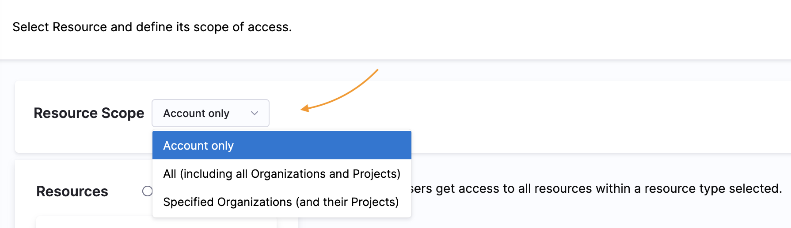

Role-based access control (RBAC) in Harness controls who can access your resources and what actions they can perform. This page walks you through the complete workflow to configure RBAC in your Harness account, from creating roles and resource groups to assigning them to users and user groups.

## What will you learn in this topic?

By the end of this page, you will understand how to:

- Set up the required permissions to configure RBAC in Harness
- Follow the complete RBAC configuration workflow in the correct order
- Create roles, resource groups, and user groups for different scenarios
- Assign roles and resource groups to users, user groups, and service accounts
- Use automated provisioning to import users and groups from your identity provider

---

## Before you begin

Before you configure RBAC in Harness, ensure you have:

- **Admin permissions:** You must be an admin at the account, organization, or project scope where you want to configure RBAC. If your account is new, contact [Harness Support](mailto:support@harness.io) to provision the first admin.
- **RBAC knowledge:** Familiarity with [RBAC components](/docs/platform/role-based-access-control/rbac-in-harness#rbac-components) (principals, roles, resource groups) and [role binding](/docs/platform/role-based-access-control/rbac-in-harness#role-binding).
- **Harness hierarchy:** Understanding of the [account, organization, and project hierarchy](/docs/platform/role-based-access-control/rbac-in-harness#permissions-hierarchy-scopes) and how scope affects permissions.

If you don't have admin permissions, you can still configure some aspects of RBAC with these granular permissions:

- **Users:** Requires **View**, **Manage**, and **Invite** permissions for **Users**
- **User groups:** Requires **View** and **Manage** permissions for **User Groups**
- **Resource groups:** Requires **View**, **Create/Edit**, and **Delete** permissions for **Resource Groups**
- **Roles:** Requires **View**, **Create/Edit**, and **Delete** permissions for **Roles**

---

## RBAC configuration workflow

Configuring RBAC in Harness requires creating roles (which grant permissions), resource groups (which grant access), and principals (users, user groups, or service accounts), then binding them together.

### Complete RBAC workflow

To configure RBAC in Harness, you must:

1. [Create roles](/docs/platform/role-based-access-control/add-manage-roles).
2. [Create resource groups](/docs/platform/role-based-access-control/add-resource-groups) and, optionally, apply [ABAC](./attribute-based-access-control.md).
3. [Create user groups](/docs/platform/role-based-access-control/add-user-groups), [create service accounts](/docs/platform/role-based-access-control/add-and-manage-service-account), and [add users](/docs/platform/role-based-access-control/add-users).
4. [Assign roles and resource groups](#role-binding) to users, user groups, and service accounts.
5. If you have not already done so, [configure authentication](/docs/platform/authentication/authentication-overview).

:::tip Automated provisioning

You can create users and user groups directly in Harness, and you can use automated provisioning, including:

- [Okta SCIM](./provision-users-with-okta-scim.md)
- [Microsoft Entra ID SCIM](./provision-users-and-groups-using-azure-ad-scim.md)
- [OneLogin SCIM](./provision-users-and-groups-with-one-login-scim.md)
- [Just-in-time provisioning](/docs/platform/role-based-access-control/just-in-time-user-provisioning/)

With automated provisioning, users and user groups are imported from your IdP, and then you [assign roles and resource groups](#role-binding) to the imported [principals](#principals) in Harness. You manage group metadata, group membership, and user profiles in your IdP, and you manage role and resource group assignments in Harness.

You can also create users and user groups directly in Harness, but any users or groups imported from your IdP must be managed in your IdP. For imported users and group, you can only change their role and resource group assignments in Harness.

:::

### RBAC workflow examples

These examples walk through two specific RBAC configuration scenarios.

Example: Configure RBAC for account-level pipeline ownership

This example walks through an RBAC configuration that allows full control of pipelines and related resources (connectors, templates, and so on) across the entire account. This configuration uses a custom user group called _Pipeline Owners_, a custom role called _Pipeline Admin_, and a custom resource group called _All Pipeline Resources_.

The _All Pipeline Resources_ resource group exists at the account scope and allows access to pipelines, secrets, connectors, delegates, environments, templates, and variables at the account level and in all organizations and projects under the account.

The _Pipeline Admin_ role has the following permissions:

- Pipelines: View, create/edit, delete, and execute
- Secrets: View, create/edit, and access
- Connectors: View, create/edit, delete, and access
- Delegates: View and create/edit
- Environments: View, create/edit, and access
- Templates: View, create/edit, and access
- Variables: View and create/edit

#### Create the Pipeline Admin role

1. In Harness, select **Account Settings**, and then select **Access Control**.
2. Select **Roles** in the header, and then select **New Role**.
3. For **Name**, enter `Pipeline Admin`. **Description** and **Tags** are optional.
4. Select **Save**.
5. Select the following permissions:

   - For **Pipelines**, select **View**, **Create/Edit**, **Delete**, and **Execute**.
   - For **Environments**, select **View**, **Create/Edit**, and **Access**.
   - Under **Shared Resources**, select the following:
     - For **Templates**, select **View**, **Create/Edit**, and **Access**.
     - For **Secrets**, select **View**, **Create/Edit**, and **Access**.
     - For **Connectors**, select **View**, **Create/Edit**, **Delete**, and **Access**.
     - For **Variables**, select **View** and **Create/Edit**.
     - For **Delegates**, select **View** and **Create/Edit**.
   - Under **Policies**, select the following:
      - For **Governance Policies**, select **View**, **Edit**, **Create** and **Delete**.
      - For **Governance Policy Sets**, select **View**, **Edit**, **Create** and **Delete**.

      The video below gives an overview of Policies RBAC in Harness.

      <DocVideo src="https://www.loom.com/share/6e11552bd64f4f5d80674e9df1a72b92?sid=4e79bbc9-adf2-477f-adb5-d00300e7b1c8" width="100%" height="600" />

6. Select **Apply Changes**.

For more information about roles and permissions, go to [Manage roles](./add-manage-roles.md) and the [Permissions reference](/docs/platform/role-based-access-control/permissions-reference).

#### Create the custom resource group

1. In Harness, select **Account Settings**, and then select **Access Control**.
2. Select **Resource Groups** in the header, and then select **New Resource Group**.
3. For **Name**, enter `All Pipeline Resources`. **Description**, **Tags**, and **Color** are optional.
4. Select **Save**.
5. For **Resource Scope**, select **All (including all Organizations and Projects)**. This means the resource group grants access to the specified resources at the account level and in all organizations and projects under the account.

   

6. For **Resources**, select **Specified**, and then select the following resources:

   - Environments
   - Variables
   - Templates
   - Secrets
   - Delegates
   - Connectors
   - Pipelines

   

7. Select **Save**.

For more information about creating resource groups, go to [Manage resource groups](./add-resource-groups.md).

#### Create the Pipeline Owners user group

1. In Harness, select **Account Settings**, and then select **Access Control**.
2. Select **User Groups** in the header, and then select **\*New User Group**.
3. For **Name**, enter `Pipeline Owners`. **Description** and **Tags** are optional.
4. In **Add Users**, select users to add to the group.
5. Select **Save**.

For more information about user groups and users, go to [Manage user groups](./add-user-groups.md) and [Manage users](./add-users.md).

:::tip Automated provisioning

You can create user groups and users directly in Harness, and you can use automated provisioning, including:

- [Okta SCIM](./provision-users-with-okta-scim.md)
- [Microsoft Entra ID SCIM](./provision-users-and-groups-using-azure-ad-scim.md)
- [OneLogin SCIM](./provision-users-and-groups-with-one-login-scim.md)
- [Just-in-time provisioning](/docs/platform/role-based-access-control/just-in-time-user-provisioning/)

When you use automated provisioning, users and user groups are imported from your IdP, and then you assign roles and resource groups to the imported [principals](#principals) in Harness. For imported users and groups, you manage group metadata, group membership, and user profiles in your IdP, and you manage their role and resource group assignments in Harness. You can also create users and user groups directly in Harness, but any users or groups imported from your IdP must be managed in your IdP.

For example, if you use Okta as your IdP, you could create a Pipeline Owners group in Okta and assign users to that group in Okta. When the Pipeline Owners group is first imported into Harness, the group and the group members are not associated with any roles or resource groups. You would [create the pipeline admin role](#create-the-pipeline-admin-role) and [create the custom resource group](#create-the-custom-resource-group) in Harness, and then [assign roles and resource groups](#assign-the-role-and-resource-group-to-the-user-group) to the user group. The group members inherit permissions and access from the role and resource group that is assigned to the user group.

:::

#### Assign the role and resource group to the user group

1. Harness, select **Account Settings**, and then select **Access Control**.
2. Select **User Groups** in the header, locate the **Pipeline Owners** group, and select **Manage Roles**.
3. Under **Role Bindings**, select **Add**.
4. For **Role**, select the **Pipeline Admin** role.
5. For **Resource Groups**, select the **All Pipeline Resources** group.
6. Select **Apply**.

For more information about assigning roles and resource groups, go to [Role binding](#role-binding).

Example: Configure RBAC to run pipelines in a specific project

This example walks through an RBAC configuration that provides only the ability to run pipelines in a specific project. This configuration uses a custom user group called _Project Pipeline Runners_, custom role called _Pipeline Runner_, and a custom resource group called _All Project Pipelines and Connectors_.

Because pipelines involve multiple resources, such as connectors, secrets, and variables, the _Pipeline Runner_ role requires the following permissions:

- **Execute** permission for pipelines.
- **Access** permission for any resource types used in pipelines.

The _All Project Pipelines and Connectors_ resource group exists at the project scope, and it only includes pipelines and resources related to pipelines (such as connectors). This restricts access to these specific resources within a specific project only.

#### Create the Pipeline Runner role

1. In Harness, go to the project where you want to configure RBAC.

   To configure RBAC for a specific project, you must navigate to that project first.

2. Select **Project Setup**, and then select **Access Control**.
3. Select **Roles** in the header, and then select **New Role**.
4. For **Name**, enter `Pipeline Runner`. **Description** and **Tags** are optional.
5. Select **Save**.
6. Select the following permissions:

   - For **Pipelines**, select **Execute**.
   - Under **Shared Resources**, select **Access** for **Connectors** and any other shared resources relevant to your pipelines, such as **Templates**, **Secrets**, **Variables**, or **Delegates**.

7. Select **Apply Changes**.

For more information about roles and permissions, go to [Manage Roles](./add-manage-roles.md) and the [Permissions reference](/docs/platform/role-based-access-control/permissions-reference).

#### Create the project resource group

1. In the same Harness project where you [created the Pipeline Runner role](#create-the-pipeline-runner-role), select **Project Setup**, and then select **Access Control**.
2. Select **Resource Groups** in the header, and then select **New Resource Group**.
3. For **Name**, enter `All Project Pipelines and Connectors`. **Description**, **Tags**, and **Color** are optional.
4. Select **Save**.
5. For **Resources**, select **Specified**, and then select **Pipelines**, **Connectors**, and any other shared resources relevant to your pipelines.

   After selecting resources, you can customize access further by configuring specific access for each resource type. For example, you can limit access to specific pipelines or connectors only.

6. Select **Save**.

In this example, the **Resource Scope** is locked to **Project only**, which means the resource group can only access the selected resources within this project. If your pipelines use connectors or other resources at a higher scope, you would need to configure RBAC at the account or org scope and then refine access by project. Similarly, if you wanted to create a user group that could run any pipeline in an organization or account, you would need to create the role, resource group, and user group at the account scope (by navigating to **Account Settings** and then selecting **Access Control**). Note that some refinement options, such as selecting specific pipelines, aren't available at higher scopes.

For more information about creating resource groups, go to [Manage resource groups](./add-resource-groups.md).

#### Configure the user group

1. In the same Harness project where you [created the Pipeline Runner role](#create-the-pipeline-runner-role), select **Project Setup**, and then select **Access Control**.
2. Select **User Groups** in the header, and then select **\*New User Group**.
3. For **Name**, enter `Project Pipeline Runners`. **Description** and **Tags** are optional.
4. In **Add Users**, select users to add to the group.
5. Select **Save**.
6. Next to the **Project Pipeline Runners** group, select **Manage Roles**
7. Under **Role Bindings**, select **Add**.
8. For **Role**, select the **Pipeline Runner** role.
9. For **Resource Groups**, select the **All Project Pipelines and Connectors** group.
10. Select **Apply**.

For more information about user groups, users, and role/resource group assignments, go to [Manage user groups](./add-user-groups.md), [Manage users](./add-users.md), and [Role binding](/docs/platform/role-based-access-control/rbac-in-harness#role-binding).

---

## Next steps

After you configure RBAC in Harness, you can:

- [Set up authentication](/docs/platform/authentication/authentication-overview) to control how users sign in to Harness
- [Use attribute-based access control (ABAC)](./attribute-based-access-control.md) to add conditional access based on user attributes
- [Provision users and groups automatically](./provision-users-with-okta-scim.md) from your identity provider using SCIM
- Review the [Permissions reference](/docs/platform/role-based-access-control/permissions-reference) for a complete list of available permissions
- Learn about [resource types](/docs/platform/role-based-access-control/resource-type-reference) you can include in resource groups