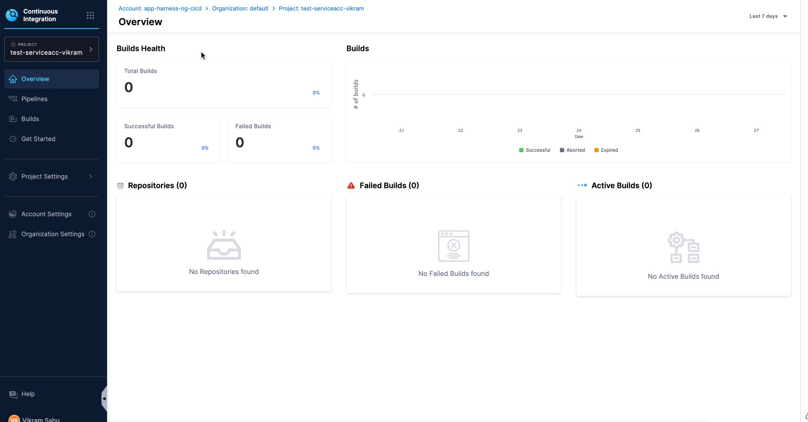
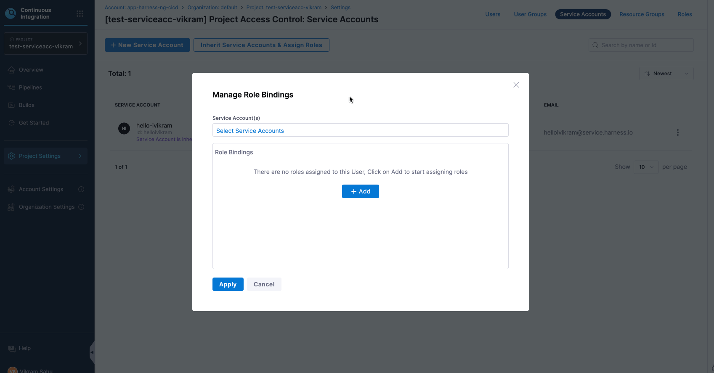

Harness lets you create a service account at a higher scope and use it in lower scopes. For example, an account-level service account can be used across organizations and projects, simplifying management and ensuring efficient pipeline execution.

In this example, an account-level service account is used at the project level. The same approach applies for the organization scope.

### Steps to Configure Hierarchical Service Accounts

1. Create a Service Account at the [Account Level](./add-and-manage-service-account.md#create-a-service-account). 

2. Create a [Role](./add-manage-roles.md#create-a-role) with the necessary permissions at the Project Level.

3. Create a [Resource Group](./add-resource-groups.md#create-a-resource-group) at the Project Level.

4. Now that you’ve created a Service Account at the account scope and a Role and Resource Group at the project scope, you can assign the role and resource group to the Service Account at the project scope by inheriting the account-level Service Account.

   - To Inherit a Service Account, Navigate to your **Project Settings** → **Access Control** → **Service Accounts**. Click on **Inherit Service Account & Assign Roles**.

      

   -  Select the Service Account created at the account scope, choose the role and resource group at project scope to bind with it, and click **Apply** to save the changes. 

       

5. Once the Service Account is assigned the role and resource group, you can use it to perform actions within the defined permissions. This includes executing pipelines or accessing resources as allowed by the assigned role and resource group.

## Benefits

- **Centralized Service Account Management**: Reduce the need to create and manage multiple service accounts for each project.

- **Simplified Permissions**: Easily manage permissions at the project level by assigning roles to account-level service accounts.

- **Seamless Pipeline Execution**: Service accounts can execute pipelines in any project without additional setup once permissions are in place.

## Additional Resources
For more information on how to manage service accounts, create roles, and assign permissions in Harness, refer to the following documentation on Harness Developer Hub:

- [Managing Service Accounts](./add-and-manage-service-account.md)

- [Creating and Managing Roles](./add-manage-roles.md)

- [Assigning Roles and Permissions](./rbac-in-harness.md)