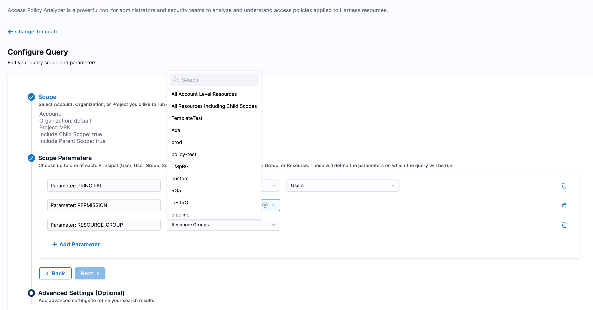

[Role-based access control (RBAC)](https://developer.harness.io/docs/platform/role-based-access-control/rbac-in-harness) in Harness lets you control who can access your resources, what actions they can perform, and where they can do it. Access is based on roles assigned to users, user groups, and service accounts.

To manage access control for connectors in Harness, you must be an Admin for the relevant account, organization, or project.

### Configure Roles 

1. Navigate to Account Settings → Access Control → Roles. 

2. [Add or edit a role](./add-manage-roles.md), check for Shared Resources → Connectors section to ensure the appropriate permissions are granted, as shown in the image below.

    

### Configure Resource Groups

1. Go to Account Settings → Access Control → Resource Groups, and [create or edit a resource group](./add-resource-groups.md). 

2. Select the appropriate Resource Scope based on your requirement, and set Resource to Specified, as shown below.

        

3. After specifying the Resources, search for Shared Resources and select Connectors. While creating a resource group, the connectors can be added in the following four ways: 

    * **All**: Provides access to all connectors at a particular resource scope.
                
            

    * **By Type**: Grants access to one or more specific connector types, such as artifact repositories, cloud providers, secret managers, and more, based on your selection.
        
            

    * **By Tag**: Grants access to connectors based on matching tags. If a connector has a tag included in the resource group's tag list, users with the corresponding role assignments automatically gain access. 
    
        If the tag is removed from the connector, access is automatically revoked.    
    
             

    * **Specified**: Grants access to one or more specific connectors that have already been created. This option is available only at Account-only, Organization-only, or Project-only scopes. 

            

By following these steps, you can enable users to manage access control for connector in four different ways through their assigned resource groups, allowing for more granular access control.

### Assign access control for connectors

After configuring the resource group for connectors, you need to assign the role and resource group to a user or user group to give them access to the connectors.

Navigate to Account Settings → Access Control → Users or User Groups(choose the appropriate option based on your requirements). 

For example, to assign access, select New User or Edit an existing user, click on Manage Role Binding, and then select the relevant Roles and Resource Groups as shown below.

