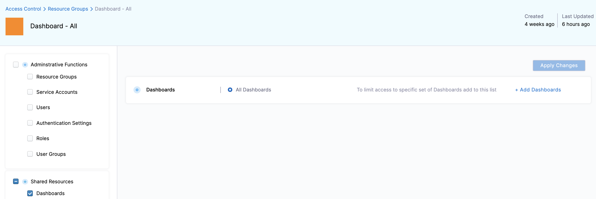

# Manage access control for dashboards

This topic describes how to add and manage access control for dashboards.

## Dashboards roles and permissions

The following roles are required for dashboards:

* **Dashboard - Static Editor**: To add, edit, and delete dashboards
* **Dashboard - All View**: To view all the **By Harness** and **Custom** dashboards

|  **Roles**| **Scope** |**Permissions** |
| --- | --- | --- |
| Dashboard - Static Editor | Folder | <ul><li>Add Dashboard</li><li> Add Tile</li><li> Edit Dashboard</li><li>Delete Dashboard</li></ul>|
| Dashboard - All View | Folder | View Dashboards|

## Add and manage the Dashboard - Static Editor role

To add and manage permissions for the **Dashboard - Static Editor** role, do the following:

1. In **Harness**, select **Account Settings**, and then select **Access Control**.

2. Select **Roles**.

3. Select **New Role**. The New Role settings appear.

4. In **Name**, enter **Dashboard - Static Editor** and select **Save**.
   
     

5. Select **Shared Resources** for the role that you created.

6. Select the **View** and **Manage** checkbox. This allows you to add dashboards, add tiles, edit dashboards, and delete dashboards.
   
     

7. Select **Apply Changes**.

## Add and manage the Dashboard - All View role

To add and manage permissions for the **Dashboard - All View** role, do the following:

1. In **Harness**, select **Account Settings**, and then select **Access Control**.

2. Select **Roles**.

3. Select **New Role**. The New Role settings appear.

4. In **Name**, enter **Dashboard - All View** and select **Save**.
   
     

5. Select **Shared Resources** for the role that you created.

6. Select the **View** checkbox. This will allow you to view all the dashboards.
   
     

7. Select **Apply Changes**.

## Limit project access for STO dashboards

:::info note

Currently, this feature is behind the feature flag `CDB_PROJECT_RBAC`. Contact [Harness Support](mailto:support@harness.io) to enable the feature.

:::

By default, RBAC for STO custom dashboards is restricted to entities exclusively. When you grant folder access to a user, they can view all entity information on the dashboard. Therefore, the **Project** filter on dashboards includes all STO projects across your organization by default, regardless of user RBAC project permissions. 

You can restrict the projects available in the **Project** filter on STO dashboards to only those where users have RBAC permissions when the `CDB_PROJECT_RBAC` feature flag is enabled.

## Add and manage access control for resource groups

To limit access to specific dashboards, do the following:

1. In **Harness**, select **Account Settings**, and then select **Access Control**.
     
2. In **Resource Groups**, select your Resource Group. For more information on adding and managing resource groups, go to [Manage resource groups](/docs/platform/role-based-access-control/add-resource-groups).  
  
     This section uses **Dashboard - All** as an example.

 3. In **Shared Resources**, select **Dashboards**.  
  
    By default, **All Dashboards** is selected.

    

 4. Select **Add Dashboards**.

 5. In **Add Dashboards**, select the folders for which you want to limit the access.  
  
    The selected folder may have more than one dashboard. All the dashboards in the selected folders will have the same access.

    

6. Select **Apply Changes**.

## Add and manage access control for users

To limit the access to specific dashboards for different users, do the following:

1. In **Harness**, select **Account Settings**, and then select **Access Control**.

2. In **User**, in **New User**, select the User for which you want to add or modify the access control. For more information on adding and managing resource groups, go to [Manage users](/docs/platform/role-based-access-control/add-users).

3. In **Assign Roles**, select the **Role** from the drop-down list. You can select either **Dashboard - Static Editor** or **Dashboard - All View**.

4. In **Resource Groups**, select the resource group for which you want to add or modify the access control.
   
     
