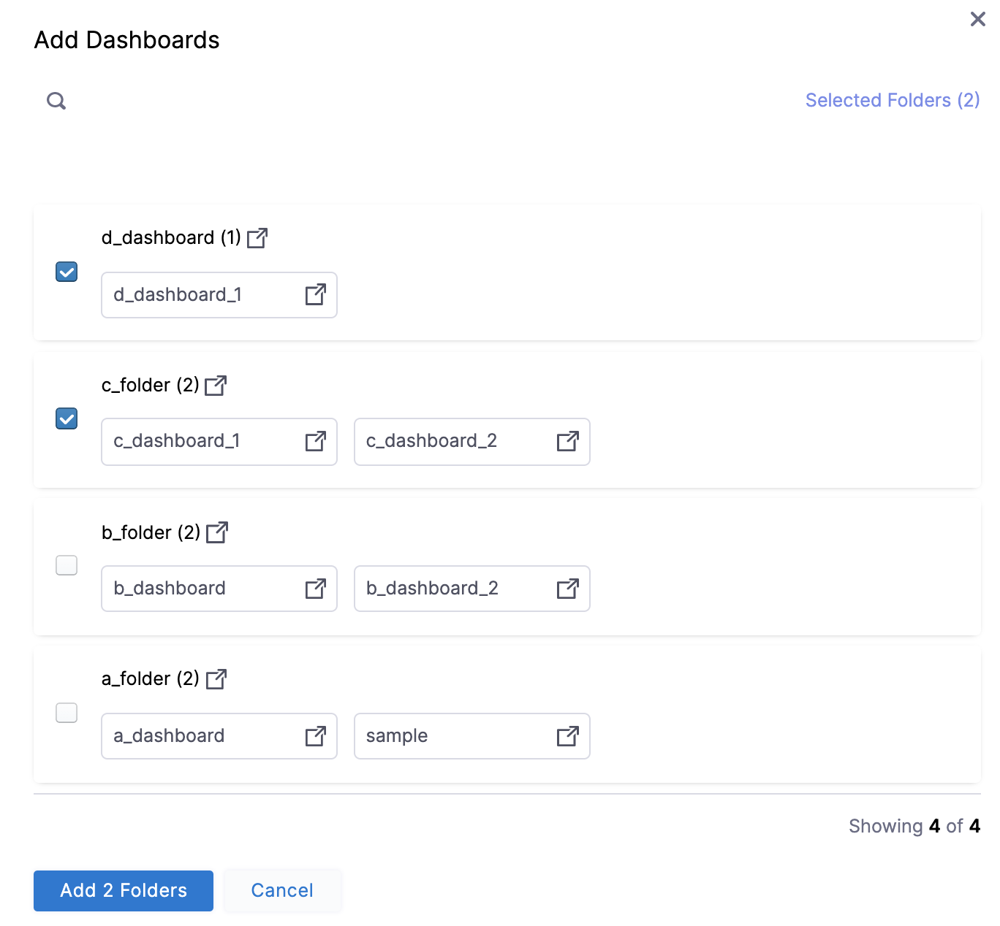

# Manage access control for dashboards

This topic describes how to add and manage access control for dashboards.

## Dashboards roles and permissions

The following roles are required for dashboards:

* **Dashboard Editor**: To add, edit, and delete dashboards
* **Dashboard Viewer**: To view all the **By Harness** and **Custom** dashboards

|  **Roles**| **Scope** |**Permissions** |
| --- | --- | --- |
| Dashboard Editor | Folder | <ul><li>Add Dashboard</li><li> Add Tile</li><li> Edit Dashboard</li><li>Delete Dashboard</li></ul>|
| Dashboard Viewer | Folder | View Dashboards|

:::info note
The Account Admin and Account Viewer roles include these permissions by default.

:::

## Add and manage the Dashboard Editor role for users or user groups

To add and manage permissions for the **Dashboard Editor** role for users, do the following:

1. In **Harness**, select **Account Settings**, and then select **Access Control**.

2. Select **Manage Roles** for the user or user group. The **Manage Role Bindings** settings display.

3. Select **Add**. 

4. Under **Roles**, select **Dashboard Editor**, and then select **Apply**.

## Add and manage the Dashboard Viewer role for users or user groups

To add and manage permissions for the **Dashboard Viewer** role for users, do the following:

1. In **Harness**, select **Account Settings**, and then select **Access Control**.

2. Select **Manage Roles** for the user or user group. The **Manage Role Bindings** settings display.

3. Select **Add**. 

4. Under **Roles**, select **Dashboard Viewer**, and then select **Apply**.

## Limit project access for STO dashboards

:::info note

Currently, this feature is behind the feature flag `CDB_PROJECT_RBAC`. Contact [Harness Support](mailto:support@harness.io) to enable the feature.

:::

By default, RBAC for STO custom dashboards is restricted to dashboard entities exclusively. When you grant folder access to a user, they can view all entity information on the dashboard. Therefore, the **Project** filter on dashboards includes all STO projects across your organization by default, regardless of user RBAC project permissions. 

You can restrict the projects available in the **Project** filter on STO dashboards to only those where users have RBAC permissions when the `CDB_PROJECT_RBAC` feature flag is enabled.

## Add and manage access control for resource groups

To limit access to specific dashboards, do the following:

1. In **Harness**, select **Account Settings**, and then select **Access Control**.
     
2. In **Resource Groups**, select your Resource Group. For more information on adding and managing resource groups, go to [Manage resource groups](/docs/platform/role-based-access-control/add-resource-groups).

3. In **Shared Resources**, select **Dashboards**.  
  
    By default, **All Dashboards** is selected.

    

4. Select **Specified**, and then select **+ Add**. The **Add Dashboards** settings display.

5. In **Add Dashboards**, select the folders for which you want to limit the access.  
  
    The selected folder may have more than one dashboard. All the dashboards in the selected folders will have the same access.

    

6. Select **Add Folders**.

7. Select **Save**.
