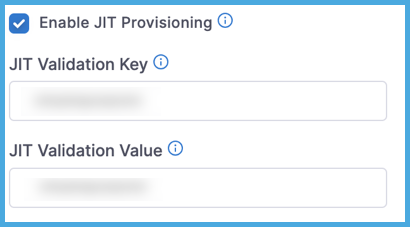

:::info note

Currently, this feature is behind the feature flag `PL_ENABLE_JIT_USER_PROVISION`. Contact [Harness Support](mailto:support@harness.io) to enable the feature.

:::

Automated provisioning eliminates repetitive tasks related to manual provisioning and simplifies user management.

Just-in-time (JIT) provisioning in Harness lets you provision users automatically when they first sign-in to Harness through SAML SSO. Harness supports JIT provisioning only for new users logging in through an IdP, such as Okta.

Here's how JIT provisioning works:

1. You add a user to your SAML application.
2. The user logs in to Harness through SAML SSO.
3. Harness automatically provisions the user and grants access accordingly.

## Requirements

Before you can enable JIT provisioning, you must configure SAML SSO authentication.

* Azure: [SAML SSO with Azure](/docs/platform/Authentication/single-sign-on-saml#saml-sso-with-azure)
* Okta: [SAML SSO with Okta](/docs/platform/Authentication/single-sign-on-saml#saml-sso-with-okta)
* OneLogin: [SAML SSO with OneLogin](/docs/platform/Authentication/single-sign-on-saml#saml-sso-with-onelogin)
* Other: [SAML SSO with Keycloak](/docs/platform/Authentication/single-sign-on-saml#saml-sso-with-keycloak)

## Enable JIT provisioning in Harness

1. In Harness, select **Account Settings**, and then select **Authentication**.
2. Select **SAML Provider** to add a new SAML provider.
3. Enter a **Name** for the SAML provider.
4. Select your SAML SSO provider.
5. Select **Enable JIT Provisioning**.
6. Enter the **JIT Validation Key** and **JIT Validation Value**.

   These settings allow you to control which users can be automatically provisioned in Harness on their first login. These settings define the validation key-value pair that must be present in the SAML assertion on the first login.

   <!--  -->

   <docimage path={require('./static/jit-user-provisioning.png')} />

   When users log in to your Harness instance for the first time, and they use SAML SSO authentication, Harness automatically provisions any users that have the matching **JIT Validation Key** and **JIT Validation Value** in the SAML assertion.

   If you don't specify a **JIT Validation Key** and **JIT Validation Value**, Harness uses JIT provisioning to provision *all* new users logging in through SAML.
