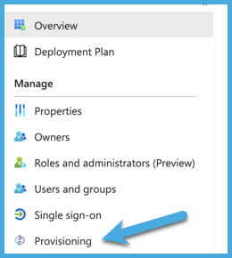
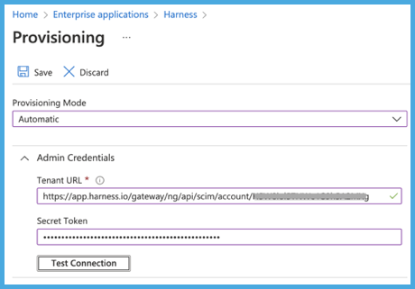
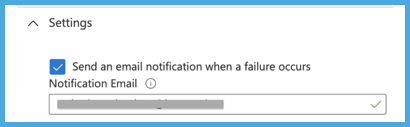
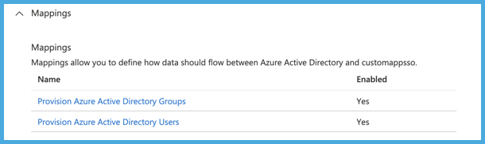

System for Cross-Domain Identity Management (SCIM) is an open standard protocol for automated user provisioning. In Harness, automated provisioning involves creating users and user groups, assigning users to groups, and managing some user attributes (such as names and email addresses). In addition to creating users and groups, automated provisioning also edits and removes users and user groups as and when required.

If Azure Active Directory (AD) is your identity provider, you can efficiently provision and manage users in your Harness account, organizations, and projects. Using [Azure AD's SCIM integration](https://learn.microsoft.com/en-us/azure/active-directory/architecture/sync-scim) with Harness enables Azure AD to serve as a single identity manager, to add and remove users, and to provision user groups. This is especially efficient for managing users at scale.

This topic describes how to use an Azure Active Directory (AD) SCIM integration for automated provisioning in Harness. To configure this integration, you must take steps in both Azure AD and Harness.

## Requirements

You need an understanding of:

* System for Cross-domain Identity Management (SCIM).
* [Harness' key concepts](../../getting-started/learn-harness-key-concepts.md).
* [RBAC in Harness](/docs/platform/role-based-access-control/rbac-in-harness).

You must be an Administrator in your Azure AD account, and you must be an **Account Admin** in Harness.

You need a Harness [API key and unexpired token](/docs/platform/Resource-Development/APIs/add-and-manage-api-keys) that has all **Users** and **User Groups** [permissions](/docs/platform/Resource-Development/APIs/api-permissions-reference). API keys inherit permissions from the user they are associated with. If you use an API key for a [service account](./add-and-manage-service-account.md), make sure the service account has all **Users** and **User Groups** permissions.

## Add Harness in Azure AD

In Azure AD, add Harness to your list of managed SaaS applications from the Azure AD [Application Gallery](https://learn.microsoft.com/en-us/azure/active-directory/manage-apps/overview-application-gallery).

1. In your [Azure portal](https://portal.azure.com/), under **Azure services**, select **Azure Active Directory**.
2. Select **Enterprise applications**, and then select **All applications**.
3. Select **New application**.
4. Search for `Harness`, select **Harness** in the results list, and then select **Add** to add the application to your list of managed SaaS apps in Azure AD.

## Enable Azure AD provisioning for Harness

1. In your Azure portal, under **Azure services**, select **Azure Active Directory**.
2. Select **Enterprise Applications**, and then select **All applications**.
3. Select the **Harness** app.
4. Select **Provisioning**.

   

5. For **Provisioning Mode**, select **Automatic**.
6. Configure the **Admin Credentials** as follows:

   1. For **Tenant URL**, enter `https://app.harness.io/gateway/ng/api/scim/account/ACCOUNT_ID`. Replace `ACCOUNT_ID` with your Harness account ID. You can get your account ID from any Harness URL or by navigating to **Account Settings** and **Overview** in Harness.
   2. For **Secret Token**, enter your Harness [Harness API key's token](#requirements) as the SCIM Authentication Token value.
   3. Select **Test Connection** to ensure that Azure AD can connect to Harness. If the connection fails, make sure your API key has admin permissions, and then try again.

   

7. Under **Settings**, in **Notification Email**, enter the email address for the person or group that should receive provisioning error notification emails.

   

8. Select **Save**.
9. Under **Mappings**:

   1. Enable **Provision Azure Active Directory Groups** and **Provision Azure Active Directory Users**.

      

   2. Select **Provision Azure Active Directory Users** and review the user **Attribute Mappings**. These user attributes are synchronized from Azure AD to Harness. Attributes marked as **Matching** are used to match Harness user accounts with Azure AD user accounts when user attributes need to be updated. Make any changes as necessary.
   3. Exit the user attribute mappings, and select **Provision Azure Active Directory Groups**.
   4. Review the group **Attribute Mappings**. These group attributes are synchronized from Azure AD to Harness. Attributes marked as **Matching** are used to match Harness user groups with Azure AD user groups when group attributes need to be updated. Make any changes as necessary.

11. Under **Settings**, switch **Provisioning Status** to **On** to enable the Azure AD provisioning service for Harness.
12. Under **Settings**, for **Scope**, select how you want to sync users and groups to Harness.

   :::tip Scoping filters

   If you want to configure scoping filters for your attribute mappings, go to the Microsoft documentation on [Scoping users or groups to be provisioned with scoping filters](https://learn.microsoft.com/en-us/azure/active-directory/app-provisioning/define-conditional-rules-for-provisioning-user-accounts?pivots=app-provisioning).

   :::

13. Select **Save**.

Saving the configuration in Azure AD triggers an initial provisioning sync. The initial sync takes longer to run than subsequent syncs. Syncs occur approximately every 40 minutes if the Azure AD provisioning service is running. To monitor sync progress, go to **Synchronization Details** in Azure AD. From there you can also find links to provisioning activity reports, which describe all actions performed by the Azure AD provisioning service in Harness. For more information about how to read the Azure AD provisioning logs, go to the Microsoft documentation on [Reporting on automatic user account provisioning](https://learn.microsoft.com/en-us/azure/active-directory/app-provisioning/check-status-user-account-provisioning).

After enabling Azure AD provisioning for Harness, you must [assign permissions to user groups](#assign-permissions) in Harness.

## Harness user management with Azure AD SCIM

Using the Azure AD SCIM integration requires you to manage users, user groups, and user/group attributes in Azure AD, rather than in Harness. Changes are synced from Azure AD to Harness approximately every 40 minutes. Data you must manage in Azure AD includes:

* Adding, removing, and editing group members. Group membership must be managed in Azure AD.
* Renaming user groups. Groups can only be renamed in Azure AD.
* Deleting user groups. Groups can only be deleted in Azure AD.
* Editing user email addresses, full names, and group assignments.
   * You can't edit these user details in Harness if the user was provisioned as part of an Azure AD-provisioned user group.
   * If you need to change a user's group (for example, to change their permissions), you must change the user's group membership in Azure AD.
   * You must use Azure AD to delete Azure AD-provisioned users from Harness.

Role and resource group assignments are not controlled in Azure AD. You must [assign permissions to user groups](#assign-permissions) in Harness.

:::info Group names

When provisioning user groups through SCIM, Harness creates IDs for user groups based on the group name in Azure AD. If the name contains periods, dashes, or spaces, those characters are replaced by underscores in the Harness user group ID. For example, if a group's name is `example-group` in Azure AD, the group's Harness ID is `example_group`.

If an Azure AD-provisioned user group has the same name as an existing user group in Harness, Harness retains both groups. To prevent confusion, you can rename the existing Harness group.

:::

After [enabling Azure AD provisioning for Harness](#enable-azure-ad-provisioning-for-harness), you can use Azure AD to [provision individual users](https://learn.microsoft.com/en-us/azure/active-directory/app-provisioning/provision-on-demand?pivots=app-provisioning) or groups containing sets of users. If you use Azure AD to provision individual users directly to Harness, these users initially have no user group assignment in Harness. You must assign them to a group, either in Azure AD or in Harness. Directly provisioning individual users is the *only* way that you can change an Azure AD user's group membership in Harness. When provisioned as part of an Azure AD group, the user's group membership must always be managed through Azure AD.

### Provisioning errors

If an error prevents adding, updating, or deleting a user in Harness, Azure retries the operation in the next sync cycle. If it fails again, and admin must check the [provisioning logs in Azure AD](https://learn.microsoft.com/en-us/azure/active-directory/reports-monitoring/concept-provisioning-logs?context=azure%2Factive-directory%2Fmanage-apps%2Fcontext%2Fmanage-apps-context) to determine the root cause of the failure and take corrective action. For more information, go to the Microsoft documentation on [Errors and retries in Azure AD app provisioning](https://learn.microsoft.com/en-us/azure/active-directory/app-provisioning/how-provisioning-works#errors-and-retries).

### Assign permissions

After user groups are provisioned through SCIM, you can manage [permissions](./permissions-reference.md) granted to the users in those groups by assigning [roles](./add-manage-roles.md) and [resource groups](./add-resource-groups.md) to user groups in Harness.

Harness roles and resource groups aren't managed in Azure AD.

If you need to change a user's group (for example, to change their permissions), you must change the user's group membership in Azure AD.

## I already have a Harness FirstGen Azure AD integration

If you currently have a Harness FirstGen App Integration in your IdP, and you want to create one for Harness NextGen, make sure the user information is included in the FirstGen App Integration before attempting to log into Harness NextGen through SSO.

Harness authenticates users using either the FirstGen App Integration or the NextGen App Integration. If you have set up both, Harness continues to use your existing App Integration in FirstGen to authenticate users that attempt to log in using SSO.

For example:

1. An App Integration is already set up for FirstGen with two users as members: `user1@example.com` and `user2@example.com`.
2. You create the App Integration for Harness NextGen, and you add `user1@example.com` and `user_2@example.com` as members.
3. You provision these users to Harness NextGen through SCIM.
4. `user1@example.com` and `user_2@example.com` try to log in to Harness NextGen through SSO.
5. The FirstGen App Integration is used for user authentication through SSO.

   * `user1@example.com` is a member of the FirstGen App Integration. They are successfully authenticated and logged in to Harness NextGen.
   * `user_2@example.com` is not a member of the FirstGen App Integration. Authentication fails and the user can't log in to Harness NextGen.

   
