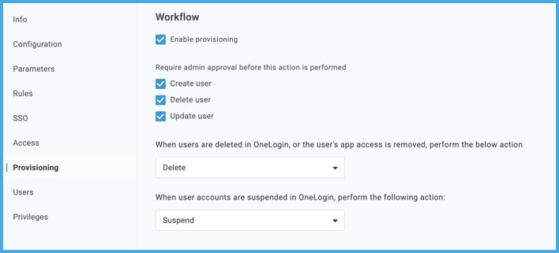
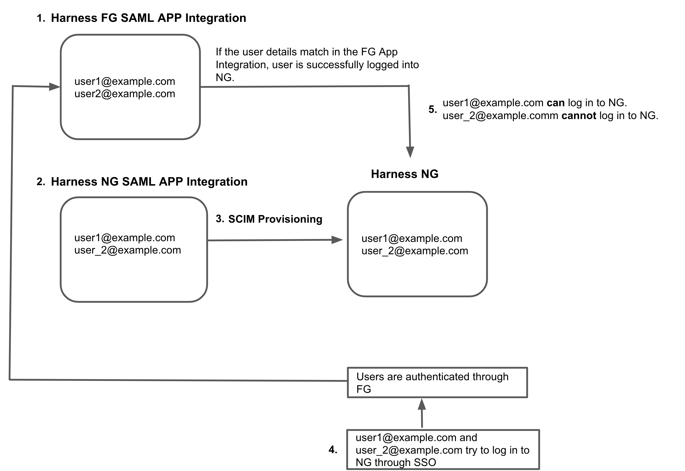

System for Cross-Domain Identity Management (SCIM) is an open standard protocol for automated user provisioning. In Harness, automated provisioning involves creating users and user groups, assigning users to groups, and managing some user attributes (such as names and email addresses). In addition to creating users and groups, automated provisioning also edits and removes users and user groups as and when required.

If OneLogin is your identity provider, you can efficiently provision and manage users in your Harness account, organizations, and projects. Using [OneLogin's SCIM integration](https://developers.onelogin.com/scim) with Harness enables OneLogin to serve as a single identity manager, to add and remove users, and to provision user groups. This is especially efficient for managing users at scale.

This topic describes how to use a OneLogin SCIM integration for automated provisioning in Harness. To configure this integration, you must take steps in both OneLogin and Harness.

:::caution

With the OneLogin SCIM integration, don't change provisioned users' email addresses in OneLogin. Once a user is provisioned in Harness, the user's email address *must remain the same*. If you change the email address in OneLogin and then try to remove the user from Harness, the removal will fail.

:::

## Requirements

You need an understanding of:

* System for Cross-domain Identity Management (SCIM).
* [Harness' key concepts](../../getting-started/learn-harness-key-concepts.md).
* [RBAC in Harness](/docs/platform/role-based-access-control/rbac-in-harness).

You must be an Administrator in your OneLogin account, and you must be an **Account Admin** in Harness.

You need a Harness [API key and unexpired token](/docs/platform/Resource-Development/APIs/add-and-manage-api-keys) that has all **Users** and **User Groups** [permissions](/docs/platform/Resource-Development/APIs/api-permissions-reference). API keys inherit permissions from the user they are associated with. If you use an API key for a [service account](./add-and-manage-service-account.md), make sure the service account has all **Users** and **User Groups** permissions.

## Add the Harness app to OneLogin

For more information, go to the OneLogin documentation on [Adding apps](https://www.onelogin.com/getting-started/free-trial-plan/add-apps-manual).

1. In OneLogin, go to **Applications** and select **Add App**.
2. Search for `Harness`, and select the Harness app.
3. Select **Save**.
4. In the Harness OneLogin app settings, in the **SCIM Base URL** field, enter `https://app.harness.io/gateway/ng/api/scim/account/ACCOUNT_ID`. Replace `ACCOUNT_ID` with your Harness account ID. You can get your account ID from any Harness URL or by navigating to **Account Settings** and **Overview** in Harness.

   For Harness On-Prem, the URL uses your custom domain name and omits `gateway`. For example, if your On-Prem domain name is `harness.mycompany.com**`, then your SCIM base URL is `https://harness.mycompany.com/ng/api/scim/account/ACCOUNT_ID`.

5. For **SCIM Bearer Token**, enter your [Harness token](#requirements). The SCIM Bearer Token authenticates requests and responses sent between the OneLogin SCIM provisioning service and Harness.
6. Make sure **API Status** is enabled.
7. Go to the app's **Provisioning** settings, and configure the following:

   * Select **Enable provisioning**.
   * Under **Require admin approval**, select **Create user**, **Delete user**, and **Update user**.
   * For **When users are deleted**, select **Delete**.
   * For **When user accounts are suspended**, select **Suspend**.

   

8. Select **Save**.

## Enable SAML SSO with OneLogin

To allow users to log in through your OneLogin SCIM integration, you must also set up [SAML SSO authentication with OneLogin](/docs/platform/Authentication/single-sign-on-saml#saml-sso-with-onelogin) in Harness.

## Provision individual users

:::caution

With the OneLogin SCIM integration, don't change a provisioned user's email address in OneLogin. Once a user is provisioned in Harness, the user's email address *must remain the same*. If you change the email address in OneLogin and then try to remove the user from Harness, the removal will fail.

:::

To provision users, add them to the Harness OneLogin app. Users are automatically provisioned in Harness if [SAML SSO with OneLogin is enabled](/docs/platform/Authentication/single-sign-on-saml#saml-sso-with-onelogin).

1. In OneLogin, select **Users**.
2. Add a user or select an existing user.
3. In the **User Info** settings, make sure **First name**, **Last name**, and **Email** are populated.

   :::info

   The Harness OneLogin SCIM integration only accepts the **First name**, **Last name**, and **Email** attributes for users. No other user attributes are permitted. Don't configure any other **User Info** settings.

   :::

4. Save the user settings, and then go to **Applications**.
5. In the **Applications** list, select **Add (+)**.
6. In the **Assign new login** settings, select the Harness OneLogin app, and then select **Continue**.
7. In **NameID**, enter the user's email address. This must match the **Email** from the **User Info** settings.
8. Select **Save**. The user's provisioning state is initially listed as **Pending**.
9. Select **Pending**.
10. In **Create User in Application**, select **Approve**. The user's provisioning state updates to **Provisioned**.

   Once the provisioning state updates to **Provisioned**, the user receives an email invite from Harness to log in.

11. In Harness, go to **Account Settings**, and then select **Access Control**.
12. Select **Users** in the header, and make sure the provisioned user is listed.
13. After provisioning users, you must [assign permissions](#assign-permissions).

### Provisioning errors

If provisioning fails, you might get an error such as `Failed to create user in app. Specified resource (e.g. User) or endpoint does not exist`. The most common cause for this error is an incorrect **SCIM Base URL** or invalid **SCIM Bearer Token** in the [OneLogin app configuration](#add-the-harness-app-to-onelogin)

If an error prevents adding, deleting, or updating an individual user in Harness, resolve the issues that caused the error and then retry provisioning the user in OneLogin. Select the **Failed** state in the user provisioning status table in OneLogin to investigate the error and retry provisioning.

## Provision OneLogin roles as Harness user groups

:::caution

With the OneLogin SCIM integration, don't change a provisioned user's email address in OneLogin. Once a user is provisioned in Harness, the user's email address *must remain the same*. If you change the email address in OneLogin and then try to remove the user from Harness, the removal will fail.

:::

To provision groups of users, you can provision OneLogin roles as Harness user groups. To do this, you must create a OneLogin role, assign OneLogin users to the role, assign your [Harness OneLogin app](#add-the-harness-app-to-onelogin) to users, and then create a rule in your Harness OneLogin app that creates Harness user groups based on the role.

You can create multiple roles. Each role becomes a Harness user group.

1. Make sure none of the intended group members (OneLogin users) have standalone Harness accounts (meaning, accounts not associated with OneLogin). If a user has a separate Harness account, the OneLogin role provisioning will fail. Before provisioning OneLogin roles, make sure you remove these accounts.
2. Add the group parameter to your Harness OneLogin app.

   1. In OneLogin, go to your Harness OneLogin app.
   2. In the **Parameters** settings, go to **Optional Parameters**, and select **Groups**.
   3. In **Edit Field Groups**, select **Include in User Provisioning**, and then select **Save**.
   4. Select **Save** again to save the app configuration.

3. Add the OneLogin role and link it to the Harness OneLogin app.

   1. Go to **Users**, select **Roles**, and then select **New Role**.
   2. Enter a **Name**, and select **Save**. The role name becomes the user group name in Harness.

      :::info Group names

      When provisioning user groups through SCIM, Harness creates names for user groups based on the OneLogin role name. If the role name contains periods, dashes, or spaces, those characters are replaced by underscores in Harness. For example, if a OneLogin role's name is `example-group`, then the resulting Harness user group's name is `example_group`.

      If a OneLogin-provisioned user group has the same name as an existing user group in Harness, Harness retains both groups. To prevent confusion, you can rename the existing Harness group.

      :::

   3. Select your new role, and then select **Users**.
   4. In **Check existing or add new users to this role**, enter the name of a OneLogin user to add to the role, locate the relevant user, select **Check**, and then select **Add to Role**. Repeat until you have added all users.
   5. Select **Save**, select your role again, and go to the **Applications** settings.
   6. Select **Add Apps**.
   7. In **Select Apps to Add**, select the Harness OneLogin app.
   8. Select **Save**.

4. Associate the Harness OneLogin app with each OneLogin user you added to the role.

   1. Go to **Users**, and select a user you added to the role.
   2. On the user's page, select **Applications**.
   3. Select **Add App**.
   4. In **Assign new login**, select the Harness OneLogin app, and select **Continue**.
   5. In **Groups**, select your OneLogin role, and select **Add**.
   6. Select **Save**.

5. Add a rule to the Harness OneLogin app that creates user groups in the Harness based on the OneLogin role.

   1. In OneLogin, go to **Applications** and select the Harness OneLogin app.
   2. Select **Rules**, and select **Add Rule**.
   3. Enter a **Name**.
   4. Under **Actions**, select **Set Groups in [Application Name]**.
   5. Select **Map from OneLogin**.
   6. Set **For each** to **Role**.
   7. Set **With value that matches** to the name of your OneLogin role or enter the regex `.*`.
   8. Select **Save** to save the rule.
   9. Select **Save** to save the app.

6. Provision the users you linked to the Harness OneLogin app.

   1. Go to your Harness OneLogin app, and select **Users**.
   2. If you [provisioned users](#provision-individual-users) prior to adding the OneLogin role and rule, select **Reapply Mappings**.
   3. For each user listed as **Pending**, select the user and select **Approve**.

7. Once provisioned, confirm the users and groups exist in Harness.

   1. In Harness, go to **Account Settings** and select **Access Control**.
   2. Select **User Groups** in the header.
   3. Select the user group matching the name of your OneLogin role.
   4. Make sure all the provisioned users are listed.

8. After provisioning groups and users, you must [assign permissions](#assign-permissions).

## Assign permissions

After user groups are provisioned through SCIM, you can manage [permissions](./permissions-reference.md) granted to the users in those groups by assigning [roles](./add-manage-roles.md) and [resource groups](./add-resource-groups.md) to user groups in Harness.

Harness roles and resource groups aren't managed in OneLogin.

If you need to change a user's group (for example, to change their permissions), you must change the user's role relationship in OneLogin.

## Remove groups

To remove a user group created by a OneLogin role, you must remove the role from OneLogin and then contact [Harness Support](mailto:support@harness.io) to get the user group removed from Harness.

The OneLogin SCIM integration doesn't currently automatically remove of user groups created from OneLogin roles. In Harness, if you try to manually remove a Harness user group created from a OneLogin role, you'll get the following error: `Cannot Delete Group Imported From SCIM`. This is why you must contact Harness support to finish removing the group after removing the OneLogin role.

## Remove users

Once a OneLogin user is provisioned in Harness, you can't delete the user in Harness. You must delete the user in OneLogin to remove them from Harness.

## I already have a Harness FirstGen OneLogin integration

If you currently have a Harness FirstGen App Integration in your IdP, and you want to create one for Harness NextGen, make sure the user information is included in the FirstGen App Integration before attempting to log into Harness NextGen through SSO.

Harness authenticates users using either the FirstGen App Integration or the NextGen App Integration. If you have set up both, Harness continues to use your existing App Integration in FirstGen to authenticate users that attempt to log in using SSO.

For example:

1. An App Integration is already set up for FirstGen with two users as members: `user1@example.com` and `user2@example.com`.
2. You create the App Integration for Harness NextGen, and you add `user1@example.com` and `user_2@example.com` as members.
3. You provision these users to Harness NextGen through SCIM.
4. `user1@example.com` and `user_2@example.com` try to log in to Harness NextGen through SSO.
5. The FirstGen App Integration is used for user authentication through SSO.

   * `user1@example.com` is a member of the FirstGen App Integration. They are successfully authenticated and logged in to Harness NextGen.
   * `user_2@example.com` is not a member of the FirstGen App Integration. Authentication fails and the user can't log in to Harness NextGen.

   
