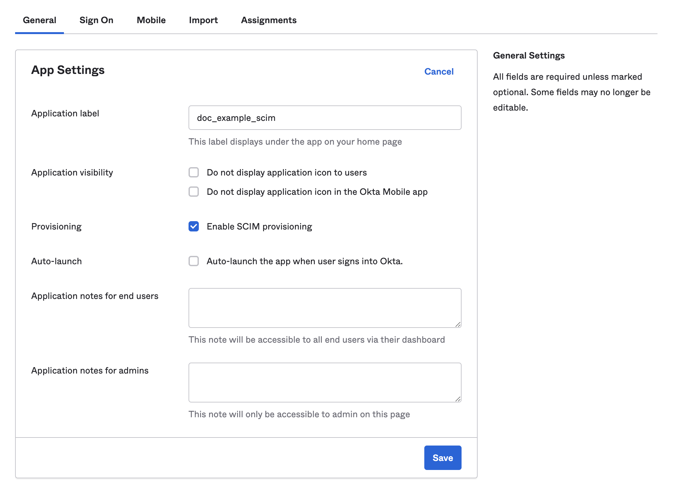
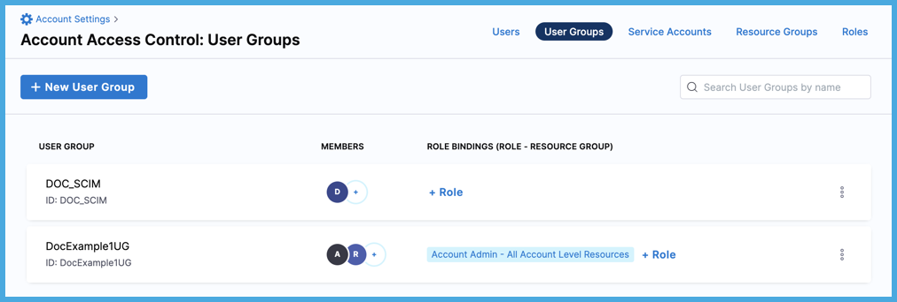

System for Cross-Domain Identity Management (SCIM) is an open standard protocol for automated user provisioning. In Harness, automated provisioning involves creating users and user groups, assigning users to groups, and managing some user attributes (such as names and email addresses). In addition to creating users and groups, automated provisioning also edits and removes users and user groups as and when required.

If Okta is your identity provider, you can efficiently provision and manage users in your Harness account, organizations, and projects. Using [Okta's SCIM integration](https://www.okta.com/blog/2017/01/what-is-scim/) with Harness enables Okta to serve as a single identity manager, to add and remove users, and to provision user groups. This is especially efficient for managing users at scale.

This topic describes how to use an Okta SCIM integration for automated provisioning in Harness. To configure this integration, you must take steps in both Okta and Harness.

## Requirements

You need an understanding of:

* System for Cross-domain Identity Management (SCIM).
* [Harness' key concepts](../../getting-started/learn-harness-key-concepts.md).
* [RBAC in Harness](/docs/platform/role-based-access-control/rbac-in-harness).

You must be an Administrator in your Okta account, and you must be an **Account Admin** in Harness.

You need a Harness [API key and unexpired token](/docs/platform/Resource-Development/APIs/add-and-manage-api-keys) that has all **Users** and **User Groups** [permissions](/docs/platform/Resource-Development/APIs/api-permissions-reference). API keys inherit permissions from the user they are associated with. If you use an API key for a [service account](./add-and-manage-service-account.md), make sure the service account has all **Users** and **User Groups** permissions.

## Create an Okta app integration

To enable automated provisioning, you must add a Harness app to your Okta administrator account.

1. Log in to your Okta administrator account, select **Applications**, and select **Create App Integration**.

   

2. On the **Create a new app integration** page, select **SAML 2.0** for the **Sign-on Method**, and then select **Next**.

   

3. In the **General Settings**, enter a name in the **Application label** field, and then select **Next**.
4. In the SAML settings, enter your Harness **Single sign on URL**.

   The single sign on URL format is:

   ```
   https://app.harness.io/gateway/api/users/saml-login?accountId=YOUR_ACCOUNT_ID
   ```

   Replace `YOUR_ACCOUNT_ID` with your Harness account ID.

5. For **Audience URI (SP Entity ID)**, enter `app.harness.io`.
6. For **Attribute Statements (optional)**, enter a name in the **Name** field, select **Basic** for the **Name Format**, and set the **Value** to **user.email**.
7. For **Group Attribute Statements (optional)**, enter a name in the **Name** field, select **Basic** for the **Name format (optional)**, select an appropriate **Filter**, and enter the appropriate corresponding filter value.
8. Select **Next**.
9. In the **Feedback** options, select the relevant option, and then select **Finish**.

   

10. In your newly created app, select the **General** tab, and then select **Edit** under **App Settings**.
11. Select **Enable SCIM provisioning**, and then select **Save**.

   

## Authorize the Okta integration

Authorize your Okta app with Harness.

1. In your Okta administrator account, go to **Applications**, and then select **Applications**.
2. Find your Harness app, select **Provisioning**, and then select **Integration**.
3. Select **Edit**.
4. For **SCIM connector base URL**, enter the base URL for your API endpoint.

   The base URL format is:

   ```
   https://app.harness.io/gateway/ng/api/scim/account/YOUR_ACCOUNT_ID
   ```

   Replace `YOUR_ACCOUNT_ID` with your Harness account ID.

5. In **Unique identifier field for users**, enter `userName`.
6. Select the **Supported provisioning actions**:

   * Import new users and profile updates
   * Push new users
   * Push profile updates
   * Push groups

7. For **Authentication Mode**, select **HTTP Header**, and enter your Harness API token in **Bearer**.

   For instructions on creating Harness API keys and tokens, go to [Manage API keys](/docs/platform/Resource-Development/APIs/add-and-manage-api-keys).

   

8. Select **Test Connection**.
9. If the test succeeds, select **Save**.

   

10. Go to the **Provisioning** tab, and select the **To App** settings.
11.  Enable **Create Users**, **Update User Attributes**, and **Deactivate Users**.

   

12. Select **Save**.

## Harness user management with Okta SCIM

Using the Okta SCIM integration requires you to manage certain user and user group attributes in Okta, rather than in Harness. This includes:

* Adding, removing, and editing group members. Group membership must be managed in Okta.
* Renaming user groups. Groups can only be renamed in Okta.
* Deleting user groups. Groups can only be deleted in Okta.
* Editing user email addresses, full names, and group assignments.
   * You can't edit these user details in Harness if the user was provisioned as part of an Okta-provisioned user group.
   * If you need to change a user's group (for example, to change their permissions), you must change the user's group membership in Okta.
   * You must use Okta to delete Okta-provisioned users from Harness. To delete an Okta-provisioned user, remove them from the corresponding Okta app.

If an Okta-provisioned user group has the same name as an existing user group in Harness, Harness retains both groups. To prevent confusion, you can rename the existing Harness group.

You can use Okta to provision individual users or groups containing sets of users. If you use Okta to provision individual users directly to Harness, these users initially have no user group assignment in Harness. You must assign them to a group, either in Okta or in Harness. Directly provisioning individual users is the *only* way that you can change an Okta user's group membership in Harness. When provisioned as part of an Okta group, the user's group membership must always be managed through Okta.

Once you have set up the SCIM integration between Okta and Harness, administrators can perform the following Harness user management actions in Okta:

* [Provision individual users](#provision-individual-users).
* [Provision Okta groups in Harness](#provision-groups).
* [Update user attributes](#update-user-attributes).
* [Deactivate or remove users](#deactivate-or-remove-users).

Role and resource group assignments are not controlled in Okta. You must [assign permissions to user groups](#assign-permissions) in Harness.

### Provision individual users

You can provision individual users, without a group affiliation, in Harness from Okta. Users assigned to groups are [provisioned with their group](#provision-groups).

1. In your Harness Okta app, select **Assignments**.
2. Select **People**.
3. Select **Assign**, and then select **Assign to People**.
4. Select the users you want to provision, and then select **Assign**.
5. Select **Save and Go Back**.
6. Select **Done** after you've finished assigning users.

Users with the Harness app assignment are shown under **People**. You can edit or delete users from here as well.


These users are also listed in your Harness account.

<!--  -->

<docimage path={require('./static/provision-users-with-okta-scim-14.png')} />

You can use Okta to provision individual users or groups containing sets of users. If you use Okta to provision individual users directly to Harness, these users initially have no user group assignment in Harness. You must assign them to a group, either in Okta or in Harness. Directly provisioning individual users is the *only* way that you can change an Okta user's group membership in Harness. When provisioned as part of an Okta group, the user's group membership must always be managed through Okta.

### Provision groups

You can provision Okta user groups in Harness. To do this, you must assign groups to your Harness Okta app and then push the groups (and the group members) to Harness.

:::info Group names

When provisioning user groups through SCIM, Harness creates IDs for user groups based on the group name in Okta. If the name contains periods, dashes, or spaces, those characters are replaced by underscores in the Harness user group ID. For example, if a group's name is `example-group` in Okta, the group's Harness ID is `example_group`.

If an Okta-provisioned user group has the same name as an existing user group in Harness, Harness retains both groups. To prevent confusion, you can rename the existing Harness group.

:::

1. In your Harness Okta app, select **Assignments**.
2. Select **Groups**.
3. Select **Assign**, and then select **Assign to Groups**.
4. Select the groups you want to provision, and then select **Assign**.
5. Select **Save and Go Back**.
6. Select **Done** after you've finished assigning groups.

   Groups with the Harness app assignment are shown under **Groups**. You can edit or delete groups from here as well.

7. Next, push your assigned groups to Harness.

   * In your Harness Okta app, select **Push Groups**.
   * Select **Push Groups**, and then select **Find groups by name** or **Find groups by rule**.

      

   * Find the groups that you want to push.

      

   * After you've found all the groups you want to push, select **Save**.

You can check the status of pushed groups in your Harness Okta app.


Active and successfully pushed groups are listed in your Harness account. The group members are also provisioned as Harness users when you push the group.

<!--  -->

<docimage path={require('./static/provision-users-with-okta-scim-18.png')} />

:::tip

If an error prevents adding, deleting, or updating a group member in Harness, you must retry [provisioning the user](#create-users) later, after resolving the issues. For more information, go to the Okta documentation on [Troubleshooting Group Push](https://help.okta.com/en-us/Content/Topics/users-groups-profiles/usgp-group-push-troubleshoot.htm).

:::

### Assign permissions

After user groups are provisioned through SCIM, you can manage [permissions](./permissions-reference.md) granted to the users in those groups by assigning [roles](./add-manage-roles.md) and [resource groups](./add-resource-groups.md) to user groups in Harness.

Harness roles and resource groups aren't managed in Okta.

If you need to change a user's group (for example, to change their permissions), you must change the user's group membership in Okta.

### Update user attributes

You can edit the following attributes in a user's Okta profile to update the corresponding values in Harness:

* Given name
* Family name
* Primary email
* Primary email type
* Display name (This is the user's Harness user name)

These are the only field synced to Harness. Editing other fields in a user's Okta profile won't change those fields in Harness, even if an equivalent field exists.

To update user attributes:

1. From your Okta administrator account, select **Directory**, and then select **People**.
2. Locate the user you want to edit, and select their name.
3. Select the **Profile** tab, and then select **Edit**.
4. Update the user's profile, and then select **Save**.


### Deactivate or remove users

You must use Okta to delete Okta-provisioned users from Harness.

To delete an individual Okta-provisioned user (without a group affiliation), remove them from your Harness Okta app.

To delete a user provisioned through a group, remove them from the group in Okta.

To delete a user from Harness and all other provisioned apps, deactivate the user's Okta profile.

:::caution

Deactivating a user removes them from *all provisioned apps*, including Harness. While a user account is deactivated, you can't change it.

:::

1. From your Okta administrator account, select **Directory**, and then select **People**.
2. Locate the user you want to deactivate, and then select their name.
3. On the user's profile, select **More Actions**, and then select **Deactivate**.
4. Select **Deactivate** on the confirmation dialog.

To reactivate a deactivated user, go to the user's profile, select **More Actions**, and then select **Activate**.

## I already have a Harness FirstGen Okta integration

If you currently have a Harness FirstGen App Integration in your IdP, and you want to create one for Harness NextGen, make sure the user information is included in the FirstGen App Integration before attempting to log into Harness NextGen through SSO.

Harness authenticates users using either the FirstGen App Integration or the NextGen App Integration. If you have set up both, Harness continues to use your existing App Integration in FirstGen to authenticate users that attempt to log in using SSO.

For example:

1. An App Integration is already set up for FirstGen with two users as members: `user1@example.com` and `user2@example.com`.
2. You create the App Integration for Harness NextGen, and you add `user1@example.com` and `user_2@example.com` as members.
3. You provision these users to Harness NextGen through SCIM.
4. `user1@example.com` and `user_2@example.com` try to log in to Harness NextGen through SSO.
5. The FirstGen App Integration is used for user authentication through SSO.

   * `user1@example.com` is a member of the FirstGen App Integration. They are successfully authenticated and logged in to Harness NextGen.
   * `user_2@example.com` is not a member of the FirstGen App Integration. Authentication fails and the user can't log in to Harness NextGen.

   
