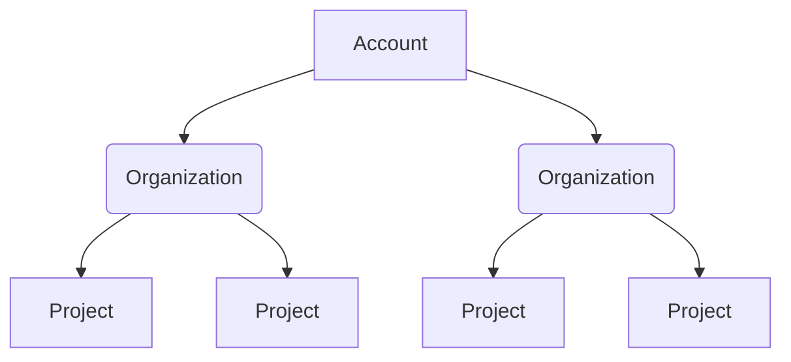
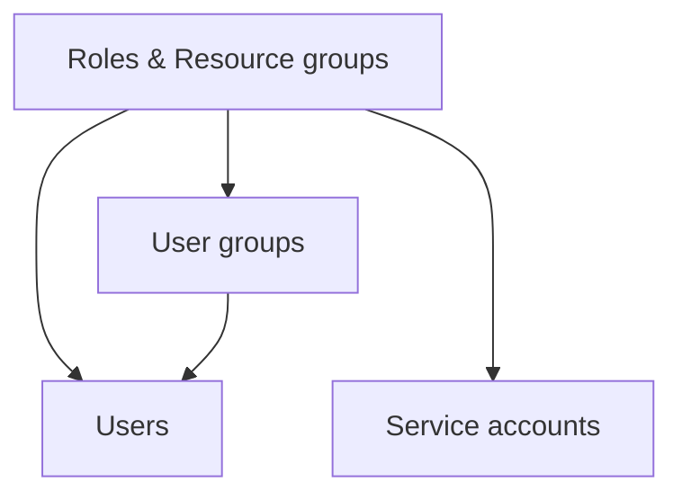

Role-based access control (RBAC) controls who can access your resources and what actions they can perform on those resources. A Harness account administrator assigns resource-related permissions to members of user groups through roles and resource groups.

RBAC helps you ensure users can only access the information and resources necessary to perform their tasks, create systematic and repeatable permissions assignments, increase accountability through audit trails, and comply with regulatory requirements for confidentiality and privacy.

---

## What will you learn in this topic?

By the end of this topic, you will be able to:

- <a href="#permissions-hierarchy-scopes">Understand the three-level permissions hierarchy (Account, Organization, Project)</a>.
- <a href="#rbac-components">Configure RBAC components (Principals, Resource Groups, Roles)</a>.
- <a href="#role-binding">Assign roles and resource groups to users, user groups, and service accounts</a>.
- <a href="#rbac-is-additive">Apply the additive RBAC model and principle of least privilege</a>.
- <a href="#extend-rbac-with-abac">Extend RBAC with Attribute-Based Access Control for fine-grained control</a>.

---

## Before you begin

Before you configure RBAC in Harness, ensure you have the following:

- **Harness key concepts**: Understanding of Harness platform fundamentals. Go to <a href="/docs/platform/get-started/key-concepts" target="_blank">Key concepts</a> for more information on core platform concepts.
- **Organizations and projects**: Knowledge of how to create and manage organizations and projects. Go to <a href="/docs/platform/get-started#create-an-organization" target="_blank">Create an organization</a> for more information on organizational structure.
- **Module functionality**: Familiarity with the modules you use in your Harness account (CI, CD, CCM, STO, etc.).
- **Account admin access**: Administrator permissions to configure roles, resource groups, and user assignments at the account level.

:::tip Recommendation

If you are new to RBAC, review <a href="https://harness.io/blog/continuous-delivery/user-role-management/" target="_blank">User and Role Management in the Harness Software Delivery Platform</a> for an introduction to RBAC concepts and best practices.

:::

---

## Overview video

The video below provides an overview of RBAC in Harness.

 <DocVideo src="https://www.loom.com/embed/b71549af4874451e9885dfe67ddfb0c2" width="100%" height="600" />

---

## Permissions hierarchy (scopes)

Understand how Harness organizes permissions across three hierarchical levels to provide granular access control.

The Harness Platform has a three-level hierarchical structure. The three levels, or scopes, are **Account**, **Organization** (Org), and **Project**. You can configure permissions for each scope to delegate responsibilities to different teams and efficiently organize and manage your resources.

The **Account** scope is the highest level. It is your Harness account and it encompasses all the resources within your Harness subscription. It provides a way to manage billing, user authentication, and global settings for all the organizations and projects within the account. Users with account-level permissions can manage the account-level settings, including billing, subscription, and SSO configuration. Resources, such as connectors, created at the account scope are available for use in all the organizations and projects within that account.

The **Organization** scope contains related projects, resources, and users within a specific domain or business unit. It provides a way to manage resources and permissions specific to a particular organization, as separate from other areas of the account. Users with org-level permissions can manage organization-level settings, including the creation of projects and user groups in the org, and assigning access policies to those user groups. Resources created at the organization scope are available for use in all projects within that organization, but aren't available outside that org.

The **Project** scope contains related resources, such as apps, pipelines, and environments. It provides a way to manage resources and permissions specific to a particular project, as separate from the larger org (business unit) and account. Users with project-level permissions can manage project-level settings, including the creation of pipelines, environments, and infrastructure definitions. Resources created at the project scope are only available in that project.

```mermaid
flowchart TD
    A[Account] --> B(Organization)
    A[Account] --> C(Organization)
    B --> D[Project]
    B --> E[Project]
    C --> F[Project]
    C --> G[Project]
```

The scope at which you create resources depends on the level of control and visibility you require. For example, if you create a connector at the account scope, it is available to all organizations and projects within the account. However, if you create a connector at the organization scope, it is only available to that organization and any projects under that organization. It is not available at the account scope or to other organizations. This lets you control access to your resources more effectively and prevent unauthorized access.

Go to <a href="/docs/platform/get-started#create-an-organization" target="_blank">Create Organizations and Projects</a> for more information on creating and managing organizations and projects.

---

## RBAC components

Control access through three core components: Principals (who), Resource Groups (what), and Roles (actions).

Harness RBAC uses **Principals**, **Resource Groups**, and **Roles** to control access:

- <a href="#principals">Principals</a> are entities taking action in the system. These include users, user groups, and service accounts.
- <a href="#resource-groups">Resource groups</a> define what objects can be acted on. Objects include organizations, projects, pipelines, connectors, users, and more.
- <a href="#roles">Roles</a> define what actions can be taken on objects. Actions include view, create, edit, delete, and so on.

You <a href="#role-binding">assign roles and resource groups to principals</a>. Roles and resource groups assigned to user groups are inherited by the users in those user groups.

```mermaid
flowchart TD
    A[Roles & Resource groups]-->C[User groups]
    A--->B
    A--->E[Service accounts]
    C-->B[Users]
```

### Principals

Principals are entities taking action in the system. You assign permissions and access, through roles and resource groups, to principals. Permissions define what actions a principal can take. Access defines which objects they can act on.

Principals include:

- <a href="/docs/platform/role-based-access-control/add-users" target="_blank">Users</a>: Individual users in Harness. Each user can belong to many user groups. You can assign roles and resource groups directly to users, or they can inherit these from user groups that they belong to.
- <a href="/docs/platform/role-based-access-control/add-user-groups" target="_blank">User Groups</a>: User groups contain multiple Harness users. Roles and resource groups are assigned to groups. The permissions and access granted by the assigned roles and resource groups are applied to all group members. You can create user groups at all [scopes](#permissions-hierarchy-scopes).
- <a href="/docs/platform/role-based-access-control/add-and-manage-service-account" target="_blank">Service Accounts</a>: Service accounts are like API users. You assign roles and resource groups to service accounts. Service accounts also have one or more <a href="/docs/platform/automation/api/add-and-manage-api-keys" target="_blank">API keys</a>, which authenticate and authorize remote services attempting to perform operations in Harness through Harness APIs.

### Resource groups

A resource group is a set of Harness resources that a principal can access. You can create resource groups at all [scopes](#permissions-hierarchy-scopes). Resource groups are assigned along with [roles](#roles) to principals. Roles grant permissions (what actions can be taken) and resource groups grant access (what objects can be acted on).

Resource groups either include **All Resources** (all resources of a given type) or **Named Resources** (specific, individual resources).

Harness has built-in resource groups at each scope, and you can create custom resource groups. Go to <a href="/docs/platform/role-based-access-control/add-resource-groups" target="_blank">Manage resource groups</a> for more information on creating and managing resource groups.

### Roles

Roles are sets of <a href="/docs/platform/role-based-access-control/permissions-reference" target="_blank">permissions</a> that allow or deny specific operations on objects (resources). Roles are applied together with [resource groups](#resource-groups) to create a complete set of permissions and access.

Harness includes some built-in roles, and you can create your own custom roles, which are useful for limited and fine-grained access control. Go to <a href="/docs/platform/role-based-access-control/add-manage-roles" target="_blank">Manage roles</a> for more information on creating and managing roles.

Roles are scope-specific and can be created at all [scopes](#permissions-hierarchy-scopes).

---

## Role binding

Assign roles and resource groups to principals to grant permissions and access at any scope.

Role binding refers to the process of assigning <a href="#roles">roles</a> and <a href="#resource-groups">resource groups</a> to <a href="#principals">principals</a> (users, user groups, and service accounts). Role binding can be configured at all scopes.

```mermaid
flowchart TD
    A[Roles & Resource groups]-->C[User groups]
    A--->B
    A--->E[Service accounts]
    C-->B[Users]
```

Built-in role binding configurations

The following table describes the role bindings (permissions and access) that result from some combinations of built-in [roles](#roles) and [resource groups](#resource-groups). This table doesn't include module-specific built-in roles, such as CET Admin or Chaos Admin.

| Role                | Resource Group                                 | Resulting role binding                                                                                                                                                                        |
| ------------------- | ---------------------------------------------- | --------------------------------------------------------------------------------------------------------------------------------------------------------------------------------------------- |
| Account Admin       | Account - All Resources Including Child Scopes | All permissions on all resources in the account and resources in organizations and projects under the account.                                                                                |
| Account Admin       | All Account Level Resources                    | All permissions on all resources at the account level only.                                                                                                                                   |
| Account Viewer      | Account - All Resources Including Child Scopes | View resources in the account and resources in organizations and projects under the account.                                                                                                  |
| Account Viewer      | All Account Level Resources                    | View resources at the account level only.                                                                                                                                                     |
| Organization Admin  | Org - All Resources Including Child Scopes     | All permissions on all resources in a specific organization and all projects under that organization.                                                                                         |
| Organization Admin  | All Organization Level Resources               | All permissions on all resources in a specific organization only.                                                                                                                             |
| Organization Viewer | Org - All Resources Including Child Scopes     | View resources in a specific organization and resources in projects under that organization.                                                                                                  |
| Organization Viewer | All Organization Level Resources               | View resources in a specific organization only.                                                                                                                                               |
| Project Admin       | All Project Level Resources                    | All permissions on all resources within a specific project.                                                                                                                                   |
| Project Viewer      | All Project Level Resources                    | View resources in a specific project.                                                                                                                                                         |
| Pipeline Executor   | All Project Level Resources                    | <ul><li>View resource groups, projects, users, user groups, and roles.</li><li>View and access secrets, connectors, environments, and services.</li><li>View and execute pipelines.</li></ul> |

<!-- | Feature Flag Manage Role | Account - All Resources Including Child Scopes | Create and edit Feature Flags and Target Management resources in the account and in organizations and projects under the account. | -->
<!-- | Feature Flag Manage Role | All Account Level Resources | Create and edit Feature Flags and Target Management resources at the account level only. | -->
<!-- | Feature Flag Manage Role | Org - All Resources Including Child Scopes | Create and edit Feature Flags and Target Management resources in a specific organization and in projects under that organization. | -->
<!-- | Feature Flag Manage Role | All Organization Level Resources | Create and edit Feature Flags and Target Management resources in a specific organization only. | -->
<!-- | Feature Flag Manage Role | All Project Level Resources | Create and edit Feature Flags and Target Management resources in a specific project. | -->

### RBAC is additive

Apply the principle of least privilege when assigning cumulative permissions.

RBAC is an additive model. Role and resource group assignments in Harness are additive. The total expanse of a principal's permissions and access is the sum of all the roles and resource groups from all user groups they belong to, as well as any roles and resource groups assigned directly to them as an individual user or service account.

:::warning Least privilege

It is important to follow the principle of least privilege (PoLP). This is a security principle that means users are granted the absolute minimum access/permissions necessary to complete their tasks and nothing more.

While Harness includes some built-in roles and resource groups, it is a good idea to create your own roles and resource groups as needed to ensure the least privilege.

:::

For example, assume a user has these role and resource group assignments:

- **Account Admin** role with **All Resources Including Child Scopes**. This is the most permissive combination of role and resource group. It grants all permissions on all resources throughout the entire account.
- **Organization Viewer** role with **All Resources Including Child Scopes**. This combination, by itself, grants the ability to view resources in a specific organization and resources in the projects under that organization.

Because the **Account Admin** combination includes the **Org Viewer** combination (and more), the user is effectively an account admin throughout the entire account. Assigning the **Org Viewer** role makes no difference to this user's access.

To control this user's access, you could change the resource group for the **Account Admin** role to **All Account Level Resources**. This would limit the **Account Admin** permissions to the resources at the account level only and remove admin access to lower scopes.

---

### Extend RBAC with ABAC

Apply attribute-based rules for highly refined access control on connectors and environments.

For more fine-grained control over access to connectors and environments, you can use <a href="/docs/platform/role-based-access-control/attribute-based-access-control" target="_blank">Attribute-Based Access Control (ABAC)</a> as an extension of RBAC on your resource groups. ABAC provides highly refined control by using rules to restrict access based on combinations of attributes, such as connector and environment type.