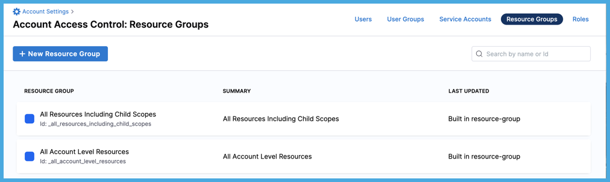

<!-- No redirect for /4_role-based-access-control/1-rbac-in-harness because that link didn't exist in prod. Now the link is true to prod: /role-based-access-control/rbac-in-harness. -->

Role-based access control (RBAC) lets you control who can access your resources and what actions they can perform on the resources. To do this, a Harness account administrator assigns resource-related permissions to members of user groups.

Using RBAC helps you:

- Ensure users can only access the information and resources necessary to perform their tasks. This reduces the risk of security breaches and unauthorized access to sensitive data.
- Create systematic, repeatable permissions assignments. RBAC saves time and increases efficiency for administrators who otherwise have to manage access for individual user accounts. You can quickly add and change roles, as well as implement them across APIs.
- Increase accountability by clearly defining who has access to which resources and information. This makes it easier to track and audit user activities, helping to identify and prevent misuse or abuse of access privileges.
- More effectively comply with regulatory and statutory requirements for confidentiality and privacy. It helps you enforce privacy and data protection policies.

:::tip

If you're not familiar with RBAC, check out this blog post on [User and Role Management in the Harness Software Delivery Platform](https://harness.io/blog/continuous-delivery/user-role-management/).

:::

Before configuring RBAC in Harness, you should have an understanding of:

* [Harness' key concepts](../../getting-started/learn-harness-key-concepts.md)
* [Creating organizations and projects](../organizations-and-projects/create-an-organization.md)
* The functionality of the modules in your Harness account.

## Permissions hierarchy (scopes)

The Harness Platform has a three-level hierarchical structure. The three levels, or scopes, are **Account**, **Organization** (Org), and **Project**.

You can configure permissions for each scope. This helps you delegate responsibilities to different teams and efficiently organize and manage your resources by providing granular access control that is flexible, scalable, and easy to manage.

The **Account** scope is the highest level. It is your Harness account and it encompasses all the resources within your Harness subscription. It provides a way to manage billing, user authentication, and global settings for all the organizations and projects within the account. Users with account-level permissions can manage the account-level settings, including billing, subscription, and SSO configuration. Resources, such as connectors, created at the account scope are available for use in all the organizations and projects within that account.

The **Organization** scope contains related projects, resources, and users within a specific domain or business unit. It provides a way to manage resources and permissions specific to a particular organization, as separate from other areas of the account. Users with org-level permissions can manage organization-level settings, including the creation of projects and user groups in the org, and assigning access policies to those user groups. Resources created at the organization scope are available for use in all projects within that organization, but aren't available outside that org.

The **Project** scope contains related resources, such as apps, pipelines, and environments. It provides a way to manage resources and permissions specific to a particular project, as separate from the larger org (business unit) and account. Users with project-level permissions can manage project-level settings, including the creation of pipelines, environments, and infrastructure definitions. Resources created at the project scope are only available in that project.

The scope at which you create resources depends on the level of control and visibility you require. For example, if you create a connector at the account scope, it is available to all organizations and projects within the account. However, if you create a connector at the organization scope, it is only available to that organization and any projects under that organization. It is not available at the account scope or to other organizations. This lets you control access to your resources more effectively and prevent unauthorized access.

To learn about organizations and projects, go to [Create Organizations and Projects](/docs/platform/organizations-and-projects/create-an-organization.md).

## RBAC components

Harness RBAC uses **Principals**, **Resource Groups** and **Roles** to control access.

* [Principals](#principal) are entities taking action in the system. These include users, user groups, and service accounts.
* [Resource groups](#resource-groups) define what objects can be acted on. Objects include organizations, projects, pipelines, connectors, users, and more.
* [Roles](#roles) define what actions can be taken on objects. Actions include view, create, edit, delete, and so on.

You [assign roles and resource groups to principals](#role-assignment). Roles and resource groups assigned to user groups are inherited by the users in those user groups.

### Principals

Principals are entities taking action in the system. You assign permissions and access, through roles and resource groups, to principals. Permissions define what actions a principal can take. Access defines which objects they can act on.

Principals include:

* [Users](/docs/platform/role-based-access-control/add-users): Individual users in Harness. Each user can belong to many user groups. You can assign roles and resource groups directly to users, or they can inherit these from user groups they belong to.
* [User Groups](/docs/platform/role-based-access-control/add-user-groups): User groups contain multiple Harness users. Roles and resource groups are assigned to groups. The permissions and access granted by the assigned roles and resource groups are applied to all group members. You can create user groups at all [scopes](#permissions-hierarchy-scopes).
* [Service Accounts](/docs/platform/role-based-access-control/add-and-manage-service-account): Service accounts are like API users. You assign roles and resource groups to service accounts. Service accounts also have one or more [API keys](/docs/platform/Resource-Development/APIs/add-and-manage-api-keys), which authenticate and authorize remote services attempting to perform operations in Harness through Harness APIs.

### Resource groups

A resource group is a set of Harness resources that a principal can access. You can create resource groups at all [scopes](#permissions-hierarchy-scopes). Resource groups are assigned along with [roles](#roles) to principals. Roles grant permissions (what actions can be taken) and resources groups grant access (what objects can be acted on).

Resource groups either include **All Resources** (all resources of a given type) or **Named Resources** (specific, individual resources).

Harness has default resource groups at each scope, and you can create custom resource groups. For more information, go to [Add and manage resource groups](/docs/platform/role-based-access-control/add-resource-groups).

Default resource groups: Account scope

* **All Resources Including Child Scopes:** Includes all resources within the account's scope as well as those within the scope of orgs and projects under the account. This is the most inclusive resource group possible.

* **All Account Level Resources:** Includes all resources in the account's scope, and excludes resources within the scope of orgs or projects under the account.

Default resource groups: Org scope

* **All Resources Including Child Scopes:** Includes all resources within a specific org's scope as well as those within the scope of projects under that org. This is set for each org. If you have multiple orgs, you have an **All Resources Including Child Scopes** for each org.

* **All Organization Level Resources:** Includes all resources in a specific org's scope. Excludes resources within the scope of projects under the org. This is set for each org. If you have multiple orgs, you have an **All Organization Level Resources** for each org.

Default resource groups: Project scope

**All Project Level Resources** includes all resources in the project's scope. This is set for each project. If you have multiple projects, you have an **All Project Level Resources** for each project.

### Roles

Roles are sets of [permissions](/docs/platform/role-based-access-control/permissions-reference) that allow or deny specific operations on objects (resources). Roles are scope-specific and can be created at all [scopes](#permissions-hierarchy-scopes).

In Harness, roles are either **Built-in roles** or **Custom roles**. Built-in roles are included with Harness by default. Custom roles are roles that you create for specific, fine-grained access control. For more information, go to [Add and manage roles](/docs/platform/role-based-access-control/add-manage-roles).

Built-in roles by scope

* Account scope
  * Account Admin
  * Account Viewer
  * Feature Flag Manage Role
* Org scope
  * Organization Admin
  * Organization Viewer
  * Feature Flag Manage Role
* Project scope
  * Project Admin
  * Project Viewer
  * Pipeline Executor
  * Feature Flag Manage Role

## Role assignment

Role assignment refers to the process of assigning [roles](#roles) and [resource groups](#resource-groups) to [principals](#principal) (users, user groups, and service accounts). Role assignment can be configured at all scopes.

Default role assignment configurations

The following table describes the role assignments (permissions and access) that result from combinations of default roles and resource groups.

For information about default roles and resource groups, go to [Roles](#roles) and [Resource groups](#resource-groups).

| Role | Resource Group | Resulting role assignment |
| - | - | - |
| Account Admin | Account - All Resources Including Child Scopes | All permissions on all resources in the account and resources in organizations and projects under the account. |
| Account Admin | All Account Level Resources | All permissions on all resources in at the account level only. |
| Account Viewer | Account - All Resources Including Child Scopes | View resources in the account and resources in organizations and projects under the account. |
| Account Viewer | All Account Level Resources | View resources at the account level only. |
| Feature Flag Manage Role | Account - All Resources Including Child Scopes | Create and edit Feature Flags and Target Management resources in the account and in organizations and projects under the account. |
| Feature Flag Manage Role | All Account Level Resources | Create and edit Feature Flags and Target Management resources at the account level only. |
| Organization Admin | Org - All Resources Including Child Scopes | All permissions on all resources in a specific organization and all projects under that organization. |
| Organization Admin | All Organization Level Resources | All permissions on all resources in a specific organization only. |
| Organization Viewer | Org - All Resources Including Child Scopes | View resources in a specific organization and resources in projects under that organization. |
| Organization Viewer | All Organization Level Resources | View resources in a specific organization only. |
| Feature Flag Manage Role | Org - All Resources Including Child Scopes | Create and edit Feature Flags and Target Management resources in a specific organization and in projects under that organization. |
| Feature Flag Manage Role | All Organization Level Resources | Create and edit Feature Flags and Target Management resources in a specific organization only. |
| Project Admin | All Project Level Resources | All permissions on all resources within a specific project. |
| Project Viewer | All Project Level Resources | View resources in a specific project. |
| Pipeline Executor | All Project Level Resources | <ul><li>View resource groups, projects, users, user groups, and roles.</li><li>View and access secrets, connectors, environments, and services.</li><li>View and execute pipelines.</li></ul> |
| Feature Flag Manage Role | All Project Level Resources | Create and edit Feature Flags and Target Management resources in a specific project. |

### RBAC is additive

RBAC is an additive model; therefore, role and resource group assignments in Harness are additive. The total expanse of a principal's permissions and access is the sum of all the roles and resource groups from all user groups they belong to, as well as any roles and resource groups assigned directly to them as an individual user or service account.

:::caution Least privilege

It is important to follow the principle of least privilege (PoLP). This is a security principle that means users are granted the absolute minimum access/permissions necessary to complete their tasks and nothing more.

While Harness includes some built-in roles and resource groups, it is a good idea to create your own roles and resource groups as needed to ensure least privilege.

:::

For example, assume a user has these role and resource group assignments:

* **Account Admin** role with **All Resources Including Child Scopes**. This is the most permissive combination of role and resource group. It grants all permissions on all resources throughout the entire account.
* **Organization Viewer** role with **All Resources Including Child Scopes**. This combination, by itself, grants the ability to view resources in a specific organization and resources in the projects under that organization.

Because the **Account Admin** combination includes the **Org Viewer** combination (and more), the user is effectively an account admin throughout the entire account. Assigning the **Org Viewer** role makes no difference to this user's access.

To control this user's access, you could change the resource group for the **Account Admin** role to **All Account Level Resources**. This would limit the **Account Admin** permissions to the resources at the account level only and remove admin access to lower scopes.

### Extend RBAC with ABAC

For more fine-grained control over access to connectors and environments, you can use [Attribute-Based Access Control (ABAC)](/docs/platform/role-based-access-control/attribute-based-access-control) as an extension of RBAC on your resource groups.

ABAC provides highly refined control by using rules to restrict access based on combinations of attributes, such as connector and environment type.

## Configure RBAC in Harness

To configure RBAC in Harness, you must:

1. Understand the [RBAC components](#rbac-components) and [Role assignment](#role-assignment).
2. [Create roles](/docs/platform/role-based-access-control/add-manage-roles)
3. [Create resource groups](/docs/platform/role-based-access-control/add-resource-groups) and, optionally, apply [ABAC](./attribute-based-access-control.md).
4. [Create user groups](/docs/platform/role-based-access-control/add-user-groups), [create service accounts](/docs/platform/role-based-access-control/add-and-manage-service-account), and [add users](/docs/platform/role-based-access-control/add-users). You can create user groups and users directly in Harness or you can use automated provisioning, including:

   * [Okta SCIM](./provision-users-with-okta-scim.md)
   * [Azure AD SCIM](./provision-users-and-groups-using-azure-ad-scim.md)
   * [OneLogin SCIM](./provision-users-and-groups-with-one-login-scim.md)
   * [Just-in-time provisioning](./provision-use-jit.md)

5. [Assign roles and resource groups](#role-assignment) to users, user groups, and service accounts.
6. If you have not already done so, [configure authentication](/docs/platform/Authentication/authentication-overview).

### Permissions required

To configure RBAC in Harness, you must be an admin in the relevant account, organization, or project.

If your Harness account is new, you might need to contact Harness Support to get the first admin provisioned in your account.

If you are not an admin, you can configure some aspects of RBAC if you have the required granular permissions:

* Users: Requires **View**, **Manage**, and **Invite** permissions for **Users**.
* User groups: Requires **View** and **Manage** permissions for **User Groups**.
* Resource groups: Requires **View**, **Create/Edit**, and **Delete** permissions for **Resource Groups**.
* Roles: Requires **View**, **Create/Edit**, and **Delete** permissions for **Roles**.

### Example: Configure RBAC for a Pipeline Owner

This example walks through configuring RBAC for a Pipeline Creation/Owner, Execution, and Connector Admin. It demonstrates how to:

* Create custom roles.
* Create custom resource groups.

Let us look at a few examples to create a few custom Resource Groups and Roles and set up RBAC accordingly.

Let us set up access control for a custom Role called Pipeline Owner.

Following are the components required for this RBAC setup:

* **Principal**: a User Group named `Pipeline Owners`.
* **Resource Group**: a custom Resource Group named `All Pipeline Resources`.
* **Role**: a custom Role named `Pipeline Admin`.

The following table shows the Role Assignment for a Pipeline Owner:

|  |  |  |  |  |
| --- | --- | --- | --- | --- |
| **Custom Role Name** | **Custom Resource Group Name** | **Resource Scope** | **Resources**  | **Permissions** |
| **Pipeline Admin** | **All Pipeline Resources** | **All (including all Organizations and Projects)** | <li> Pipelines</li><li> Secrets</li><li>Connectors</li><li>Delegates</li><li> Environments &nbsp;&nbsp;&nbsp;&nbsp;&nbsp;</li><li>Templates</li><li>Variables</li>| <li> View, Create/Edit, Delete, Execute Pipelines</li><li>View, Create/Edit, Access Secrets</li><li>View, Create/Edit, Delete, Access Connectors</li><li>View, Create/Edit Delegates</li><li>View, Create/Edit, Access Environments</li><li>View, Create/Edit, Access Templates</li><li>View, Create/Edit Variables</li>|

#### Step 1: Create a User Group

1. In your Harness Account, click **Account Settings**.
2. Click **Access Control**.
3. In **User Groups,** click **New User** **Group**. The New User Group settings appear.
4. Enter a **Name** for your **User Group**. In this case, enter Pipeline Owners.
5. Enter **Description** and [**Tags**](/docs/platform/20_References/tags-reference.md) for your **User Group**.
6. Select Users under **Add Users**.
7. Click **Save.**

Your User Group is now listed under User Groups.

#### Step 2: Create a Custom Resource Group

1. In your Harness Account, click **Account Settings**.
2. Click **Access Control**.
3. In **Resource Groups**, click **New Resource** **Group**. The New Resource Group settings appear.
4. Enter a **Name** for your **Resource Group**. In this case, enter **All Pipeline Resources**.
5. Enter **Description** and **Tags** for your **Resource Group**.
6. Click **Save**.
7. In **Resource Scope**, select **All (including all Organizations and Projects)**. This would mean the Principal can access the specified resources within the Account as well as those within the Organizations and their Projects.

   

8. In Resources, select **Specified**.

   

9. Select the following resources:
	1. Environments
	2. Variables
	3. Templates
	4. Secrets
	5. Delegates
	6. Connectors
	7. Pipelines
10. Click **Save**.

#### Step 3: Create a Custom Role

1. In your Harness Account, click **Account Settings**.
2. Click **Access Control**.
3. In **Roles**, click **New Role**. The New Role settings appear.
4. Enter a **Name** for your **Role**. In this case, enter **Pipeline Admin.**
5. Enter optional **Description** and **Tags** for your **Role**.
6. Click **Save**.
7. Select the following [permissions](/docs/platform/role-based-access-control/permissions-reference) for the resources:
	1. View, Create/Edit, Delete, Execute Pipelines
	2. View, Create/Edit, Access Secrets
	3. View, Create/Edit, Delete, Access Connectors
	4. View, Create/Edit Delegates
	5. View, Create/Edit, Access Environments
	6. View, Create/Edit, Access Templates

#### Step 4: Assign Role Permission to the User Group

Let us now complete the [Role Assignment](/docs/platform/role-based-access-control/rbac-in-harness#role-assignment) for the User Group to complete the RBAC set up for Pipeline Owner.

1. In your Harness Account, click **Account Settings**.
2. Click **Access Control**.
3. In **User Groups,** locate the User Group you just created and click on **Role**.

   

   The **Add Role** settings appear.

4. In **Assign Role Bindings**, click **Add**.
5. In **Role**, select the custom Role that you created.
6. In **Resource** **Group**, select the custom Resource Group you just created.

   

7. Click **Apply**.

### Example: Control access to execute pipelines

The following example shows you how to set up access control for pipeline execution.

Pipelines are composite entities that can contain multiple stages like CI, CD, and STO. There can be many steps in each stage, such as build, test, push, and deploy. 

A pipeline can reference other resources in it like:

- GitHub connector: Check out the code for the build.

- Artifact repository connector: Fetch the image for deployment.

- Cloud Provider connector: Get access to the infrastructure where deployment will happen.

- Secrets: Connect to various services.

To execute a pipeline, the principals need the following permissions:

- Execute permissions on the pipeline.

- Access permissions for the resources used in the pipeline.

#### Create a principal, role, and resource group

The following example shows you how to create a user group as the principal.
1. Create a [user group](/docs/platform/role-based-access-control/add-user-groups) named `SampleUG` in the account scope.
2. Create a [custom role](/docs/platform/role-based-access-control/add-manage-roles) named `SampleRole` in the project scope.
   Add the `Execute` permission for pipeline and `Access` permission for connectors in this role.
3. Create a [custom resource group](/docs/platform/role-based-access-control/add-resource-groups) named `SampleResourceGroup` in the project scope.
   Include pipelines and all the connectors your pipeline needs in this resource group.

   The following table explains the ways in which you can grant execute permission for a pipeline:

   |  Resource scope     |  Description     |
   |  ---  |  ---  |
   |  Grant execute permission on specific pipelines.    | Select specific pipelines in the resource group at the project level. **Note:** You cannot select specific pipelines when resource groups are created at the org or account scope. |
   |  Grant execute permissions on all the pipelines in a specific project.    |   Select all the pipelines in the resource group created at the project level.    |
   |  Grant execute permissions on all the pipelines in all the projects within an org.    |   Select scope of the resource group created at org level as `All` and select all the pipelines.    |
   |  Grant execute permissions on all the pipelines in the entire account.    |  Select scope of the resource group created at account level as `All` and selecting all the pipelines.     |

   The following table explains the ways in which you can grant access permission for the required resources: 

   |  Resource scope     |   Description    |
   |  ---  |  ---  |
   |   Grant access permissions on specific resources.    |  Select specific resources in the resource group at the project, org or account scope.      |
   |   Grant access permissions on all the resources in pipelines for a specific project.    |  Select all the resources used in the pipeline in the corresponding resource group created at the project scope.    |
   |   Grant access permissions on all the resources used in the pipeline in the entire org.   |   Select scope of the resource group created at org scope as `All` and select all the resources used in the pipeline.   |
   |   Grant access permissions on all the resources used in all the pipelines in the entire account.  |   Select scope of the resource group created at account level as `All` and select all the resources used in all the pipeline.    |

4. Assign `SampleRole` and `SampleResourceGroup` to `SampleUG`.

The members of `SampleUG` can now execute pipelines and access the connectors referenced in the pipeline.
