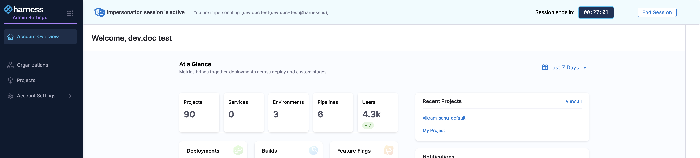

:::note Feature availability
    User Impersonation is a [Beta](/docs/platform/get-started/release-status#beta-limited-ga-and-ga-definitions) feature and is currently behind the `PL_ENABLE_USER_IMPERSONATION` feature flag. Contact [Harness Support](mailto:support@harness.io) to enable the feature.
:::

User Impersonation allows account administrators to temporarily act as another user in the account, including other admins without needing their password. This feature is especially useful for troubleshooting, and verifying if a user has the intended set of permissions.

By impersonating a user, Account admins can see exactly what that user sees and perform actions on their behalf.

### Prerequisite

- A user must have the [Account Admin role](/docs/platform/role-based-access-control/add-manage-roles/#platform-roles) to impersonate other users.

### How to Impersonate a User

1. Navigate to **Account Settings**, **Access Control** and select **Users**.

2. For the user you want to impersonate, click the vertical ellipsis icon (:) on the right, and select **Impersonate User**.

    

3. For each impersonation session, you must provide a valid reason. Once entered, click **Start Impersonation** to begin the session.   

    

4. The impersonation session lasts 30 minutes. A banner at the top of the screen shows the remaining time for the session.

    

5. To end the impersonation session midway, click the **End Session** button on the top banner. 

6. When the session ends, a prompt appears giving you the option to either **Restart Session** or **Quit**.

    

### Impersonation session audit events

The `Start impersonation` audit event is triggered at the beginning of an impersonation session, while the `End impersonation` audit event occurs when the session concludes or times out.

All audit events fired during the impersonation session are tagged with the impersonator and impersonated user details. These can be viewed in the [Audit Trail](/docs/platform/governance/audit-trail/) page. 

The Action column shows the activity, while the User column indicates who was impersonated and by whom.

    

:::caution Important Note

1. The Impersonate User option is available only at the Account scope.
2. Only users that have logged in at least once can be impersonated.
3. The following are not supported during an impersonation session:
    - [Software Engineering Insights](/docs/software-engineering-insights)
    - Self-impersonation
    - Creating, editing, or deleting [API Keys or Access Tokens](/docs/platform/automation/api/add-and-manage-api-keys/)
    - Account-related actions such as:
        - Viewing list of accounts for an impersonated user 
        - Switching accounts
        - Changing the default account
        - Signing out
        - Resetting passwords
        - Managing [Two-Factor Authentication (2FA)](/docs/platform/authentication/two-factor-authentication/)
        - Changing state of [public access](/docs/platform/pipelines/executions-and-logs/allow-public-access-to-executions) or managing [IP allowlist](/docs/platform/security/add-manage-ip-allowlist/)
    
:::

