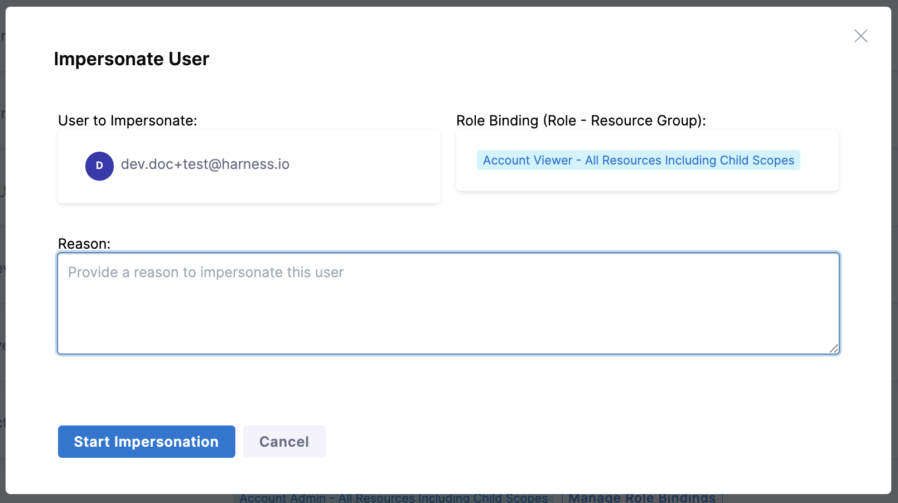
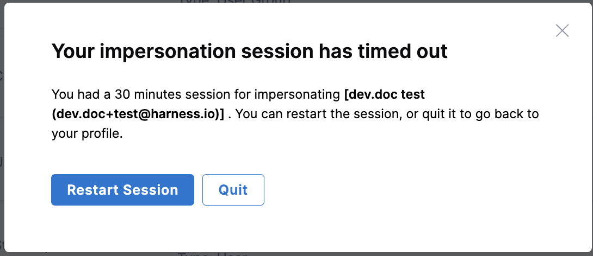
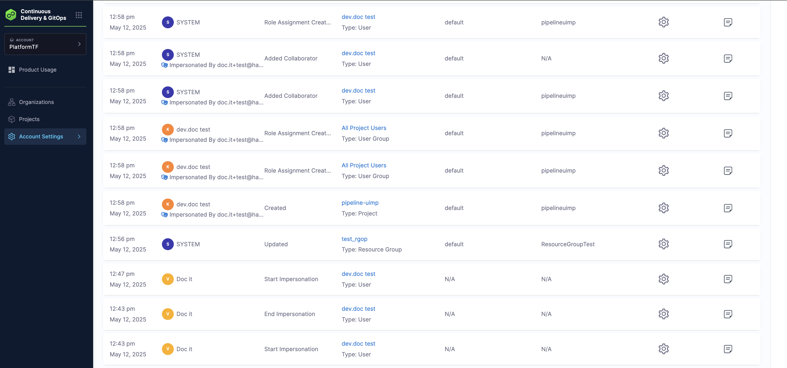

:::note
    This feature is currently behind the `PL_ENABLE_USER_IMPERSONATION` feature flag and is only available to users with the Account Admin role. Contact [Harness Support](support@harness.io) to enable the feature.
:::

User Impersonation allows administrators to temporarily access and act as another user, including other admins without needing their password. This feature is especially useful for troubleshooting, and verifying permissions across environments.

By impersonating a user, admins can see exactly what that user sees and perform actions on their behalf, ensuring a more accurate and efficient support or testing process. 

### How to Impersonate a User

1. Navigate to **Account Settings**, **Access Control** and select **Users**.

2. Check for a user you want to impersonate, click on the vertical Ellipsis icon on the right, and select **Impersonate user**.

    

3. For each impersonation session, you must provide a valid reason. Once entered, click **Start Impersonation** to begin the session.   

    

4. The session begins with a banner displayed at the top of the page. It lasts for 30 minutes, during which you'll have the same access as the user being impersonated.

    

5. To end the impersonation session, click **End Session**. If no action is taken, the session will automatically expire after 30 minutes.

6. When the session ends, a prompt appears giving you the option to either **Restart Session** or **Quit**.

    

### Impersonation Session Logs

All impersonation activities are recorded in the Audit Trail. To view them, go to **Account Settings** > **Security and Governance** > **Audit Trail**. 

The Action column shows the activity, while the User column indicates who was impersonated and by whom.

    

:::info Important Note    

    **The following actions are disabled during an impersonation session to ensure security and control:**

    - You cannot impersonate yourself.  
    - Signing out, switching accounts, and changing passwords are not allowed.  
    - Creating, editing, or deleting Personal Access Tokens (PATs) is disabled.  
    - Managing Two-Factor Authentication (2FA) is also restricted.

:::

