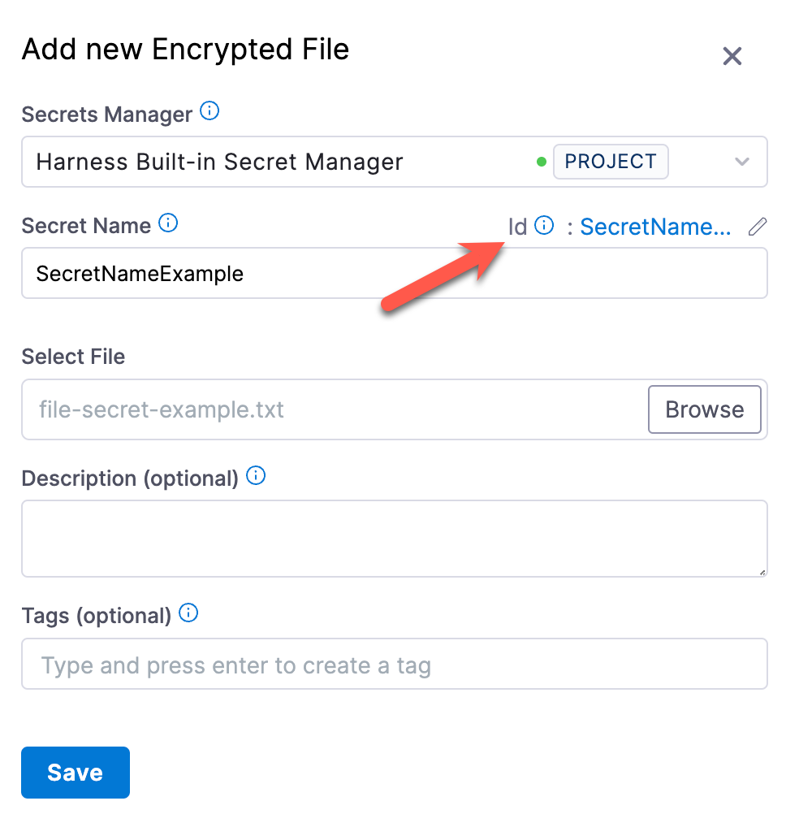

You can store encrypted files and reference them in your Harness resources, such as pipelines, steps, and connectors.

This topic assumes you have [created a Harness project](../organizations-and-projects/create-an-organization.md).

## Create an encrypted file secret

You can add an encrypted file secrets at the project, organization, and account scopes.

1. Depending on the scope where you want to create the secret, go to **Project Setup**, **Organization**, or **Account Resources**.
2. Select **Secrets**.
3. Select **Secret**, and then select **File**.

   

4. Select the [Secrets Manager](/docs/category/secrets-management) that you want to use to store the secret.

   

5. Enter a name for the secret.

   You can use this name to reference the encrypted file secret in pipelines, steps, connectors, and so on.

   An ID is created based on the name, and you can also use the ID to reference the encrypted file secret.

6. Select **Browse** and locate the file you want to store as a secret.
7. Optionally, you can enter a **Description** and **Tags**.
8. Select **Save**.


  :::warning

   File secrets are only created as Inline secrets. Inline secrets deleted in Harness are also deleted from the external secrets manager. Harness recommends that you always back up these secrets.

   :::

## Reference an encrypted file secret

You can reference a encrypted file secret in any resource that allows files, such as SSH key files for SSH credentials, authentication keys for connectors, and steps in pipelines that ingest files.

### Reference by name

When populating a UI field, you can search and select secrets by the **Secret Name**.


### Reference by ID

To reference encrypted file secrets in YAML or in fields that require expressions, you must use the ID in a [Harness expression](/docs/platform/variables-and-expressions/runtime-inputs#expressions).

1. Locate the ID, next to the **Secret Name**, in the secret's settings.

   

   You can edit a secret's display name, but you can't change the ID.

2. Reference the secret using the appropriate expression format:

   * Secret created at the project scope, use: `<+secrets.getValue("FILE_SECRET_ID")>`
   * Secret created at the organization scope: `<+secrets.getValue("org.FILE_SECRET_ID")>`
   * Secret created at the account scope: `<+secrets.getValue("account.FILE_SECRET_ID")>`

## Secrets in outputs

When a secret is displayed in an output, Harness substitutes the secret value with asterisks so that the secret value is masked. Harness replaces each character in the name with an asterisk (`*`).

<figure>


<figcaption>Secret values referenced in a Shell Script step are replaced with asterisks.</figcaption>
</figure>

If you accidentally use a very common value in your secret, like whitespace, the `*` substitution might appear in multiple places in the output. If you see an output like this, review your secret and fix the error.

Masking only applies if Harness knows the value is a secret. For example, if you use `cat` to handle [line breaks and shell-interpreted characters in decoded secrets](#line-breaks-and-shell-interpreted-characters), Harness doesn't know that the content of the `cat` was a secret, and, therefore, it isn't masked.

Additionally, if an output variable from a step in a build (CI) stage contains a secret, be aware that the secret will be visible in the [build details](/docs/continuous-integration/use-ci/viewing-builds). Such secrets are visible on the **Output** tab of the step where the output variable originates and in the build logs for any later steps that reference that variable.

### Sanitization

Log and output sanitization only look for an exact match of what is stored. For example, if you stored a base64-encoded value, then only the base64-encoded value is sanitized.

For example, assume you have the following multi-line secret:

```
line 1
line 2
line 3
```

When this value is base64-encoded, it results in an output like `bGluZSAxCmxpbmUgMgpsaW5lIDM=`. You could add this value to a Harness secret named **linebreaks**, and then decode the secret with a command such as `echo '<+secrets.getValue("linebreaks")>' | base64 -d`.

When the pipeline runs, the resulting decoded output is not sanitized because it doesn't match the stored base64-encoded value.


## Line breaks and shell-interpreted characters

You can reference secrets in scripts, but [text secrets](./add-use-text-secrets.md) with line breaks or other special characters might interfere with script execution.

To address this, you can decode and write the secret to a file. For example, the following command decodes a secret from [base64](https://linux.die.net/man/1/base64) and writes it to a file:

```shell
echo '<+secrets.getValue("my_secret")>' | base64 -d > /path/to/file.txt
```

For secrets that are not in base64, such as PEM files, you can convert and encode them in base64, and then store them as [Harness file secrets](./add-file-secrets.md) before decoding them in your pipelines. For example, this command decodes a secret called `my_secret` and stores the decoded secret at `/harness/secrets.json`:

```shell
echo '<+secrets.getValue("my_secret")>' | base64 -d > /harness/secrets.json
```

You can also write secrets to files without base64, for example:

```shell
echo '<+secrets.getValue("long_secret")>' > /tmp/secretvalue.txt
```

However, if your secret contains line breaks or you don't use base64 and the secret's value contains any shell-interpreted characters, the script might not execute as expected. In this case, you can `cat` the secret in a special-purpose code block, for example:

```shell
cat > /harness/secret_exporter/values.txt << 'EOF'
MySecret:<+secrets.getValue("test")>
EOF
```

Decoded secrets in `cat` aren't [masked in outputs](#secrets-in-outputs), because Harness no longer recognizes the contents as a secret.

Here's an example of a secret decoded in a [CI Run step](/docs/continuous-integration/use-ci/run-step-settings.md):

```yaml
              - step:
                  type: Run
                  name: Run_1
                  identifier: Run_1
                  spec:
                    shell: Sh
                    command: |
                      echo $SECRET | base64 --decode > decoded.txt
                    envVariables:
                      SECRET: <+secrets.getValue("secretfile")>
```

## Guidance for specific providers or formats

Use this information in addition to the above general file secret information.

### GCP secrets

For information about using GCP secrets in Harness, go to [Use GCP secrets in scripts](/docs/continuous-integration/secure-ci/authenticate-gcp-key-in-run-step.md).

### JKS files

To use JKS files, you need to use base64 encoding.

1. [Create a base64-encoded secret file](https://www.base64encode.org/) from your JKS secret.
2. Save the base64-encoded file as a [Harness file secret](/docs/platform/secrets/add-file-secrets) or, if you are working with a keystore, save the secret in your keystore as base64, for example:

   ```
   cat keystore.jks | base64 > keystorefile_asbase64.jks
   ```

3. In your pipeline, in the step where you need to use the JKS file, decode the file secret and write it to a temporary file, for example:

   ```
   ls -lha /

   echo '<+secrets.getValue("filejksasbase64")>' > /values.jksbase64

   cat /values.jksbase64

   cat /values.jksbase64 | base64 -d
   ```

   You can also decode the secret to a `.jks` file, for example:

   ```
   cat /values.jksbase64 | base64 -d > values.jks
   ```

   If your secret contains line breaks, you can `cat` the secret in a special-purpose code block, for example:

   ```
   cat > /harness/values.jksbase64 << 'EOF'
   MySecret:<+secrets.getValue("my_secret")>
   EOF
   ```

   :::warning

   Decoded secrets in `cat` aren't [masked in outputs](/docs/platform/secrets/add-file-secrets/#secrets-in-outputs) because Harness no longer recognizes the contents as a secret.

   :::

4. Use the decoded file as needed for authentication in your scripts, such as:

   ```
   ... --key-file=/harness/values.jksbase64
   ```
