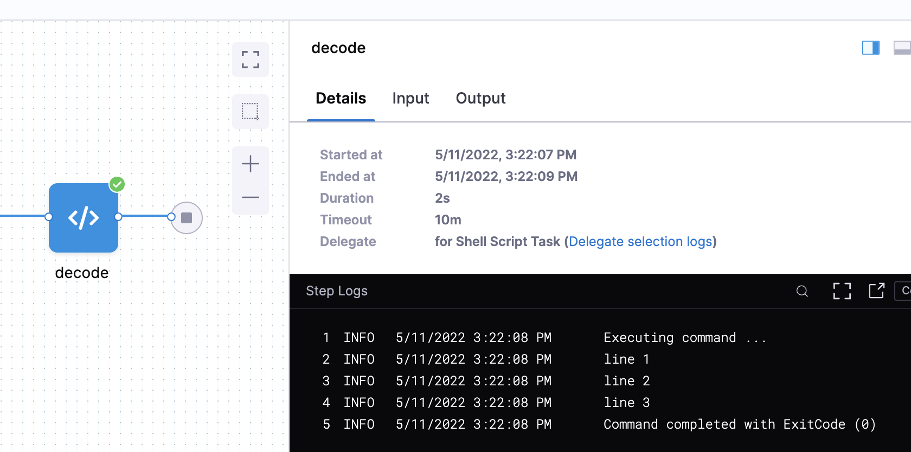

You can add an encrypted text secret to a secrets manager and use the secret in Harness resources, such as pipelines, connectors, and step commands.

## Add a text secret

You can create secrets inline while configuring connectors or other resources, and you can create secrets directly in the account, organization, or project.

To create a text secret:

1. In your Harness account, select **ACCOUNT SETTINGS**, select **Account Resources**, and then select **Secrets**.

   You can also create secrets at the organization and project scopes. For more information, go to [Secret scope](#secret-scope).

3. Select **New Secret**, and then select **Text**.

   

4. On the **Add new Encrypted Text** dialog, select the **Secrets Manager** that you want to use to encrypt this secret.

   :::info

   You can create secrets that point to secret managers in a different [scope](/docs/platform/role-based-access-control/rbac-in-harness/#permissions-hierarchy-scopes). For example, you can create secrets inside a project using the Secret Manager created at the Org or Account level.

   :::

   

5. Enter a **Name** for your secret. **Description** and **Tags** are optional.

    :::note
   Harness recommends not using hyphens/dashes (-) in variable and property names, because these characters can cause issues with headers and they aren't allowed in some Linux distributions and deployment-related software.
   :::

   Harness automatically creates an **Id** based on the name. You can use the **Secret Name** and **Id** to [reference this secret elsewhere in Harness](#reference-the-secret-by-identifier).

   

   Secret names have a [character limit and special character restrictions](#secret-name-character-limits-and-restrictions).

6. Select **Inline Secret Value** or **Reference Secret**.

   - **Inline Secret Value**: Enter the value for the encrypted text. If your secret is managed by Azure Key Vault, you can set an expiry date in **Expires on**. The Harness Delegate version 79306 is required for this feature.

   

   - **Reference Secret**: Enter the name of the existing secret in your Secret Manager that you want the **Reference Secret** to refer to, and then select **Test** to test the reference path. You can reference existing secrets in Azure Key Vault, Hashicorp Vault, AWS Secrets Manager, or GCP Secrets Manager.

   

7. Select **Save**.

  :::warning

   Inline secrets of text types deleted in Harness are also deleted from the external secrets manager. Harness recommends that you always back up these secrets.
   :::
   

### Secret scope

You can add text secrets at the account, organization, or project scope.

When creating secrets, it's important to understand their [scope](/docs/platform/role-based-access-control/rbac-in-harness/#permissions-hierarchy-scopes) in your Harness account.

You can only create secrets in the scopes permitted by your [role binding](/docs/platform/role-based-access-control/rbac-in-harness/#role-binding).

For example, when you create a new project or a new organization, a Harness Secret Manager is automatically scoped to that level.

### Secret name character limits and restrictions

Secret names can't exceed 100 characters if you are using the Vault V2 engine.

Additionally, secret names can't contain these characters:

```
 ~ ! @ # $ % ^ & * ' " ? / < > , ;
```

## Use the secret in connectors

All of the passwords and keys used in Harness connectors are stored as encrypted text secrets in Harness.

You can either [create the secret](#add-a-text-secret) first and then select it in the connector, or you can create it while configuring the connector by selecting **Create or Select a Secret**.


You can also edit an existing secret's name, description, and tags while configuring the connector.


## Reference the secret by identifier

When you create a secret, Harness automatically creates an **Id** based on the name. You can use the identifier to reference a secret in your connectors, steps, stages, and other settings and commands that expect or ingest secrets.


When referencing a secret in an [expression](/docs/platform/variables-and-expressions/harness-variables), you must use the identifier. The name won't work.

For a text secret at the project scope, you can use the following expression to reference the secret by its identifier:

```
<+secrets.getValue("some_secret_identifier")>
```

For example, if you have a text secret with the identifier `Docker_Hub_MRC`, you could reference it in a Shell Script step with a command such as:

```shell
echo "text secret is: " <+secrets.getValue("Docker_Hub_MRC")>
```

To reference a secret at the organization scope, include the `org` modifier in the expression, for example:

```
<+secrets.getValue("org.some_secret_identifier")>
```

To reference a secret at the account scope, include the `account` modifier, for example:

```
<+secrets.getValue("account.some_secret_identifier")>
```

You can also use variables to populate secret identifiers that might change depending on the pipeline run context. To reference a secret identifier as a variable, use the following expression syntax:

```
<+secrets.getValue(<+stage.variables.variable_name>)>
```

If possible, avoid using `$` in your secret value. If your secret value includes `$`, you must use single quotes when you use the expression in a script. For example, assume you have a secret at the project scope that has a value of `my$secret` and an identifier of `Docker_Hub_MRC`, to call thi secret in a script, you must wrap the expression in single quotes, such as:

```shell
echo '<+secrets.getValue("Docker_Hub_MRC")>'
```

For more information about handling special characters in secret values, go to [Line breaks and shell-interpreted characters](#line-breaks-and-shell-interpreted-characters).

### Nested expressions using string concatenation

You can use the `+` operator or `concat` method inside expressions referencing secrets. For example, each of the following expressions uses a concatenation method to combine a string and a variable expression into a complete secret identifier.

```
<+secrets.getValue("test_secret" + <+pipeline.variables.envVar>)>
<+secrets.getValue("test_secret")>.concat(<+pipeline.variables.envVar>)>
```

## Secrets in outputs

When a secret is displayed in an output, Harness substitutes the secret value with asterisks so that the secret value is masked. Harness replaces each character in the name with an asterisk (`*`).

<figure>


<figcaption>Secret values referenced in a Shell Script step are replaced with asterisks.</figcaption>
</figure>

If you accidentally use a very common value in your secret, like whitespace, the `*` substitution might appear in multiple places in the output. If you see an output like this, review your secret and fix the error.

Masking only applies if Harness knows the value is a secret. For example, if you use `cat` to handle [line breaks and shell-interpreted characters in decoded secrets](#line-breaks-and-shell-interpreted-characters), Harness doesn't know that the content of the `cat` was a secret, and, therefore, it isn't masked.

Additionally, if an output variable from a step in a build (CI) stage contains a secret, be aware that the secret will be visible in the [build details](/docs/continuous-integration/use-ci/viewing-builds). Such secrets are visible on the **Output** tab of the step where the output variable originates and in the build logs for any later steps that reference that variable.

### Sanitization

Log and output sanitization only look for an exact match of what is stored. For example, if you stored a base64-encoded value, then only the base64-encoded value is sanitized.

For example, assume you have the following multi-line secret:

```
line 1
line 2
line 3
```

When this value is base64-encoded, it results in an output like `bGluZSAxCmxpbmUgMgpsaW5lIDM=`. You could add this value to a Harness secret named **linebreaks**, and then decode the secret with a command such as `echo <+secrets.getValue("linebreaks")> | base64 -d`.

When the pipeline runs, the resulting decoded output is not sanitized because it doesn't match the stored base64-encoded value.



## Line breaks and shell-interpreted characters

You can reference secrets in scripts, but text secrets with line breaks or other special characters might interfere with script execution.

To address this, you can decode and write the secret to a file. For example, the following command decodes a secret from [base64](https://linux.die.net/man/1/base64) and writes it to a file:

```shell
echo <+secrets.getValue("my_secret")> | base64 -d > /path/to/file.txt
```

For secrets that are not in base64, such as PEM files, you can convert and encode them in base64, and then store them as [Harness file secrets](./add-file-secrets.md) before decoding them in your pipelines. For example, this command decodes a secret called `my_secret` and stores the decoded secret at `/harness/secrets.json`:

```shell
echo <+secrets.getValue("my_secret")> | base64 -d > /harness/secrets.json
```

You can also write secrets to files without base64, for example:

```shell
echo '<+secrets.getValue("long_secret")>' > /tmp/secretvalue.txt
```

However, if your secret contains line breaks or you don't use base64 and the secret's value contains any shell-interpreted characters, the script might not execute as expected. In this case, you can `cat` the secret in a special-purpose code block, for example:

```shell
cat > /harness/secret_exporter/values.txt << 'EOF'
MySecret:<+secrets.getValue("test")>
EOF
```

Decoded secrets in `cat` aren't [masked in outputs](#secrets-in-outputs), because Harness no longer recognizes the contents as a secret.

Here's an example of a secret decoded in a [CI Run step](/docs/continuous-integration/use-ci/run-step-settings.md):

```yaml
              - step:
                  type: Run
                  name: Run_1
                  identifier: Run_1
                  spec:
                    shell: Sh
                    command: |
                      echo $SECRET | base64 --decode > decoded.txt
                    envVariables:
                      SECRET: <+secrets.getValue("secretfile")>
```
