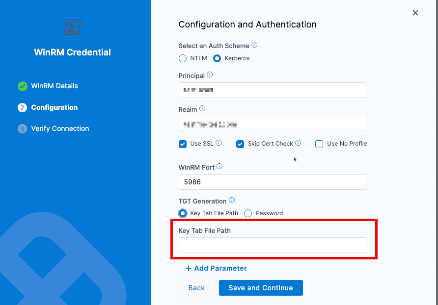

Use these steps to add a WinRM credential key that can be referenced in Harness entities.

You can add WinRM credentials when creating connectors and other account or project resources. Or, you can select **Secrets** under **Account/Organization/Project Setup** and create a WinRM credential secret. In this example, we'll create a WinRM credential secret at the account scope.

To configure **WinRM Credential** settings:

1. In Harness, select **Account Settings**. The Account Settings page opens.
2. Under **Account-level resources**, select **Secrets**. The Secrets list page opens.
3. Select **+ New Secret**, then select **WinRM Credential**. The WinRM Details pane opens.
Enter a **Name** for the WinRM credential and select **Continue**.
4. Under **Select an Auth Scheme**, select one of the following:

   * **[NLTM](https://learn.microsoft.com/en-us/windows-server/security/kerberos/ntlm-overview)**
  
     Enter the following authentication details:
     1. **Domain:** Enter the Active Directory domain name with which the user account in the credential is registered.
     2. **Username:** Enter the user name for this connection. The user must belong to the same Active Directory domain as the Windows instances that this connection uses. These are the same user account credentials you would use when logging in to the VM through an application such as Microsoft Remote Desktop.
     3. **Password:** Create or select an existing [encrypted file secret](/docs/platform/secrets/add-file-secrets) that contains the relevant WinRM key file.
     4. **Use SSL:** (Recommended) Select to enable an HTTPS connection instead of an HTTP connection.
     5. **Skip Cert Check:** Select to skip the certificate check. When connected over HTTPS, the client doesn't validate the server certificate.
     6. **No Profile** Enable this option to start the PowerShell session without loading the user's `Profile.ps1`.
        :::info
        
          If your environment uses a custom `Profile.ps1`, it may produce output or set configurations that interfere with session initialization. Enabling **No Profile** ensures a clean PowerShell environment and is recommended if you're seeing unexpected behavior during execution.
        :::
        
     7. **WinRM Port:** Leave the default port or enter a new port if needed.


         :::info

          The default port for SSL is **5986**. If you haven't selected the **Use SSL** option, the default port is **5985**. Harness switches ports depending on whether or not SSL is enabled.

         :::

   * **[Kerberos](https://learn.microsoft.com/en-us/windows-server/security/kerberos/kerberos-authentication-overview?source=recommendations)** (recommended)

     
       :::info

       You must add the Kerberos startup script to the Harness Delegate YAML for the connection to succeed.

       :::

   <details>

   <summary>Add the Kerberos startup script to the delegate YAML</summary>

   1. Open `delegate.yaml` in a text editor.
   2. Locate the environment variable `INIT_SCRIPT` in the `Deployment` object.

        ```yaml
        - name: INIT_SCRIPT
        value: ""
        ```

   3. Replace `value: ""` with the following script:
    
        :::info
    
        Make sure to use the actual Kerberos domain values, host IP, and password in the following script.
    
        :::
  
        ```yaml
        - name: INIT_SCRIPT
          value: |-
           # Set up kerberos
           microdnf update
           microdnf install vim
           microdnf install yum
           microdnf install -y yum-utils
           yes | yum install krb5-workstation krb5-libs
           truncate -s 0 /etc/krb5.conf
           cat <<EOT >> /etc/krb5.conf
           [logging]
               default = FILE:/var/log/krb5libs.log
               kdc = FILE:/var/log/krb5kdc.log
               admin_server = FILE:/var/log/kadmind.log
           [libdefaults]
               default_realm = KERBEROS.DOMAIN
               dns_lookup_realm = true
               ticket_lifetime = 24h
               renew_lifetime = 7d
               forwardable = true
               rdns = false
           [realms]
             KERBEROS.DOMAIN = {
               kdc = "SERVER_NAME.KERBEROS.DOMAIN"
               admin_server = "SERVER_NAME.KERBEROS.DOMAIN"
               default_domain = "KERBEROS.DOMAIN"
               master_kdc = "SERVER_NAME.KERBEROS.DOMAIN"
             }
           [domain_realm]
             .KERBEROS.DOMAIN = KERBEROS.DOMAIN
           EOT
           echo 'host_ip host_name SERVER_NAME.KERBEROS.DOMAIN' >> /etc/hosts
           echo 'password' | kinit USERNAME@KERBEROS.DOMAIN
           klist
        ```

   </details>

    Enter the following authentication details:

      1. **Principal:** Enter the account name associated with the Kerberos account.
      2. **Realm:** Enter a realm. A realm is a logical network served by a single Kerberos database and a set of Key Distribution Centers (KDCs).
      3. **Use SSL:** (Recommended) Select to enable an HTTPS connection instead of an HTTP connection.
      4. **Skip Cert Check:** Select to skip certificate check. When connected over an HTTPS connection, the client doesn't validate the server certificate.
      5. **No Profile** Enable this option to start the PowerShell session without loading the user's `Profile.ps1`.
        :::info
        
          If your environment uses a custom `Profile.ps1`, it may produce output or set configurations that interfere with session initialization. Enabling **No Profile** ensures a clean PowerShell environment and is recommended if you're seeing unexpected behavior during execution.
        :::

      7. **WinRM Port:** Leave the default port or enter a new port if needed 
      
          :::info

          The default port for SSL is **5986**. If you haven't selected the **Use SSL** option, the default port is **5985**. Harness switches ports depending on whether or not SSL is enabled.
         :::

      8. **TGT Generation:** Select one of the following options:

          * **Key Tab File:** Generates a new TGT from KDC every time you authenticate with the service. For more information, [please see below](#generating-keytab-files)
          * **Password:** Use Harness [encrypted text secrets](/docs/platform/secrets/add-use-text-secrets) to save the password and refer to it using this option.

5. Select **Save and Continue**.
6. Enter the **Host Name** of the remote server you want to connect to. For example, if the server is an AWS EC2 instance, the host name might be similar to `ec2-54-175-135-106.compute-1.amazonaws.com`.
7. Select **Test Connection**.

   If a message appears stating that no Harness Delegate could reach the host, or that a credential is invalid, verify that your settings are correct, and your Harness Delegate is able to connect to the server.
8. After the test succeeds, select **Finish** to save the WinRM credential.

## Generating KeyTab Files
There are multiple methods to generate KeyTab files.  The following is an example from the [MIT Kerberos Documentation](https://web.mit.edu/kerberos/krb5-devel/doc/basic/keytab_def.html)

As a note, when utilizing KeyTab files, the file will need to be included/distributed to all delegates which may be establishing the connection.  The KeyTab will also need to be updated with rotations.  Because KeyTab files are encrypted tokens, they will not contain password data, or the special characters that may cause problems in password data.

1. Ensure `ktutil` is available.  [ktutil Documentation](https://web.mit.edu/kerberos/krb5-1.12/doc/admin/admin_commands/ktutil.html). The machine executing the `ktutil` commands must also have access to the Key Distribution Center (KDC) database.
2. In terminal/bash, enter the `ktutil` CLI 
3. Run `addent -password -p <principalName> -k 1 -e aes256-cts-hmac-sha1-96` to pull the token
4. Run `wkt ./<username>.keytab` to write the keytab/keylist file to the location
5. Add the keytab to the appropriate delegates.  This can be done in multiple methods, but an example would be to do a `kubectl cp` command.
6. Provide the file location to the WinRM Secret
   
