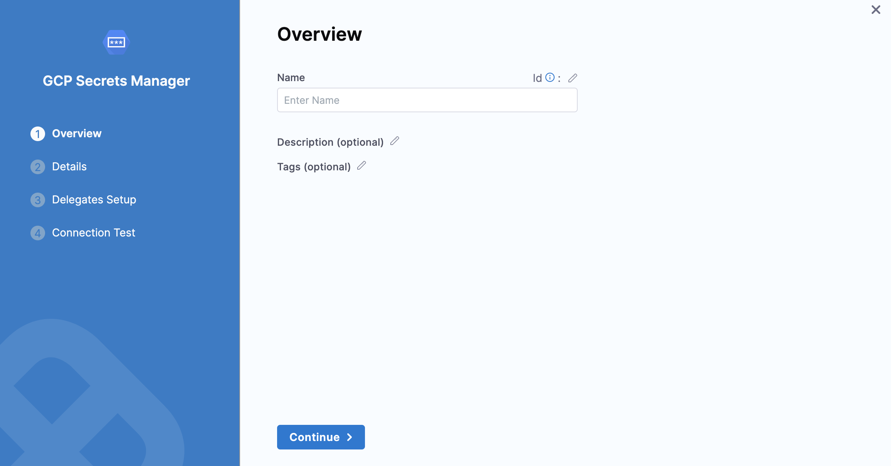
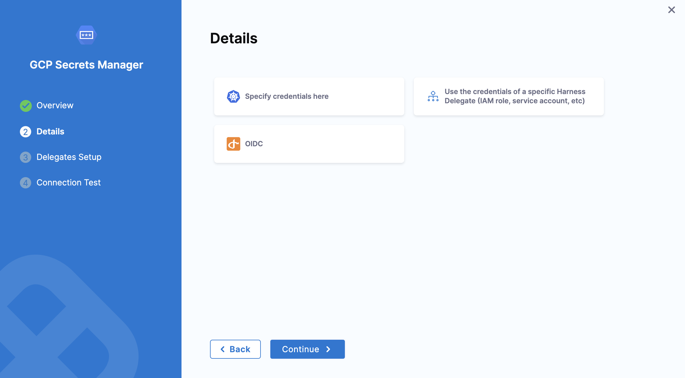
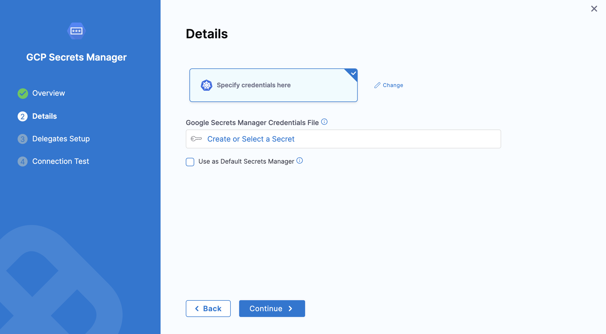
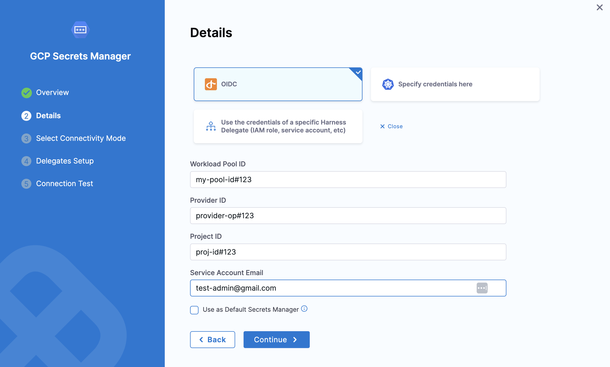
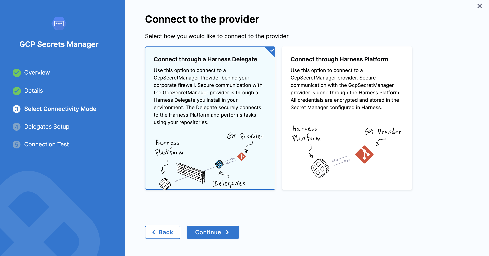
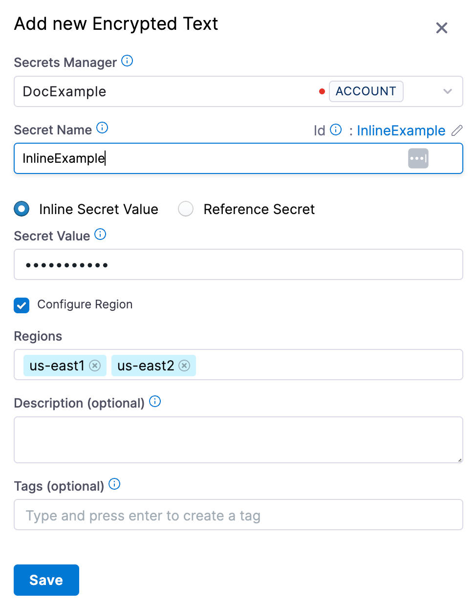
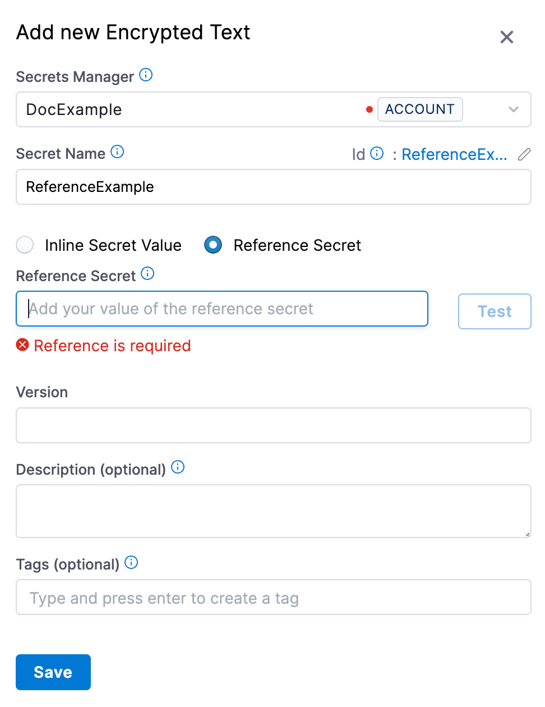
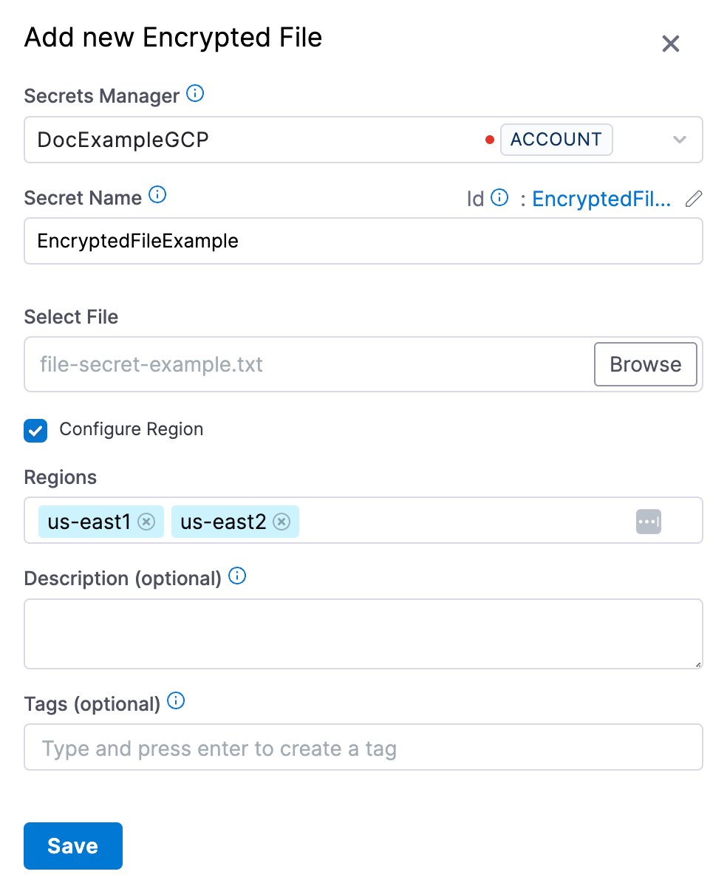

You can link your Google Cloud Secret Manager to Harness and use it to store any sensitive data you use in Harness, including secrets.

Harness also supports [Google KMS as a secrets manager](/docs/platform/secrets/secrets-management/add-google-kms-secrets-manager.md). This topic explains how to add a GCP Secrets Manager in Harness.

import Storeauth from '/docs/platform/shared/store-auth-credentials.md'

<Storeauth />

## Before you begin

You need an understanding of:

* [Harness' key concepts](/docs/platform/get-started/key-concepts.md).
* [Secrets Management](/docs/platform/secrets/secrets-management/harness-secret-manager-overview).
* [Storing authentication credentials](/docs/platform/secrets/secrets-management/store-authentication-credentials).

## Google Cloud secret manager important notes

* Inline secrets saved to GCP Secrets Manager must follow the naming limitations of Google Cloud Secret Manager. Secret names can only contain alphabets, numbers, dashes (-), and underscores (\_). Google Secret Manager restrictions are subject to change. Go to [Secret Manager](https://cloud.google.com/secret-manager) in the GCP documentation for details.
* The maximum size for encrypted files saved to Google Cloud Secret Manager is 64KiB.
* Inline secrets saved to Google Cloud Secret Manager have a region assignment by default. An automatic assignment is the same as not selecting the **Regions** setting when creating a secret in Google Cloud Secret Manager.
* Harness does not support Google Cloud Secret Manager labels at this time.
* **Versions for reference secrets:**
	+ Any modification to the content of a secret stored by Harness in Google Cloud Secret Manager creates a new version of that secret.
	+ When you delete a secret present in Google Cloud Secret Manager from Harness, the entire secret is deleted and not just a version.
* You cannot update the name of an inline or referenced secret stored in the Google Cloud Secret Manager using the Harness Secret Manager.
* Harness does not support changing an inline secret to a reference secret or vice versa in Harness.
* **Cross-project access:** A single connector can access secrets across multiple GCP projects. The connector is configured with a default project, but you can optionally specify a different project when creating or referencing secrets. The service account associated with the connector must have appropriate permissions across all target projects. For more information, go to [Enable Cross-Project Access](#enable-cross-project-access).

## Google Cloud secret manager permission requirements

* Make sure you have Create/Edit permissions for Secrets.
* Make sure you have **Create/Edit** permissions for connectors.
* The GCP Service Account you use in the **Google Secrets Manager Credentials File** should have the following IAM roles:
	+ `roles/secretmanager.admin` or `roles/secretmanager.secretAccessor` and `roles/secretmanager.secretVersionManager`.

Go to [Managing secrets](https://cloud.google.com/secret-manager/docs/access-control) from Google.

## Add a Google Cloud secret manager

This topic assumes you have a Harness Project set up. If not, go to[Create Organizations and Projects](../../organizations-and-projects/create-an-organization.md).

You can add a connector from any module in your project, in the Project setup, or in your organization or account resources.

This topic explains the steps to add a Google Cloud Secrets Manager to the account [scope](/docs/platform/role-based-access-control/rbac-in-harness#permissions-hierarchy-scopes).

1. In your Harness Account, select **Account Settings**.
2. Select **Account Resources**.
3. Select **Connectors** and then select **New Connector**.
4. In **Secret Managers**, select **GCP Secrets Manager**.
   The GCP Secrets Manager settings appear.

   

## Add overview

1. In **Name**, enter a name for your secret manager.
2. You can choose to update the **Id** or let it be the same as your secret manager's name. For more information, go to [Entity Identifier Reference](../../references/entity-identifier-reference.md).
3. Enter the **Description** for your secret manager.
4. Enter **Tags** for your secret manager.
5. Click **Continue**.

## Configure details

Select one of the following options to configure details for the Google cloud secret manager:

   - **Specify credentials here**
   - **Use the credentials of a specific Harness Delegate (IAM role, service account, etc)**

### Specify credentials here

#### Attach a Google Secret Manager credentials file

You must export your Google Cloud service account key and add it as an [Encrypted File Secret](/docs/platform/secrets/add-file-secrets) in Harness.

1. In the Google Cloud console, select **IAM & admin** > **Service account**.
2. Scroll to the service account you want to use. If no service account is present, create one.
3. Grant this service account the Google Cloud Secret Manager permissions needed.
To do this, edit the service account and select **Permissions**. Click **Roles**, and then add the roles needed.
Go to [Managing secrets](https://cloud.google.com/secret-manager/docs/access-control) in the Google Cloud documentation.
4. Open your service account's Actions ⋮ menu, then select **Create key**.
5. In the resulting **Create private key** dialog, select the **JSON** option, create the key, and download it to your computer.
6. Go back to Harness.
7. In **Google Secrets Manager Credentials File**, select the encrypted file you just added in Harness.

   

   You can also create a new [File Secret](/docs/platform/secrets/add-file-secrets) here and add the Google Cloud service account key that you downloaded.

8. Click **Continue**.

### Use the credentials of a specific Harness Delegate (IAM role, service account, etc)

If you select this option, Harness will authenticate using the IAM role assigned to the specific delegate you select. This would be the Application Default Credentials.

For more information, go to [Application Default Credentials](https://cloud.google.com/docs/authentication/application-default-credentials).

You can select a delegate using a Delegate Selector.

Click **Continue**.

### OIDC - OpenID Connect

This option uses OpenID Connect (OIDC) to authenticate. This option is commonly used for secure identity federation across different applications or cloud platforms, enabling seamless authentication and access management.

After selecting OIDC, choose the connectivity mode based on your requirement—either via a delegate or the Harness platform.

Click **Continue** to proceed.

## Step 4: Setup delegates

1. In **Delegates Setup**, enter [**Selectors**](../../delegates/manage-delegates/select-delegates-with-selectors.md#option-select-a-delegate-for-a-connector-using-tags) for specific delegates that you want to allow to connect to this connector.
2. Click **Save and** **Continue**.

## Step 5: Test connection

Once the Test Connection succeeds, select **Finish**. You can now see the connector in **Connectors**.

## Add an inline secret to the GCP Secrets Manager

Let us add an inline text secret to the GCP Secrets Manager we just created.

1. In your Harness account, select **Account Settings**.
2. Select **Account Resources** and then select **Secrets**.
3. Select **New Secret**, and then select **Text**.
   The **Add new Encrypted Text** settings appear.
4. Select the GCP Secrets Manager you just created.
5. Enter a **Name** for your secret.
6. The default selection is **Inline Secret Value**.
7. Enter the **Secret Value**.
8. (Optional) In **Project**, select the GCP project where this secret should be created.
     - The dropdown lists all GCP projects that the connector's service account has access to.
     - If left blank, the secret is created in the default project associated with the connector.
     - For more information about cross-project access, go to [Enable Cross-Project Access](#enable-cross-project-access).
9. Select **Configure Region** to add the region(s) for your secret.

   

10. Select **Save**.

## Add a secret reference to the GCP Secrets Manager

Let us add a secret reference to the GCP Secrets Manager we just created.

1. In your Harness account, select **Account Settings**.
2. Select **Account Resources** and then select **Secrets**.
3. Select **New Secret** and then select **Text**.
The **Add new Encrypted Text** settings appear.
4. Select the GCP Secrets Manager you just created.
5. Enter a **Name** for your secret.
6. Select **Reference Secret**.

   

7. Enter your secret identifier in **Reference Secret Identifier**.
8. (Optional) In **Project**, select the GCP project that contains the referenced secret.
     - The dropdown lists all GCP projects that the connector's service account has access to.
     - If left blank, Harness retrieves the secret from the default project associated with the connector.
     - For more information about cross-project access, go to [Enable Cross-Project Access](#enable-cross-project-access).
9. In **Version**, enter the version of your secret that you want to reference.
You can either enter a version number like `1`, `2`, or enter `latest` to reference the latest version.
10. Click **Save**.

## Add an encrypted file secret to the GCP Secrets Manager

Let us add an encrypted file secret to the GCP Secrets Manager we just created.

1. In your Harness account, select **Account Settings**.
2. Select **Account Resources** and then select **Secrets**.
3. Select **New Secret** and then select **File**.
The **Add new Encrypted File** settings appear.
4. Select the GCP Secrets Manager you just created.
5. Enter a **Name** for your secret.
6. In **Select File**, browse, and select your file.
7. (Optional) In **Project**, select the GCP project where this encrypted file should be stored.
     - The dropdown lists all GCP projects that the connector's service account has access to.
     - If left blank, the file is stored in the default project associated with the connector.
     - For more information about cross-project access, go to [Enable Cross-Project Access](#enable-cross-project-access).
8. Select **Configure Region** to add the region(s) for your secret.

   

9. Click **Save**.

## Enable Cross-Project Access

  :::note
  Cross-project access is supported in Harness Delegate version **26.01.88200** or later and is behind the feature flag `PL_GCPSM_OIDC_CONNECTOR_CROSS_PROJECT_ACCESS`. Contact [Harness
  Support](mailto:support@harness.io) to enable the feature.
  :::

  You can use one Google Secret Manager connector to access secrets across multiple GCP projects, eliminating the need to create separate connectors for each project. This feature works with all authentication methods: service account credentials, Harness Delegate credentials, and OIDC.

  ### How it works

  **Connector Configuration:**
  - Every Google Secret Manager connector is associated with a default GCP project.
  - This project is determined either directly from user input or indirectly from the authentication credentials provided (service account key, delegate IAM role, or OIDC configuration).
  - The connector configuration itself does not change with this feature.

  **Secret-Level Project Selection:**
  - When creating or referencing secrets (inline text, reference, or encrypted file), you can optionally specify a **Project** field.
  - If you specify a project, Harness creates or retrieves the secret from that GCP project.
  - If you leave the project field blank, Harness uses the connector's default project.

  **Project Selection Dropdown:**
  
  :::note
   To get the list of projects in the secret create/edit flow, [Cloud Resource Manager API](https://docs.cloud.google.com/resource-manager/reference/rest) should be enabled for the project where the service account is located.
  :::

  - The project dropdown is dynamically populated with only the GCP projects that the connector's service account has access to.
  - Only projects where the service account has the required Secret Manager permissions are displayed in the dropdown.

  ### Prerequisites

  The GCP service account associated with your connector must have the required IAM permissions across all projects you want to access:
  - `roles/secretmanager.admin` or
  - `roles/secretmanager.secretAccessor` and `roles/secretmanager.secretVersionManager`

  Ensure these permissions are granted in each target GCP project.

  ### Managing secrets across projects

  **Creating new secrets:**
  1. When creating an inline secret, reference secret, or encrypted file secret, you'll see an optional **Project** field.
  2. Select a project from the dropdown to create the secret in that specific GCP project.
  3. If no project is selected, the secret is created in the connector's default project.

  **Editing existing secrets:**

  - **Secrets created before cross-project access was available:** When you edit these secrets, the **Project** dropdown appears with no project selected. The secret continues to use the connector's default project unless you explicitly select a different project.

  - **Secrets created with a project specified:** When you edit these secrets, the currently selected project is displayed. You can change the project if needed.

  **Changing a secret's project:**
  If you change a secret's project from Project A to Project B and save:
  - Harness tries to create a new secret in Project B's Google Secret Manager with the given name.
  - The original secret in Project A remains unchanged and is not deleted.
  - This is the same behavior as changing the connector itself.

  ### Example use case

  A large organization with multiple GCP projects (e.g., `dev-project-123`, `staging-project-456`, `prod-project-789`) can:

  1. Create a single Google Secret Manager connector with OIDC authentication.
  2. Ensure the OIDC service account has Secret Manager permissions across all three projects.
  3. When creating secrets in Harness:
     - Select `dev-project-123` for development secrets.
     - Select `staging-project-456` for staging secrets.
     - Select `prod-project-789` for production secrets.
  4. All secrets are managed through one connector instead of maintaining three separate connectors.

  This approach significantly reduces connector sprawl and simplifies secret management for organizations with many GCP projects.

## Reference JSON secrets

import Refj from '/docs/platform/shared/reference-via-json.md';

<Refj />

## See also

* [Add Google KMS as a Harness Secret Manager](/docs/platform/secrets/secrets-management/add-google-kms-secrets-manager.md)
* [Add an AWS KMS Secret Manager](/docs/platform/secrets/secrets-management/add-an-aws-kms-secrets-manager)
* [Add an AWS Secret Manager](/docs/platform/secrets/secrets-management/add-an-aws-secret-manager.md)
* [Add an Azure Key Vault Secret Manager](/docs/platform/secrets/secrets-management/azure-key-vault.md)
* [Add a HashiCorp Vault Secret Manager](/docs/platform/secrets/secrets-management/add-hashicorp-vault.md)