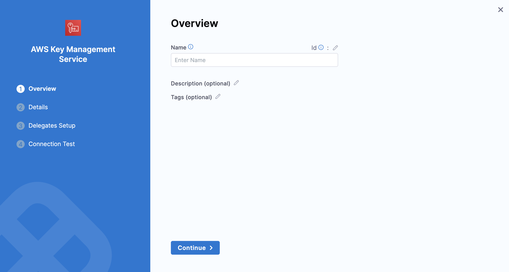
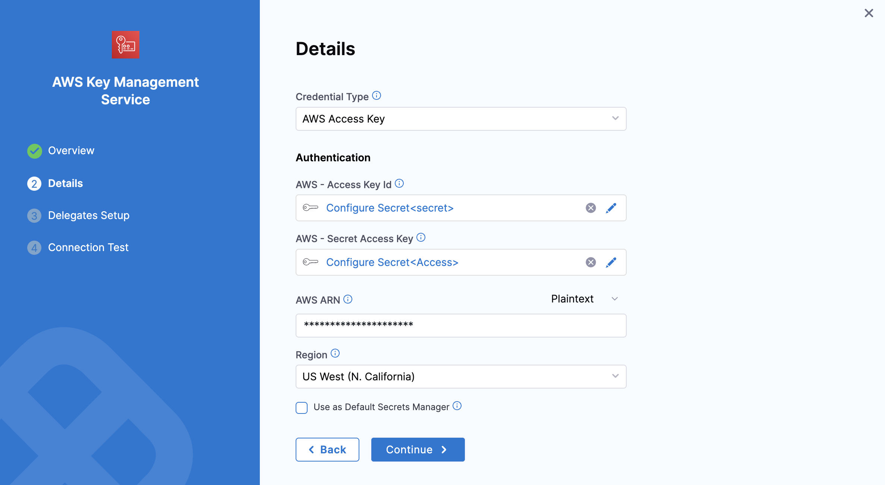
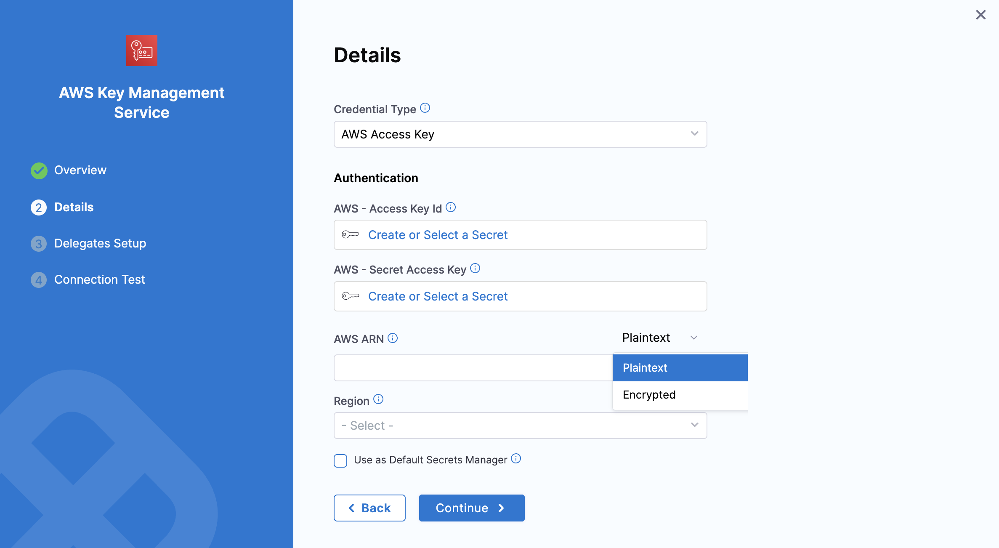
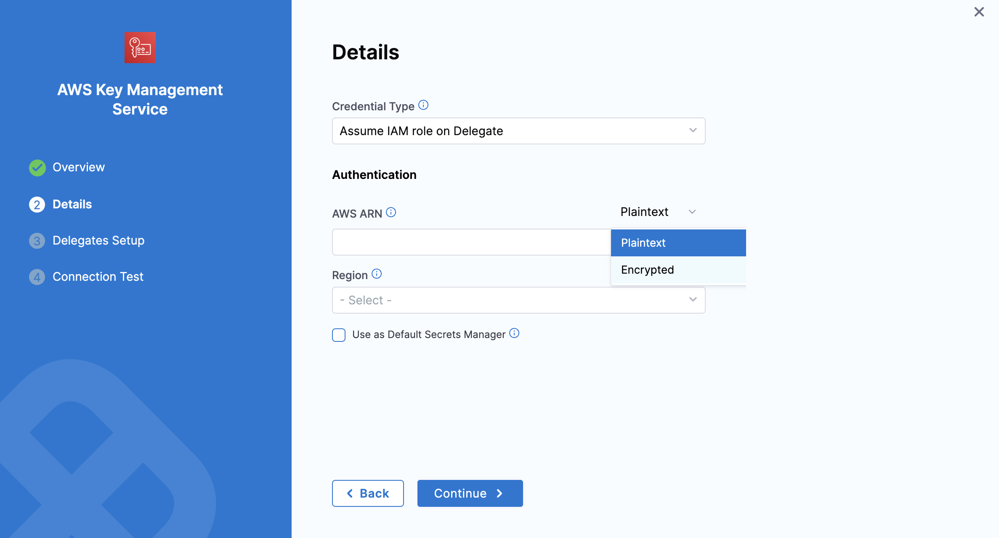
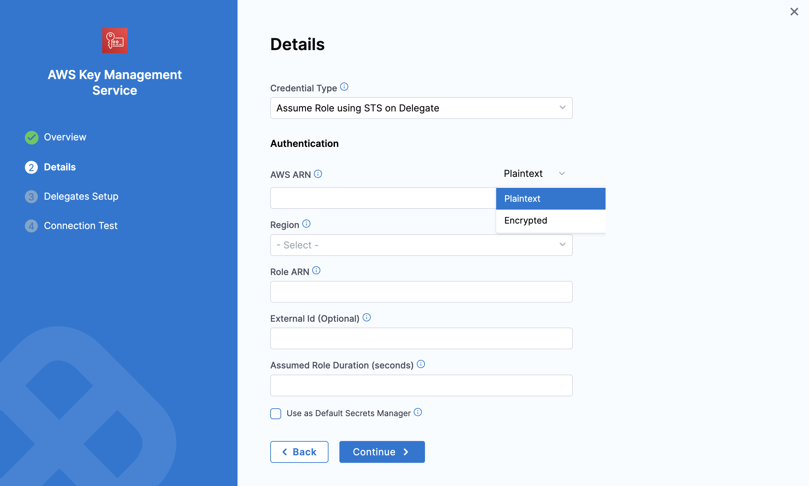
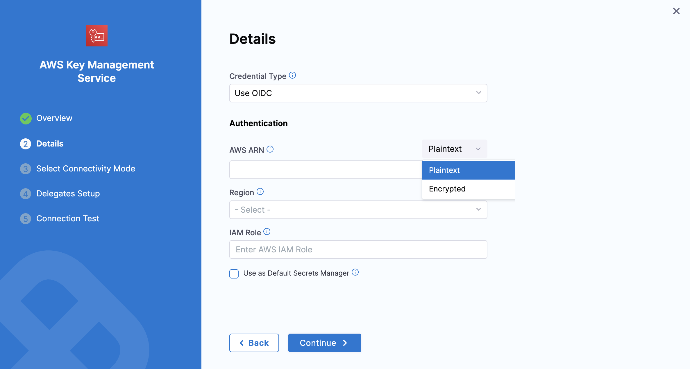
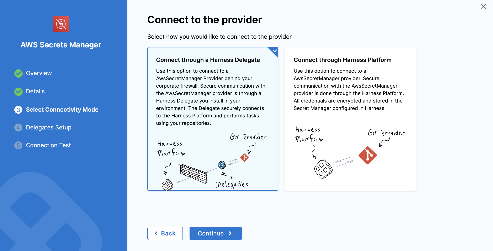

To store and use encrypted secrets (such as access keys) and files, you can add an AWS KMS Secret Manager.

import Storeauth from '/docs/platform/shared/store-auth-credentials.md'

<Storeauth />

This topic describes how to add an AWS KMS Secret Manager in Harness.

### Prerequisites

* [Harness' key concepts](/docs/platform/get-started/key-concepts.md)
* [Harness Secret Manager Overview](/docs/platform/secrets/secrets-management/harness-secret-manager-overview)
* [Store authentication credentials](/docs/platform/secrets/secrets-management/store-authentication-credentials)

### 1: Add a Secret Manager

Navigate to **Settings** → **Account-level resources** → **Connectors** and click **New Connector**. Then, go to **Secret Managers** and select **AWS KMS**. 

### 2: Overview

- Enter a **Name** for your secret manager.

        > You can either update the **ID** or leave it the same as your secret manager's name. For more information, see [Entity Identifier Reference](../../references/entity-identifier-reference.md).

- (Optional) Enter a **Description** and **Tags** for your secret manager.

- Select **Continue**.

### 3: Details

Select the Credential Type. There are four ways to authenticate with AWS, as shown below:

- [**AWS Access Key.**](#option-1-aws-access-key)
- [**Assume IAM role on Delegate.**](#option-2-assume-iam-role-on-delegate)
- [**Assume Role using STS on Delegate.**](#option-3-assume-role-using-sts-on-delegate)
- [**Use OIDC**](#option-4-oidc---openid-connect)

### Option 1: AWS Access Key

Use your AWS IAM user login credentials.

:::tip 
You can get the **AWS Access Key ID**, **AWS Secret Key**, and **Amazon Resource Name (ARN)** either from the **Key Policy** JSON or from the AWS **IAM** console under **Encryption keys**.
:::

For more information, refer to the AWS guide on [viewing the Key ID and ARN](https://docs.aws.amazon.com/kms/latest/developerguide/viewing-keys.html#find-cmk-id-arn)

    - **AWS Access Key ID**

        - Select **Create or Select a Secret**.

        - In the secret settings dialog, you can create or select a [Secret](/docs/platform/secrets/add-use-text-secrets) and enter your AWS Access Key as its value.

            :::info
            - The AWS Access Key is the AWS Access Key ID for the IAM user you want to use to connect to secret manager.
            :::

    - **AWS Secret Access Key**

        - Select **Create or Select a Secret**. You can create a new [Secret](/docs/platform/secrets/add-use-text-secrets) with your Access Key ID's secret key as the **Secret Value**, or use an existing secret.

    - **AWS ARN**:  You can provide the AWS ARN as plain text or as a secret.

        

### Option 2: Assume IAM Role on Delegate

If you select **Assume the IAM Role on Delegate** Harness will authenticate using the IAM role assigned to the AWS host running the Delegate, you select using a Delegate Selector.

    - **AWS ARN**: Enter the AWS ARN directly as plain text or as a secret.

        

    - Select the **Region**, then click **Continue**.

### Option 3: Assume Role using STS on Delegate

This option uses the [AWS Security Token Service](https://docs.aws.amazon.com/IAM/latest/UserGuide/id_credentials_temp.html) (STS) feature. Typically, you use `AssumeRole` within your account or for AWS cross-account access.

    - **AWS ARN**: Provide the ARN either in plain text (for non-sensitive use cases) or as a secret.

        

    - **Region**: select your AWS region.

    - **Role ARN**: Enter the Amazon Resource Name (ARN) of the role that you want to assume. This is an IAM role in the target deployment AWS account.

    - **External ID**: If the administrator of the account to which the role belongs provided you with an external ID, then enter that value. For more information, see [How to Use an External ID When Granting Access to Your AWS Resources to a Third Party](https://docs.aws.amazon.com/IAM/latest/UserGuide/id_roles_create_for-user_externalid.html) in the AWS documentation.

    - **Assume Role Duration (seconds)**: This field sets the AssumeRole session duration. For more details, see [Session Duration](https://docs.aws.amazon.com/STS/latest/APIReference/API_AssumeRole.html) in the AWS AssumeRole documentation.
.

### Option 4: OIDC - OpenID Connect.

 This option uses OpenID Connect (OIDC) to authenticate and authorize users. This option is commonly used for secure identity federation across different applications or cloud platforms, enabling seamless authentication and access management.

    - **AWS ARN**: Choose to input your ARN either as plain text or as a secret.

        

    - **Region and IAM Role**: Once your configuration is complete, set the IAM role and region below to proceed with the setup, as shown in the image above.

    
An additional step before proceeding.

    #### Connectivity mode 

    This additional step allows you to select the connectivity mode.

    Once you have selected OIDC, you will be able to select **connectivity mode**, based on the requirement you can select the provider that can be either connect through a **delegate** or through **Harness platform**. 
        
              

### 3: Setup Delegates

In **Delegates** **Setup**, enter [**Selectors**](../../delegates/manage-delegates/select-delegates-with-selectors.md#option-select-a-delegate-for-a-connector-using-tags) for specific **Delegates** that you want to allow to connect to this Connector. Select **Save and Continue**.

### 4: Test Connection

In **Connection** **Test**, select **Finish** after your connection is successful.
