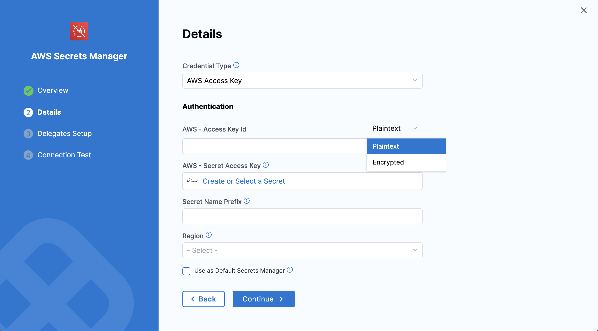

You can use AWS Secrets Manager for your Harness secrets.

Unlike AWS KMS, AWS Secrets Manager stores both secrets and encrypted keys. With AWS KMS, Harness stores the secret in its Harness store and retrieves the encryption keys from KMS. For information on using an AWS KMS Secrets Manager, go to [Add an AWS KMS Secrets Manager](/docs/platform/secrets/secrets-management/add-an-aws-kms-secrets-manager).

This topic describes how to add an AWS Secret Manager in Harness.

import Storeauth from '/docs/platform/shared/store-auth-credentials.md'

<Storeauth />

### Before you begin

* If you are adding an AWS Secrets Manager running on ROSA, you must also add an environment variable `AWS_REGION` with the appropriate region as its value, for example, `AWS_REGION=us-east-1`.

### Permissions: Test AWS Permissions

Harness uses the same minimum IAM policies for AWS secret manager access as the AWS CLI.

The AWS account you use for the AWS Secret Manager must have the following policies at a minimum:

```json
{
    "Version": "2012-10-17",
    "Statement": {
        "Effect": "Allow",
        "Action": [
            "secretsmanager:Describe*",
            "secretsmanager:Get*",
            "secretsmanager:List*"
        ],
        "Resource": "*"
    }
}
```

These policies let you list secrets which will allow you to add the secret manager and refer to secrets, but it will not let you read secrets values.

The following policy list enables Harness to perform all the secrets operations you might need:

```json
{
    "Version": "2012-10-17",
    "Statement": {
        "Effect": "Allow",
        "Action": [
          "secretsmanager:CreateSecret",
          "secretsmanager:DescribeSecret",
          "secretsmanager:DeleteSecret",
          "secretsmanager:GetRandomPassword",
          "secretsmanager:GetSecretValue",
          "secretsmanager:ListSecretVersionIds",
          "secretsmanager:ListSecrets",
          "secretsmanager:PutSecretValue",
          "secretsmanager:UpdateSecret",
          "secretsmanager:TagResource"
        ],
        "Resource": "*"
    }
}
```

Go to [Using Identity-based Policies (IAM Policies) for Secret Manager](https://docs.aws.amazon.com/secretsmanager/latest/userguide/auth-and-access_identity-based-policies.html) in the AWS documentation.

To test, use the AWS account when running [aws secretsmanager list-secrets](https://docs.aws.amazon.com/cli/latest/reference/secretsmanager/list-secrets.html#examples) on either the Harness Delegate host or another host.

### Step 1: Add a Secret Manager

This topic assumes you have a Harness Project set up. If you don't have a Harness Project, go to [Create Organizations and Projects](../../organizations-and-projects/create-an-organization.md).

You can add a connector from any module in your Project in Project SETUP, or in your Organization, or Account Resources.

In **Connectors**, select **Connector**.

In **Secret Managers**, select **AWS Secrets Manager**. The AWS Secrets Manager settings appear.

:::info note
For information on restrictions on names and maximum quotas, go to [Quotas for AWS Secrets Manager](https://docs.aws.amazon.com/secretsmanager/latest/userguide/reference_limits.html).
:::

### Step 2: Overview

Enter a **Name** for your secret manager.

You can choose to update the **ID** or let it be the same as your secret manager's name. For more information, go to [Entity Identifier Reference](../../references/entity-identifier-reference.md).

Enter a **Description** for your secret manager.

Enter **Tags** for your secret manager.

Select **Continue**.

### Step 3: Details

You can select the following options in **Credential Type** for authenticating with AWS:

* **AWS Access Key.**
* **Assume IAM Role on Delegate.**
* **Assume Role Using STS on Delegate.**

### Option: AWS Access Key

Use your AWS IAM user login credentials.

Gather **AWS - Access Key ID** and **AWS - Secret Access Key** from the JSON for the **Key Policy**, or in the AWS **IAM** console, under **Encryption keys**.

For more information, go to [Finding the Key ID and ARN](https://docs.aws.amazon.com/kms/latest/developerguide/viewing-keys.html#find-cmk-id-arn) from Amazon.

#### AWS-Access Key ID

You have two options to provide the AWS Access Key, **Plaintext** or **Encrypted**.

- For **Plaintext**, you can directly add the Access Key under the **AWS - Access Key Id** in plaintext format.

- For **Encrypted**:

  - Select **Create or Select a Secret**.

  - In the **Create or Select an Existing Secret** dialog, you can create/select a [Secret](/docs/platform/secrets/add-use-text-secrets) and enter your AWS Access Key as its value.

  - The AWS Access Key is the AWS Access Key ID for the IAM user you want to use to connect to the secret manager.

  

#### AWS- Secret Access Key

Select **Create or Select a Secret**.

You can either create a new [Secret](/docs/platform/secrets/add-use-text-secrets) with your Access Key ID's secret key as its **Value** or use an existing secret.

#### Secret Name Prefix

Enter **Secret Name Prefix**. All the secrets under this secret manager would have this prefix. For example, `devops` will result in secrets like `devops/mysecret`. The prefix is not a folder name.

#### Region

Select the AWS **Region** for the secret manager.

### Option: Assume IAM Role on Delegate

If you select this option, Harness will authenticate using the IAM role assigned to the AWS host running the Delegate you select. You can select a Delegate using a Delegate Selector.

Refer to [Secret Name Prefix](/docs/platform/secrets/secrets-management/add-an-aws-secret-manager.md#secret-name-prefix) and [Region](/docs/platform/secrets/secrets-management/add-an-aws-secret-manager.md#region) explained above to add these details.

### Option: Assume Role Using STS on Delegate

This option uses the [AWS Security Token Service](https://docs.aws.amazon.com/IAM/latest/UserGuide/id_credentials_temp.html) (STS) feature. Typically, you use `AssumeRole` within your account or for AWS cross-account access.

Refer to [Secret Name Prefix](/docs/platform/secrets/secrets-management/add-an-aws-secret-manager.md#secret-name-prefix) and [Region](/docs/platform/secrets/secrets-management/add-an-aws-secret-manager.md#region) explained above to add these details.

#### Role ARN

Enter the Amazon Resource Name (ARN) of the role that you want to assume. This role is an IAM role in the target deployment AWS account.

#### External ID

If the administrator of the account to which the role belongs provided you with an external ID, then enter that value.

For more information, go to [How to Use an External ID When Granting Access to Your AWS Resources to a Third Party](https://docs.aws.amazon.com/IAM/latest/UserGuide/id_roles_create_for-user_externalid.html) in the AWS documentation.

#### Assume Role Duration

Enter the AssumeRole Session Duration. Go to Session Duration in the [AssumeRole AWS docs](https://docs.aws.amazon.com/STS/latest/APIReference/API_AssumeRole.html).

### Step 4: Setup Delegates

In **Setup Delegates,** enter [**Selectors**](../../delegates/manage-delegates/select-delegates-with-selectors.md#option-select-a-delegate-for-a-connector-using-tags) for specific **Delegates** that you want to allow to connect to this connector.

### Step 5: Test Connection

Once the Test Connection succeeds, select **Finish**. You can now see the connector in **Connectors**.

### Reference JSON secrets

import Refj from '/docs/platform/shared/reference-via-json.md';

<Refj />
