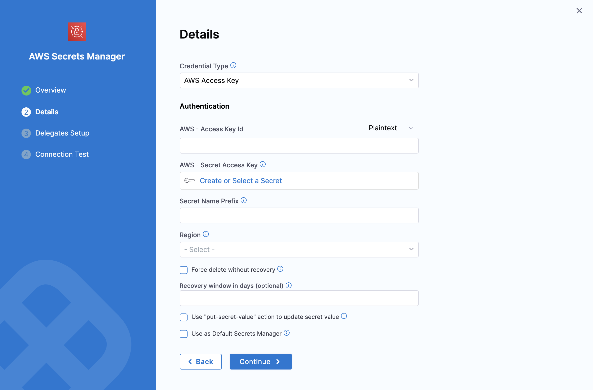
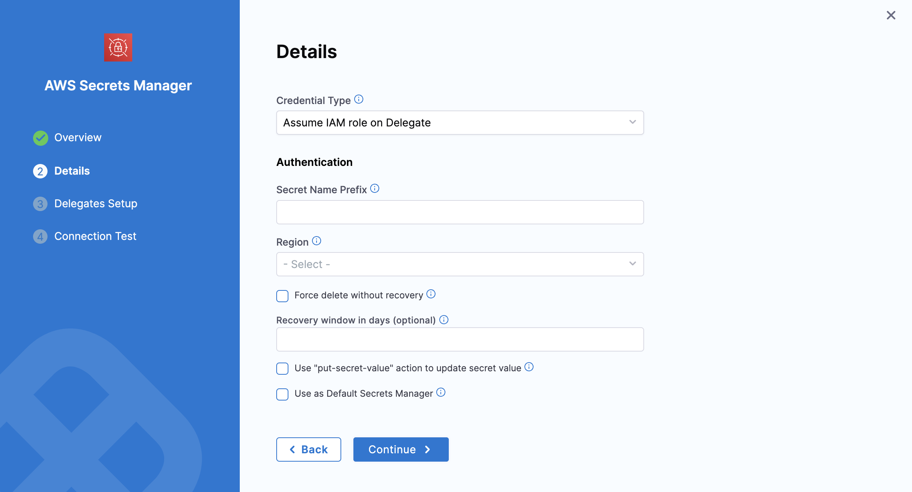
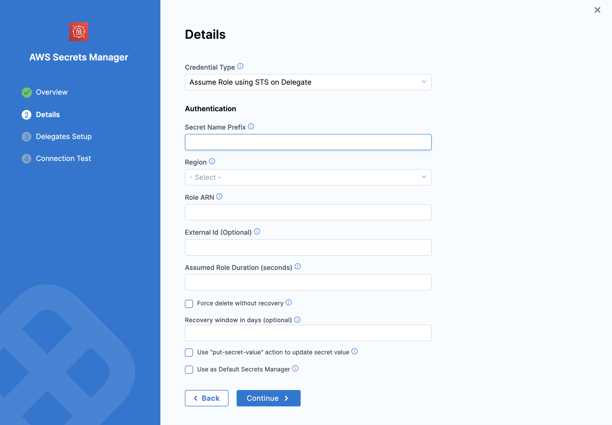
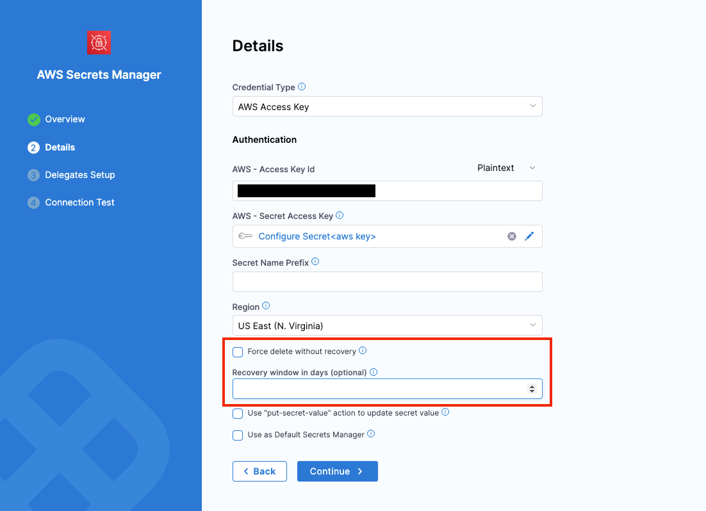
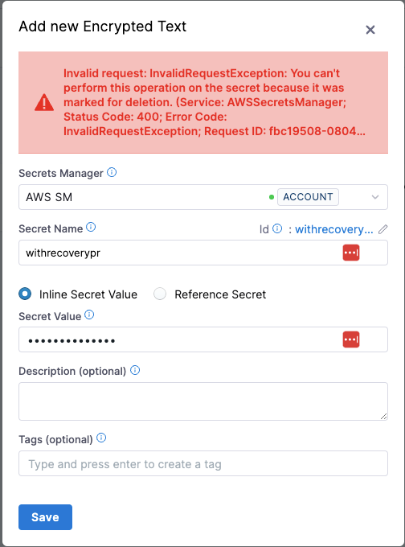

You can use AWS Secrets Manager for your Harness secrets.

Unlike AWS KMS, AWS Secrets Manager stores both secrets and encrypted keys. With AWS KMS, Harness stores the secret in its Harness store and retrieves the encryption keys from KMS. For information on using an AWS KMS Secrets Manager, go to [Add an AWS KMS Secrets Manager](/docs/platform/secrets/secrets-management/add-an-aws-kms-secrets-manager).

This topic describes how to add an AWS Secret Manager in Harness.

import Storeauth from '/docs/platform/shared/store-auth-credentials.md'

<Storeauth />

### Before you begin

* If you are adding an AWS Secrets Manager running on ROSA, you must also add an environment variable `AWS_REGION` with the appropriate region as its value, for example, `AWS_REGION=us-east-1`.

### Permissions: Test AWS Permissions

Harness uses the same minimum IAM policies for AWS secret manager access as the AWS CLI.

The AWS account you use for the AWS Secret Manager must have the following policies at a minimum:

```json
{
    "Version": "2012-10-17",
    "Statement": {
        "Effect": "Allow",
        "Action": [
            "secretsmanager:Describe*",
            "secretsmanager:Get*",
            "secretsmanager:List*"
        ],
        "Resource": "*"
    }
}
```

These policies let you list secrets which will allow you to add the secret manager and refer to secrets, but it will not let you read secrets values.

The following policy list enables Harness to perform all the secrets operations you might need:

```json
{
    "Version": "2012-10-17",
    "Statement": {
        "Effect": "Allow",
        "Action": [
          "secretsmanager:CreateSecret",
          "secretsmanager:DescribeSecret",
          "secretsmanager:DeleteSecret",
          "secretsmanager:GetRandomPassword",
          "secretsmanager:GetSecretValue",
          "secretsmanager:ListSecretVersionIds",
          "secretsmanager:ListSecrets",
          "secretsmanager:UpdateSecret",
          "secretsmanager:TagResource"
        ],
        "Resource": "*"
    }
}
```

Go to [Using Identity-based Policies (IAM Policies) for Secret Manager](https://docs.aws.amazon.com/secretsmanager/latest/userguide/auth-and-access_identity-based-policies.html) in the AWS documentation.

To test, use the AWS account when running [aws secretsmanager list-secrets](https://docs.aws.amazon.com/cli/latest/reference/secretsmanager/list-secrets.html#examples) on either the Harness Delegate host or another host.

### Step 1: Add a Secret Manager

This topic assumes you have a Harness Project set up. If you don't have a Harness Project, go to [Create Organizations and Projects](../../organizations-and-projects/create-an-organization.md).

You can add a connector from any module in your Project in Project SETUP, or in your Organization, or Account Resources.

In **Connectors**, select **Connector**.

In **Secret Managers**, select **AWS Secrets Manager**. The AWS Secrets Manager settings appear.

:::info note
For information on restrictions on names and maximum quotas, go to [Quotas for AWS Secrets Manager](https://docs.aws.amazon.com/secretsmanager/latest/userguide/reference_limits.html).
:::

### Step 2: Overview

Enter a **Name** for your secret manager.

You can choose to update the **ID** or let it be the same as your secret manager's name. For more information, go to [Entity Identifier Reference](../../references/entity-identifier-reference.md).

Enter a **Description** for your secret manager.

Enter **Tags** for your secret manager.

Select **Continue**.

### Step 3: Credential Details

When setting up your AWS Secrets Manager in Harness, you can choose one of the following **Credential Types** for authentication:

1. **AWS Access Key**  
2. **Assume IAM Role on Delegate**  
3. **Assume Role Using STS on Delegate**

#### Common Settings for All Credential Types

1. **Use "PutSecretValue" Action to Update Secret Value**  
   By default, Harness uses the `UpdateSecret` action to update secret values, which requires the `secretsmanager:UpdateSecret` permission for AWS Secrets Manager. Enable this option to use the `PutSecretValue` action instead, requiring the `secretsmanager:PutSecretValue` permission.

2. **Use as Default Secrets Manager**  
   Enable this option to make this Secrets Manager the default for all secret operations within your Harness account.

#### Credential Type: AWS Access Key

Use your AWS IAM user login credentials for authentication.

  

##### Prerequisites
- **Access Key ID** and **Secret Access Key**: Obtain these from the JSON Key Policy or the AWS **IAM** console under **Encryption Keys**.  
- For detailed instructions, see [Finding the Key ID and ARN](https://docs.aws.amazon.com/kms/latest/developerguide/viewing-keys.html#find-cmk-id-arn) in the AWS documentation.

##### Providing AWS Access Key ID

You have two options for adding the **Access Key ID**:

- **Plaintext**:  
  Enter the Access Key ID directly into the **AWS Access Key ID** field.

- **Encrypted**:  
  1. Click **Create or Select a Secret**.  
  2. In the dialog, create or select a [Secret](/docs/platform/secrets/add-use-text-secrets) and enter the Access Key ID as the secret value.  
  3. Save and use the created secret for this configuration.

##### Providing AWS Secret Access Key

- Click **Create or Select a Secret**.  
- Create or select an existing [Secret](/docs/platform/secrets/add-use-text-secrets) with the Secret Access Key as its value.

##### Additional Fields

- **Secret Name Prefix**: Add a prefix to all secrets stored under this Secrets Manager. For example, using `devops` as the prefix results in secrets like `devops/mysecret`. This is not a folder name.  
- **Region**: Select the appropriate AWS region for your Secrets Manager.

#### Credential Type: Assume IAM Role on Delegate

With this option, Harness uses the IAM role assigned to the AWS host running the selected Delegate for authentication.

  

##### Prerequisites

- Ensure the Delegate host has the appropriate IAM role assigned.

##### Additional Fields

Refer to the **Secret Name Prefix** and **Region** settings described under the AWS Access Key section above.

#### Credential Type: Assume Role Using STS on Delegate

Harness uses AWS Security Token Service (STS) to assume a role. This option is commonly used for cross-account access or assuming roles within the same AWS account.

  

##### Prerequisites

- Configure an IAM role in the target AWS account.

##### Required Fields

- **Role ARN**: Enter the Amazon Resource Name (ARN) of the role you want to assume.  
- **External ID**: If provided by the account administrator, enter the External ID for additional security. See [AWS External ID documentation](https://docs.aws.amazon.com/IAM/latest/UserGuide/id_roles_create_for-user_externalid.html) for more details.  
- **Assume Role Duration**: Specify the session duration for the assumed role. For more information, refer to the [AssumeRole API documentation](https://docs.aws.amazon.com/STS/latest/APIReference/API_AssumeRole.html).

##### Additional Fields

Refer to the **Secret Name Prefix** and **Region** settings described under the AWS Access Key section above.

### Step 4: Setup Delegates

In **Setup Delegates,** enter [**Selectors**](../../delegates/manage-delegates/select-delegates-with-selectors.md#option-select-a-delegate-for-a-connector-using-tags) for specific **Delegates** that you want to allow to connect to this connector.

### Step 5: Test Connection

Once the Test Connection succeeds, select **Finish**. You can now see the connector in **Connectors**.

### AWS Secret Manager with Recovery 

When setting up an AWS SM connector in Harness, you can now select from two additional fields:



- Force Delete Without Recovery: This option determines whether a secret in AWS Secrets Manager should be permanently deleted without a recovery window. Selecting this will immediately and irreversibly delete the secret in AWS Secrets Manager, with no possibility of recovery.  

- Recovery Window in Days (Optional):If specified, the deletion request sent to AWS will include the provided recovery window. While the secret is removed from Harness, it remains recoverable in AWS Secrets Manager during the specified recovery period. The recovery window can range from 7 to 30 days and defaults to 30 days if not specified.

 #### Note:

 - If a user attempts to create such a secret (as an inline secret) again in Harness, an exception will be thrown.

  

 - Force Delete Without Recovery cannot be set to true if a value is provided for the recovery window.

### Reference JSON secrets

import Refj from '/docs/platform/shared/reference-via-json.md';

<Refj />
