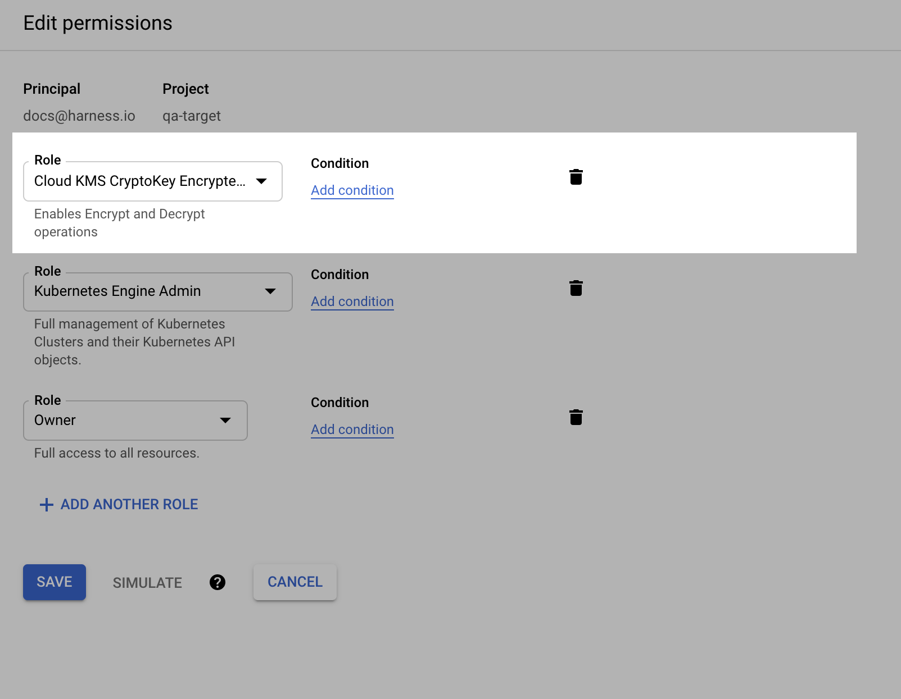
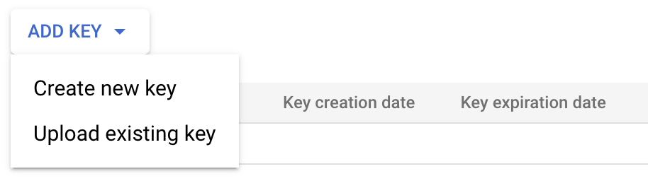
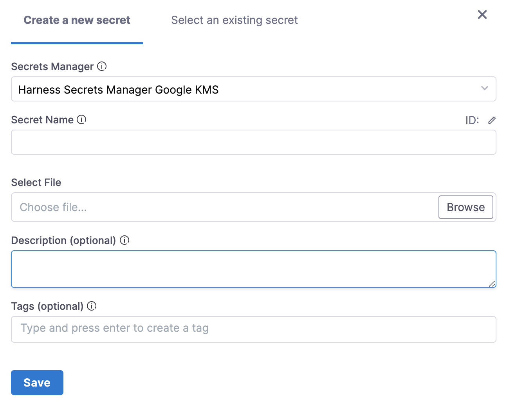

You can use Google [Cloud Key Management Service](https://cloud.google.com/security-key-management) (Cloud KMS) as a Harness Secret Manager. Once Google KMS is added as a secret manager, you can create encrypted secrets in Google KMS and use them in your Harness account.

import Storeauth from '/docs/platform/shared/store-auth-credentials.md'

<Storeauth />

This topic describes how to add a Google KMS Secret Manager in Harness.

### Before you begin

* [Harness' key concepts](/docs/platform/get-started/key-concepts.md)
* [Harness Secret Manager Overview](/docs/platform/secrets/secrets-management/harness-secret-manager-overview)
* [Store authentication credentials](/docs/platform/secrets/secrets-management/store-authentication-credentials)

### Add a Secret Manager

This topic assumes you have a Harness Project set up. If not, go to[Create Organizations and Projects](../../organizations-and-projects/create-an-organization.md).

You can add a connector from any module in your Project in Project setup, or in your Organization or Account Resources.

In **Connectors**, select **Connector**.

In **Secret Managers**, select **GCP KMS**.

The **GCP Key Management Service** settings appear.

In **Name,** enter a name for your secret manager. You will use this name to select this secret manager when adding or selecting a secret.

Enter a description for your secret manager.

Enter tags for your secret manager.

Select **Continue**.

### Obtain Google Cloud Symmetric Key

To obtain the values for the Details page, you'll need a Google Cloud Symmetric Key.

In the [Google Cloud Console](https://console.cloud.google.com/), select your project.

Select **Security** > **Key** **Management**.

Select/create a key ring. Select/create a key in the key ring.

To create resources in this or the next step, go to Google Cloud's[Creating Symmetric Keys](https://cloud.google.com/kms/docs/creating-keys) topic. Open the Actions menu (⋮), and then select **Copy Resource Name**.

A reference to the key is now on your clipboard.

Paste the reference into an editor. You can now copy and paste its substrings into each of the Harness Secret Manager's **Details** settings as shown below.

### Attach Service Account Key (Credentials) File

Next, you will export your Google Cloud service account key and attach it to the **Details** page in Harness.

First, you need to grant a Principal the Cloud KMS CryptoKey Encrypter/Decrypter (cloudkms.cryptoKeyEncrypterDecrypter) role.

In Google Cloud Console, go to the IAM page.

Locate the Principal you want to use, and then select Edit.

In Edit permissions, add the Cloud KMS CryptoKey Encrypter/Decrypter role, and then select **Save**.

Go to Google [Permissions and roles](https://cloud.google.com/kms/docs/reference/permissions-and-roles) and Cloud's Using Cloud IAM with KMSCloud's Using Cloud IAM with KMS topics.

Next, you'll select the Service Account for that Principal and export its Key file.

In the Google Cloud Console, in IAM & Admin, go to Service Accounts.

Scroll to the service account for the Principal you gave the Cloud KMS CryptoKey Encrypter/Decrypter role. If no service account is present, create one.

Open your service account's Actions ⋮ menu, then select **Manage keys**.

Select **ADD KEY** > **Create new key**.

In the resulting Create private key dialog, select JSON, create the key, and download it to your computer.

Return to the secret manager's Details page in Harness.

Under GCP KMS Credentials File, select **Create or Select a Secret**. You can create a new [File Secret](/docs/platform/secrets/add-file-secrets) and upload the key file you just exported from Google Cloud.

Select **Save**, and then select **Continue**.

### Set up delegates

In **Delegates** **Setup**, use [**Selectors**](../../delegates/manage-delegates/select-delegates-with-selectors.md#option-select-a-delegate-for-a-connector-using-tags) to select any specific delegates that you want this Connector to use. Select **Save and Continue**.

### Test Connection

In **Connection Test**, select **Finish** after your connection is successful.

