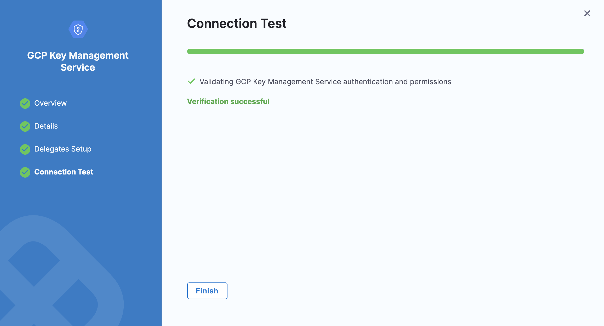

You can use Google [Cloud Key Management Service](https://cloud.google.com/security-key-management) (Cloud KMS) as a Harness Secret Manager. Once Google KMS is added as a secret manager, you can create encrypted secrets in Google KMS and use them in your Harness account.

import Storeauth from '/docs/platform/shared/store-auth-credentials.md'

<Storeauth />

This topic describes how to add a Google KMS Secret Manager in Harness.

### Before you begin

* [Harness' key concepts](/docs/platform/get-started/key-concepts.md)
* [Harness Secret Manager Overview](/docs/platform/secrets/secrets-management/harness-secret-manager-overview)
* [Store authentication credentials](/docs/platform/secrets/secrets-management/store-authentication-credentials)

### Add a Secret Manager

To add Google KMS as a secret manager, you’ll need to set up a Harness Project. If you haven't already, refer to [Create Organizations and Projects](../../organizations-and-projects/create-an-organization.md).

You can add connectors from any module in your Project under Project Setup, or in your Organization or Account Resources:

1. In **Connectors**, select **Connector**.

2. Under **Secret Managers**, select **GCP KMS**.

#### GCP Key Management Service Settings

Basic Information: 

- **Name**: Enter a unique name for the secret manager.

- **ID**: Harness will auto-generate an ID based on the name. You can edit this ID during initial setup but not after saving.

- **Description**: Optional description of the secret manager.

- **Tags**: Tag the secret manager for easy search and organization.

### Details Settings

To obtain the values for the Details settings, you'll need a Google Cloud Symmetric Key.

1. In the [Google Cloud Console](https://console.cloud.google.com/), select your project.

2. Select **Security** > **Key** **Management**.

3. Select/create a key ring. Select/create a key in the key ring.

4. To create resources in this or the next step, go to Google Cloud's [Creating Symmetric Keys](https://cloud.google.com/kms/docs/creating-keys) topic. Open the Actions menu (⋮), and then select **Copy Resource Name**.

5. A reference to the key is now on your clipboard.

    Paste the reference into an editor. You can now copy and paste its substrings into each of the Harness Secret Manager's **Details** settings as shown below.

### Configure Credentials

Harness supports two credential types for authenticating with Google KMS: Service Account Key and OpenID Connect (OIDC). Follow the steps below to configure the appropriate credentials for your setup.

#### 1. Service Account Key

To configure a Service Account Key for Google KMS in Harness, refer to our [Service Account Key Setup Guide](). This guide covers all steps for creating and downloading the key file, uploading it to Harness, and attaching it to the GCP KMS connector.

**Permissions Required**: To use the Service Account Key with Google KMS, ensure the following role is assigned to the service account in Google Cloud:

- **Cloud KMS CryptoKey Encrypter/Decrypter** (`roles/cloudkms.cryptoKeyEncrypterDecrypter`): Allows the service account to encrypt and decrypt data using KMS keys.

    - In Google Cloud Console, go to **IAM & Admin > IAM**.

    - Locate your service account, select Edit, and add the **Cloud KMS CryptoKey Encrypter/Decrypter** role.

#### 2. OpenID Connect (OIDC)

:::note
OIDC support requires the PL_GCP_OIDC_AUTHENTICATION feature flag in Harness. Contact Harness Support to enable this feature.
:::

For setting up OIDC, refer to our [OIDC Setup Guide]() for detailed steps on configuring a workload identity pool and identity provider with Harness.

**Permissions Required**: When using OIDC with Google KMS, ensure the identity provider in Google Cloud is granted the following permissions:

- **Cloud KMS CryptoKey Encrypter/Decrypter** (`roles/cloudkms.cryptoKeyEncrypterDecrypter`): Grants encryption and decryption access to KMS keys within Google Cloud.

    - In **IAM & Admin > Workload Identity Federation**, select your identity pool.

    - Assign the **Cloud KMS CryptoKey Encrypter/Decrypter** role to the identity provider associated with the workload identity pool.

### Set up delegates

In **Delegates** **Setup**, use [**Selectors**](../../delegates/manage-delegates/select-delegates-with-selectors.md#option-select-a-delegate-for-a-connector-using-tags) to select any specific delegates that you want this Connector to use. Select **Save and Continue**.

### Test Connection

In **Connection Test**, select **Finish** after your connection is successful.

