To store and use encrypted secrets (such as access keys), you can add a HashiCorp Vault Secret Manager.

The video below provides an overview of how to use HashiCorp Vault as an external secret manager.

 <DocVideo src="https://www.loom.com/embed/92335a30823a4662a1d7212395c66e63" width="100%" height="600" />

import Storeauth from '/docs/platform/shared/store-auth-credentials.md'

<Storeauth />

### Before you begin

* [Harness' key concepts](/docs/platform/get-started/key-concepts.md)
- [Harness Secret Manager Overview](/docs/platform/secrets/secrets-management/harness-secret-manager-overview)
- [Store authentication credentials](/docs/platform/secrets/secrets-management/store-authentication-credentials)
- Make sure that the Harness Delegate can connect to the Vault URL.
- Make sure you have View and Create/Edit permissions for secrets.

### Step 1: Add a Secret Manager

This topic assumes you have a Harness Project set up. If not, go to [Create Organizations and Projects](../../organizations-and-projects/create-an-organization.md).

You can add a Connector at Project/Organization/Account scope. To do this, go to Project setup, Organization, or Account Resources.

In **Connectors**, select **Connector**.

In **Secret Managers**, select **HashiCorp Vault**. The HashiCorp Vault Secret Manager settings appear.

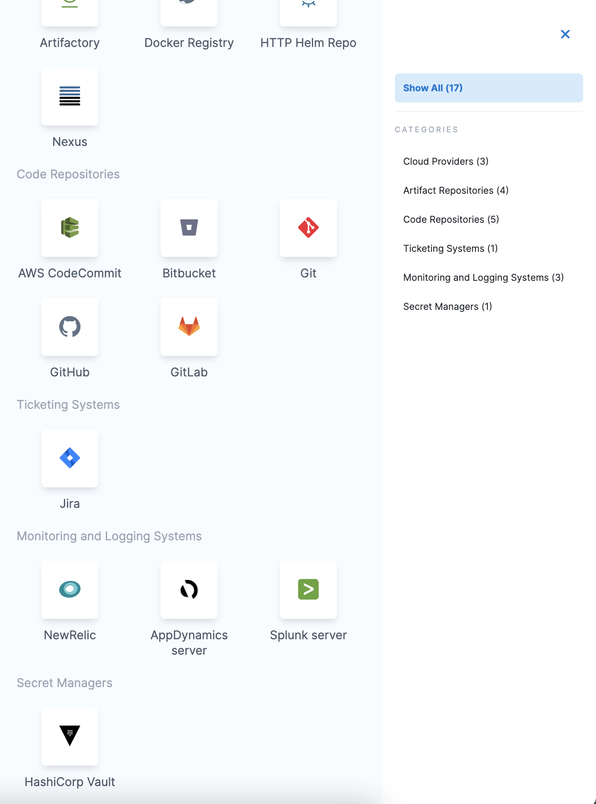

### Step 2: Overview

Enter a **Name** for your secret manager.

You can choose to update the **ID** or let it be the same as your secret manager's name. For more information, go to [Entity Identifier Reference](../../references/entity-identifier-reference.md).

Enter **Description** for your secret manager.

Enter **Tags** for your secret manager.

Select **Save and Continue.**

Enter **Vault URL**.

Enter **Base Secret Path**. The Base Secret Path is used for writing secrets. When Harness reads secrets, it uses the full path.

For more information, go to [Vault documentation](https://www.vaultproject.io/docs/index.html).

Select the **Authentication** Type.

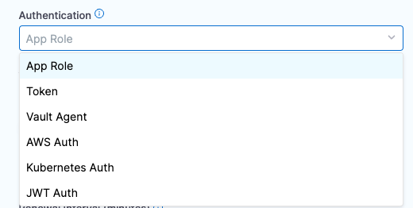

### Option: App Role

The App Role option enables the Harness Vault Secret Manager to authenticate with Vault-defined roles.

The Vault AppRole method allows you to define multiple roles corresponding to different applications, each with different levels of access. The application's **App Role ID** and **Secret ID** are used for authentication with Vault. You need these to log in and fetch a Vault token.

To assign a **Secret ID**, you can create a new [**Secret**](/docs/platform/secrets/add-use-text-secrets) or choose an existing one.

The SecretId should not expire and it should be valid until it is manually revoked. Harness uses the App Role ID and Secret ID you supply to fetch a Vault Auth Token dynamically whenever there is a CRUD operation of secrets related to this vault. For example, when creating a secret in this vault, Harness internally uses this App Role Id and Secret ID and makes a call to vault via the delegate to generate a token. 

#### Enable Cache for App Role Token
Now, this token is used to make the actual secret creation call to vault. This token is never received on the Harness side. It resides in the delegate and is cached for the duration that is one percent less than the time-to-live (TTL) of the token to prevent the generation of a new token for each request for improved performance. If you don't want to cache the token, you can disable the caching and token will be destroyed after the operation is successfully completed.

#### Example of Token Caching Refresh
To understand how the number of delegates and caching schedule works, here is an example that we have put together.

Let’s assume we have set a 15 min TTL. The token is cached for one pipeline during those 15 minutes (minus 1 percent), but it is determined by the **delegate** which is being used with the connector.  If the delegate has been used previously with the connector within the 15 min, then a cached version of the Vault token will exist on the delegate.  

If we have three pipeline, and two delgates involved, the assignment in our example is:
- `Pipeline A` and `Pipeine C` use the delegate, `delegate-mumbai`
- `Pipeline B` uses the delegate, `delegate-sanfran`

We will see the following behavior for the Vault connector occur in the executions, along with the **unique refresh timer** for each delegate
```
Pipeline A executed at time 0 (Token initial new fetch using role ID and Secret ID, stored on delegate-mumbai)
Pipeline B executed at time +2min (Token initial new fetch using role ID and Secret ID, because this is a different delegate delegate-sanfran)
Pipeline A executed at time +5min
Pipeline C executed at time +10 min
Pipeline B executed at time +11 min
Pipeline A executed at time +16 min (Token expired on delegate-mumbai, Token new fetch performed using role ID and Secret ID,)
Pipeline C executed at time +17 min
Pipeline B executed at time +20 min (Token expired on delegate-sanfran, Token new fetch performed using role ID and Secret ID,)
```

Each delegate being utilized with the connector has a local cache of the token which refreshes according to the TTL rule of 15 minutes (minus 1 percent).

#### Additional Information

For more information, go to [RoleID](https://www.vaultproject.io/docs/auth/approle.html#roleid) and [Authenticating Applications with HashiCorp Vault AppRole](https://www.hashicorp.com/blog/authenticating-applications-with-vault-approle) in the HashiCorp documentation.

If you encounter errors, setting [token_num_uses](https://www.vaultproject.io/api-docs/auth/approle#token_num_uses) to `0` can often resolve problems.

#### Permissions

The Vault AppRole ID or the Periodic Token used in either of the authentication options must have an ACL policy attached so that Harness can use it. Typically, you create the policy first, then create the AppRole or Periodic Token and attach the policy.

:::note important
The AppRole option only works with the default authentication path `approle`. If you change the authentication path to a non-default value like `approle-test`, the AppRole authentication will fail.

:::

In the policy examples below: if you've created a Read-only Vault Secret Manager, this secret manager needs only read, and list permissions on Vault. It does not need — and cannot assume — create, update, or delete permissions. If the secrets are in the Secret Engine named “secret”, the policy must have the following permissions.

```
path "secret/*" {
  capabilities = ["create", "update", "list", "read", "delete"]
}
```

If the secrets are in a subfolder, such as secrets/harness, the policy will look like this:

```
path "secret/harness/*" {
  capabilities = ["create", "list", "read", "update", "delete"]
}
path "secret/harness" {
  capabilities = ["list", "read"]
}
```

These examples apply only to a **v1** secret engine. If you are planning to use a secret engine with version 2 (versioned secret engine), then the policies are different as explained [here](https://www.vaultproject.io/docs/secrets/kv/kv-v2). Go through this link to understand the correct permissions required for your use case. If the Vault Secret Manager needs to renew tokens, the following permissions are needed:

```
path "auth/token/renew-self" {
 capabilities = ["read", "update"]
}
```

#### Custom Authentication Path for AppRole Login

:::note
This feature is supported on delegate version `837xx` and above and is available behind the Feature Flag `PL_APPROLE_CUSTOM_PATH`. Contact [Harness Support](mailto:support@harness.io) to enable the feature.
:::

The `appRoleLogin` method now supports a custom authentication path, utilizing it if provided, or defaulting to the standard `approle` endpoint if not specified.

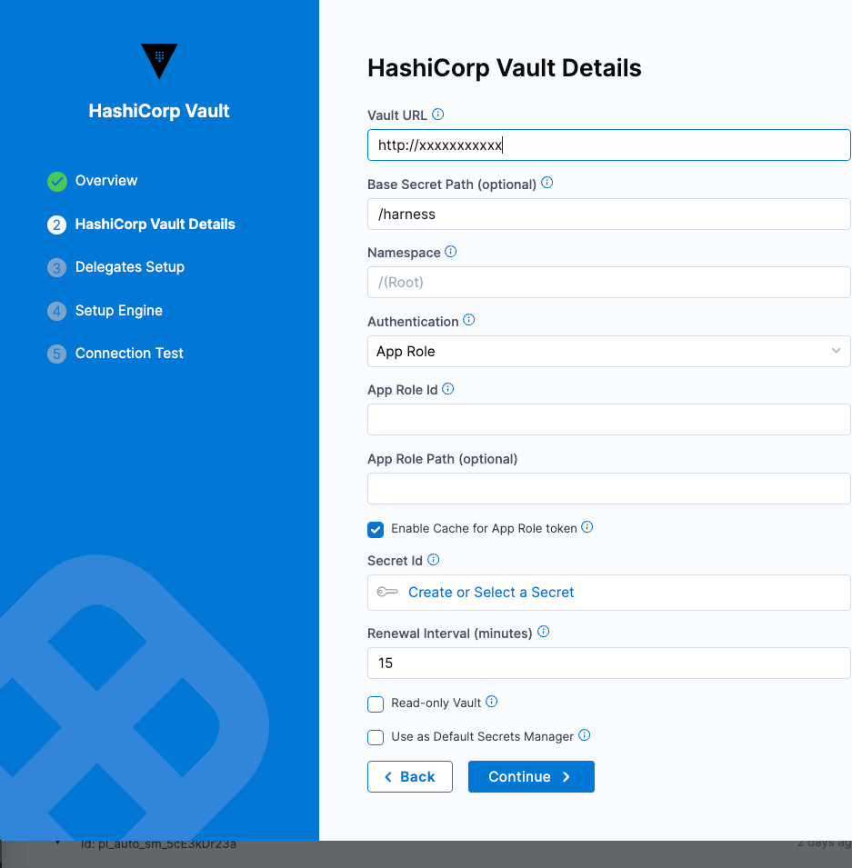

For example, the custom AppRole path can be set as `<customPath>`, providing greater flexibility in configuring the authentication mechanism. This feature is particularly useful in scenarios where the default authentication path requires customization.

Ensure that the custom AppRole path you configure exists in your HashiCorp Vault. This step is necessary for the authentication to succeed using the custom path.

### Option: Token

For Harness, the **Token** option requires [periodic tokens](https://www.vaultproject.io/docs/concepts/tokens#periodic-tokens) (tokens that have renewal options).

To create a periodic token, make sure to specify a period in the token creation command:

```
vault token create -policy=harness -period=768h
```

Next, use the new token with Harness. To do this, perform the below steps:

* Select **Create or Select a Secret**.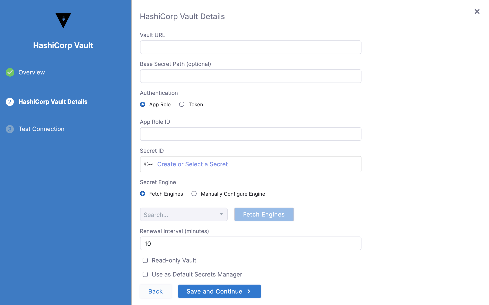
* The secret settings page appears. Here you can either **Create a new** [**Secret**](/docs/platform/secrets/add-use-text-secrets) or **Select an existing secret**. If creating a new Secret, enter the token which you created in the **Secret Value** field.
  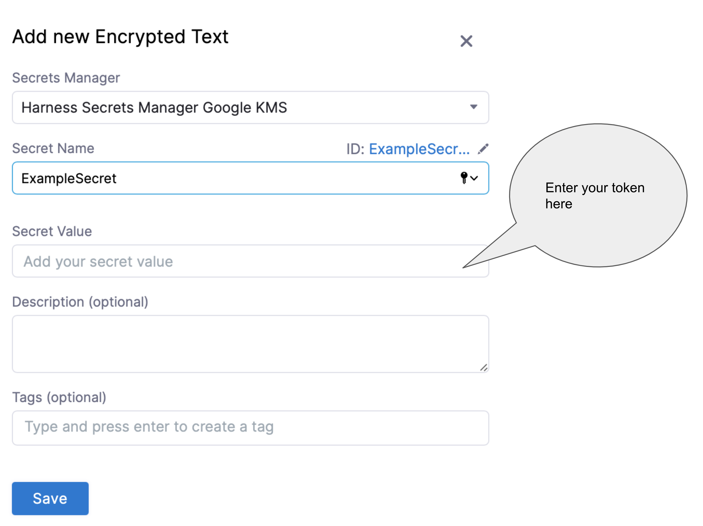

For detailed steps on creating a secret, go to [Add and reference text secrets](/docs/platform/secrets/add-use-text-secrets).

If you have already added a Secret with your token, you can choose the same as shown below:

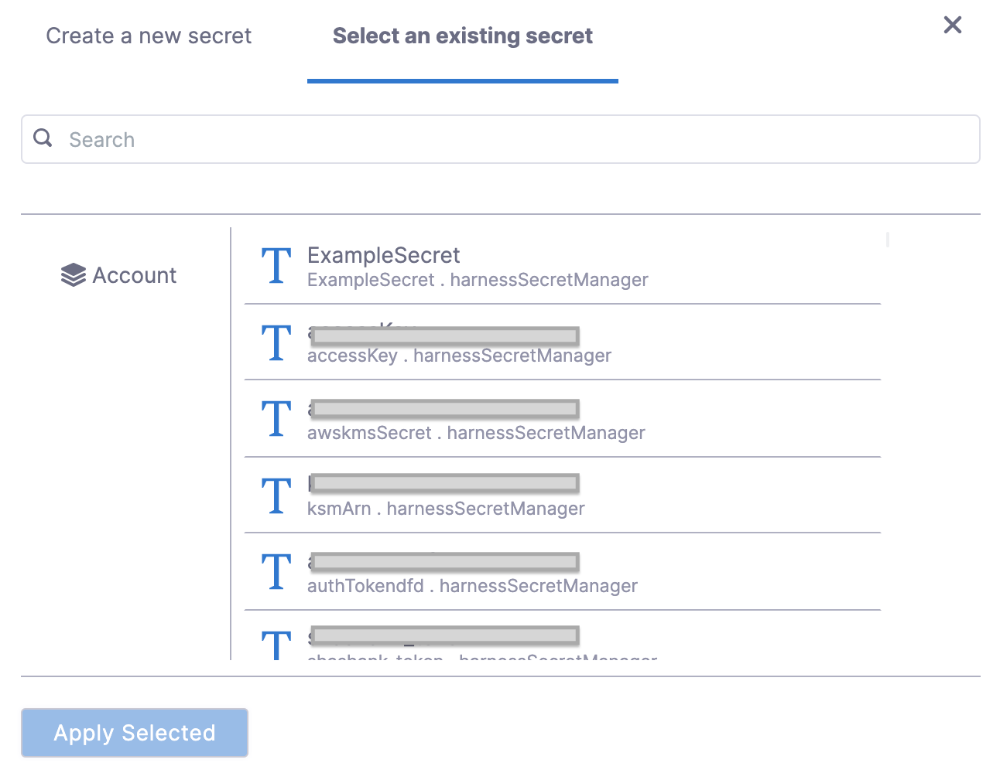

* Select **Apply**.

If you want to verify the renewal manually, use the command:

```
vault token lookup <token_id>
```

### Option: Vault Agent

This option enables the Harness Vault Secret Manager to authenticate with the Auto-Auth functionality of the [Vault Agent](https://www.vaultproject.io/docs/agent/autoauth).

To authenticate with Vault Agent, make sure you have configured it on the required environment, with entries for **method** and **sinks**. For more information, go to [Vault Agent](https://www.vaultproject.io/docs/agent).

In the **Sink Path** field, enter any sink path you have in your Vault Agent Configuration. This is the path of the encrypted file with tokens. The specified delegate reads this file through file protocol (file://).

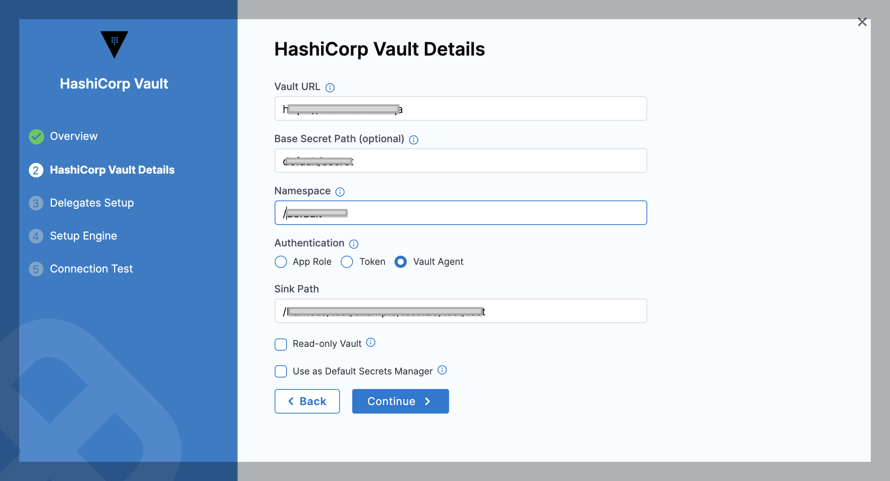

### Option: AWS Auth

This option provides an automated mechanism to retrieve a Vault token for IAM principals and AWS EC2 instances. With this method, you do not need to manually install or supply security-sensitive credentials such as tokens, usernames, or passwords.

In the AWS Auth method, there are two authentication types:

* IAM
* EC2

Harness recommends using the IAM technique for authentication since it is more versatile and complies with standard practices.

To authenticate with AWS Auth, make sure you have configured the vault with entries for **Header**, **Role**, and **Region**. For more information, go to [AWS Auth Method](https://www.vaultproject.io/docs/auth/aws#iam-auth-method) in the Vault documentation.

You must add the **Server ID Header** from Vault as a [Harness Encrypted Text Secret](/docs/platform/secrets/add-use-text-secrets) and select it for **Server Id Header** in Harness.

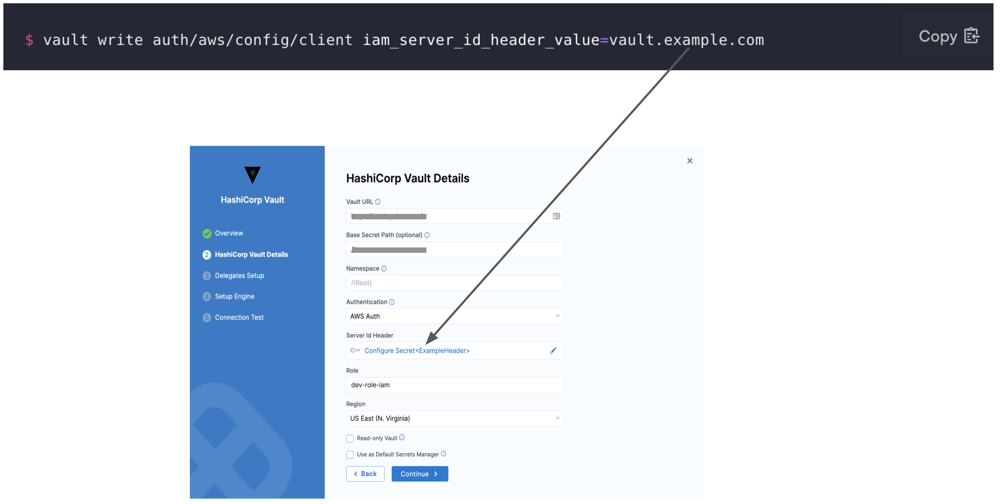

In **Role**, enter the role you have configured in the Vault.

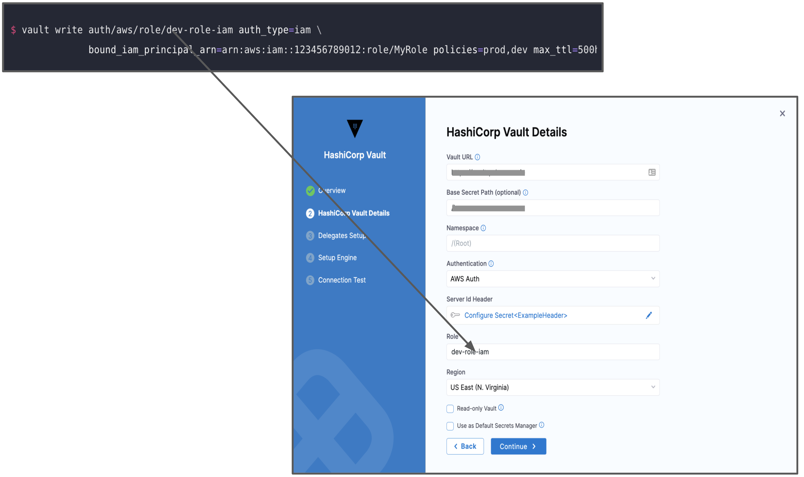

In **Region**, enter the AWS Region for the Secret Manager.

### Option: Kubernetes Auth

This option uses a Kubernetes Service Account Token to authenticate with Vault. With this method of authentication, you can easily add a Vault token into a Kubernetes pod.

To authenticate with Kubernetes Auth, make sure you have created a role in the vault inside `auth/kubernetes/role`. This role authorizes the "vault-auth" service account in the default namespace and it gives it the default policy. This is also where you'll find the **service account name** and **namespace** that will be used to access the vault endpoint.

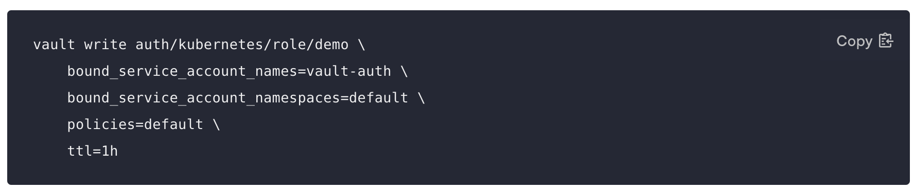

For more information, go to [Kubernetes Auth Configuration](https://www.vaultproject.io/docs/auth/kubernetes#configuration) in the Vault documentation.

In **Role Name**, enter the role you have configured in the Vault.

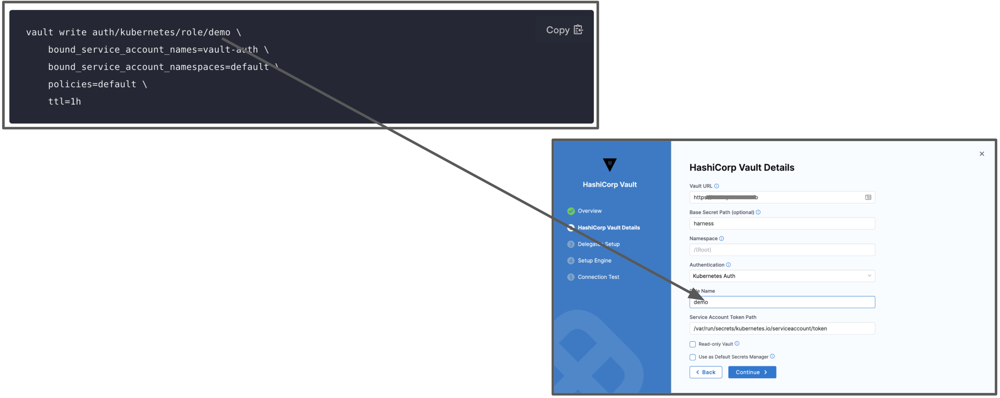
In **Service Account Token Path** enter the JSON Web Token (JWT) path. This is the path where the JWT token is mounted. The default path of this token is `/var/run/secrets/kubernetes.io/serviceaccount/token`.

For more information, go to [Service Account Tokens](https://kubernetes.io/docs/reference/access-authn-authz/authentication/#service-account-tokens) in the Kubernetes documentation.

### Option: JWT/OIDC Auth

:::note
   This feature is supported with [Delegate version](/release-notes/delegate): 25.02.85100 and above.
:::

JWT/OIDC authentication allows you to authenticate with HashiCorp Vault using JWT token in just a few steps.

#### Steps to enable Vault authentication:  

1. **Enable the JWT authentication method** on custom path:  
   
   Enable any custom path with `<YOUR_PATH>`. For example, we have used `harness/jwt` below.

   ```  
   vault auth enable -path=harness/jwt jwt  
   ```  

2. **Configure the JWT authentication method**:  
   
   - Set the OIDC discovery URL or manually specify the JWT issuer with `https://app.harness.io/ng/api/oidc/account/<YOUR_ACCOUNT_ID/>`. Harness exposes endpoints with discovery url for publishing the OpenID configuration and RSA public key.  


      ```  
      vault write auth/harness/jwt/config   
         oidc_discovery_url="<OIDC_DISCOVERY>"   
         bound_issuer="<BOUND_ISSUER>"     
      ```  
      :::note
           `bound_issuer` is same as `oidc_discovery_url` i.e., `https://app.harness.io/ng/api/oidc/account/<YOUR_ACCOUNT_ID/>`   
      :::

      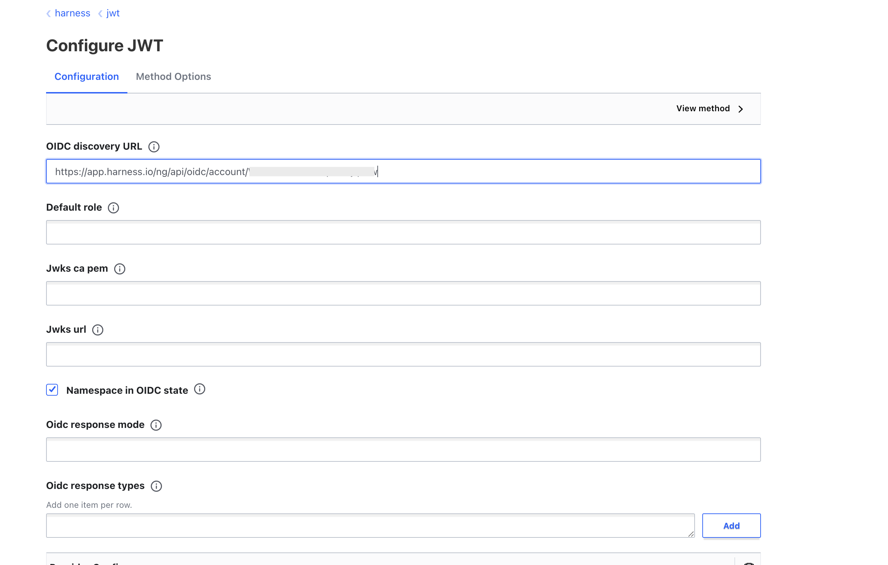


3. **Verify JWT Configuration**:  
   
   After setting the OIDC discovery URL or manually specifying the JWT issuer, you can verify the configuration by running the following command:
   ```  
   curl --header "X-Vault-Token: YOUR_ROOT_TOKEN" http://<VAULT_DOMAIN_IP>/v1/auth/harness/jwt/config
   ```  
   This will return the current configuration, showing details like `bound_issuer`, `oidc_discovery_url`, and other settings.

4. **Create a Role for JWT Authentication**:  
   
   Create a role that maps JWT claims to Vault policies. Define this role in a file, such as `role-config.json`. Here's an example of how to configure it:

   - **bound_audiences**: Set this to the audience (`aud`) in the JWT claims, matching the JWT authentication mount path (`harness/jwt`).
   - **bound_claims**: Specify the claims you want to validate (e.g., `sub`, `iss`, `account_id`).
   - **policies**: Define the policies associated with the client token.
   - **ttl**: Set the time-to-live for the generated token.
   - **role_type**: Roles allow you to group configuration settings together to simplify plugin management. Set this to `jwt`.

   Example `role-config.json`:

   :::note
      The **sub** field can have the following format, depending on the scope of the authentication method configured in Harness:

         - For account scope only: `<ACCOUNT_ID>`

         - With the `PL_OIDC_ENHANCED_SUBJECT_FIELD` feature flag enabled: `account/{account_id}:org/{organization_id}:project/{project_id}`
           - Leave org and/or project blank for an account level or org level connector.  For example, account level would be `account/{account_id}:org/:project/`
   :::

   ```json
   {
     "bound_audiences": ["<CUSTOM_MOUNT_PATH>"],
     "user_claim": "sub",
     "bound_claims": {
       "sub": "<YOUR_ACCOUNT_ID>",
       "iss": "<SAME_AS_OIDC_DISCOVERY_URL>",
       "account_id": "<YOUR_ACCOUNT_ID>"
     },
     "policies": ["<YOUR_POLICIES>"],
     "ttl": "1h",
     "max_ttl": "4h",
     "role_type": "jwt"
   }
   ```

6. **Apply the Role Configuration**:  
   
   Use the following command to create the role in Vault:
   ```  
   curl --header "X-Vault-Token: YOUR_ROOT_TOKEN" --request POST --data @role-config.json http://<VAULT_DOMAIN_IP>/v1/auth/harness/jwt/role/role_assigned
   ```  

7. **Verify the Role**:  
   
   To ensure that the role was created successfully, run the following command:
   ```  
   curl --header "X-Vault-Token: YOUR_ROOT_TOKEN" http://<VAULT_DOMAIN_IP>/v1/auth/harness/jwt/role/role_assigned
   ```  

8. **Configure in HashiCorp Vault in Harness**

     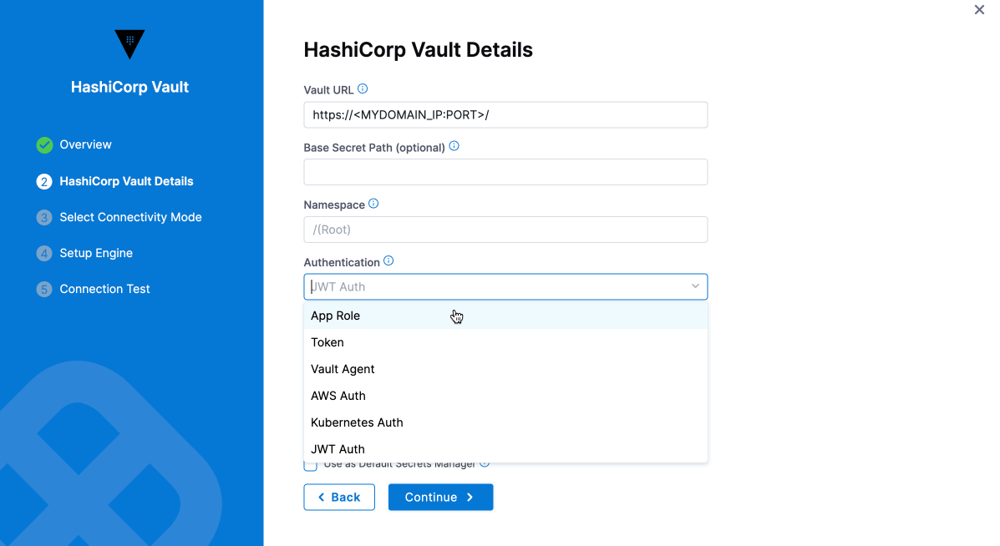

   - **Configure directly through Harness, without using a delegate**:

      :::note
         In this step, the customer needs to whitelist the Harness Platform IPs to enable connectivity to Vault.
      :::

      After setting up your Vault URL, Authentication, Path, and Role, choose the connectivity mode: either using a delegate or without a delegate. For now, we will use the **"Connect through Harness Platform"** option, as shown in the image below. 
      
      Next, set up the engine by either auto-fetching or manually configuring it. Finally, the system will check the connection. Click "Finish" to complete the setup.

      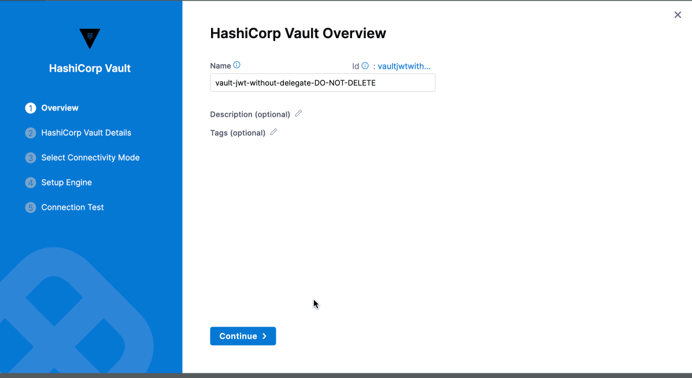
   
   - **Configure directly through Harness Delegate**:

      Repeat the steps by configuring Vault URL, Authentication, Path and role, choose **"Connect through Harness Delegate"** option in connectivity mode.

      Next, set up the engine (auto-fetch or manual). Once the connection is verified, click "Finish" to complete the setup.  

      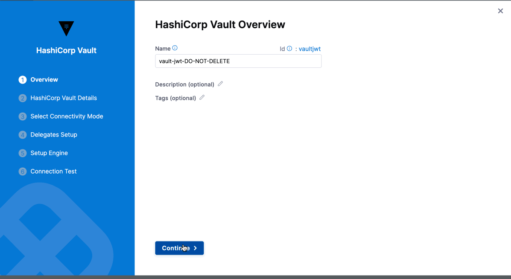

### Step 2: Select Secret Engine and Version

Once you have entered the required fields, you can choose to **Fetch Engines** or **Manually Configure Engine**.

#### Fetch Engines

If you want Harness to automatically fetch secret engines, include this read permission for **sys/mounts** in the ACL policy.

```
path "sys/mounts"{
 capabilities = ["read"]
}
```

Select **Fetch Engines**.

Harness will populate the Secret Engine drop-down with the list of engines and their versions.

Select the engine you want to use.

#### Manually Configure Engine

If you don't want to or cannot add the ACL policy (with read permission for sys/mounts) in the Secret Manager, perform the following steps:

1. Identify the engine version of the Secret Manager in Vault.
2. In **Secret Engine Name**, enter the name of the Secret Engine.
3. In **Secret Engine Version**, enter the engine version.

   You cannot change the Secret Engine later. Harness blocks editing this setting later since there might be secrets that are created/referenced under this secret engine. Changing the secret engine might break references to those secrets.

4. In **Kubernetes Auth Endpoint**, enter the authentication endpoint, if configured. The default value is `Kubernetes`.

### Step 3: Renewal Interval (minutes)

In **Renew Interval**, you can (optionally) enter how often the Harness Delegate reloads the Vault access token.


You can expect a delay during the Vault renewal. A periodic job runs to check if there has to be a renewal, resulting in a delay of no more than two minutes.

### Review: Validating Non-Read Only Vault Secret Managers

To validate a non-read-only Vault Secret Manager, Harness creates a dummy secret in the secret engine.

The path of the secret is as follows:

v2 Secret Engine:

`<SECRET_ENGINE_NAME>/data/\<BASE_PATH>/harness_vault_validation#value`

v1 Secret Engine:

`<SECRET_ENGINE_NAME>/\<BASE_PATH>/harness_vault_validation#value`

The secret can fail because of various reasons.

1. Using the Token/App Role, the **Vault** authentication is not successful.
2. The following **permission** is not available in any of the policies attached to the Token/App Role. If this permission is not available, the user will not be able to fetch the list of secret engines from the customer vault and Harness will show a single option of Secret Engine named **"secret"**with version 2, which might be incorrect for the customer. Make sure to add the permission to a policy attached to the Token/App Role as follows:

   ```
            path "sys/mounts"{
               capabilities = ["read"]
               }
   ```

3. The policy attached to the Token/AppRole does not provide the **write** permission in the specified path. Make sure you update the policies and permissions.

### Step 4: Read-only Vault

If required by your organization's security practices, select the **Read-only Vault** option. This selection authorizes Harness to read secrets from Vault, but not to create or manage secrets within Vault.


Once you have filled out the required fields, select **Finish**.

##### Read-only Limitations

If you select **Read-only Vault**, there are several limitations on the resulting Harness Vault Secret Manager.

Also a read-only Harness Vault Secret Manager:

- Cannot be used in the **Add Encrypted File** dialog.
- Cannot create inline secrets in the **Add Encrypted Text** modal.

### Step 5: Test Connection

Once the Test Connection succeeds, select **Finish**. You can now see the connector in **Connectors**.

:::info important
​Harness tests connections by creating a dummy secret in the Secret Manager or Vault. For the Test Connection to function successfully, make sure you have Create permission for secrets.

The Test Connection fails if you do not have Create permission. However, Harness still creates the connector for you. You may use this connector to read secrets, if you have View permissions.

:::

### Reference JSON secrets

import Refj from '/docs/platform/shared/reference-via-json.md';

<Refj />
