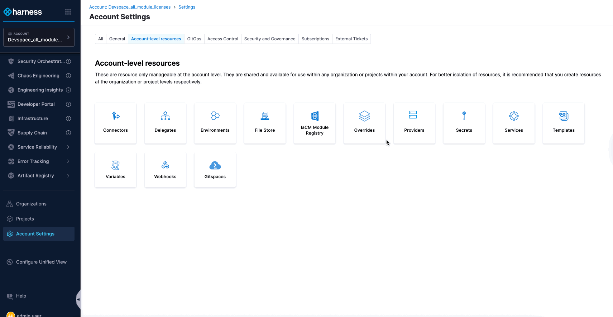
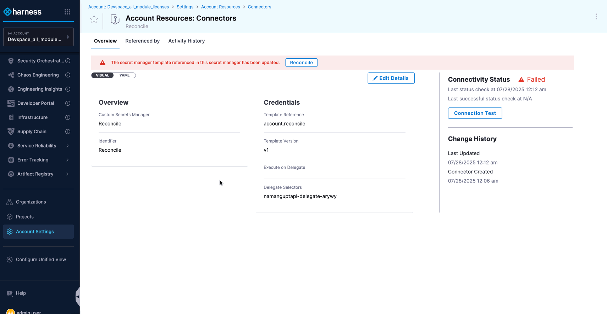
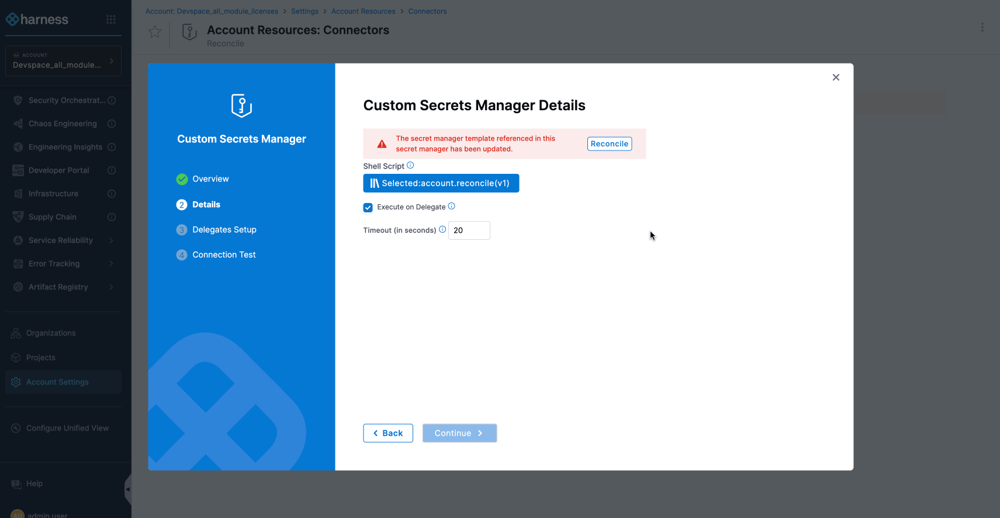
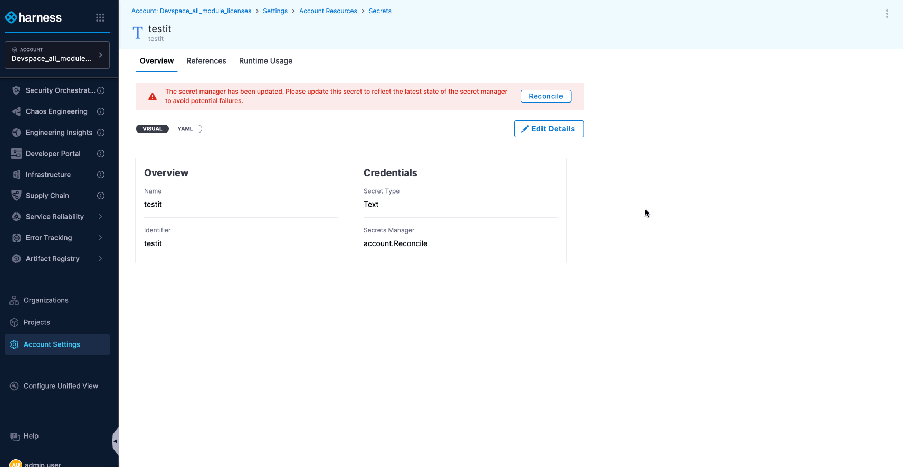

When you update a Secret Manager Template, dependent Custom Secret Managers and Secrets become out of sync, potentially causing pipeline failures and can affect other entities. Harness provides reconciliation alerts to help you synchronize these entities.

## Prerequisites

Before you can reconcile templates, ensure you have the following configured:

- A [Secret Manager Template](/docs/platform/templates/create-a-secret-manager-template) with [fixed values](https://developer.harness.io/docs/platform/variables-and-expressions/runtime-inputs/)
- A [Custom Secret Manager](https://developer.harness.io/docs/platform/secrets/secrets-management/custom-secret-manager/) that references the Secret Manager Template
- A [Secret](https://developer.harness.io/docs/platform/secrets/secrets-management/harness-secret-manager-overview) that uses the Custom Secret Manager

## Update the Secret Manager Template

To trigger the reconciliation process, you need to modify your Secret Manager Template. This example shows changing from fixed values to runtime inputs:

1. Navigate to your Secret Manager Template in the Templates section

2. Click the **More options** (⋮) menu and select **Open/Edit Template**

3. In the **Configuration** section, change the values from **Fixed value** to **Runtime Input**

4. Click **Save** to apply your template updates

   

:::info What happens next?
After saving the template changes, Harness automatically identifies all dependent Custom Secret Managers and Secrets that need to be updated. Reconciliation alerts will appear on these entities to guide you through the update process.
:::

## Reconcile the Secret Manager

After updating the template, you need to reconcile each Custom Secret Manager that references it

- Navigate to the Custom Secret Manager and click **Reconcile** in the alert banner

   

- On the details page, click **Reconcile** again to view the YAML diff

- Review the configuration changes, provide values for any runtime inputs, and click **Continue** to apply

   

## Reconcile the Secret

After reconciling the Secret Manager, update all dependent secrets:

- Navigate to each Secret that uses the Custom Secret Manager and click **Reconcile** in the alert banner

- On the Secret editing page, click **Reconcile** again to view the YAML diff

- Review the configuration changes, provide values for any runtime inputs, and click **Save** to apply

        