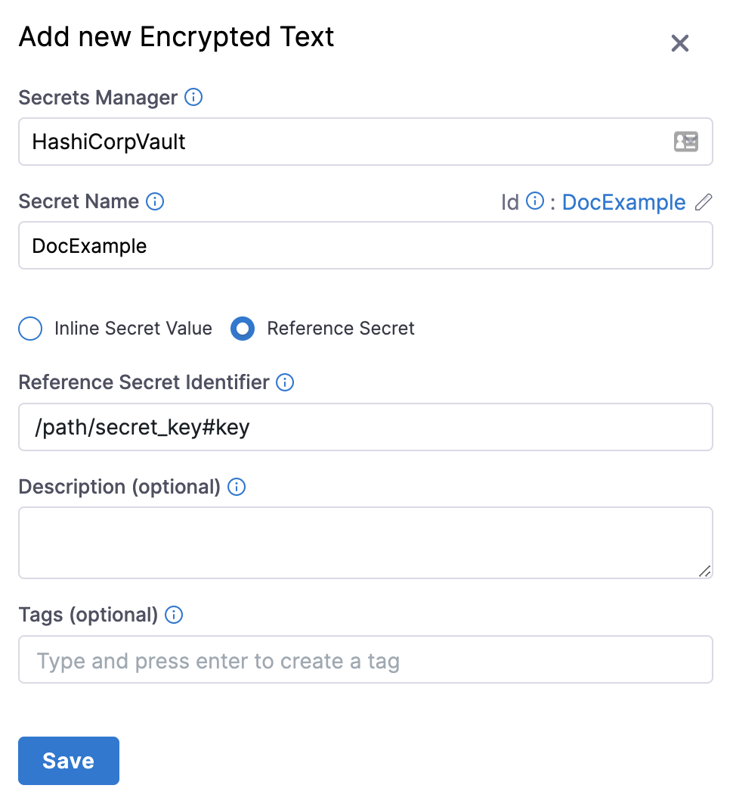
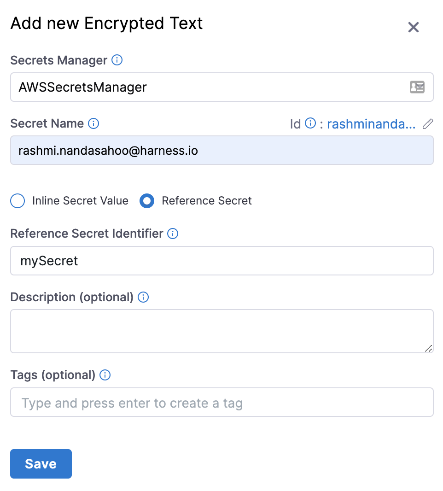
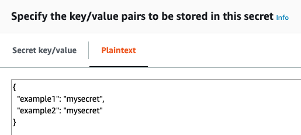

If you already have secrets created in a secret manager such as HashiCorp Vault or AWS Secrets Manager, you do not need to re-create the existing secrets in Harness.

Harness does not query the secret manager for existing secrets, but you can create a secret in Harness that references an existing secret in HashiCorp Vault or AWS Secrets Manager. No new secret is created in those providers. If you delete the secret in Harness, it does not delete the secret in the provider.


### Before you begin

* Go to [AWS KMS Secret Manager](/docs/platform/secrets/secrets-management/add-an-aws-kms-secrets-manager)
* Go to [AWS Secrets Manager](/docs/platform/secrets/secrets-management/add-an-aws-secret-manager.md)
* Go to [Azure Key Vault Secret Manager](/docs/platform/secrets/secrets-management/azure-key-vault.md)
* Go to [HashiCorp Vault Secret Manager](/docs/platform/secrets/secrets-management/add-hashicorp-vault.md)

### Option: Vault secrets

You can create a Harness secret that refers to the existing Vault secret using a path and key, such as `/path/secret_key#my_key`.



In the above example, `/path` is the pre-existing path, `secret_key` is the secret name, and `my_key` is the key used to lookup the secret value.

:::info note
Do not prepend the Vault secrets engine to the path. In the above example, if the secret (`/path/secret_key#my_key`) had been generated by a Vault secrets engine named `harness-engine`, it would reside in this full path `/harness-engine/path/secret_key#my_key`. However, in the **Value** field, you would enter only `/path/secret_key#my_key`. For example, if your secret path is `https://<vault_url>/ui/vault/secrets/\<SECRET_ENGINE>/show/VAULT/secret_val`, then the reference path is `VAULT/secret_val`.

Also note, Harness supports JSON secrets. For example, if you have a JSON secret named `my_secret` like the one below defined in vault, you can reference `/path/my_secret#password` or `/path/my_secret#database.password`. For more information, go to [Reference JSON secrets](#reference-json-secrets).

```
{
  "username": "sample_user",
  "password": "P@ssw0rd!123",
  "database": {
    "username": "db_user",
    "password": "db_P@ssw0rd!789"
  }
}
```
:::

This Harness secret is simply a reference pointing to an existing Vault secret. Deleting this Harness secret will not delete the Vault secret referred to by this secret.

You can reference pre-existing Vault secrets in the Harness YAML editor.

### Option: HashiCorp Vault Secrets

For HashiCorp Vault, you can also use expressions to reference pre-existing secrets in Vault using a fully-qualified path, such as `hashicorpvault://LocalVault/foo/bar/mysecret#mykey`.

With this type of referencing, you don't need to pre-create secrets.

The scheme `hashicorpvault://` is needed to distinguish a Vault secret from other secret references. It is followed by the identifier of the Vault secret manager.

For example, if you have a HashiCorp Vault connector with the identifier `myVault` in the Account scope and a secret with the name `example` present in the vault path `/harness/testpath` with the following values:


```
{
    "key1": "value one",
    "key2": "value two"
}
```
You can reference the value of `key1` for the secret `example` using the following expression:


```
<+secrets.getValue("account.hashicorpvault://myVault/harness/testpath/example#key1")>
```
For a HashiCorp Vault connector at the Org scope, use the following expression:


```
<+secrets.getValue("org.hashicorpvault://myVault/harness/testpath/example#key1")>
```
For a HashiCorp Vault connector at the Project scope, use the following expression:


```
<+secrets.getValue("hashicorpvault://myVault/harness/testpath/example#key1")>
```

:::info note
To dynamically reference secrets in HashiCorp Vault, make sure you use the expression in the following format:
`<+secrets.getValue()>`
:::

### Option: AWS Secrets Manager secrets

You can create a Harness secret that refers to an existing secret in AWS Secrets Manager using the name of the secret, and a prefix if needed. For example, `mySecret`.



#### Referencing secret keys

In AWS Secrets Manager, your secrets are specified as key-value pairs, using a JSON collection:



To reference a specific key in your Harness secret, add the key name following the secret name, like `secret_name#key_name`. In the above example, the secret is named **example4docs**. To reference the **example1** key, you would enter `example4docs#example1`.

#### Referencing pre-existing secrets

For AWS secret manager, you can also use expressions to reference pre-existing secrets using a fully-qualified path, such as `awssecretsmanager://<connector_identifier>/<secret>`.

With this type of reference, you don't need to pre-create secrets.

The scheme `awssecretsmanager://` is needed to distinguish an AWS secret manager secret from other secret references. The identifier of the secret manager follows this.

For example, if you have an AWS secret manager connector with the identifier `exampleAWS` in the Account scope and a secret with the name `example` present in it.

You can reference the secret example using the following expression:

```
<+secrets.getValue("account.awssecretsmanager://exampleAWS/example")>
```
For an AWS secret manager connector at the Org scope, use the following expression:

```
<+secrets.getValue("org.awssecretsmanager://exampleAWS/example")>
```

For an AWS secret manager connector at the Project scope, use the following expression:

```
<+secrets.getValue("awssecretsmanager://exampleAWS/example")>
```
:::info note
To dynamically reference secrets in the AWS secret manager, make sure you use the expression in the following format:
`<+secrets.getValue()`>
:::


### Option: Azure Key Vault secrets

You can create a Harness secret that refers to an existing secret in Azure Key Vault, using that secret's name (for example: `azureSecret`). You can also specify the secret's version (for example: `azureSecret/05`).

#### Referencing pre-existing secrets

For Azure Key Vault secret manager, you can also use expressions to reference pre-existing secrets using a fully-qualified path, such as `azurevault://My_AzureVault/mySecret`.

With this type of reference, you don't need to pre-create secrets.

The scheme `azurevault://` is needed to distinguish an Azure Key Vault secret from other secret references. The identifier of the secret manager follows this.

For example, if you have an Azure Key Vault connector with the identifier `exampleAzureKeyVault` in the Account scope and a secret with the name `example` present in it.

You can reference the secret example using the following expression:

```
<+secrets.getValue("account.azurevault://exampleAzureKeyVault/example")>
```

For an Azure Key Vault secret manager connector at the Org scope, use the following expression:

```
<+secrets.getValue("org.azurevault://exampleAzureKeyVault/example")>
```

For an Azure Key Vault secret manager at the Project scope, use the following expression:


```
<+secrets.getValue("azurevault://exampleAzureKeyVault/example")>
```

:::info note
To dynamically reference secrets in the Azure Key Vault, make sure you use the expression in the following format:
`<+secrets.getValue()>`

:::

### Option: GCP Secret Manager

For GCP secret manager, you can also use expressions to reference pre-existing secrets using a fully-qualified path, such as `gcpsecretsmanager://My_GoogleSM/mySecret`.

With this type of reference, you don't need to pre-create secrets.

The scheme `gcpsecretsmanager://` is needed to distinguish a GCP secret manager secret from other secret references. The identifier of the secret manager follows this.

#### Supported reference formats

What you add after the connector identifier depends on which secret you want, and on whether that secret lives in the connector default project or in another GCP project.

| What you want to reference | Path after the connector identifier | Example |
| --- | --- | --- |
| The latest version of a secret in the connector default project | `secretName` | `gcpsecretsmanager://exampleGCP/example` |
| A specific version of a secret in the connector default project | `secretName/version` | `gcpsecretsmanager://exampleGCP/example/7` |
| A secret in a different GCP project that the connector can access | `gcpProject/secretName/version` | `gcpsecretsmanager://exampleGCP/my-gcp-project/example/latest` |

For `version`, enter a version number such as `1` or `7`, or enter `latest` to resolve the most recent version at runtime.

The following examples use a GCP secret manager connector with the identifier `exampleGCP` and a secret named `example`.

**Reference the latest version of a secret in the connector default project:**

```
<+secrets.getValue("gcpsecretsmanager://exampleGCP/example")>
```

**Reference a specific version of a secret in the connector default project:**

```
<+secrets.getValue("gcpsecretsmanager://exampleGCP/example/7")>
```

**Reference a secret in another GCP project:**

```
<+secrets.getValue("gcpsecretsmanager://exampleGCP/my-gcp-project/example/latest")>
```

:::warning
When you name a GCP project, always include the version as well. Harness reads `gcpsecretsmanager://exampleGCP/my-gcp-project/example` as the secret `my-gcp-project` at version `example`, not as the secret `example` in the project `my-gcp-project`. Harness accepts the expression, and GCP fails later, when the secret is fetched.
:::

:::info note
References to a secret in another GCP project require Harness Delegate version **26.01.88200** or later, and the connector service account needs Secret Manager permissions in that project. Go to [Enable cross-project access](/docs/platform/secrets/secrets-management/add-a-google-cloud-secret-manager#enable-cross-project-access) to review the required IAM permissions. References that use the connector default project have no delegate version requirement beyond the connector itself.

No format is gated by a feature flag. The `PL_GCPSM_OIDC_CONNECTOR_CROSS_PROJECT_ACCESS` flag controls only the **Project** dropdown in the secret creation and edit flow.
:::

#### Connector scope prefixes

Prefix the scheme with the scope of the connector when the connector is not in the same project as the pipeline. The Harness scope prefix sits in front of the scheme, and does not change the path that follows the connector identifier. Project, org, and account scope connectors all support every format above, including references to another GCP project.

For a connector at the Account scope, use the following expression:

```
<+secrets.getValue("account.gcpsecretsmanager://exampleGCP/example/7")>
```

For a connector at the Org scope, use the following expression:

```
<+secrets.getValue("org.gcpsecretsmanager://exampleGCP/example/7")>
```

For a connector at the Project scope, use no prefix:

```
<+secrets.getValue("gcpsecretsmanager://exampleGCP/example/7")>
```

Scope prefixes combine with a cross-project reference. For example, to reference the latest version of the secret `example` in the GCP project `my-gcp-project`, use one of the following expressions, depending on the scope of the connector:

```
<+secrets.getValue("gcpsecretsmanager://exampleGCP/my-gcp-project/example/latest")>
<+secrets.getValue("org.gcpsecretsmanager://exampleGCP/my-gcp-project/example/latest")>
<+secrets.getValue("account.gcpsecretsmanager://exampleGCP/my-gcp-project/example/latest")>
```

:::info note
To dynamically reference secrets in GCP secret manager, make sure you use the expression in the following format:
`<+secrets.getValue()>`
:::

### Option: Reference JSON secrets

Harness supports the ability to reference JSON secrets for the following secret managers.

* AWS KMS Secret Manager
* AWS Secret Manager
* Azure Key Vault Secret Manager
* HashiCorp Vault Secret Manager

import Refj from '/docs/platform/shared/reference-via-json.md';

<Refj />

