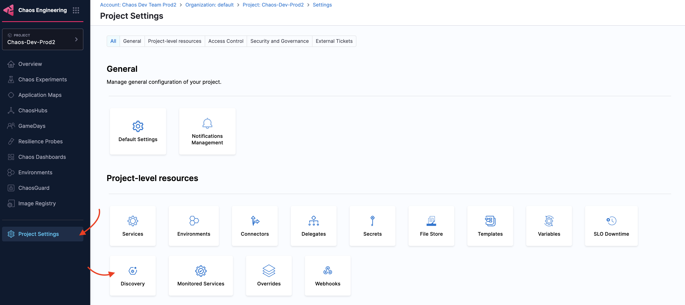
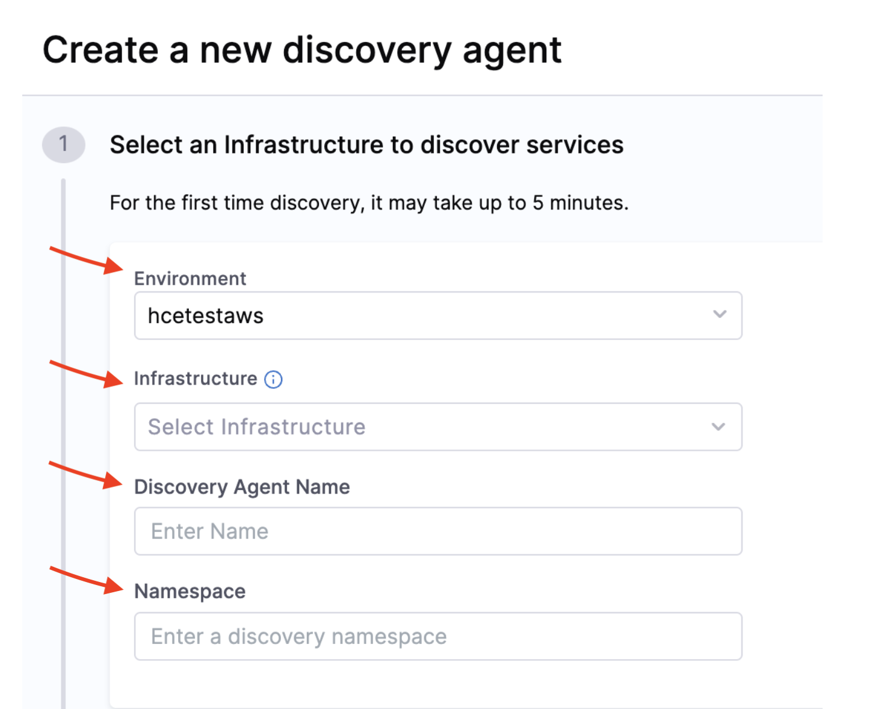
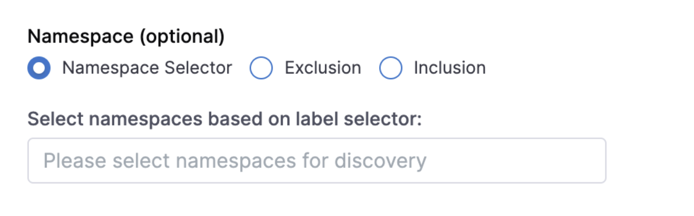
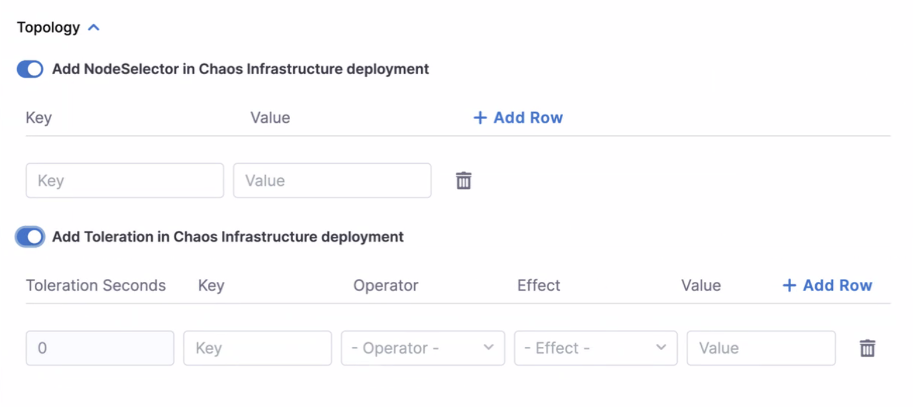
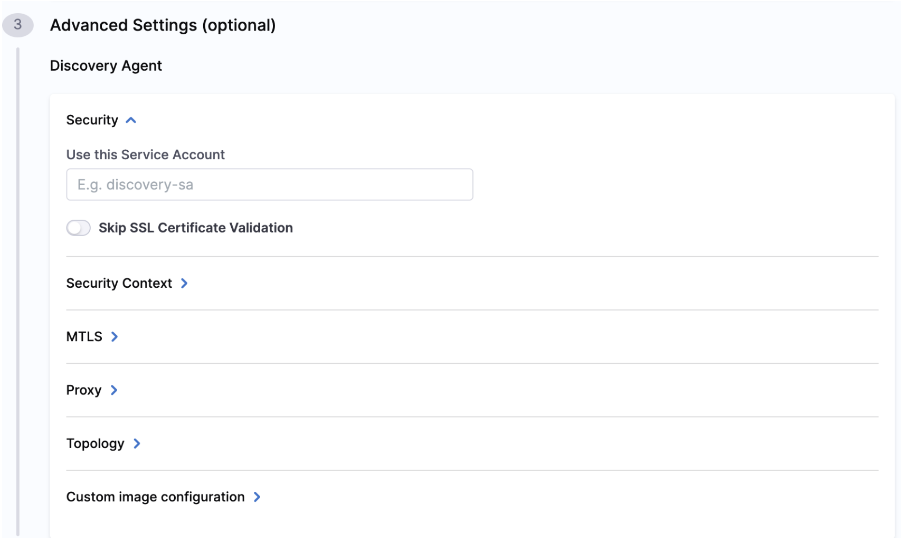
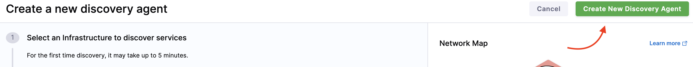
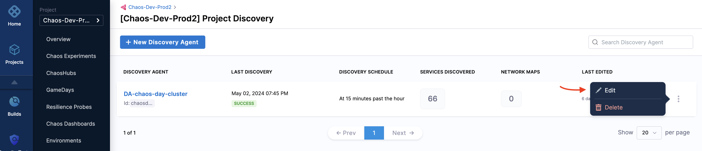
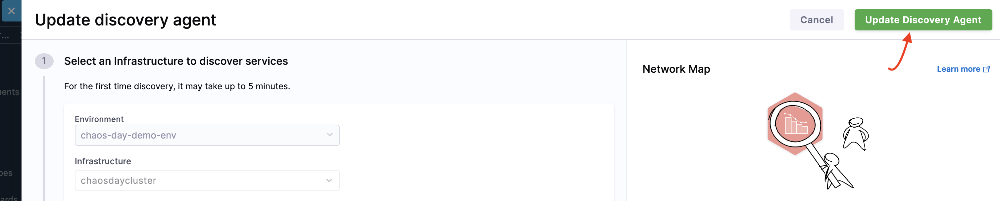
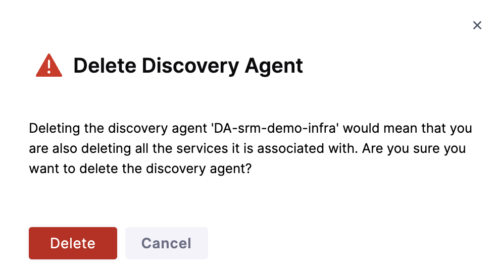

This topic describes how to create a discovery agent and configure it to discover services, edit it, and delete it.

### Create Discovery Agent

1. Navigate to **Project Settings** and select **Discovery**.

    

2. Click **New Discovery Agent**.

    

3. Specify the following variables:

    - **Environment** (this is created earlier, and is the place where you install infrastructure)
    - **Infrastructure** (this is created earlier, where your target cluster is housed). 
    - Specify **Discovery Agent Name**. 
    - For the **Namespace**, provide the dedicated namespace you created in your target cluster for Harness. This is the namespace where Harness runs chaos runners, discovers services and executes chaos experiments.

            

4. Select one of the following based on your requirement.

    - **Namespace Selector**: Selects one or more namespaces based on [level selector](https://kubernetes.io/docs/concepts/overview/working-with-objects/labels/).
    - **Exclusion**: Select this option to avoid Harness from discovering certain namespaces. Provide the name of the namespaces to be excluded.
    - **Inclusion**: Select this option to allow Harness to discover specific namespaces. Provide the name of the namespaces to be included.

        

5. If your cluster control plane node has a taint, **Add Node Selector** so that Harness launches its pod only on the worker nodes.

        

6. Populate the **Use this Service Account** field with the Service Account name that you created in the dedicated namespace in your target cluster for Harness.

        

7. Click **Create New Discovery Agent** on the top right corner of the page.

    

### Edit Discovery Agent

1. To edit a discovery agent, navigate to the agent (that you created earlier) and click **Edit**. Make the necessary changes to the required fields.

    

2. Select **Update Discovery Agent**.

    

### Delete Discovery Agent

1. To delete a discovery agent, navigate to the agent you want to delete and select **Delete**.

    

2. Select **Delete**.

    