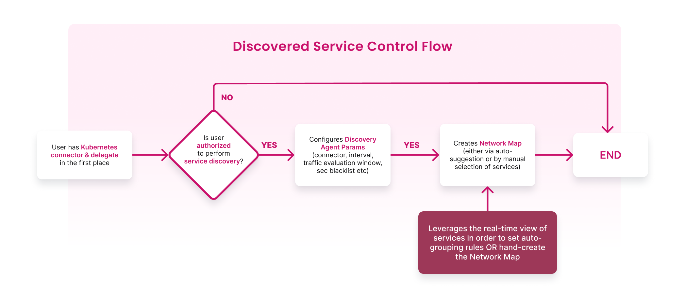

This topic introduces you to **service discovery** for **Kubernetes infrastructure**, its significance, and its purpose.

### What is a discovered service?
Discovered service is an entity on the Harness platform (also known as the control plane) that corresponds to a Kubernetes service on your (user) cluster. It includes details about the connections made from and to it.

Below is the control flow to a discovered service.

  

### Why is a discovered service required?

Large enterprises deal with hundreds of deployed services. Monitoring these services on these services would require building a database of these services and the relationship between these services, which is time-consuming. Service discovery comes into the picture: Instead of creating a database with the services, **automatically discover services** and the relationship between them.

### How does Harness discover services?

Harness performs the following steps to discover services in your cluster:
1. Scan your Kubernetes cluster periodically (you can define the interval or ad-hoc).
2. Build a database of services that describes the relationship between the services.
3. Provide APIs to group the discovered services into a map, wherein the map represents a topological view of an application.

Service discovery leverages the standard Kubernetes API for workload identification and eBPF (extended Berkeley Packet Filter) to analyze real-time network traffic between workloads using kprobe hooks. These open-source technologies enable efficient monitoring and visualization of service-to-service communication within a Kubernetes cluster.

### How does Harness leverage discovered services?

- Identify the various available services in the Kubernetes cluster that you can deploy using Harness or other means.
- Record the resources backing the above services (logical resources such as deployment, pods, containers, processes, FQDNs, ports, physical resources such as nodes, storage, and so on).
- Highlight the given service's position and the lineage within the topology view.

:::tip
You can leverage all the [permissions mentioned](/docs/chaos-engineering/security/security-templates/openshift-scc#run-service-account-as-a-cluster-admin) for service discovery.
:::

### Advantages

- Reduces overhead of creating a database with services
- User-friendly
- Increased adoption of Harness

When you are onboarding, one of the steps involves discovering services. Harness creates the discovery agent that automatically discovers services for your application.

## Next Steps

- [Customize Discovery Agent](/docs/platform/service-discovery/customize-agent)
