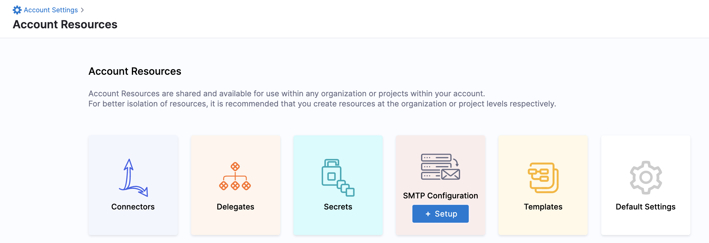
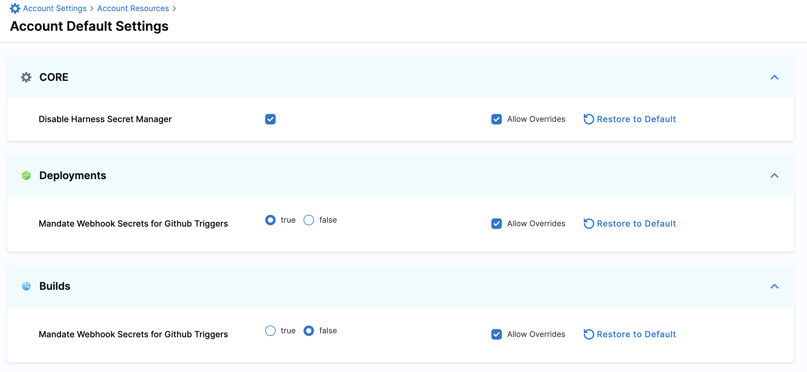

import Tabs from '@theme/Tabs';
import TabItem from '@theme/TabItem';

Harness Default Settings lets you configure parameters in your Account, Org, or Project scope for specific Harness modules.

This topic explains how to view and edit Default Settings for your modules.

Harness supports the configuration of Default Settings for the following modules:

* Core
* Deployments
* Builds

## Required permissions

Make sure you have the **view** and **edit** permissions for Default Settings.

## Manage Harness Platform default settings

Default Settings include configurable module-specific parameters that you can customize based on your needs, such as enabling or disabling features at specific scopes.

<Tabs>
  <TabItem value="accountscope" label="Account scope" default>

To access the Default Settings at the Account scope, do the following:

1. In your Harness Account, go to **Account Resources**.

   

2. Select **Default Settings**. The **Account Default Settings** appear.

</TabItem>
  <TabItem value="orgscope" label="Org scope" default>

To access the Default Settings at the Org scope, do the following:

1. In Harness, select your organization. The organization page opens.

2. Select **Default Settings**. The **Account Default Settings** appear.

</TabItem>
  <TabItem value="projscope" label="Project scope" default>

To access the Default Settings at the Project scope, do the following:

1. In Harness, select your project. 

2. Under **PROJECT SETUP**, select **Default Settings**. The **Account Default Settings** appear.

</TabItem>
</Tabs>

### View and Edit Default Settings

This topic explains how to view and edit Default Settings at the Account scope.

1. In your Harness Account, go to **Account Resources**.

   

2. Select **Default Settings**. The **Account Default Settings** appear.

   Harness onboards the module-specific settings in **Account Default Settings**.
   
   

#### Allow Override

* If you select Allow Override at the parent scope, your setting can be overridden at the child scope.​
* To have the settings of a child scope the same as that of a parent scope, disable **Allow Override**.  
For example, if you want to have the same settings for all the Organizations and Projects within an Account.

#### Restore to Default

Harness has default values for the parameters in Default Settings. You can change these values as per your needs.

When you change any default setting, you have the option to change it back to the default value for that scope, using the **Restore to Default** option.

## Account scope default settings

This topic lists Default Settings at the Account scope. You can also configure Default Settings at the Org and Project scopes.

:::info note

Available settings vary by scope.

:::

### General

**Enable Force Delete of Harness Resources:** You can force delete a Harness entity even if your pipelines or other entities reference it. For more information, go to [Force delete](/docs/platform/references/entity-deletion-reference/#force-delete).

### Connectors

**Disable Harness Secret Manager:** You can choose to disable the Harness built-in Secret Manager at any point and use any other Secret Manager to store secrets. For more information, go to [Disable built-in secret manager](/docs/platform/secrets/secrets-management/disable-harness-secret-manager/).

### Continuous Deployment

The following settings are available for Continuous Deployment.

- **Enable Emails to be sent to non-Harness Users:** To send emails to non-Harness users, you must configure your own SMTP server and enable this default setting.

- **Project Scoped Resource Constraint Queue**: Resource Constraints protect resource capacity limits by preventing simultaneous deployments to the same Service + Infrastructure combination. For more information, go to [Resource constraints](/docs/continuous-delivery/manage-deployments/controlling-deployments-with-barriers-resource-constraints-and-queue-steps/#resource-constraints). 

### Git Experience

The following settings are available for Git Experience. For more information, go to [Git Experience settings](/docs/platform/git-experience/git-settings).

- **Default Connector For Git Experience with Entities - Pipelines/InputSets/Templates**

- **Use Git client for commits**

- **Allow different repo for Pipeline and InputSets**

- **Enforce git experience for pipelines and templates**

- **Default Store Type For Entities- Pipelines/InputSets/Templates**

- **Default Repository For Git Experience with Entities - Pipelines/InputSets/Templates**

- **Allowed Repositories**

### Pipeline

The following settings are available for pipelines.

- **Mandate Authorization for Custom Webhook Triggers:** Enable this setting to require that all custom triggers in this Harness account use API key tokens. For more information, go to [Enforcing authorization for custom triggers](/docs/platform/triggers/trigger-deployments-using-custom-triggers/#enforcing-authorization-for-custom-triggers).

- **Enable Pipeline Execution Audit Events:** By default, the pipeline execution audit events such as Pipeline Start, Pipeline End, Stage Start, and Stage End are not displayed in Audit Trail. Enable this setting to display these events. For more information, go to [View an Audit Trail](/docs/platform/governance/audit-trail/#step-view-an-audit-trail).

- **Run RBAC Validation before executing Inline Pipelines:** By default, before running any pipeline, Harness checks whether the user has access to all of the environments and other resources that the pipeline accesses. This check is run only for inline pipelines, not those stored in Git or other repositories. Turn off this setting if the check isn't required. Turning it off may cause pipelines to fail partway through execution (since later stages could have permission issues that haven't been checked beforehand).

- **Do Not Delete Pipeline Execution Details:** When this is set to true, older pipeline executions remain in the system even when the corresponding pipelines are deleted. You can view these executions in the Pipeline Executions list and open them to view details, but you cannot re-run them. When this is set to false, Harness deletes all executions of a pipeline when that pipeline is deleted.

- **Allow users to mark a running Step as failure:** Enable this setting to allow users to fail a running step.

- **Export Service Variables as Env Variables:** Enable this setting to export service variables as environment variables in Shell Script steps. This setting is available at account, organization, and project levels. For more information, go to [Exporting service variables as environment variables in a Shell Script step](/docs/continuous-delivery/x-platform-cd-features/services/export-ser-var-as-env-var/).

- **Enable Matrix Labels By Name:** Enable this setting to use the names of the matrix indices as labels.

   By default, Harness uses indices for the matrix naming strategy (stages are named with indices like _2_2, _1_3, and so on). If you prefer, you can customize this naming convention for better readability. For more information, go to [Use matrix axes as stage labels](/docs/platform/pipelines/looping-strategies/looping-strategies-matrix-repeat-and-parallelism/#use-matrix-axes-as-stage-labels).

- **Enable Json Support for expressions:** Enable this setting to write expressions using any JSON parser tool. For more information, go to [Write expressions using JSON](/docs/platform/variables-and-expressions/expression-v2/#write-expressions-using-json).

- **Default Image Pull Policy For Add On Container:** Use this setting to set the image pull policy for the internal Harness images that run inside a pod along with your containers. For example, you can pull all images using a pull policy of **Always** (the default setting), or you can select **Never** because you expect the image to be present in the cluster already.

- **Mandate Webhook Secrets for Github Triggers:** Enable this setting to force secrets for Webhook triggers for authenticating the webhook call. For the secret to work with your webhook, you need to configure the repository webhook with the same secret after creating the trigger in Harness. For more information, go to [Configure Secret](/docs/platform/triggers/triggers-reference/#configure-secret).

- **Execute Triggers With All Collected Artifacts or Manifests:** Enable this setting to allow all artifacts or manifests collected during the polling interval to trigger a deployment, with one deployment triggered for each artifact/manifest collected. For more information, go to [Trigger pipelines on a new artifact](/docs/platform/triggers/trigger-on-a-new-artifact/).

### Cloud Cost Management

For more information about these settings, go to [Set up perspective preferences](/docs/cloud-cost-management/use-ccm-cost-reporting/ccm-perspectives/perspective-preferences/#default-settings-for-perspective-preferences) and [View and apply recommendations](/docs/cloud-cost-management/use-ccm-cost-optimization/ccm-recommendations/home-recommendations/).

### Notifications

For more information about these settings, go to [Notification settings](/docs/platform/notifications/notification-settings).

### Harness AI Development Assistant

Enable this setting to use Harness AI Development Assistant (AIDA). For more information, go to [Overview of Harness AI Development Assistant](/docs/platform/harness-aida/aida-overview/).

#### Module-specific settings

To learn about a module's settings, go to the corresponding settings documentation:
- [Pipeline settings](docs/platform/pipelines/w_pipeline-steps-reference/pipeline-settings.md)
- [Notification settings](docs/platform/notifications/notification-settings.md)
