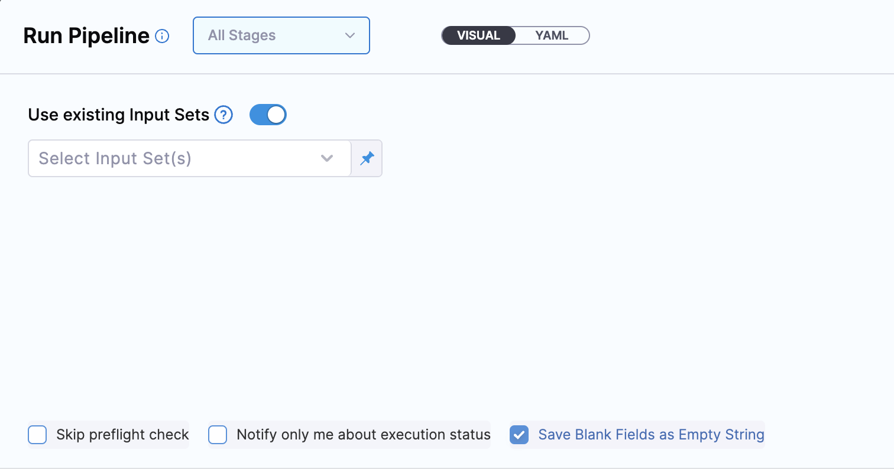
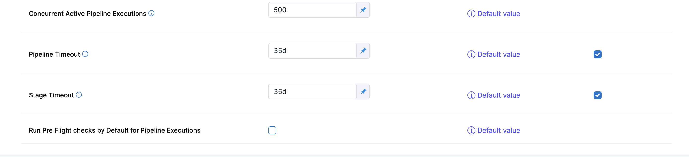

import Tabs from '@theme/Tabs';
import TabItem from '@theme/TabItem';

The Harness Default Settings are broadly scoped configurations that apply to your entire account, an entire organization in your account, or a specific project. These settings control configurations for certain Harness Platform features and high-level module settings.

To manage default settings at the account, org, or project scope, you need **view** and **edit** permissions for Default Settings at the corresponding scope.

## Managed Default Settings

Default Settings include configurable module-specific parameters that you can customize based on your needs, such as enabling or disabling features at specific scopes.

:::warning

When configuring default settings, be mindful of your current scope. For example, editing settings at the account scope applies the setting across the entire account.

:::

<Tabs>
  <TabItem value="accountscope" label="Account scope" default>

To access the Default Settings at the Account scope:

1. Go to **Account Settings**.
2. Select **Default Settings**.

   

</TabItem>
  <TabItem value="orgscope" label="Organization scope" default>

To access the Default Settings at the Org scope:

1. Select **Organizations** and select the organization you want to modify.
2. Select **Organization Settings**, and then select **Default Settings**.

</TabItem>
  <TabItem value="projscope" label="Project scope" default>

To access the Default Settings at the Project scope:

1. Select **Projects** and select the project you want to modify.
2. Select **Project Settings**, and then select **Default Settings**.

</TabItem>
</Tabs>

On the **Default Settings** screen, settings are divided into Platform (General), cross-module feature (Connectors, Notifications, Pipelines, AIDA), and module-specific settings (CCM, CD, Git Experience, SCS).

Expand each section to configure the settings in that section. Available settings vary by scope.

### Allow Overrides

If necessary, you can configure the Default Settings differently at the account, org, and project scopes.

To do this you must enable **Allow Overrides** at the account and/or org scope. This allows the setting to be overridden at lower scopes. **Allow Overrides** is not available at the project scope because that is the lowest scope.

To force lower scopes to inherit the configuration from a higher scope, disable **Allow Overrides**.

### Restore to Default

All Default Settings are initially set to their default values. Once you modify a setting, you can quickly set it back to the default by selecting **Restore to Default.**.

## Default Settings reference

These are the Default Settings available for configuration at the Account scope. You can also configure Default Settings at the Org and Project scopes, but some options are not available at lower scopes.

### General

**Enable Force Delete of Harness Resources:** You can force delete a Harness entity even if your pipelines or other entities reference it. For more information, go to [Force delete](/docs/platform/references/entity-deletion-reference/#force-delete).

### Connectors

**Disable Harness Secret Manager:** You can choose to disable the Harness built-in Secret Manager at any point and use any other Secret Manager to store secrets. For more information, go to [Disable built-in secret manager](/docs/platform/secrets/secrets-management/disable-harness-secret-manager/).

### Continuous Deployment

These settings are for the Harness CD module.

- **Enable Emails to be sent to non-Harness Users:** To send emails to non-Harness users, you must configure your own SMTP server *and* enable this default setting.
- **Project Scoped Resource Constraint Queue:** Resource Constraints protect resource capacity limits by preventing simultaneous deployments to the same Service + Infrastructure combination. For more information, go to [Resource constraints](/docs/continuous-delivery/manage-deployments/controlling-deployments-with-barriers-resource-constraints-and-queue-steps/#resource-constraints).
- **Enable Native Helm steady state for jobs:** By default, the steady state check is only performed for Harness-managed workloads. To perform steady state check for jobs in Native Helm Deployment, you must enable this setting.
- **Fetch files from Git using provider-specific APIs:** Utilize provider-specific APIs (works with GitHub, GitLab, Bitbucket, and Azure Repos) for efficient file retrieval from Git, instead of relying on JGit. This approach can encounter API rate limits. Refer to your Git provider's documentation for limit details.
- **Disable addition of Harness track selector in Kubernetes deployments:** During canary deployments, Harness adds a selector (`harness.io/track: stable`) in deployment objects during the rolling deployment phase. If there are pre-existing deployment objects in the cluster (not deployed by Harness), this can cause an errors. For more information, go to [Skip Harness label selector tracking on Kubernetes deployments](https://developer.harness.io/docs/continuous-delivery/deploy-srv-diff-platforms/kubernetes/cd-kubernetes-category/skip-harness-label-selector-tracking-on-kubernetes-deployments).
- **Ignore status code for HTTP connections:** This setting is only relevant for HTTP steps and HTTP Helm repositories. When enabled, Harness only requires a valid response from the target HTTP server and does not verify the response code. This is useful when the Harness Delegate is configured with a proxy, because socket connection tests conducted by Harness from the delegate do not account for proxy details.

### Pre Flight check

Pre Flight check includes a series of check on the Pipeline such as verifying Pipeline YAML, accessibility of connectors, services, secrets and others. 

**Skip Pre Flight** is not checked by default in the Pipeline Run Form that means that the Pre Flight checks do not run by default.

You can enable Pre Flight Check by default by following these steps:

:::info note
This change is behind the FF `CDS_REMOVE_CONNECTOR_HEARTBEAT`. Please contact [Harness Support](mailto:support@harness.io) to enable this feature.
:::

If the FF `CDS_REMOVE_CONNECTOR_HEARTBEAT` is enabled then you will be able to see the default setting **Run Pre Flight checks by Default for Pipeline Execution** in Pipeline settings.

If this setting is enabled **Skip Pre Flight** will be checked by default.

### Continuous Integration

## S3-Compatible Object Store for Self-Managed Build Infrastructure

:::note

Currently, Harness-managed caching with self-managed build infrastructures is behind the feature flags `CI_ENABLE_DLC_SELF_HOSTED` and `CI_ENABLE_CACHE_INTEL_SELF_HOSTED`. Contact [Harness Support](mailto:support@harness.io) to enable these features.

:::

To use [Harness CI Intelligence](/docs/continuous-integration/get-started/harness-ci-intelligence.md) caching features, such as Cache Intelligence and Harness-managed Docker layer caching, with [self-managed build infrastructures](/docs/continuous-integration/use-ci/set-up-build-infrastructure/which-build-infrastructure-is-right-for-me.md), you must provide S3-compatible object storage where Harness can store and manage your caches.

Use the **S3-Compatible Object Store for Self-Managed Build Infrastructure** settings to connect your S3-compatible object storage to your Harness account. If you want to define different object storage for individual organizations or projects, you must [allow overrides](#allow-overrides) and then change these settings at the lower scopes.

* **Endpoint URL:** S3-compatible storage URL.
* **Region:** Geographical region where your storage is hosted. This is optional for some providers.
* **Bucket Name:** The name of the bucket to use for Harness-managed caches.
* **Access Key** and **Secret Key:** Access key and secret key to access your S3-compatible storage.
   Currently, only access key and secret key authentication is supported. If you don't want to use this authentication method, consider other [caching options](/docs/continuous-integration/use-ci/caching-ci-data/share-ci-data-across-steps-and-stages.md).

:::info

This storage is only for Harness-managed caches (such as those created by Cache Intelligence) for builds that run on self-managed build infrastructure.

Self-managed build infrastructure is any [build infrastructure](/docs/continuous-integration/use-ci/set-up-build-infrastructure/which-build-infrastructure-is-right-for-me.md) other than Harness CI Cloud.

This doesn't apply to Harness CI Cloud because, when you use Harness CI Cloud with Harness-managed caches, Harness uses Harness-hosted Harness Cloud storage.

:::

## Upload Logs Via Harness

When set to `True`, CI step execution logs will route  through Harness' log service instead of getting uploaded directly to the object store (GCS bucket). This is useful if your network settings do not allow direct access to the object store. 
By Default, Upload Logs Via Harness is set to `False`. This is an account level setting only, it cannot be overriden in organization or project default settings. 
**Note:** Enabling this setting may introduce some latency in log uploads so we advise to only use this option is truly needed. 

### Git Experience

For information about these settings, go to [Git Experience settings](/docs/platform/git-experience/git-settings).

### Pipeline

For information about these settings, go to [Pipeline settings](/docs/platform/pipelines/pipeline-settings.md).

### Cloud Cost Management

For information about these settings, go to [Set up perspective preferences](/docs/cloud-cost-management/use-ccm-cost-reporting/ccm-perspectives/perspective-preferences/#default-settings-for-perspective-preferences) and [View and apply recommendations](/docs/cloud-cost-management/use-ccm-cost-optimization/ccm-recommendations/home-recommendations/).

### Notifications

For information about these settings, go to [Notification settings](/docs/platform/notifications/notification-settings).

### Supply Chain Assurance

These settings are for [Harness SSCA](/docs/software-supply-chain-assurance).

* **Use Base64 encoded secrets for attestation**
* **Enable SSCA Airgap**

### Harness AI Development Assistant

Enable this setting to use [Harness AI Development Assistant (AIDA)](/docs/platform/harness-aida/aida-overview/).
