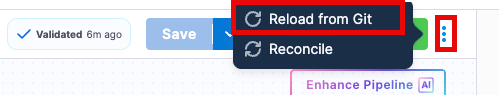
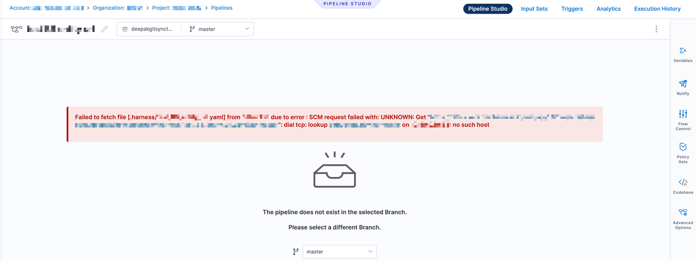
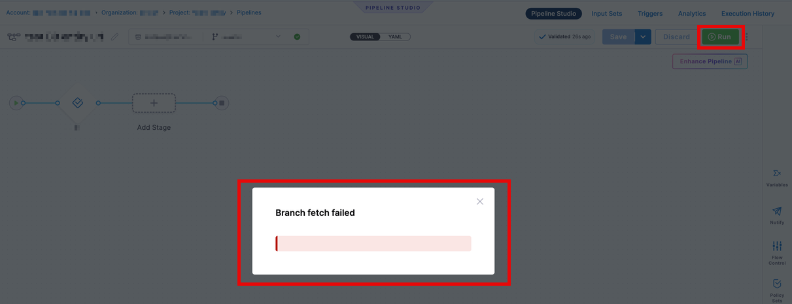

## Connectivity loss
Customers may be naturally curious about what might happen in the event of a potential network outage between Harness and the entity repository provider.  In this case, several scenarios need to be considered.  In general, while the connectivity is broken, Harness will utilize the "locked" cached version of the entity.

### Updates to remote entities at the remote entity repo
If autocreation is enabled, new entities will not be created automatically and must be imported manually.  Another option would be for customers to recreate the file once the connectivity is fixed. For existing entities, we provide an option to `Reload from Git` where customers can manually reload from the repository once the connectivity is restored.

At a base level, if the entities' `.yaml` files are updated in the remote repository while the connection is broken, the webhook event will never reach Harness, and the cache we maintain will never be updated. Customers should be able to see both the attempt to reach Harness and the failure to reach Harness within the repository logs.

### Updates to remote entities from the Harness UI
If the connectivity is broken, customers will not be able to make changes to the entity locally.  The create, edit, or delete operation will fail, and the cache will not be updated.  The following error message may appear when attempting to update.  This is because, as part of storing a remote entity, Harness cannot update the remote entity at the repo, resulting in the failure.

### Harness Executions - no changes or updates
For existing entities, if the connectivity is broken, the pipeline will continue running and reference the last cache version of the entities during execution. This includes any remote entities that were kept in the remote repo.  Harness maintains a cache with an expiration, and as long as the cache hasn't expired, users will see a `Branch Fetch Failed` error, but will still be able to execute the pipeline.

If we don’t have a cache for the pipeline or it has expired, our end users will see a page where the pipeline is not visible, as shown in the screenshot below. 

Any updates made during the downtime period will not be reflected in the execution.  Basically, the cache has an effective "read only" state

### Cache Expiry
Please note that while the cache remains effective, the cache's existence and each individual object's existence is reliant on a couple factors

#### Overall Cache Existence
The Harness webhook cache as a whole, will exist so long as the webhook for that particular cache remains unmodified.  For example, deleting, modifying, or disabling a webhook will cause the entire cache to be flushed, and therefore, all objects in the cache will disappear.   So for example, if a customer deletes a webhook while there is a connectivity error to the host respository, and attempts to re-create the webhook, the existing cache will be deleted and then a new cache will need to be built.

This will mean that no executions can occur again until the cache is re-established

#### Individual Objects Existence
As stated, each [cached object has a lifecycle of 30 days](https://developer.harness.io/docs/platform/git-experience/harness-git-cache/#entity-cache-life-cycle).  As a result, each object has their own timer for when the object will expire and need to be re-cached/re-fetched from the source repository.  This timer is reset every time the objected is re-cached either because of its expiry, or because of changes that have happened to the object.  

If during the connectivity issues with the code repository a particular object in Harness requires a re-cache and is unable to, the object will be show up as being inaccessible or missing.

In summary:
- Each entity has a cache expiry of 30 days for the last event for the file.
- This cache date would be different for each cached item (e.g., the pipeline itself, could have a different cache expiry date from each individual template used in the pipeline)
- If at the time of a cache refresh, Harness is unable to refresh the object, the cached item will have expired and appear to "not exist" in Harness.  Once connectivity is re-established, customers can either manually force a re-sync, or the webhook cache will be rebuilt/recovered as a part of Harness' scheduled tasks

