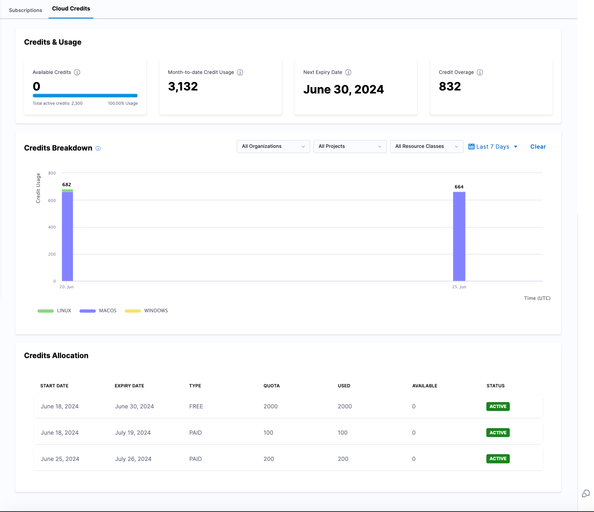

:::info note
Currently, the **Cloud Credits** page is behind the feature flag `PL_ENABLE_LICENSE_USAGE_COMPUTE`. Contact [Harness Support](mailto:support@harness.io) to enable the feature.
:::

For Developer 360 module subscriptions, you can view your cloud credits on the **Subscriptions** page. In your Harness account, go to **Account Settings**, then select **Subscriptions**.

On the **Subscriptions** page, select **Cloud Credits**.

#### Credits & Usage

**Credits & Usage** enables you to view the following credit information:

- **Available Credits:** Current balance of active credits remaining to use.
- **Month-to-date Credit Usage:** Credits consumed month-to-date.
- **Next Expiry Date:** The next upcoming credit expiration date.
- **Credit Overage:** Current amount of credit overage. As a courtesy, Harness notifies you when you are running low on cloud credits. For more information, go to [Credit allowance by plan tier](/docs/continuous-integration/get-started/ci-subscription-mgmt/#credit-allowance-by-plan-tier) and [Credit overages (overuse)](/docs/continuous-integration/get-started/ci-subscription-mgmt#credit-overages-overuse).

#### Credits Breakdown

**Credits Breakdown** enables you to view your credit usage by organization, project, or resource class. You can also use the date filters to view by a **Recommended** range, **Relative dates**, **Calendar months**, or a selected custom range.

#### Credits Allocation

**Credits Allocation** enables you to view the following details for your credit allocation:

- **Start Date:** The date on which a block of credits were applied to your account.
- **Expiry Date:** The date on which a block of credits expires.
- **Type:** The credit type: Free, Team, or Enterprise.
- **Quota:** The total number or allocated credits.
- **Used:** Credits consumed during the active credit period.
   - The active credit period is the time between the **Start Date** and **Expiry Date** for your oldest unexpired credits.
   - For free accounts, the credit balance resets at the end of every calendar month. Your **Start Date** is the first of the month. Your **Expiry Date** is the end of the month.
   - If you purchased additional credits that haven't yet expired, the **Start Date** for **Used Credits** is the date that you purchased the additional credits, and the active credit period covers the lifetime of your purchased credits. For example, if you purchase credits in January that last for six months, **Used Credits** tracks credit usage from January through July, when your purchased credits expire. Therefore, **Used Credits** could include credits with various expiration dates.
- **Available:** The number of credits available to use.
- **Status:** The credit status, **Active** or **Expired**.

For more information about Harness Cloud billing and cloud credit consumption, go to [Subscriptions and licenses](/docs/continuous-integration/get-started/ci-subscription-mgmt.md#harness-cloud-billing-and-cloud-credits).

