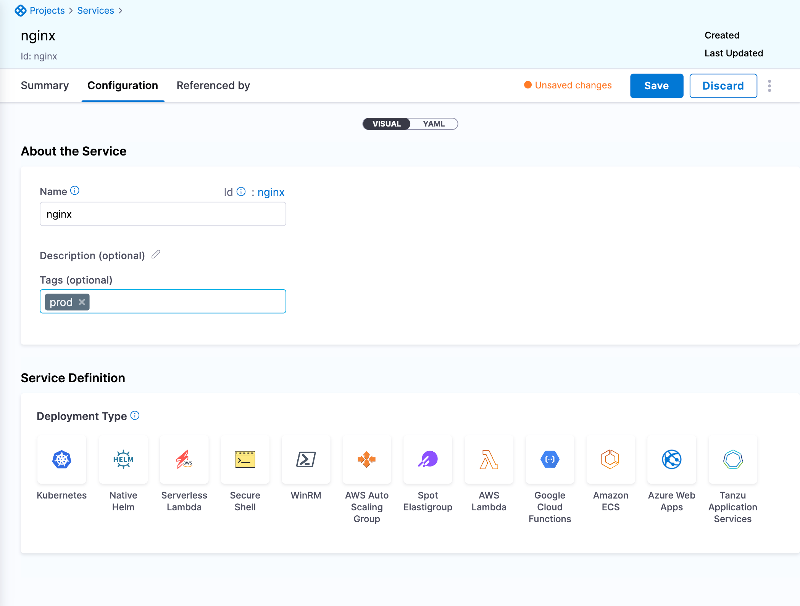

Harness enables you to provide metadata for organizing, searching, and filtering components. You add your metadata using Harness tags. This topic explains how to create tags, including guidelines and restrictions.

## Before you begin

* Go to [Onboarding guide](/docs/platform/get-started/onboarding-guide).
* Go to [Tags reference](/docs/platform/references/tags-reference/).

## Review: Tag guidelines

Harness tags function like the tags on common cloud providers' platforms. They are arbitrary key-value pairs that you can apply to Harness applications and application components. As metadata, they enable you to organize, search, and filter Harness entities.

Using tags, you can overlay your organization’s structure onto Harness resources. Here are some sample use cases:

* Categorizing applications and components by team.
* Marking applications and components for reuse, preservation, or deletion.
* Allocating costs.

Some examples of tag keys, with representative values, are:

* `org: engineering`
* `owner: jenny`
* `validUntil: 1557444441`
* `do-not-delete`

The final tag example above is a key with no value. If assigned to a component, such a tag with no value simply acts like a flag.

### Tag format restrictions

- Tag names and values are restricted to the following format:

   `^[/A-Za-z0-9 _-]+`

- Harness variable expressions cannot be used in tags.

### Tag general restrictions

**Tags** in Harness have these general restrictions:

* A Harness account can maintain a maximum of 500 tag names.
* Each application, or application component, can have a maximum of 50 tags applied.
* Each instance of a tag key can have only one value when applied to an application or component.
* The Tag-name prefix `harness.io/` is reserved for future use by Harness.

**Tag names** (keys) have the following restrictions:

* Length: 1 to 128 characters.
* Allowed characters: letters, numbers, spaces, `_,-,/`.
* Names: Must be unique across your Harness account.
* Names are case-sensitive.
* Names must not begin with the characters `_, -` or spaces.
* System tags will have the tag-name prefix `system/`.

**Tag values**, when applied to applications or components, have the following restrictions:

* Length: 0 to 256 characters. (Entering a value is optional—unless the tag key imposes [Allowed values](#allowed_values), in which case one of those values is required.)
* Allowed characters: letters, numbers, spaces, `_,-,/`.
* Values are case-sensitive.
* Must not begin with the characters `_, -` or spaces.

## Review: Tag scope

You can add tags to Harness applications and the following application components:

* Service
* Environment
* Workflow
* Pipeline
* Infrastructure Provisioner

## Step 1: Assign required permissions

Your options for interacting with tags depend on your Harness [User group permissions](/docs/platform/role-based-access-control/add-user-groups/), as follows:

* All users can view tags (and values) that have been applied to applications and their components.
* Users' [Application permissions](/docs/platform/role-based-access-control/permissions-reference/) determine their ability to apply, update, and remove tags on specific applications and application components.
* Users who have the [Account permission:](/docs/platform/role-based-access-control/permissions-reference/) **Manage Tags** can create tag keys, impose Allowed Values on keys, and edit and delete keys.

### Applying tags

Users who have appropriate [Application-level permissions](/docs/platform/role-based-access-control/permissions-reference/) can add and modify tags on the Harness Application components listed above under [Tag scope](#tag_scope).

## Step 2: Add tags

To add a tag to an application or [supported](#tag_scope) application component, do the following:

1. In Harness, go the application or component to display its Overview card: **Application Overview**, **Environment Overview**, **Workflow Overview**, **Services** etc.

2. In **Configuration**, select the **Tags** pencil icon.

   

2. In the field, type a tag name, and then press enter.

   

3. Select **Save** to add your tag.

   Each applied tag's key and value will now appear on the application's or component's **Overview** card:

   

## Option 2: Remove tags

You can remove tags from the same applications and components where you have Application permissions to add (attach) tags. Click the tag's **X** box, and then save the configuration.

There is no automatic undo. To restore a removed tag, you must manually re-enter it.

## Next Steps

* [Apply filters using tags](apply-filters-using-tags.md)
