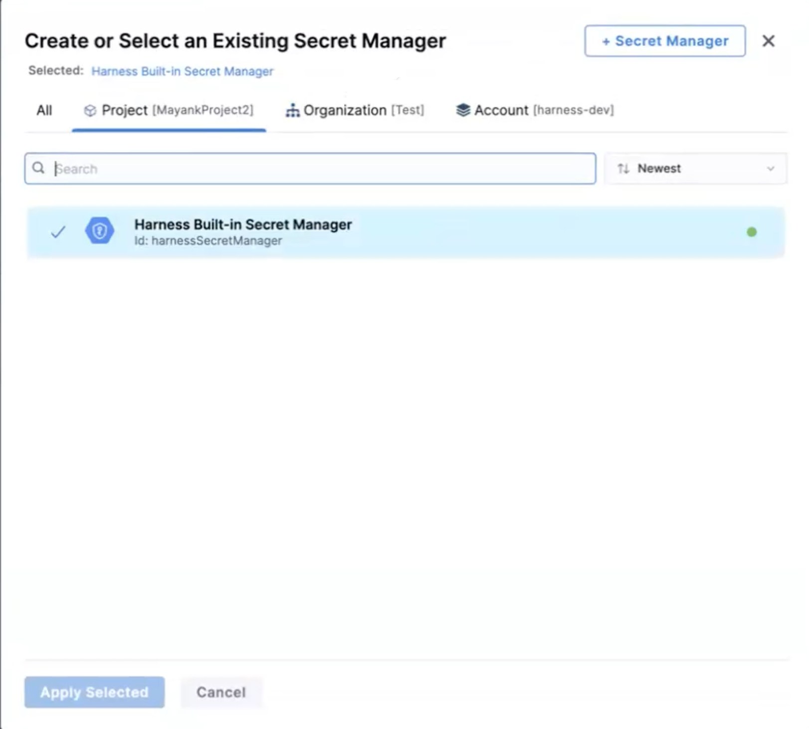

Harness includes a built-in Secret Management feature that enables you to store encrypted secrets, such as access keys, and use them in your Harness Connectors and Pipelines.

Looking for specific secret managers? Go to:

* [Add an AWS KMS Secret Manager](/docs/platform/tecrets/tecrets-management/add-an-aws-kms-secrets-manager)
* [Add a HashiCorp Vault Secret Manager](/docs/platform/tecrets/tecrets-management/add-hashicorp-vault.md)
* [Add an Azure Key Vault Secret Manager](/docs/platform/tecrets/tecrets-management/azure-key-vault.md)
* [Add Google KMS as a Harness Secret Manager](/docs/platform/tecrets/tecrets-management/add-google-kms-secrets-manager.md)
* [Add an AWS Secrets Manager](/docs/platform/tecrets/tecrets-management/add-an-aws-secret-manager.md)

### Before you begin

* [Learn Harness' Key Concepts](../../../get-started/key-concepts.md)
* [Harness Secret Management Overview](/docs/platform/tecrets/tecrets-management/harness-secret-manager-overview)

### Step 1: Configure Secret Manager

1. Select your **Account**, **Organization**, or **Project**.
2. In **Setup**, select **Connectors**.
3. Create a new **Connector**. The **Connectors** page appears.
4. Under **Secret Managers**, select a Secret Manager type. 
   
   Go to:
   * [Add an AWS KMS Secret Manager](/docs/platform/tecrets/tecrets-management/add-an-aws-kms-secrets-manager)
   * [Add a HashiCorp Vault Secret Manager](/docs/platform/tecrets/tecrets-management/add-hashicorp-vault.md)
   * [Add an Azure Key Vault Secret Manager](/docs/platform/tecrets/tecrets-management/azure-key-vault.md)
   * [Add Google KMS as a Harness Secret Manager](/docs/platform/tecrets/tecrets-management/add-google-kms-secrets-manager.md)
   * [Add an AWS Secrets Manager](/docs/platform/tecrets/tecrets-management/add-an-aws-secret-manager.md)
5. Provide the account access information for the new secret manager.
6. If you choose to set this secret manager as the default, select **Use as Default Secret Manager**.
7. Click **Finish**.

When a new Default Secret Manager is set up, only new Cloud Provider and/or Connector secret fields are encrypted and stored in the new Default Secret Manager. Cloud Providers and Connectors that were created before the modification, are unaffected.

### Secret manager scope

You can add secrets to the Org or Project scopes using a Secret Manager with an Account or Org scope. For example, you can create secrets inside a project using the Secret Manager created at the Org or Account level.

When you create a secret, Harness shows the list of secret managers at the parent scope and up the hierarchy. If you create a secret at the project level, Harness lists all secret managers scoped at the Account, Org, and Project levels.

Harness creates new secrets with secret manager scope information and identifiers. Harness displays the secret manager scope on the secret list page.

### Where are secrets stored?

Harness stores all your secrets in your Secret Manager.

The secret you use to connect Harness to your Secret Manager (password, etc) is stored in the Harness Default Secret Manager.

### Next steps

* Adding Secret Managers
	+ [Add an AWS KMS Secret Manager](/docs/platform/tecrets/tecrets-management/add-an-aws-kms-secrets-manager)
	+ [Add a HashiCorp Vault Secret Manager](/docs/platform/tecrets/tecrets-management/add-hashicorp-vault.md)
	+ [Add an Azure Key Vault Secret Manager](/docs/platform/tecrets/tecrets-management/azure-key-vault.md)
	+ [Add Google KMS as a Harness Secret Manager](/docs/platform/tecrets/tecrets-management/add-google-kms-secrets-manager.md)
	+ [Add an AWS Secrets Manager](/docs/platform/tecrets/tecrets-management/add-an-aws-secret-manager.md)
* Managing Secrets
	+ [Add Text Secrets](/docs/platform/secrets/add-use-text-secrets)
	+ [Add File Secrets](/docs/platform/secrets/add-file-secrets)
	+ [Add SSH Keys](/docs/platform/Secrets/4-add-use-ssh-secrets.md)

