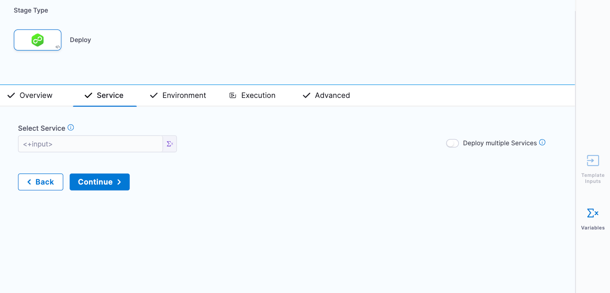

The Harness Template Library enables you to standardize and create templates that you can use across Harness pipelines and teams.

A stage template is a Harness CD, CI, or approval stage template that you can use in any pipeline in any project.

This topic walks you through the steps to create a CD stage template, but the steps are the same for the other stage types.

### Objectives

You'll learn how to: 

* Create a deploy stage template.
* Define stage template parameters.
* Use the deploy stage template in a pipeline.

### Before you begin

* Review [Templates overview](template.md).
* Review the [Harness key concepts](../../first-gen/starthere-firstgen/harness-key-concepts.md).
* This topic adds a stage template to a CD pipeline. If you are new to Harness CD, review the [CD tutorials](/tutorials/cd-pipelines).
* You can also create CI Build stage template, as well as manual approval stage and Jira approval stage templates. For more information, go to the [CI tutorials](../../continuous-integration/get-started/tutorials.md), [Using manual Harness approval stages](../approvals/adding-harness-approval-stages.md), and [Adding Jira approval stages and steps](../approvals/adding-jira-approval-stages.md).
* The stage template in this topic uses runtime inputs. Runtime inputs are placeholders for values that you provide when you start a pipeline execution. For more information, go to [Fixed values, runtime inputs, and expressions](../variables-and-expressions/runtime-inputs.md).

### Review: Templates

* You can add templates to template libraries at any [scope](/docs/platform/role-based-access-control/rbac-in-harness#permissions-hierarchy-scopes).
* [Tags](../references/tags-reference.md) can be used to group templates. You can search or filter templates using these tags.
* You can have nested templates. You can refer to a stage template from your pipeline template.

### Step 1: Create a stage template

You can create a stage template from your account, org, or project. This topic explains the steps to create a stage template from the project scope.

To create a stage template, do the following:

1. In Harness, go to your project.
2. Select **Project Settings**, then, under **Project-level resources**, select **Templates**.
3. Select **Stage** to create a stage template. The **Create New Stage Template** settings open.
4. In **Name**, enter a name for the stage template, for example `Quickstart`.
5. (Optional) Select the pencil icon to enter a **Description**.
6. (Optional) Select the pencil icon to add **Tags**.
7. In **Version Label**, enter the version of the stage, for example, `v1`. Versioning a template enables you to create a new template without modifying the existing one. For more information, go to [Versioning](template.md).
8. (Optional) Select the **Logo** icon to upload a logo image file.
9. From the **Save To** list, select the scope where you want to save the template: Project, Organization, or Account. For this example, select **Project**.
10. Under **How do you want to set up your template?**, you can select **Inline** to store your pipeline configuration in Harness, or select **Remote** to store your pipeline as code in a Git repository. For this example, select **Inline**.
11. Select **Start**. **Select stage type** settings open.

    

    You can now add stage parameters.

### Step 2: Add stage parameters

This example uses the Deploy stage. The Deploy stage type is a CD stage that enables you to deploy any service to your target environment. 

Other options include:

   - **Build:** Use CI to build, test, and push artifacts to repositories.
   - **Approval:** Manual and Jira approval stages.
   - **Feature Flag:** Enable or disable functionality remotely without redeploying code.
   - **Custom Stage:** Set up a stage configurable to your needs.

To add stage parameters, do the following:

1. Follow the steps above to create your template.

2. In **Select stage type**, select **Deploy**. The **About Your Stage** settings open.

   

3. Select the type of deployment this stage must perform. For this example, select **Kubernetes**. The deployment type is how your service will be deployed. For example, using Kubernetes, Native Helm, Serverless, etc. Select the platform for your deployment. When you select a platform, its specific settings open.

      :::info note

      If you change the deployment type (for example, from Kubernetes to Native Helm) there might be some conflicting resources in the target environment. As a result, Stage execution can fail. If this happens, delete all the conflicting resources and try again. You will also lose any deployment type-specific steps in this stage's Execution.

      :::

4. Select **Set Up Stage**. The Template Studio page opens.

5. In **Select Service**, select **Runtime input**.

   

   Harness Services represent your microservices or applications logically. You can propagate the same service to as many stages as you need.

   **Use Runtime Inputs instead of variable expressions:** when you want to template settings in a stage or step template, use [Runtime inputs](../variables-and-expressions/runtime-inputs.md) instead of variable expressions. When Harness tries to resolve variable expressions to specific stage-level settings using fully-qualified names, it can cause issues at runtime. Every pipeline where the stage or step template is inserted must use the same names for fully-qualified name references to operate. With runtime inputs, you can supply values for a setting at deployment runtime.

6. Select **Continue**.

7. In **Specify Environment**, select **Runtime input**. Environments represent your deployment targets logically (QA, Prod, etc). You can add the same environment to as many stages are you need.

8. Select **Continue**. The **Execution Strategies** dialog opens.

    

9. Select **Rolling**, and then select **Use Strategy**.

    In **Execution**, you can see the **Rollout Deployment** step is added automatically.

    Your template is now ready.

10. Select **Save**, add a comment, and then select **Save** again.

    The template is published successfully.

#### Option: Variables

You can add variables to your template as needed.

You can add the following types of values to your variables:

* **Fixed values:** These cannot be overridden.
* **Default values in the Template:** These can be overridden.
* **Expressions:** These can be provided during consumption or at runtime.
* **Combination of variables and fixed values:** These variables will be automatically created as part of the template.

### Step 3: Add the stage template to a pipeline

You can use the CD stage template in any pipeline in your project.

To add a stage template to a pipeline, do the following:

1. In Harness, open the pipeline, and then select **Add Stage**. The **Select Stage Type** settings open.

   

2. Select **Use template**. The next page lists all the project-level templates.

3. Select the `Quickstart` template that you created.

   

4. Click the **Activity Log** to track all template events. It shows you details like who created the template and template version changes.

5. In **Details**, from the **Version Label** list, select **Always use the stable version**.

   

   Selecting this option ensures that any changes that you make to this version are propagated automatically to the pipelines using this template.

6. Select **Use Template**.

   The **About your stage** dialog opens. Enter **Quickstart**, and then select **Set Up Stage**.

   

   The template stage is added to your pipeline.

   The stage is added and not copied by the template icon in the stage.

   

   If you had used **Copy to Pipeline**, this icon would not be there, and you could change settings in the stage.

   You can now enter all the Runtime Inputs for this pipeline execution.

   

7. Select **Save**.

   You'll notice that you can change and remove the template as needed.

### Option: Copy to pipeline

You can copy the contents of a specific template to your pipeline using the **Copy to Pipeline** option. This does not add any reference to the template. Copying a template to a pipeline is different from linking a template to your pipeline. You can't change any stage parameters when you link to a template from your pipeline.

To copy a template to your pipeline, do the following:

1. In Harness, go to your pipeline.
2. Select **Add Stage**. The **Select Stage Type** settings open.

   

3. Select **Use template**, and then select the template you want to copy.

   

5. Select **Copy to Pipeline**.

6. Enter a name for your stage, and then select **Set Up Stage**.

   

   The template contents are copied to your pipeline stage. You can change any settings in the stage that you have copied from a template.

### Next steps

* [Create a step template](run-step-template-quickstart.md)
* [Create an HTTP step template](harness-template-library.md)
