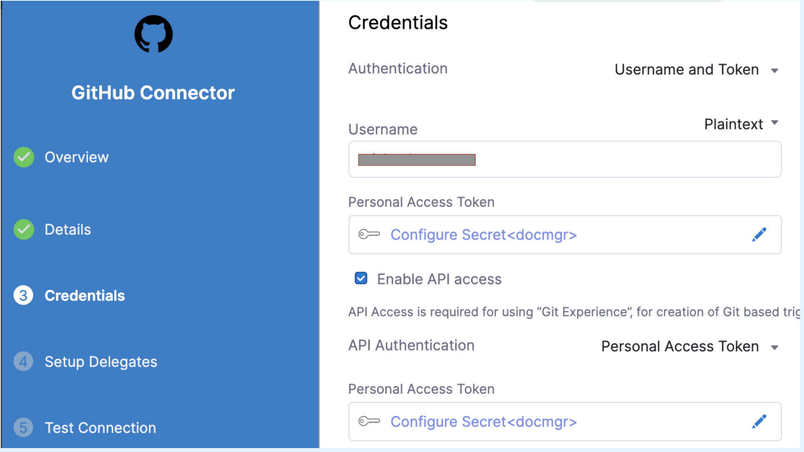
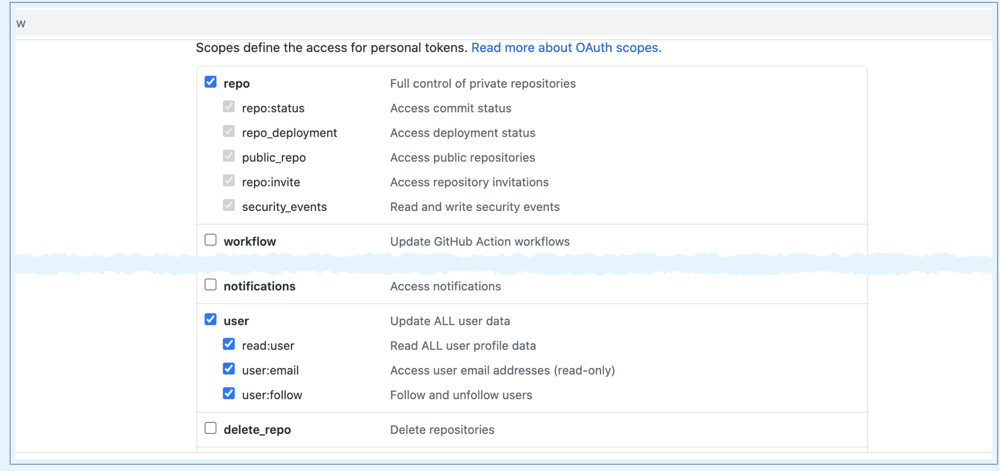
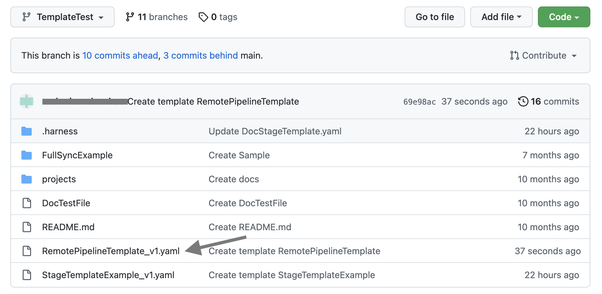
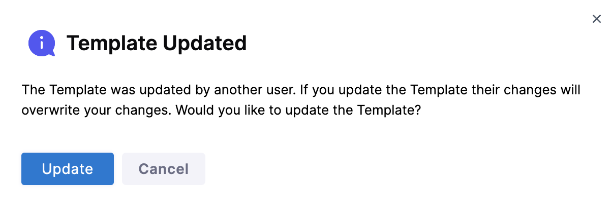

Harness enables you to add templates to create re-usable logic and Harness entities (like steps, stages, and pipelines) in your pipelines. You can link these templates in your pipelines or share them with your teams for improved efficiency.

Templates enhance developer productivity, reduce onboarding time, and enforce standardization across the teams that use Harness.

A pipeline template lets you distribute reusable pipelines across your team or among multiple teams. Instead of building pipelines from scratch, pipeline templates simplify the process by having parameters already built-in.

For example, you can automate your build and deploy services by adding a pipeline template. You can link the following templates to your pipeline template:

* Build stage: To push the artifact to the registry, run tests, and security scans.
* Staging deploy stage: To deploy to Dev, QA.
* Approval stage: To add approval stages for PROD.
* Prod deploy stage: To deploy to production.

You can create a template and save it either in Harness or in a Git repository using the inline or remote option respectively.

This topic walks you through the steps to create a remote pipeline template.

## Permissions

You must have **Create/Edit** and **Access** permissions for templates to create a remote pipeline template. 

## Remote pipeline template overview

Harness pipeline templates give you the ability to enforce consistency. You can save your pipeline templates in different Git repositories. These are called remote pipeline templates.

For example, if you have a core pipeline that you want all of your teams to use, you can put the template in a core repo and then refer to it. Now you can reuse this template.

For information on inline pipeline templates, go to [Create a pipeline template](create-pipeline-template.md).

## Use a remote pipeline template

Harness templates let you reuse a pipeline template to create a pipeline, or share it with your teams for enhanced efficiency.

When using a remote pipeline, Harness resolves the repositories at pipeline startup.

You can have one of the following scenarios when using a template in your pipeline:

* The remote pipeline template and the pipeline exist in the same Git repo.
* The remote pipeline template and the pipeline exist in different Git repos.

Let's see how you can use a template in each of these situations.

### Remote pipeline template and the pipeline exist in the same Git repo

To use the template in your pipeline if your remote pipeline template and pipeline are in the same Git repository, make sure your pipeline and template are both present in the same branch.

### Remote pipeline template and the pipeline exist in different Git repos

To use the template in your pipeline if your remote pipeline template and pipeline are in different Git repositories, make sure your template is present in the default branch of the specific repo.

## Create a remote pipeline template

You can create a pipeline template from your account, org, or project. This topic explains the steps to create a pipeline template from the project scope.

To create a remote pipeline template, do the following:

1. In your Harness, go to your project.
2. Select **Project Settings**, then, under **Project-level resources**, select **Templates**.
3. Select **+ New Template**, and then select **Pipeline**. The **Create New Pipeline Template** settings open.
4. In **Name**, enter a name for the template.
5. (Optional) Select the pencil icon to enter a **Description**.
6. (Optional) Select the pencil icon to add **Tags**.
7. In **Version Label**, enter the version of the stage, for example, `v1`. Versioning a template enables you to create a new template without modifying the existing one. For more information, go to [Versioning](template.md).
8. (Optional) Select the **Logo** icon to upload a logo image file.
9. From the **Save To** list, select the scope where you want to save the template: Project, Organization, or Account. For this example, select Project.
10. Under **How do you want to set up your template?**, select **Remote**.
11. In **Git Connector**, select or create a Git connector to the repo for your project.​ For steps, go to [Code Repo Connectors](/docs/category/code-repo-connectors).

     :::info note
   
     The Git connector must use the **Enable API access** option and **Username and Token** authentication. 
   
     Harness requires the token for API access.
   
     Generate the token in your account on the Git provider and add it to Harness as a Secret. Next, use the token in the credentials for the Git Connector.
   
       
   
     For GitHub, the token must have the following scopes:
   
     
   
     :::

12. In **Repository**, select your repository. If your repository isn't listed, enter its name. Create the repository in Git before entering it in **Select Repository**. Harness does not create the repository for you.
13. In **Git Branch**, select your branch. If your branch isn't listed, enter its name. Create the branch in your repository before entering it in **Git Branch**. Harness does not create the branch for you.
14. Harness auto-populates the **YAML Path**. You can change this path and the file name.
15. Select **Start**.

## Add a stage

This example uses the Deploy stage. The Deploy stage type is a CD stage that enables you to deploy any service to your target environment. 

Other options include:

   - **Build:** Use CI to build, test, and push artifacts to repositories.
   - **Approval:** Manual and Jira approval stages.
   - **Feature Flag:** Enable or disable functionality remotely without redeploying code.
   - **Custom Stage:** Set up a stage configurable to your needs.

To add a stage, do the following:

1. Select **Add Stage**. The **Select Stage Type** settings open.
2. Select **Deploy**. The **About Your Stage** settings open.
3. In **Stage Name**, enter a name for your stage.
4. Select the entity that this stage should deploy.
4. In **Deployment Type**, select **Kubernetes**.
5. Select **Set Up Stage**.

## Add service details

To add service details, do the following:

1. In **Select Service**, select an existing service that you want to deploy from the **Specify Service** list or create a new one. You can also use [Fixed values, runtime inputs, and expressions](../variables-and-expressions/runtime-inputs.md).
2. Select **Continue**.
3. In **Specify Environment**, select an existing environment or add a new one.
4. In **Specify Infrastructure**, select an existing infrastructure or add a new one.
5. Select **Continue**. The **Execution Strategies** settings open.

## Define execution strategies

To define execution strategies, do the following:

1. In **Execution Strategies**, select the deployment strategy for your pipeline template. This topic uses the example of a rolling deployment.
For more information on different execution strategies, go to [Deployment concepts and strategies.](/docs/continuous-delivery/manage-deployments/deployment-concepts/)
2. Select **Use Strategy**.
3. Select **Save**. The **Save Template to Git** settings open.

   

## Save a remote pipeline template to Git

To save your remote pipeline template to Git, do the following:

1. In **Select Branch to Commit**, You can select one of the following:
	- **Commit to an existing branch:** You can start a pull request if you like.
	- **Commit to a new branch:** Enter the new branch name. You can start a pull request if you like.
2. Select **Save**. Your remote pipeline template is saved to the repo branch.
   
   

3. Click the YAML file to view the YAML for the stage template.
4. Edit the YAML. For example, change the name of the template.
5. Commit your changes to Git.
6. Return to Harness and refresh the page. A **Template Updated** message opens.

   

## Next steps

* [Use a template](use-a-template.md)
