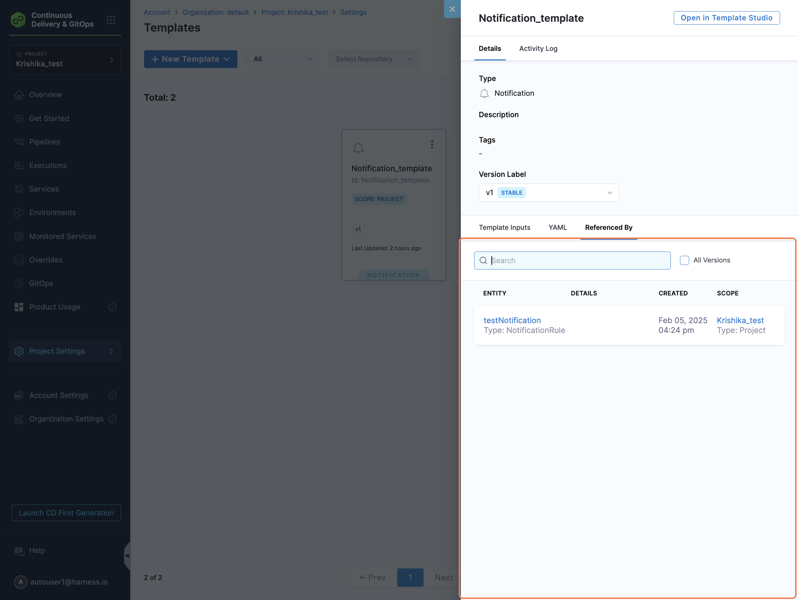
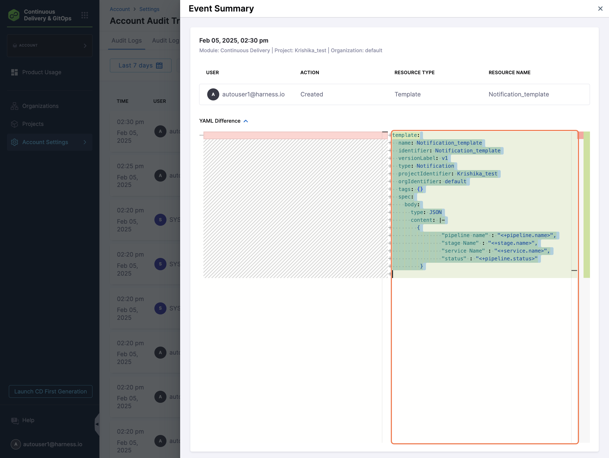

import Tabs from '@theme/Tabs';
import TabItem from '@theme/TabItem';

:::info note
Currently this feature is behind Feature Flag: `PIPE_CUSTOM_NOTIFICATION_TEMPLATES`
However, since this is supported for centralised notification, we need `PL_CENTRAL_NOTIFICATIONS` and `PIPE_CENTRALISED_NOTIFICATION` to be enabled first. Please contact [Harness support](mailto:support@harness.io) to enable this feature.
:::

Users can create custom notification templates, allowing them to customise notification content and reuse templates within **Centralised Pipeline Notifications**. Templates support Pipeline Expressions and RBAC controls, ensuring flexibility and security.

This feature is especially useful when you want to:

- Include specific information such as pipeline variables, stage outputs, or build inputs in the notification.
- Send trimmed-down notifications that contain only the most relevant information.
- Format notifications to align with internal standards or predefined payload structures.

This enhancement allows you to **attach a Custom Notification Template** to a notification rule and override the default message format with a custom webhook payload.

Custom templates give you control over the structure and content of the notification, support dynamic expressions (like pipeline and stage variables), and enable reuse across multiple pipelines.

We are going to discuss setting up a notification for Pipeline Events using Custom Notification Templates, at a certain scope.

You can set up custom notification template for Pipeline notification at following [scope](https://developer.harness.io/docs/platform/role-based-access-control/rbac-in-harness/#permissions-hierarchy-scopes): **Account**, **Organization** and **Project Level**. 

## Setting Up Notifications Template

:::info note
1. Custom Notification templates will work only for webhook notifications.
2. Custom Notification templates support usage of template variables.
3. Custom Notification templates will be an inline entity, meaning they cannot be stored in Git.
4. All Pipeline and Stage-level variables are supported. If an expression cannot be resolved, it will return an empty string.
```json
{
  "pipeline name": "pipeline",
  "stage name": "",
  "stage type": ""
}
```
:::

<Tabs>
<TabItem value="Interactive guide">

In this example, we are going to discuss setting up custom notification template for Pipeline at Project Level:-

<iframe 
  src="https://app.tango.us/app/embed/fc86f283-ef3a-4199-88a1-8de92b845754"
  style={{ minHeight: '960px', maxWidth: '800px', width: '100%' }}
  sandbox="allow-scripts allow-top-navigation-by-user-activation allow-popups allow-same-origin"
  security="restricted"
  title="Creating a Notification Template in Harness"
  width="100%" 
  height="100%" 
  referrerpolicy="strict-origin-when-cross-origin"
  frameborder="0" 
  webkitallowfullscreen="webkitallowfullscreen"
  mozallowfullscreen="mozallowfullscreen"
  allowfullscreen="allowfullscreen"
/>

</TabItem>

<TabItem value="Step-by-step">
In this example, we are going to discuss setting up custom notification template for Pipeline at Project Level:

1. In your Harness, go to your project.
2. Select **Project Settings**, then, under **Project-level resources**, select **Templates**.
3. Select **+ New Template**, and then select **Notifications**. The **Create New Notifications Template** settings open.
4. In **Name**, enter a name for the template.
5. (Optional) Select the pencil icon to enter a **Description**.
6. (Optional) Select the pencil icon to add **Tags**.
7. In **Version Label**, enter the version of the template, for example, `v1`. Versioning a template enables you to create a new template without modifying the existing one. For more information, go to [Versioning](template.md).
8. In Text Type you can choose text type as **HTML**, **JSON**, **YAML** or **String** for content body.


9. When you select text type as per your need you will be asked to provide the body of notification template.
   :::info
   You can use **pipeline and stage-level expressions** in the body instead of hardcoded values. This enables dynamic content based on execution context.

   Stage-level expressions will only be resolved when the notification is triggered by stage-level events (e.g., Stage Success or Stage Failed)
   :::


10. Click on **Save**.

Now, let's add this custom notification template to a notification rule at Project Level:

:::info note
A template created at the Account level can be used for notification rules at Account, Org, or Project levels. Similarly, Org-level templates can be used at Org and Project levels.
:::

1. In Harness, go to **Project Settings**.
2. Under **General**, select **Notifications Management**. 
3. Under **Overview**, provide **Notification Name** and **Continue** to select Resource type.
4. Under **Resources**, Select Resource Type as **Pipeline**. 
5. Under **Condition** , select **+ Add Condition** to define pipeline events based on which you want to be notified.

Under events you can select the following **pipeline events**:-

1. Pipeline Start
2. Pipeline Success
3. Pipeline Failed
4. Stage Start
5. Stage Success
5. Stage Failed

:::info note
Stage start/success/failed events will apply to all stages within a pipeline. There is no option to configure notifications for specific stages. If you want stage-specific notifications, you can configure them via Pipeline-level notifications, but note that this does not support custom notification templates.
:::

Under **Create Condition** provide, Condition Name and **Select Pipeline Events**. Click on **Continue** to set channel where you want to send the notification.

:::info
Custom Notification Templates are currently supported **only for Webhook channels**. If you select any other channel type (e.g., Email, Slack, Teams, PagerDuty), the template option will not be available.
:::

6. Under **Notification Templates**, select your Notification template and select **Use Template** and click on **Continue**.

7. Under **Set Channels**, **Select Channels** where you want notification to be sent.

Under **Select Channel** you can chose the already created channel at that scope or you can create a [**New Channel**](/docs/platform/notifications/notification-settings.md).


8. Select **Submit** to save your notification configuration.

Once this is done, all notifications for the selected event will be sent in the selected template format for **all pipelines in that project**.

If you want to apply the same template to notifications across **all pipelines in an Org or Account**, follow the same flow at the respective scope.


You can also view **Referenced By** in your Custom Notification Template to see notification rule it is attached to.



You can also check audit trail events for Custom Notification Template created. 

Notification Templates support **versioning**, allowing you to maintain multiple iterations of a template. You can also mark a version as the **Stable Version**, enabling notification rules to automatically reference the most current approved version, similar to how other templates in Harness work.




</TabItem>
</Tabs>

---

## Attaching a Custom Notification Template to Pipeline Notifications

Harness supports [adding notification rules to pipelines](/docs/platform/notifications/notification-settings/#add-a-notification-rule). With this enhancement, you can now **attach a Custom Notification Template** to a pipeline notification rule to override the default message format and send custom webhook-based notifications.

This lets you replace the default notification message with a tailored structure defined in your template, including any runtime variables or expressions you've configured.

### How to attach a template

When configuring a **pipeline-level notification rule**, click on **Notify** in the right panel of the Pipeline Studio, and follow the existing flow until you reach the **Notification Templates** step:

1. Under the **Notification Templates** tab:
   - Select your custom notification template.
   - If the template includes **runtime variables**, you’ll be prompted to provide values for those inputs.

   

:::info
Custom notification templates are supported **only for webhook notification methods**. Templates cannot be used with Email, Slack, Teams, or PagerDuty.
:::

Once applied, the custom template overrides the default webhook payload sent during pipeline execution.

## Variables in the Notification Template

Notification templates support **runtime inputs**, which must be provided when configuring a notification rule—whether at the **Centralised Notification Service (CNS)** level or the **pipeline** level.

If a runtime variable is declared in the template, you will be prompted to **enter values or expressions** for it when selecting that template during notification rule configuration.

Use the following expression format to reference these variables in your template body: `<+notification.variables.testVar>`

You can also access the event type that triggered the notification using: `<+notification.eventType>`

## Reconciliation of Notification Rules

If you update a notification template by **adding new runtime variables** after it has already been attached to a notification rule, you may need to reconcile the rule to ensure those inputs are provided during execution.

### Pipeline-level Notifications (via CNT tab)

When a template used in a **pipeline-level notification rule configured through the Notify (CNT) tab** is updated, a **warning message** will appear when you attempt to run the pipeline:

- "Entities referenced in this pipeline have been updated. Please reconcile and save the pipeline to run the latest version."

You can still proceed with the run, but any newly added variables will default to an **empty string** unless resolved.

To fully reconcile the rule with the latest version of the template, you need to **reselect the template** and **provide values** for the new inputs:

1. Go to the **Notify** tab in the pipeline.
2. Edit the notification rule.
3. Navigate to the **Templates** tab.
4. Reselect the **same notification template**.
5. A prompt will appear asking you to **enter values** for the new runtime variables.

This updates the pipeline YAML to reference the latest template version and ensures all required inputs are captured.

### Centralised Notifications (CNS)

In **Centralised Notification rules**, no warning appears when you update a template. However, if a template has changes or new input variables, you can view all the impacted references in the **Referenced By** section of the template.

To fully reconcile the rule with the latest version of the template, you’ll still need to **reselect the template** and **provide values** for the new inputs.

Steps:

1. Go to **Notification Management** under Project/Org/Account Settings.
2. Edit the existing notification rule.
3. In the **Notification Templates** step, reselect the same template.
4. A prompt will appear for you to enter values for the newly added runtime variables.

This process ensures that all new inputs are captured and the rule remains valid.

---

By re-selecting the updated template in either case, you ensure your rule is aligned with the latest version and that all runtime inputs are explicitly provided.

## YAML Structure

Below is an example of the YAML structure for a **Custom Notification Template** where the `type` of the content body is set to **YAML**

```yaml
template:
  name: sample_notification_template
  identifier: sample_notification_template
  versionLabel: v1
  type: Notification
  projectIdentifier: samples
  orgIdentifier: default
  tags: {}
  spec:
    body:
      content: |-
        {
            "pipeline name": "<+pipeline.name>",
            "description": "<+pipeline.description>",
            "eventType": "<+notification.eventType>",
            "runtime_var_1": "<+notification.variables.var1>"
        }
      type: YAML
    variables:
      - name: var1
        value: <+input>
        type: string
```

Pipeline YAML Using the Notification Template

You can reference this notification template from your pipeline YAML as follows: 

```yaml
notificationRules:
    - name: notify_demo
      identifier: notify_demo
      pipelineEvents:
        - type: PipelineStart
        - type: PipelineEnd
      notificationMethod:
        type: Webhook
        spec:
          webhookUrl: https://your/webhook/url
      enabled: true
      template:
        versionLabel: v1
        templateRef: sample_notification_template
        templateInputs:
          variables:
            - name: var1
              type: string
              value: test_val

```

## Sample JSON Response

Below is an example of the JSON response received when this notification is triggered:


## CD Events Schema

To align with the [CDEvents](https://cdevents.dev/) standard, Harness has contributed several notification templates to the public CD Events schema repository based on our supported events.

You can explore these templates here:  
[CD Events Schema on GitHub](https://github.com/harness/harness-schema/tree/main/cdevents)

The public repository includes a brief explanation of the schema, structure, and supported event types. If you think anything is missing or requires further clarification, feel free to raise a GitHub issue or contact us.