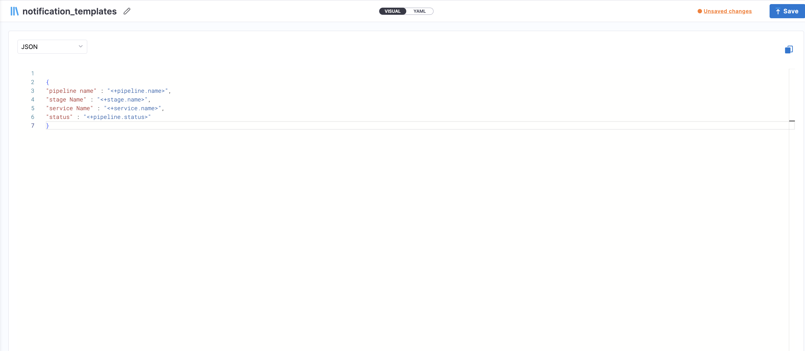

import Tabs from '@theme/Tabs';
import TabItem from '@theme/TabItem';

:::info note
Currently this feature is behind Feature Flag: `PIPE_CUSTOM_NOTIFICATION_TEMPLATES`
However, since this is supported for centralised notification, we need `PL_CENTRAL_NOTIFICATIONS` and `PIPE_CENTRALISED_NOTIFICATION` to be enabled first. Please contact [Harness support](mailto:support@harness.io) to enable this feature.
:::

Users can create custom notification templates, allowing them to customize notification content and reuse templates within **Centralized Pipeline Notifications**. Templates support Pipeline Expressions and RBAC controls, ensuring flexibility and security.

We are going to discuss setting up a notification for Pipeline Events using Custom Notification Templates, at a certain scope.

You can set up custom notification template for Pipeline notification at following [scope](https://developer.harness.io/docs/platform/role-based-access-control/rbac-in-harness/#permissions-hierarchy-scopes): **Account**, **Organization** and **Project Level**. 

## Setting Up Notifications Template

:::info note
1. Custom Notification templates will work only with Centralized Notifications. 
2. Custom Notification templates will work only for webhook notifications.
3. Custom Notification templates support usage of template variables.
4. Custom Notification templates will be an inline entity, meaning they cannot be stored in Git.
5. All Pipeline and Stage-level variables are supported. If an expression cannot be resolved, it will return an empty string.
```json
{
  "pipeline name": "pipeline",
  "stage name": "",
  "stage type": ""
}
```
6. Once a custom notification template is selected for a notification rule, it cannot be removed. Users must recreate the notification rule if they want to use a different template or remove it. A fix for this is expected by **February 20, 2025**.
:::

<Tabs>
<TabItem value="Interactive guide">

In this example, we are going to discuss setting up custom notification template for Pipeline at Project Level:-

<iframe 
  src="https://app.tango.us/app/embed/fc86f283-ef3a-4199-88a1-8de92b845754"
  style={{ minHeight: '960px', maxWidth: '800px', width: '100%' }}
  sandbox="allow-scripts allow-top-navigation-by-user-activation allow-popups allow-same-origin"
  security="restricted"
  title="Creating a Notification Template in Harness"
  width="100%" 
  height="100%" 
  referrerpolicy="strict-origin-when-cross-origin"
  frameborder="0" 
  webkitallowfullscreen="webkitallowfullscreen"
  mozallowfullscreen="mozallowfullscreen"
  allowfullscreen="allowfullscreen"
/>

</TabItem>

<TabItem value="Step-by-step">
In this example, we are going to discuss setting up custom notification template for Pipeline at Project Level:-

1. In your Harness, go to your project.
2. Select **Project Settings**, then, under **Project-level resources**, select **Templates**.
3. Select **+ New Template**, and then select **Notifications**. The **Create New Notifications Template** settings open.
4. In **Name**, enter a name for the template.
5. (Optional) Select the pencil icon to enter a **Description**.
6. (Optional) Select the pencil icon to add **Tags**.
7. In **Version Label**, enter the version of the template, for example, `v1`. Versioning a template enables you to create a new template without modifying the existing one. For more information, go to [Versioning](template.md).
8. In Text Type you can choose text type as **HTML**, **JSON**, **YAML** or **String** for content body.


9. When you select text type as per your need you will be asked to provide the body of notification template.



10. Click on **Save**.

Now, let's add this custom notification template to a notification rule at Project Level:-

:::info note
A template created at the Account level can be used for notification rules at Account, Org, or Project levels. Similarly, Org-level templates can be used at Org and Project levels.
:::

1. In Harness, go to **Project Settings**.
2. Under **General**, select **Notifications Management**. 
3. Under **Overview**, provide **Notification Name** and **Continue** to select Resource type.
4. Under **Resources**, Select Resource Type as **Pipeline**. 
5. Under **Condition** , select **+ Add Condition** to define pipeline events based on which you want to be notified.

Under events you can select the following **pipeline events**:-

1. Pipeline Start
2. Pipeline Success
3. Pipeline Failed
4. Stage Start
5. Stage Success
5. Stage Failed

:::info note
Stage start/success/failed events will apply to all stages within a pipeline. There is no option to configure notifications for specific stages. If you want stage-specific notifications, you can configure them via Pipeline-level notifications, but note that this does not support custom notification templates.
:::

Under **Create Condition** provide, Condition Name and **Select Pipeline Events**. Click on **Continue** to set channel where you want to send the notification.

6. Under **Notification Templates**, select your Notification template and select **Use Template** and click on **Continue**.

7. Under **Set Channels**, **Select Channels** where you want notification to be sent.

Under **Select Channel** you can chose the already created channel at that scope or you can create a [**New Channel**](/docs/platform/notifications/notification-settings.md).


8. Select **Submit** to save your notification configuration.


You can also view **Referenced By** in your Custom Notification Template to see notification rule it is attached to.


You can also check audit trail events for Custom Notification Template created. 


</TabItem>
</Tabs>

## Adding a Notification Rule in the Pipeline

You can add a notification rule while creating your pipeline. To do this, select the **Notify** tab on the vertical navigation bar to the left. This opens a **Custom Notifications** tab where you can apply a previously created notification template. Follow these steps:

1. Click on **+ Notification**.

2. On the **New Notification** page:
   - Under the **Overview** tab, provide a **name** for your notification.

3. Go to the **Pipeline Events** tab:
   - Select the pipeline events you want to receive notifications for.
   - You can also select **All Events** to receive notifications for all pipeline-related events.

4. In the **Notification Method** tab, choose the channel where you want to receive notifications:
   - **Email**: Enter individual email addresses or select a **User Group** to notify multiple recipients.
   - **Microsoft Teams**: Create an **incoming webhook** in your Teams channel and paste the **Webhook URL**. Harness can also notify Teams channels associated with selected user groups.
   - **Slack**: Add your **Slack Incoming Webhook URL**. Notifications can also be sent to Slack channels tied to user groups.
   - **PagerDuty**: Enter the integration key for a PagerDuty service. You can notify groups linked to the selected user groups.
   - **Webhook**: Provide a custom **Webhook URL** and optionally add **headers** to customize the request.

5. In the **Notification Templates** tab:
   - Select the notification template you created earlier.
   - If your template includes **runtime variables**, you will be prompted to resolve those values here.

   

6. In the **Select Connectivity Mode** section:
   - Choose either:
     - **Connect through Harness Platform**, or
     - **Connect through a Harness Delegate** (you’ll need to specify which delegate to use).

Click **Submit** to save your notification rule.

### Variables in the notification template.

### Variables in the Notification Template

Notification templates support **runtime variables** that can be resolved during pipeline configuration.

If a runtime variable is declared in a notification template, you will be prompted to **provide values** for it when selecting that template in the pipeline notification settings.

Use the following expression format to reference variables: `<+notification.variables.testVar>`

You can also access the event type that triggered the notification using: `<+notification.eventType>`


### Reconciliation of the Pipeline

If you update a notification template by adding more input variables **after it has already been used in a pipeline**, here’s how the reconciliation process works:

- When you go to run the pipeline, a **warning message** will appear on the Run dialog:
  > "Entities referenced in this pipeline have been updated. Please reconcile and save the pipeline to run the latest version."

  You can still proceed to run the pipeline, but any new variables introduced will default to an **empty string** unless resolved.

- Clicking **Reconcile** and saving the pipeline will update the YAML with the new variables, but it will **not resolve** the runtime values. These will still default to empty strings during execution.

- To **fully reconcile** and resolve new runtime inputs:
  1. Go to the **Notify** tab in the pipeline.
  2. Edit the notification step.
  3. Keep all current settings as-is until you reach the **Templates** tab.
  4. Reselect the **same notification template**.
  5. A pop-up will appear prompting you to **enter values** for the new runtime variables.

This ensures the pipeline is properly updated with the latest version of the notification template and that all required inputs are correctly resolved.

## YAML Structure

Below is an example of the YAML structure for a **Custom Notification Template** where the `type` of the content body is set to **YAML**

```yaml
template:
  name: sample_notification_template
  identifier: sample_notification_template
  versionLabel: v1
  type: Notification
  projectIdentifier: samples
  orgIdentifier: default
  tags: {}
  spec:
    body:
      content: |-
        {
            "pipeline name": "<+pipeline.name>",
            "description": "<+pipeline.description>",
            "eventType": "<+notification.eventType>",
            "runtime_var_1": "<+notification.variables.var1>"
        }
      type: YAML
    variables:
      - name: var1
        value: <+input>
        type: string

```

Pipeline YAML Using the Notification Template

You can reference this notification template from your pipeline YAML as follows: 

```yaml
notificationRules:
    - name: notify_demo
      identifier: notify_demo
      pipelineEvents:
        - type: PipelineStart
        - type: PipelineEnd
      notificationMethod:
        type: Webhook
        spec:
          webhookUrl: https://your/webhook/url
      enabled: true
      template:
        versionLabel: v1
        templateRef: sample_notification_template
        templateInputs:
          variables:
            - name: var1
              type: string
              value: test_val

```

## Sample JSON Response

Below is an example of the JSON response received when this notification is triggered:


## CD Events Schema

To align with the [CDEvents](https://cdevents.dev/) standard, Harness has contributed several notification templates to the public CD Events schema repository based on our supported events.

You can explore these templates here:  
🔗 [CD Events Schema on GitHub](https://github.com/harness/harness-schema/tree/main/cdevents)

The public repository includes a brief explanation of the schema, structure, and supported event types. If you think anything is missing or requires further clarification, feel free to raise a GitHub issue or contact us.