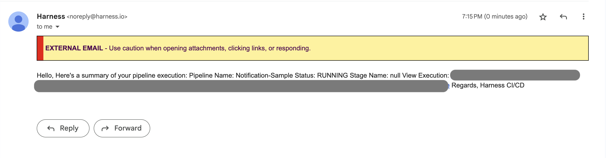
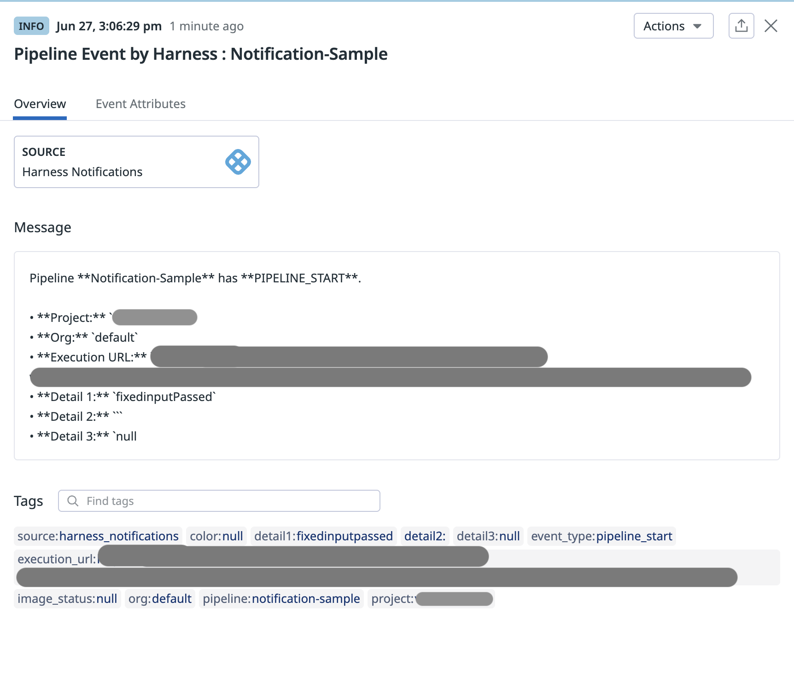
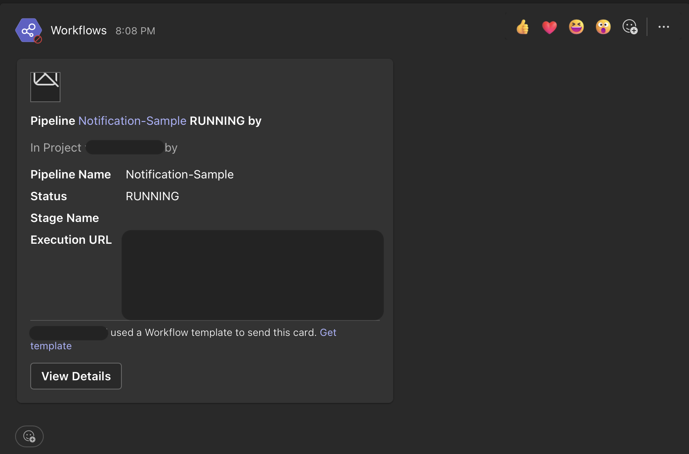
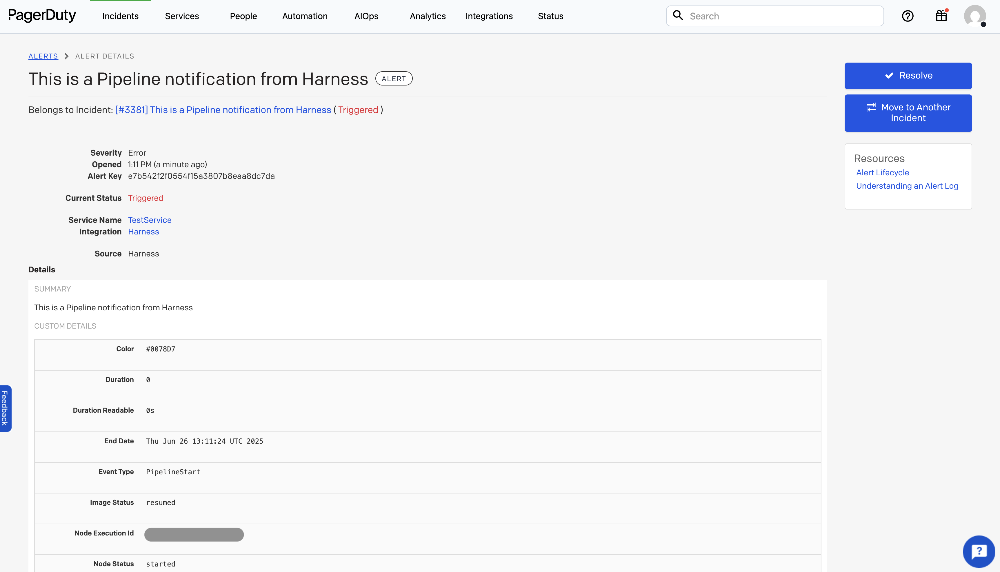

import Tabs from '@theme/Tabs';
import TabItem from '@theme/TabItem';

:::info note
Currently this feature is behind Feature Flag: `PIPE_CUSTOM_NOTIFICATION_TEMPLATES`
:::

You can create custom notification templates to customize notification content and reuse templates across **Centralized Pipeline Notifications**. These templates support Pipeline Expressions and RBAC controls, giving you both flexibility and security.

With this enhancement, you can **attach a custom notification template** to a notification rule and override the default message format with a custom webhook payload.

Custom templates let you:

- Control the structure and content of your notifications.
- Use dynamic expressions (such as pipeline or stage variables).
- Reuse templates across multiple pipelines and teams.

In this section, you'll learn how to set up notifications for pipeline events using custom notification templates at a specific scope.

You can create custom notification templates at the following [scopes](https://developer.harness.io/docs/platform/role-based-access-control/rbac-in-harness/#permissions-hierarchy-scopes): **Account**, **Organization**, and **Project**.

There are two ways to use custom notification templates:

- [**Centralized notifications for pipelines**](/docs/platform/notifications/centralised-notification)
- [**Pipeline notifications**](/docs/platform/notifications/notification-settings/#get-started-with-notifications)

## Setting Up Notifications Template

:::info note
- Custom Notification templates support usage of template variables.
- Custom Notification templates will be an inline entity, meaning they cannot be stored in Git.
- All Pipeline and Stage-level variables are supported. If an expression cannot be resolved, it will return an empty string.
```json
{
  "pipeline name": "pipeline",
  "stage name": "",
  "stage type": ""
}
```
:::

<Tabs>
<TabItem value="Interactive guide">

In this example, we are going to discuss setting up custom notification template for Pipeline at Project Level:-

<iframe 
  src="https://app.tango.us/app/embed/fc86f283-ef3a-4199-88a1-8de92b845754"
  style={{ minHeight: '800px'}}
  sandbox="allow-scripts allow-top-navigation-by-user-activation allow-popups allow-same-origin"
  security="restricted"
  title="Creating a Notification Template in Harness"
  width="100%" 
  height="100%" 
  referrerpolicy="strict-origin-when-cross-origin"
  frameborder="0" 
  webkitallowfullscreen="webkitallowfullscreen"
  mozallowfullscreen="mozallowfullscreen"
  allowfullscreen="allowfullscreen"
/>

</TabItem>

<TabItem value="Step-by-step">
In this example, we are going to discuss setting up custom notification template for Pipeline at Project Level:

1. In your Harness, go to your project.
2. Select **Project Settings**, then, under **Project-level resources**, select **Templates**.
3. Select **+ New Template**, and then select **Notifications**. The **Create New Notifications Template** settings open.
4. In **Name**, enter a name for the template.
5. (Optional) Select the pencil icon to enter a **Description**.
6. (Optional) Select the pencil icon to add **Tags**.
7. In **Version Label**, enter the version of the template, for example, `v1`. Versioning a template enables you to create a new template without modifying the existing one. For more information, go to [Versioning](template.md).
8. In Text Type you can choose text type as **HTML**, **JSON**, **YAML** or **String** for content body based on what notification method you are using.


9. When you select text type as per your need you will be asked to provide the body of notification template.
   :::info
   You can use **pipeline and stage-level expressions** in the body instead of hardcoded values. This enables dynamic content based on execution context.

   Stage-level expressions will only be resolved when the notification is triggered by stage-level events (e.g., Stage Success or Stage Failed)
   :::


10. Click on **Save**.


</TabItem>
</Tabs>

---

## Attaching a Custom Notification Template to Pipeline Notifications

Harness supports [adding notification rules to pipelines](/docs/platform/notifications/notification-settings/#add-a-notification-rule). With this enhancement, you can now **attach a custom notification template** to a pipeline notification rule to override the default message format and send custom webhook-based notifications.

You can also attach templates in [**centralized notification for pipeline events**](/docs/platform/notifications/centralised-notification)

This allows you to replace the default notification message with a tailored structure defined in your template, including any runtime variables or expressions you've configured.

### How to Attach a Template

When configuring a **pipeline-level notification rule**, click **Notify** in the right panel of the Pipeline Studio. Then, follow the steps for [Configure pipeline notifications](/docs/platform/notifications/notification-settings/#get-started-with-notifications) until you reach the **Notification Template** step.

Under the **Notification Template** section:

- Select your custom notification template.
- If the template includes **runtime variables**, you'll be prompted to provide values for those inputs.

  

Each notification method has a different payload format, so you’ll need to create a separate custom notification template for each method.

Here are the notification methods and their sample payload format:


<Tabs>
  <TabItem value="email" label="Email" default>

Here is a sample template for Email notification:

```yaml
template:
  name: email-template
  type: Notification
  projectIdentifier: samples
  orgIdentifier: default
  tags: {}
  spec:
    body:
      content: |
        subject: Harness Pipeline Notification
        body: |
          Hello,

          Here's a summary of your pipeline execution:

          Pipeline Name: <+pipeline.name>
          Status: <+pipeline.status>

          Stage Name: <+stage.name>

          View Execution:
          <+pipeline.executionUrl>


          Regards,
          Harness CI/CD
      type: YAML
    variables: []
  identifier: email-template
  versionLabel: v0
  ```

  Here's how the notification would look like when the above template is used in the notification rule:

  

  </TabItem>
  <TabItem value="datadog" label="Datadog">

Here is a sample template for Datadog notification:

```yaml
template:
  name: datadog-template
  identifier: datadog-template
  type: Notification
  projectIdentifier: samples
  orgIdentifier: default
  tags: {}
  spec:
    body:
      content: |
        {
          "title": "Pipeline Event by Harness : <+pipeline.name>",
          "text": "Pipeline **<+pipeline.name>** has **<+notification.eventType>**.\n\n• **Project:** `<+project.identifier>`\n• **Org:** `<+org.identifier>`\n• **Execution URL:** `<+pipeline.executionUrl>`\n• **Detail 1:** `<+notification.variables.var1>`\n• **Detail 2:** `<+notification.variables.var2>``\n• **Detail 3:** `<+notification.variables.var3>",
          "tags": [
            "pipeline:<+pipeline.name>",
            "project:<+project.identifier>",
            "org:<+org.identifier>",
            "execution_url:<+pipeline.executionUrl>",
            "event_type:<+notification.eventType>",
            "detail1:<+notification.variables.var1>",
            "detail2:<+notification.variables.var2>",
            "detail3:<+notification.variables.var3>",
            "image_status:<+notification.variables.imageStatus>",
            "color:<+notification.variables.color>"
          ],
          "aggregation_key": "<+pipeline.name>",
          "priority": "normal",
          "alert_type": "info",
          "source_type_name": "harness_notifications"
        }
      type: JSON
    variables:
      - name: var1
        value: fixedinputPassed
        type: string
      - name: var2
        value: <+input>
        type: string
      - name: var3
        value: <+stage.name>
        type: string
  versionLabel: v2
```
Here's how the notification would look like when the above template is used in the notification rule:



  </TabItem>

  <TabItem value="teams" label="Microsoft Teams">

Here is a sample template for Microsoft Teams notification:

```yaml
template:
  name: MSteamTemplate
  identifier: MSteamTemplate
  versionLabel: v0
  type: Notification
  projectIdentifier: samples
  orgIdentifier: default
  tags: {}
  spec:
    body:
      content: |
        {
          "type": "message",
          "attachments": [
            {
              "contentType": "application/vnd.microsoft.card.adaptive",
              "content": {
                "$schema": "http://adaptivecards.io/schemas/adaptive-card.json",
                "type": "AdaptiveCard",
                "version": "1.2",
                "body": [
                  {
                    "type": "Image",
                    "url": "https://s3.amazonaws.com/wings-assets/slackicons/${IMAGE_STATUS}.png",
                    "size": "Small"
                  },
                  {
                    "type": "TextBlock",
                    "size": "Medium",
                    "weight": "Bolder",
                    "text": "Pipeline [<+pipeline.name>](<+pipeline.executionUrl>) <+pipeline.status> by <+notification.variables.runtimeVar>",
                    "wrap": true
                  },
                  {
                    "type": "TextBlock",
                    "text": "In Project <+project.name> by <+notification.variables.runtimeVar>",
                    "isSubtle": true,
                    "wrap": true
                  },
                  {
                    "type": "FactSet",
                    "facts": [
                      {
                        "title": "Pipeline Name",
                        "value": "<+pipeline.name>"
                      },
                      {
                        "title": "Status",
                        "value": "<+pipeline.status>"
                      },
                      {
                        "title": "Stage Name",
                        "value": "<+stage.name>"
                      },
                      {
                        "title": "Execution URL",
                        "value": "<+pipeline.executionUrl>"
                      }
                    ]
                  }
                ],
                "actions": [
                  {
                    "type": "Action.OpenUrl",
                    "title": "View Details",
                    "url": "<+pipeline.executionUrl>"
                  }
                ]
              }
            }
          ]
        }
      type: JSON
    variables:
      - name: var1
        value: var1ValuePassed
        type: string
      - name: runtimeVar
        value: <+input>
        type: string
  description: This is a perfect template all details are provided and the view details (msteams) button will work.
```

Here's how the notification would look like when the above template is used in the notification rule:



  </TabItem>

  <TabItem value="slack" label="Slack">

Here is a sample template for Slack notification:

```yaml
template:
  name: SlackTemplate
  type: Notification
  projectIdentifier: samples
  orgIdentifier: default
  tags: {}
  spec:
    body:
      content: |2-
              {
                "text": "Hello, here's an update:",
                "username": "HarnessBot",
                "icon_emoji": ":robot_face:",
                "attachments": [
                  {
                    "fallback": "Notification fallback text",
                    "color": "#36a64f",
                    "pretext": "Pipeline Update",
                    "title": "Pipeline Execution Summary",
                    "fields": [
                      {
                        "title": "Pipeline Name",
                        "value": "<+pipeline.name>",
                        "short": true
                      },
                      {
                        "title": "Status",
                        "value": "<+pipeline.status>",
                        "short": true
                      },
                      {
                        "title": "Stage Name",
                        "value": "<+stage.name>",
                        "short": true
                      },
                      {
                        "title": "Execution URL",
                        "value": "<+pipeline.executionUrl>",
                        "short": false
                      },
                      {
                        "title": "Variables Tested",
                        "value": "var1: <+notification.variables.var1>\nvar2: <+notification.variables.var2>\nvar3: <+notification.variables.stageName>",
                        "short": false
                      }
                    ],
                    "footer": "Harness CI/CD"
                  }
                ]
              }
      type: JSON
    variables:
      - name: var1
        value: var1Passed
        type: string
      - name: var2
        value: <+input>
        type: string
      - name: stageName
        value: <+stage.name>
        type: string
  identifier: SlackTempUpdated
  versionLabel: v4
  ```

  Here's how the notification would look like when the above template is used in the notification rule:

  


  </TabItem>
  <TabItem value="pagerduty" label="PagerDuty">

Here is a sample template for PagerDuty notification:

```yaml
template:
  name: JsonPagerDuty
  identifier: JsonPagerDuty
  versionLabel: "1"
  type: Notification
  projectIdentifier: sample-project
  orgIdentifier: default
  tags: {}
  spec:
    body:
      content: |-
        {
                "summary": "This is a Pipeline notification from Harness",
                "link": {
                  "href": "harness.io",
                  "text": "Harness"
                }
              }
      type: JSON
    variables:
      - name: var1
        value: Harness
        type: string
```

Here's how the notification would look like when the above template is used in the notification rule:



  </TabItem>
  <TabItem value="webhook" label="Webhook">

Here is a sample template for Webhook notification:

```yaml
template:
  name: sample_notification_template
  identifier: sample_notification_template
  versionLabel: v1
  type: Notification
  projectIdentifier: samples
  orgIdentifier: default
  tags: {}
  spec:
    body:
      content: |-
        {
            "pipeline name": "<+pipeline.name>",
            "description": "<+pipeline.description>",
            "eventType": "<+notification.eventType>",
            "runtime_var_1": "<+notification.variables.var1>"
        }
      type: YAML
    variables:
      - name: var1
        value: <+input>
        type: string
```

Here's how the notification would look like when the above template is used in the notification rule:


  </TabItem>
</Tabs>


:::warning
Each notification method has its own payload format. Ensure that your custom template matches the expected format for the notification method you are using. Any mismatch in the payload format will result in the notification sent in the default format.
:::

Once applied, the custom template overrides the default webhook payload sent during pipeline execution.

## Variables in the Notification Template

Notification templates support **runtime inputs**, which must be provided when configuring a notification rule—whether at the **Centralised Notification Service (CNS)** level or the **pipeline** level.

If a runtime variable is declared in the template, you will be prompted to **enter values or expressions** for it when selecting that template during notification rule configuration.

Use the following expression format to reference these variables in your template body: `<+notification.variables.testVar>`

You can access the event type that triggered the notification using: `<+notification.eventType>`

In case of failure, you can use the expression `<+notification.errorMessage>` to view failure information for the pipeline/stage/step.

## Reconciliation of Notification Rules

If you update a notification template by **adding new runtime variables** after it has already been attached to a notification rule, you may need to reconcile the rule to ensure those inputs are provided during execution.

### Pipeline-level Notifications

When a template used in a **pipeline-level notification rule configured through the Custom Notification tab** is updated, a **warning message** will appear when you attempt to run the pipeline:

- "Entities referenced in this pipeline have been updated. Please reconcile and save the pipeline to run the latest version."

You can still proceed with the run, but any newly added variables will default to an **empty string** unless resolved.

To fully reconcile the rule with the latest version of the template, you need to **reselect the template** and **provide values** for the new inputs:

1. Go to the **Notify** tab in the pipeline.
2. Edit the notification rule.
3. Navigate to the **Templates** tab.
4. Reselect the **same notification template**.
5. A prompt will appear asking you to **enter values** for the new runtime variables.

This updates the pipeline YAML to reference the latest template version and ensures all required inputs are captured.

### Improved Reconciliation Flow (Feature Flag)

:::note 
This enhanced flow is available behind the feature flag `PIPE_NOTIFICATION_TEMPLATE_INPUT_VARIABLE_PROMPT_UI`. Contact [Harness Support](mailto:support@harness.io) to enable it.
:::

When the feature flag is enabled, pipeline reconciliation for updated notification templates follows an improved, UI-driven flow.

**What’s new:**

1. After a notification template is updated, pipelines referencing it show an inline error:

> **Some of the entities referenced in this pipeline have been updated.**


2. Click the **Reconcile** button shown in the pipeline editor.
3. A diff view opens, allowing you to review the updated template inputs. Confirm and save the pipeline.
4. A yellow banner appears:

> **Notification inputs in this pipeline have been updated. Please click the Notify tab to review and update them.**


5. Go to the **Notify** tab. The affected template will display a red warning:

> **Notification template inputs have been updated. Please update the notification template inputs.**


6. Click into the affected rule, navigate to the **Templates** tab, reselect the same notification template, and provide values for the new inputs.
7. Save the notification rule and then save the pipeline.

Once these steps are completed, the pipeline will be fully reconciled with the latest version of the notification template.

### Centralised Notifications

In **Centralised Notification rules**, no warning appears when you update a template. However, if a template has changes or new input variables, you can view all the impacted references in the **Referenced By** section of the template.

To fully reconcile the rule with the latest version of the template, you’ll still need to **reselect the template** and **provide values** for the new inputs.

Steps:

1. Go to **Notification Management** under Project/Org/Account Settings.
2. Edit the existing notification rule.
3. In the **Notification Templates** step, reselect the same template.
4. A prompt will appear for you to enter values for the newly added runtime variables.

This process ensures that all new inputs are captured and the rule remains valid.

---

By re-selecting the updated template in either case, you ensure your rule is aligned with the latest version and that all runtime inputs are explicitly provided.

## CD Events Schema

To align with the [CD Events](https://cdevents.dev/) standard, Harness has contributed several notification templates to the public CD Events schema repository based on our supported events.

You can explore these templates here:  
[CD Events Schema on GitHub](https://github.com/harness/harness-schema/tree/main/cdevents)

The public repository includes a brief explanation of the schema, structure, and supported event types. If you think anything is missing or requires further clarification, feel free to raise a GitHub issue or contact us.