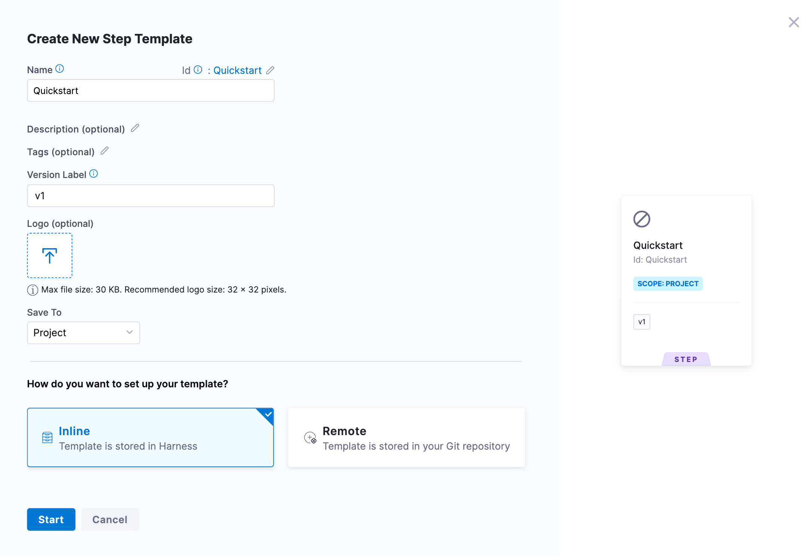
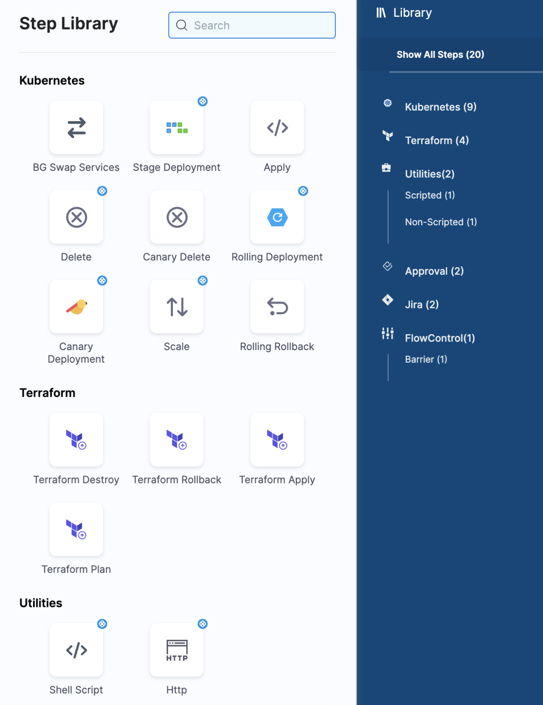
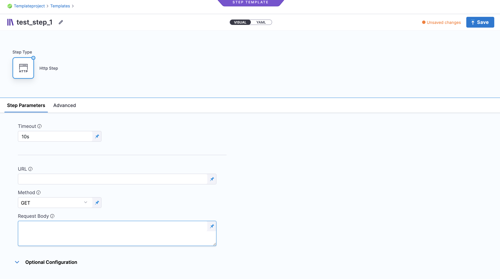
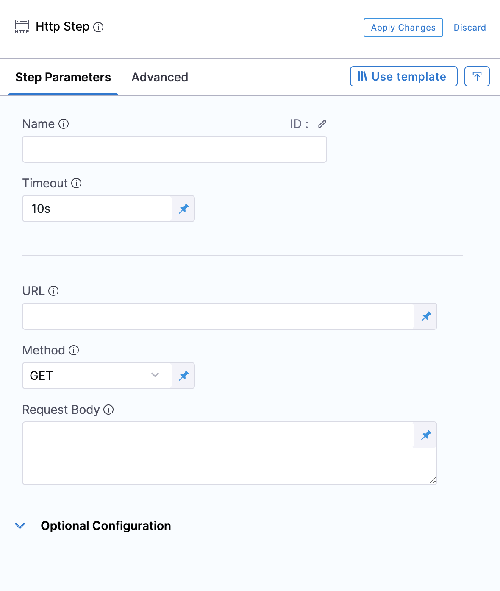

The Harness Template Library enables you to standardize and distribute reusable step templates across teams that use Harness.

This topic walks you through the steps to create an HTTP step template.

### Objectives

You'll learn how to: 

* Create an HTTP step template.
* Define template parameters.
* Use the HTTP step template in a pipeline.

### Before you begin

* Review the [Harness key concepts](../../first-gen/starthere-firstgen/harness-key-concepts.md).
* This topic adds an HTTP template to a CD Pipeline. If you are new to Harness CD, review the [CD tutorials](/tutorials/cd-pipelines).
* If you're using Harness CI, review the [CI tutorials](../../continuous-integration/get-started/tutorials.md).

### Step 1: Create a step template

You can create a step template from your account, org, or project. ​This topic explains the steps to create a step template from the project scope.

To create a inline step template from the project scope, do the following:

1. In your Harness, go to your project.
2. Select **Project Settings**, then, under **Project-level resources**, select **Templates**.
3. Select **+ New Template**, and then select **Step**. The **Create New Step Template** settings open.

   

4. In **Name**, enter a name for the template, for example `Quickstart`.
5. (Optional) Select the pencil icon to enter a **Description**.
6. (Optional) Select the pencil icon to add **Tags**.
7. In **Version Label**, enter a version for the template.​
8. Under **How do you want to set up your template?**, select **Inline**.
9. Click **Start**. The **Step Library** panel opens.

### Step 2: Add step parameters

To add step parameters, do the following:

1. Follow the steps above to create a template.
2. In **Step Library,** select **HTTP** under **Utilities**.

   

   The **Step Parameters** settings open.

   

3. In **Timeout**, enter a timeout value for this step. You can enter 10s.
4. In **URL**, enter the URL for the HTTP call.
5. In **Method**, select **GET**.
6. Select **Save**. The new template displays under the **Templates** list.

### Step 3: Add the HTTP step template to a pipeline

To add a step template in a pipeline execution, do the following:

1. In Harness, select your pipeline.
2. Select the step, and then select **Add Step**. The **Step Library** panel opens.
3. In **Step Library,** select **HTTP** under **Utilities**. The **HTTP Step** settings open.

   

4. Click **Use Template.** The next page lists all the Project-level templates.
5. Select the template that you created.

   

6. Select the **Activity Log** to track all template events. It shows you details like who created the template and template version changes.
7. In **Details**, from the **Version Label** list, select **Always use the stable version**.

   Selecting this option ensures that any changes that you make to this version are propagated automatically to the pipelines using this template.

8. Select **Use Template**.

   

9. In **Name**, enter `Quickstart`.

10. Under **Template Inputs**, select **Timeout**, and then select **Runtime input**.

11. Click URL and select **Runtime input**.

    **Use Runtime Inputs instead of variable expressions:** when you want to template settings in a stage or step template, use [Runtime inputs](../variables-and-expressions/runtime-inputs.md) instead of variable expressions. When Harness tries to resolve variable expressions to specific stage-level settings using fully-qualified names, it can cause issues at runtime. Every pipeline where the stage or step template is inserted must utilize the exact same names for fully-qualified name references to operate. With runtime inputs, you can supply values for a setting at deployment runtime.
   
12. Select **Apply Changes**.
13. Select **Save**.
