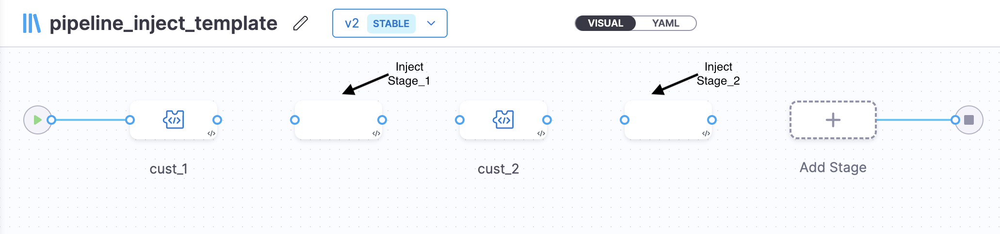
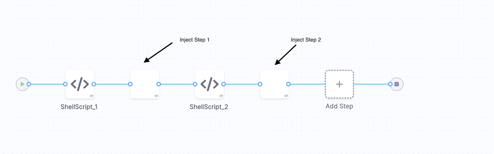
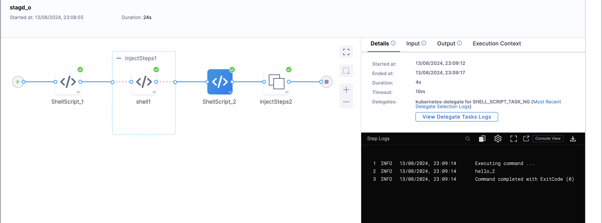
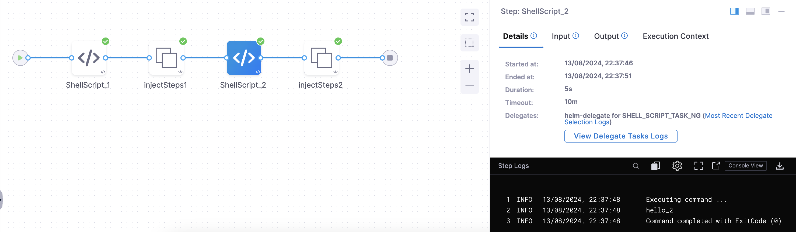

:::info note
Currently this feature is behind the feature flag `PIE_FLEXIBLE_TEMPLATES`. Please contact [Harness support](mailto:support@harness.io) to enable this feature.
:::

Inject blocks provide a way to customize pipelines without affecting the main template. 

Steps and stages included in the inject block will behave the same as normal steps and stages in the pipeline.

:::info note
Inject block is only supported for CD, Custom and Approval Stages.
:::

## Pros of Using Inject blocks in a template

- Only the Template Editor has the flexibility to allow additional steps or stages at any given point where they want.(At beginning of all steps/stage or at the end of all steps/stages or in between the steps/stages)
- The YAML would be very simple and incline with existing harness steps/stages YAML. Here the Inject is as simply a new type of step which starts with the key `inject`. 

Now, let's dive into who can add inject block in the pipeline and stage template and how other users can utilise it in their pipelines.

## Inject stage block in Pipeline Template

**Template editors** will be able to add inject stage block in the pipeline template at any position between a stage.




Sample YAML of a pipeline template with inject stage block will look like:

```yaml
template:
  name: pipeline_inject_template
  identifier: pipeline_inject_template
  versionLabel: v2
  type: Pipeline
  projectIdentifier: Inject_block
  orgIdentifier: default
  tags: {}
  spec:
    stages:
      - stage:
          name: cust_1
          identifier: cust_1
          description: ""
          type: Custom
          spec:
            execution:
              steps:
                - step:
                    type: ShellScript
                    name: ShellScript_1
                    identifier: ShellScript_1
                    spec:
                      shell: Bash
                      executionTarget: {}
                      source:
                        type: Inline
                        spec:
                          script: echo hello
                      environmentVariables: []
                      outputVariables: []
                    timeout: 10m
      - inject:
          identifier: injectStages1
          name: injectStages1
          stages: <+input>
          tags: {}
      - stage:
          name: cust_2
          identifier: cust_2
          description: ""
          type: Custom
          spec:
            execution:
              steps:
                - step:
                    type: ShellScript
                    name: ShellScript_1
                    identifier: ShellScript_1
                    spec:
                      shell: Bash
                      executionTarget: {}
                      source:
                        type: Inline
                        spec:
                          script: echo hello_2
                      environmentVariables: []
                      outputVariables: []
                    timeout: 10m
      - inject:
          identifier: injectStages2
          name: injectStages1
          stages: <+input>
          tags: {}
```

## Inject step block in Stage Template

Similarly, as a Template Editor you can add a inject step block in the stage template at any position between a step. 



Sample YAML of a stage template with an inject step block will look like:-

```yaml
template:
  name: stage_inject_template
  identifier: stage_inject_template
  versionLabel: v2
  type: Stage
  projectIdentifier: Inject_block
  orgIdentifier: default
  tags: {}
  spec:
    type: Custom
    spec:
      execution:
        steps:
          - step:
              type: ShellScript
              name: ShellScript_1
              identifier: ShellScript_1
              spec:
                shell: Bash
                executionTarget: {}
                source:
                  type: Inline
                  spec:
                    script: echo hello
                environmentVariables: []
                outputVariables: []
              timeout: 10m
          - inject:
              identifier: injectSteps1
              name: injectSteps1
              steps: <+input>
          - step:
              type: ShellScript
              name: ShellScript_2
              identifier: ShellScript_2
              spec:
                shell: Bash
                executionTarget: {}
                source:
                  type: Inline
                  spec:
                    script: echo hello_2
                environmentVariables: []
                outputVariables: []
              timeout: 10m
          - inject:
              identifier: injectSteps2
              name: injectSteps2
              steps: <+input>
```

This allows you, as the template editor, to maintain control over the template, ensuring its integrity is preserved. 

Now, if you use a template with a inject step/stage block in a pipeline, suppose you are using a pipeline template while creating a pipeline in a pipeline studio those inject stages will come under `templateInputs`. 

Sample YAML:

```yaml
pipeline:
  name: pipeline_inject_sample
  identifier: pipeline_inject_sample
  tags: {}
  template:
    templateRef: pipeline_inject_template
    versionLabel: v2
    templateInputs:
      stages:
        - inject:
            identifier: injectStages1
            stages: <+input>
        - inject:
            identifier: injectStages2
            stages: <+input>
  projectIdentifier: Inject_block
  orgIdentifier: default

```
In the above YAML as you can see, we have used pipeline template ` pipeline_inject_template` which are having two inject blocks and those inject blocks are under `templateInputs`.


**Template user** can add additional step and stage wherever an inject block has been defined. The inject block support inclusion of stages and steps along with runtime inputs, failure strategies, and conditional execution.

Consider a YAML using stage template in a pipeline with an inject step block:-

```yaml
pipeline:
  name: pipeline_sample
  identifier: pipeline_sample
  projectIdentifier: Krishika_test_autocreation
  orgIdentifier: default
  tags: {}
  stages:
    - stage:
        name: stage_1
        identifier: stage_1
        tags: {}
        template:
          templateRef: stage_inject_template
          versionLabel: v2
          templateInputs:
            type: Custom
            spec:
              execution:
                steps:
                  - inject:
                      identifier: injectSteps1
                      steps:
                        - parallel:
                            - step:
                                identifier: shell1
                                type: ShellScript
                                name: shell1
                                spec:
                                  shell: Bash
                                  executionTarget: {}
                                  source:
                                    type: Inline
                                    spec:
                                      script: echo hello_3
                                  environmentVariables: []
                                  outputVariables: []
                                timeout: 10m
                                failureStrategies:
                                  - onFailure:
                                      errors:
                                        - AllErrors
                                      action:
                                        type: Ignore
                  - inject:
                      identifier: injectSteps2
                      steps: <+input>
```

In this, under the first inject block we have added one Shell Script step. Now, when we run the pipeline the execution will look like :-



If no actions are provided in the inject block the pipeline will proceed without any additonal steps and stages. 

For example, in the below yaml, we have used this stage template  in the pipeline with 2 inject blocks and we have not added any additional steps in it:-

```yaml
pipeline:
  name: pipeline_inject_sample
  identifier: pipeline_inject_sample
  projectIdentifier: Krishika_test_autocreation
  orgIdentifier: default
  tags: {}
  stages:
    - stage:
        name: stage_1
        identifier: stagd_1
        tags: {}
        template:
          templateRef: stage_inject_template
          versionLabel: v2
          templateInputs:
            type: Custom
            spec:
              execution:
                steps:
                  - inject:
                      identifier: injectSteps1
                      steps: <+input>
                  - inject:
                      identifier: injectSteps2
                      steps: <+input>

```
Now when we will run the pipeline the execution will look like:-



If you will check the compiled YAML it will show the steps input as empty and thus will not fail the pipeline as well with a null error. 

:::info note
Inject block can not be output of any step. it has to be provided 
:::

## Expressions

If we intend to utilize expressions for the properties within the inject, it will be necessary to specify the complete path for each one.

Example: `<+execution.steps.inject1.steps.ShellScript_1.description>`


## What's Supported 

1. **Retry Failed Pipeline**

Retry from an injected stage will be supported. So basically when 2 or more stages are injected in the Pipeline-template by the inject block. And the 2nd stage(or any later) of the inject block has failed then we will allow to retry the failed execution from the 2nd stage or 1st stage of inject.

Let say We have a pipeline template with stages `stage_1`, `inject_1`(inject wrapper) and `stage_2`. And while referencing the template in pipeline, 2 stages `injected_stage_1` and `injected_stage_2` are injected in the template. So when the execution fails at stage `injected_stage_2`(or stage_2)  then users will have an option to retry the failed execution from `injected_stage_2` or `injected_stage_1`.

2. Selective stage execution

Users can select any individual stage of the inject wrapper to execute in the selective stage execution. 

Example: We have a pipeline-template with stages `stage_1`, `inject_1` and `stage_2`. And 2 more stages `injected_stage_1` and `injected_stage_2` have been injected in the template while referencing the template in the pipeline. So users will have an option to select any of the `injected_stage_1` or `injected_stage_2`(or both) for selective stage execution.

3. Rerun Single Stage 

Rerun of any of the injected stages during the rerun is allowed.

4. OPA Policy

OPA Policy is supported for Inject steps and stages.

## RBAC required 

* Users must possess the **Template Create/Edit** Permission in order to insert an inject block into the template at any desired location.
* In order to provide the steps/stages input to inject block when specifying runtime inputs in the pipeline, users must have **Pipeline Create/Edit** Permission. Otherwise, if they intend to provide input values in the parent template, **Template Create/Edit** Permission will be required.