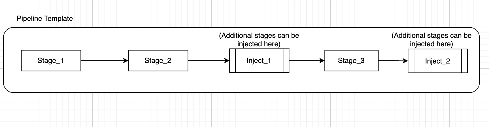
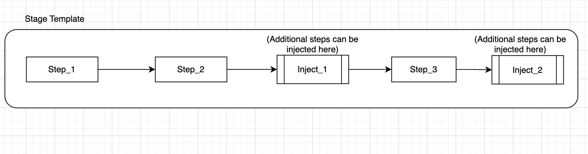

Inject blocks provide a way to customize pipelines without affecting the main template. They allow users to add extra stages or steps at specified points, maintaining the integrity of the original template.

Steps and stages included in the inject block will behave the same as normal steps and stages in the pipeline.

Template editors will be able to add inject block in the pipeline template at any position between a stage.

Similarly you can add a inject block in the stage template at any position between a step. 

