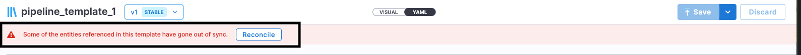
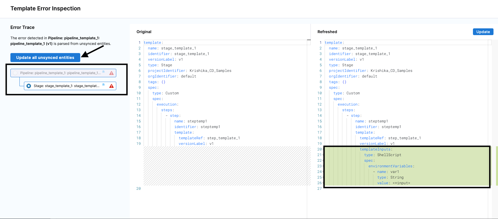
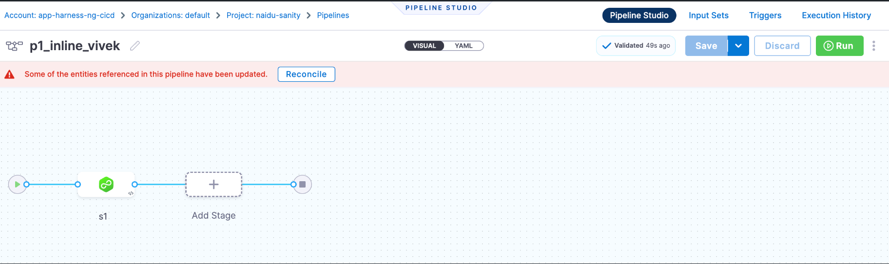

If any [entity](https://developer.harness.io/docs/platform/references/harness-entity-reference/) referenced in a pipeline is updated, Harness prompts you to update the pipeline if you're viewing the pipeline in Pipeline Studio. Harness detects updates made to the referenced entities using Pipeline Studio or YAML view. 

This process of updating the referenced entities in the pipeline is called pipeline reconciliation. It ensures that you are aware that referenced entities have updates and you can choose to integrate those changes into the pipeline. 

One of the most common example of pipeline reconciliation is when you increase or decrease the number of runtime inputs.

Let's consider a scenario with three templates: a pipeline template, a stage template, and a step template. In this scenario, the pipeline serves as the parent template, the stage is the pipeline's child template, and the step is the stage's child template.

**Step Template**
```yaml
template:
  name: step_template_1
  identifier: step_template_1
  versionLabel: v1
  type: Step
  projectIdentifier: Pipeline_Samples
  orgIdentifier: default1
  tags: {}
  spec:
    timeout: 10m
    type: ShellScript
    spec:
      shell: Bash
      executionTarget: {}
      delegateSelectors: []
      source:
        type: Inline
        spec:
          script: echo hello
      environmentVariables:
        - name: var1
          type: String
          value: val1
      outputVariables: []

```

**Stage Template**
```yaml
template:
  name: stage_template_1
  identifier: stage_template_1
  versionLabel: v1
  type: Stage
  projectIdentifier: Pipeline_Samples
  orgIdentifier: default
  tags: {}
  spec:
    type: Custom
    spec:
      execution:
        steps:
          - step:
              name: steptemp1
              identifier: steptemp1
              template:
                templateRef: step_template_1
                versionLabel: v1

```

**Pipeline Template**
```yaml
template:
  name: pipeline_template_1
  identifier: pipeline_template_1
  versionLabel: v1
  type: Pipeline
  projectIdentifier: Pipeline_Samples
  orgIdentifier: default
  tags: {}
  spec:
    stages:
      - stage:
          name: stagetemp1
          identifier: stagetemp1
          tags: {}
          template:
            templateRef: stage_template_1
            versionLabel: v1

```
In this pipeline template, both step and stage templates are utilized. In this example, when you update a variable at a step level, you changed the value of variable from ``Fixed value`` to ``Runtime input``.

**Step template**
```yaml
template:
  name: step_template_1
  identifier: step_template_1
  versionLabel: v1
  type: Step
  projectIdentifier: Pipeline_Samples
  orgIdentifier: default
  tags: {}
  spec:
    timeout: 10m
    type: ShellScript
    spec:
      shell: Bash
      executionTarget: {}
      delegateSelectors: []
      source:
        type: Inline
        spec:
          script: echo hello
      environmentVariables:
        - name: var1
          type: String
          value: <+input>
      outputVariables: []
```

When you update a child entity, the step template and the parent entities, i.e., stage and pipeline templates must be updated as well. In this scenario, the concept of reconciliation comes into play. 


When you move to the pipeline template, you can see the message: ``Some of the entities referenced in this template have gone out of sync.`` along with a ``Reconcile`` button.


Harness calls the refreshed YAML API `POST https://app.harness.io/template/api/refresh-template/refreshed-yaml` when you select the **Reconcile** option in **Pipeline Studio**. This API gets the latest pipeline YAML. Harness shows the difference between the original and the refreshed YAML in the UI on the Template Error Inspection page.



First, you will be asked to update the stage template, and then the pipeline template. You also have the option to ``Update all unsynced entities`` at once.
:::info note
Every reconciliation requires saving the pipeline. Specifically, if the pipeline is remote, you must to do a ``git push`` every time to ensure that the latest version of the pipeline is saved.
:::

Pipeline reconciliation allows you to add or remove ``allowed values`` to your runtime inputs. However, if you add new allowed values to the parent entity, it will not allow the same. Parent entity can have subset of allowed values that are present in child entity.

For example, You have a pipeline that uses a stage and step template. 

Step template
```yaml
template:
  name: step_template_1
  identifier: step_template_1
  versionLabel: v1
  type: Step
  projectIdentifier: CD_Samples
  orgIdentifier: default
  tags: {}
  spec:
    timeout: 10m
    type: ShellScript
    spec:
      shell: Bash
      executionTarget: {}
      delegateSelectors: []
      source:
        type: Inline
        spec:
          script: echo hello
      environmentVariables:
        - name: var1
          type: String
          value: <+input>.allowedValues(a,b,c,d)
      outputVariables: []

```

The parent entities like stage or pipeline can have subsets of the above mentioned ``allowed values``. But, if you add a new value, for example,``e`` in the parent entity, then it won't allow you to add the same since the child entity in the step template doesn't have that updated value in it's allowed value. The parent entity in the above scenario picks up allowed values from the child entity. 

## How Harness detects changes

Harness APIs detect pipeline template changes that require reconciliation. Harness warns you in the UI when a pipeline references a template with updated entities you must reconcile.



Harness calls the Validate template inputs API `GET https://app.harness.io/pipeline/api/refresh-template/validate-template-inputs` when you select the **Reconcile** option in the **Pipeline Studio**. For more information, go to [Validate template inputs](https://apidocs.harness.io/tag/Pipeline-Refresh#operation/validateTemplateInputs) in the API documentation.

When you save pipeline changes, the Validate pipeline API `POST https://app.harness.io/pipeline/api/pipelines/{pipelineIdentifier}/validate` starts an asynchronous pipeline validation. The same flow is also executed when you view a pipeline (by making a GET call from the Pipelines list page). The YAML is fetched from the cache, so the results may not be the latest.

Harness fetches the response of the validation event from the Get Pipeline validation event data API `GET https://app.harness.io/pipeline/api/pipelines/validate/{uuid}`. This API includes the information to determine whether reconciliation is required.


## What changes are shown

When reconciling a pipeline, Harness shows you the diff between the current YAML configuration and the updated YAML configuration. 

The diff shows only those changes that involve runtime inputs. The following list illustrates the updates that Harness highlights in the diff:

- A field requiring a runtime input was added. This includes scenarios in which the referenced entity was updated to reference another entity, and this change introduced runtime inputs to the configuration (for example, a referenced service was updated to use an artifact source template, and the source template requires runtime inputs). 

  The converse is true: a field requiring a runtime input is removed, either directly or by the removal of a referenced entity such as the artifact source template in the previous example.

- A field's value type was changed from a fixed value or expression to a runtime input, or from a runtime input to a fixed value or expression.


## Resolve conflicts in the pipeline YAML

Harness warns you when a pipeline references a template that needs to be reconciled when you change it.

To resolve conflicts in the pipeline YAML, do the following:

1. In the **Pipeline Studio**, select **Reconcile**. The Template Error Inspection page opens.

   You can view the Git YAML differences for the pipeline and see which lines have been modified. The differences are calculated based on the data, not exact string matches. Therefore, a different quote symbol, such as, `"` versus `'` for the same value might not be recognized as a difference. This is not an issue or error.

2. Update the YAML with the required changes.

3. Select **Save**. Harness reconciles the change, making it the default state.
 
   Harness calls the update pipeline API `PUT https://app.harness.io/pipeline/api/pipelines/{pipelineIdentifier}`, and saves the updated YAML.
