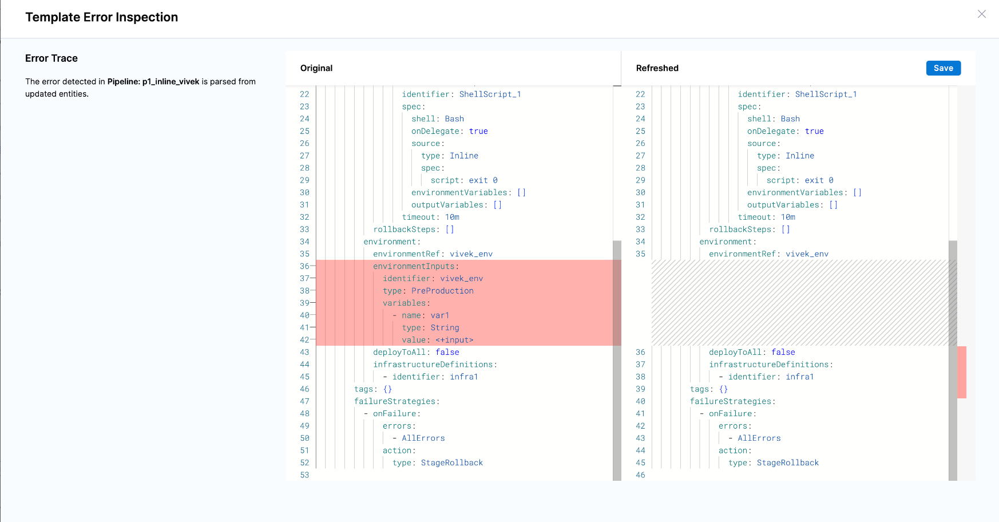

Harness detects updates made to referenced entities if those updates are made outside of Pipeline Studio. When you are viewing a pipeline in Pipeline Studio, if a referenced entity has an update, Harness informs you and prompts you to update the pipeline. This process of updating the referenced entities in the pipeline is called pipeline reconciliation. The process ensures that you are aware that referenced entities have updates, and you can choose to integrate those changes into the pipeline.

For example, consider that a CD stage in a pipeline references an environment. If you update the environment on the Environment tab and not in Pipeline Studio, Harness prompts you to reconcile the pipeline.

## How Harness detects changes

Harness APIs detect pipeline template changes that require reconciliation. Harness warns you in the UI when a pipeline references a template with updated entities you must reconcile.

Harness calls the Validate template inputs API `GET https://app.harness.io/pipeline/api/refresh-template/validate-template-inputs` when you select the **Reconcile** option in the **Pipeline Studio**. For more information, go to [Validate template inputs](https://apidocs.harness.io/tag/Pipeline-Refresh#operation/validateTemplateInputs) in the API documentation.

When you save pipeline changes, the Validate pipeline API `POST https://app.harness.io/pipeline/api/pipelines/{pipelineIdentifier}/validate` starts an asynchronous pipeline validation. The same flow is also executed when you view a pipeline (by making a GET call from the Pipelines list page). The YAML is fetched from the cache, so the results may not be the latest.

Harness fetches the response of the validation event from the Get Pipeline validation event data API `GET https://app.harness.io/pipeline/api/pipelines/validate/{uuid}`. This API includes the information to determine whether reconciliation is required.

## How Harness gets the latest pipeline YAML

Harness calls the refreshed YAML API `POST https://app.harness.io/template/api/refresh-template/refreshed-yaml` when you select the **Reconcile** option in the **Pipeline Studio**. This API gets the latest pipeline YAML. Harness shows the differences between the original and the refreshed YAML in the UI on the Template Error Inspection page.

## What changes are shown

When reconciling a pipeline, Harness shows you the diff between the current YAML configuration and the updated YAML configuration. 

The diff shows only those changes that involve runtime inputs. The following list illustrates the updates that Harness highlights in the diff:

- A field requiring a runtime input was added. This includes scenarios in which the referenced entity was updated to reference another entity, and this change introduced runtime inputs to the configuration (for example, a referenced service was updated to use an artifact source template, and the source template requires runtime inputs). 

  The converse is true: a field requiring a runtime input is removed, either directly or by the removal of a referenced entity such as the artifact source template in the previous example.

- A field's value type was changed from a fixed value or expression to a runtime input, or from a runtime input to a fixed value or expression.

## Resolve conflicts in the pipeline YAML

Harness warns you when a pipeline references a template that needs to be reconciled when you change it.

To resolve conflicts in the pipeline YAML, do the following:

1. In the **Pipeline Studio**, select **Reconcile**. The Template Error Inspection page opens.

   You can view the Git YAML differences for the pipeline and see which lines have been modified. The differences are calculated based on the data, not exact string matches. Therefore, a different quote symbol, such as, `"` versus `'` for the same value might not be recognized as a difference. This is not an issue or error.

2. Update the YAML with the required changes.

3. Select **Save**. Harness reconciles the change, making it the default state.
 
   Harness calls the update pipeline API `PUT https://app.harness.io/pipeline/api/pipelines/{pipelineIdentifier}`, and saves the updated YAML.
