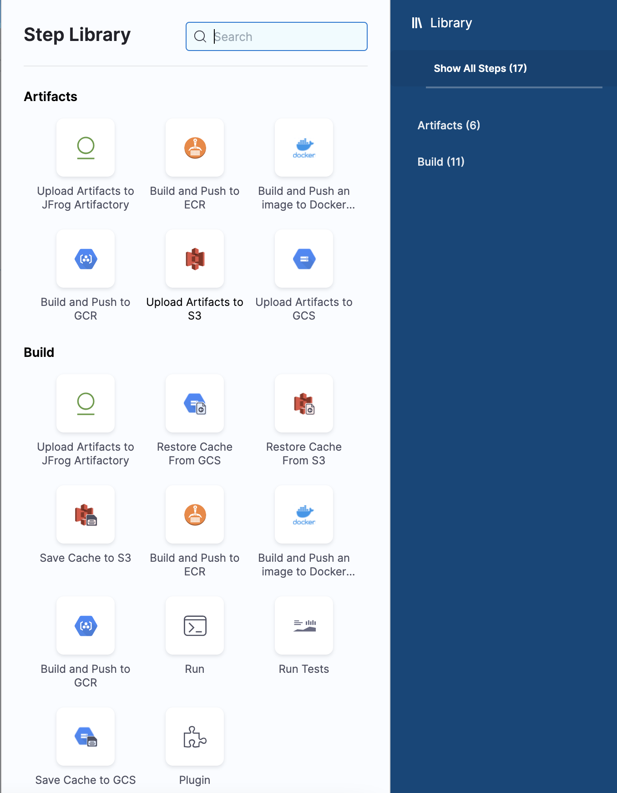
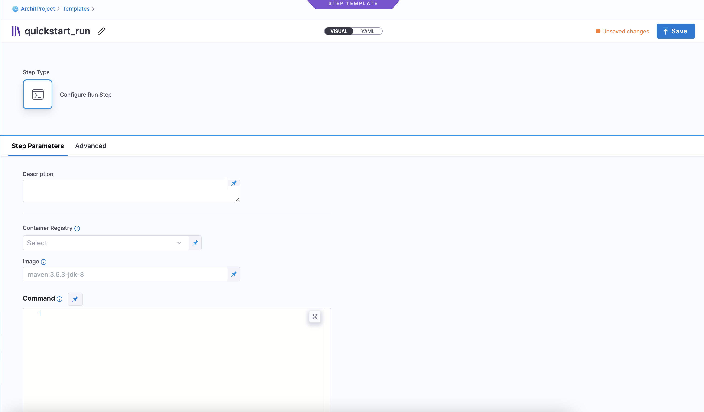
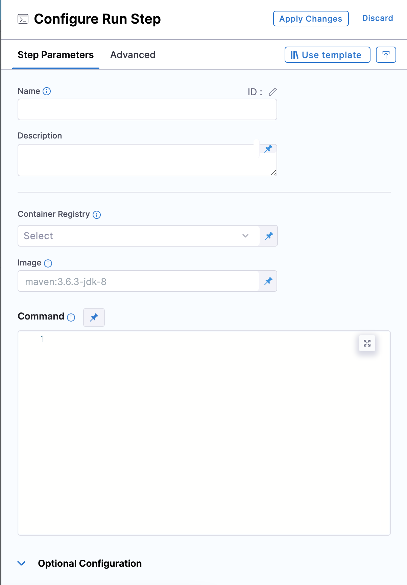
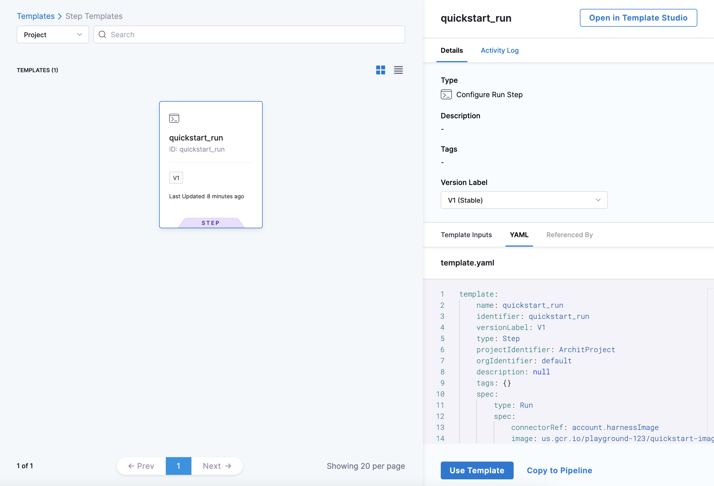
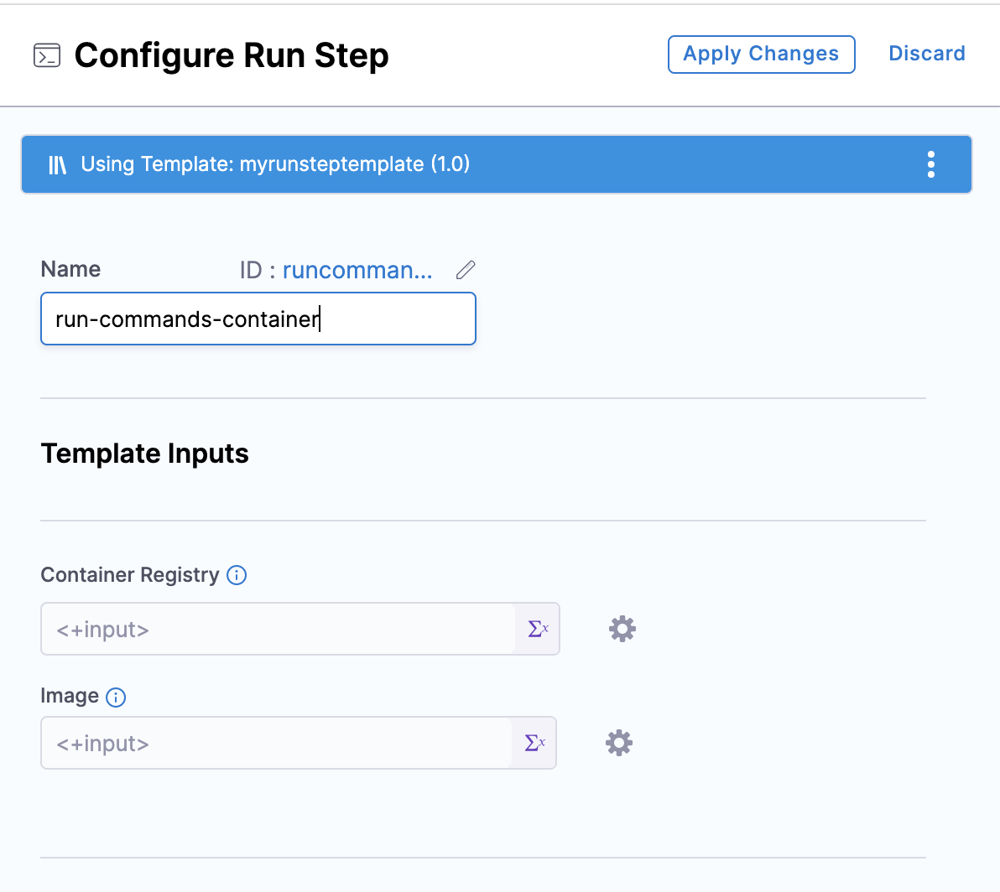

The Harness Template Library enables you to standardize and create step templates that can be re-used across pipelines and teams that use Harness.

This topic walks you through the steps to create a Run step template.

### Objectives

You'll learn how to: 

* Create a Run step template.
* Define template parameters.
* Use the run step template in a pipeline.

### Before you begin

* Review the [Harness Key Concepts](../../first-gen/starthere-firstgen/harness-key-concepts.md).
* This topic adds a Run template to a CD pipeline. If you are new to Harness CD, review the [CD tutorials](/tutorials/cd-pipelines).
* If you're using Harness CI, review the [CI tutorials](../../continuous-integration/get-started/tutorials.md).

### Step 1: Create a template

You can create a step template from your account, org, or project. ​This topic explains the steps to create a step template from the project scope.

To create a inline step template from the project scope, do the following:

1. In your Harness, go to your project.
2. Select **Project Settings**, then, under **Project-level resources**, select **Templates**.
3. Select **+ New Template**, and then select **Step**. The **Create New Step Template** settings open.
4. In **Name**, enter a name for the template.​
5. (Optional) Select the pencil icon to enter a **Description**.
6. (Optional) Select the pencil icon to add **Tags**.
7. In **Version Label**, enter the version of the stage, for example, `v1`. Versioning a template enables you to create a new template without modifying the existing one. For more information, go to [Versioning](template.md).
8. Under **How do you want to set up your template?**, select **Inline**.
9. Select **Start**. The **Step Library** panel opens.

### Step 2: Add step parameters

To add step parameters, do the following:

1. Follow the steps above to create a template.
2. In **Step Library,** select **Run** under **Build**.

   

   The **Step Parameters** settings open.

   

3. Select **Container Registry**, and then select **Runtime input**, which lets you add values when you start a pipeline execution.
4. In **Image,** select **Runtime input**. You can use any Docker image from any Docker registry, including private registries.
5. In **Command**, select **Runtime input**.
6. Select **Save**. The new template displays under the **Templates** list.

   **Use Runtime Inputs instead of variable expressions:** when you want to template settings in a Stage or step template, use [Runtime inputs](../variables-and-expressions/runtime-inputs.md) instead of variable expressions. When Harness tries to resolve variable expressions to specific stage-level settings using fully-qualified names, it can cause issues at runtime. Every pipeline where the stage or step template is inserted must utilize the exact same names for fully-qualified name references to operate. With runtime inputs, you can supply values for a setting at deployment runtime.

### Step 3: Add the run step template to a pipeline

To add the run step template to a pipeline, do the following:

1. Follow the steps above to create a template.
2. Go to your pipeline, and then select **Add Step**. The **Step Library** panel opens.
3. In **Step Library,** select **Run** under **Build**. The **Configure Run** **Step** settings open.

   

4. Select **Use Template.** The next page lists all the project-level templates.

5. Select the template that you created.

   

6. Select the **Activity Log** to track all template events. It shows you details like who created the template and template version changes.

7. In **Details**, from the **Version Label** list, select **Always use the stable version**. This ensures that any changes that you make to this version are propagated automatically to the pipelines using this template.

8. Select **Use Template**.

   

9. In **Container Registry**, select **Runtime input**.
10. In **Image**, select **Runtime input**.
11. In **Command**, select **Runtime input**.
12. Select **Apply Changes**.
13. Click **Save**.
