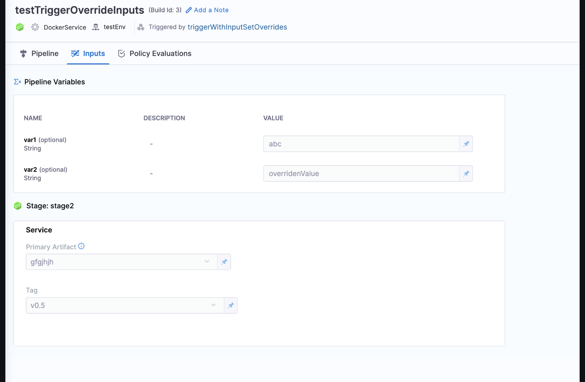
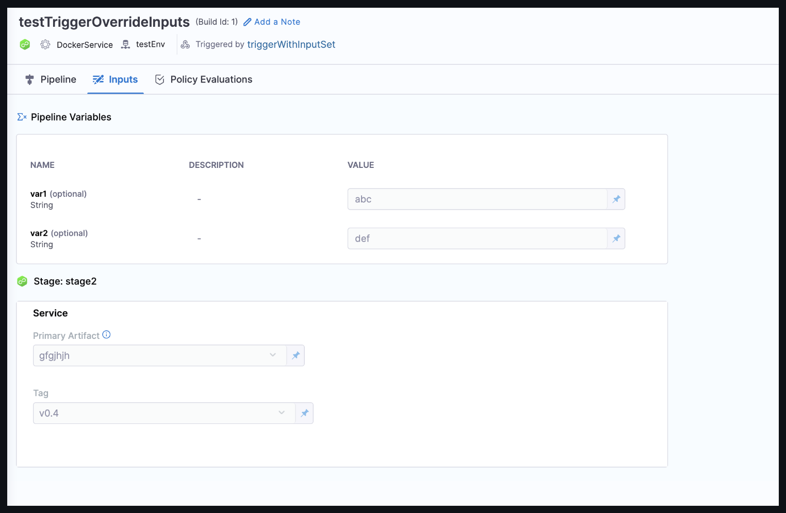

Suppose you have a CD pipeline with three different stages, each intended for a different environment. You wish to deploy one stage manually and the others via triggers. In an ideal scenario, you would create different input sets for each environment. However, managing numerous input sets with only one or two variable changes can be tedious and prone to mistakes.
To address this, overriding input YAML provides the flexibility to change  a specific parameter in the associated ``Input Set``.

:::note
You can only customize parameters using YAML in this setup.
:::
Let's go through the feature with an example:


Suppose you have a trigger referring to an Input set `myInputSet` :
```
 trigger:
  name: triggerWithInputSet
  identifier: triggerWithInputSet
  enabled: true
  description: ""
  tags: {}
  stagesToExecute: []
  orgIdentifier: default
  projectIdentifier: test
  pipelineIdentifier: testTriggerOverrideInputs
  source:
    type: Webhook
    spec:
      type: Custom
      spec:
        payloadConditions: []
        headerConditions: []
  inputSetRefs:
    - myInputSet
```

Input Set:
```
inputSet:
  name: myInputSet
  tags: {}
  identifier: myInputSet
  orgIdentifier: default
  projectIdentifier: test
  pipeline:
    identifier: testTriggerOverrideInputs
    stages:
      - stage:
          identifier: stage2
          type: Deployment
          spec:
            service:
              serviceInputs:
                serviceDefinition:
                  type: Kubernetes
                  spec:
                    artifacts:
                      primary:
                        primaryArtifactRef: gfgjhjh
                        sources:
                          - identifier: gfgjhjh
                            type: Gcr
                            spec:
                              tag: v0.4
    variables:
      - name: var1
        type: String
        value: abc
      - name: var2
        type: String
        value: def
```
We observe that the artifact tag, as well as var1 and var2 are coming from the input set.



If you want to change the tag to ``v0.5`` during the pipeline trigger execution, you can define an ``inputYaml`` in the trigger YAML. The inputYaml is similar to the Input set YAML; you only need to modify the value of the variable you want to override.

```yaml
trigger:
  name: triggerWithInputSetOverrides
  identifier: triggerWithInputSetOverrides
  enabled: true
  description: ""
  tags: {}
  stagesToExecute: []
  orgIdentifier: default
  projectIdentifier: test
  pipelineIdentifier: testTriggerOverrideInputs
  source:
    type: Webhook
    spec:
      type: Custom
      spec:
        payloadConditions: []
        headerConditions: []
  inputSetRefs:
    - myInputSet
  inputYaml: |
    pipeline:
      identifier: triggerWithInputSetOverrides
      stages:
        - stage:
            identifier: stage2
            type: Deployment
            spec:
              service:
                serviceInputs:
                  serviceDefinition:
                    type: Kubernetes
                    spec:
                      artifacts:
                        primary:
                          primaryArtifactRef: gfgjhjh
                          sources:
                            - identifier: gfgjhjh
                              type: Gcr
                              spec:
                                tag: v0.5
      variables:
        - name: var2
          type: String
          value: overridenValue
```


We observe that the artifact tag and ``var2`` are coming from the override inputs. ``var1`` is still coming from the input set, since we didn't override it in the trigger's YAML.


:::info note
1. When ``inputYaml`` is provided, the user-supplied values take precedence over all other configurations. In other words, any values specified in the  ``inputYaml`` section will override and take preference over the corresponding values in the Input Set.
2. It's crucial to structure the ``inputYaml`` similarly to what is defined in the Pipeline Input Set. Additionally, ensure that you provide the correct pipeline, stage, or step ``identifier``.
3. If you have an array structure in the Input YAML and need to override one of its values you need to provide the entire array structure in the input YAML, you cannot override only one part of the array.
:::
