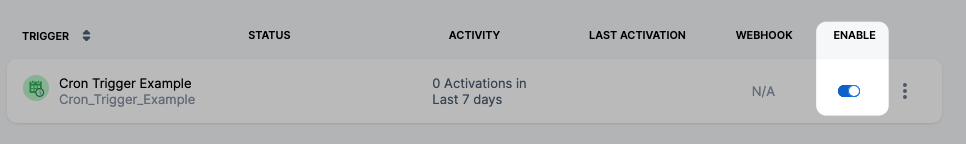
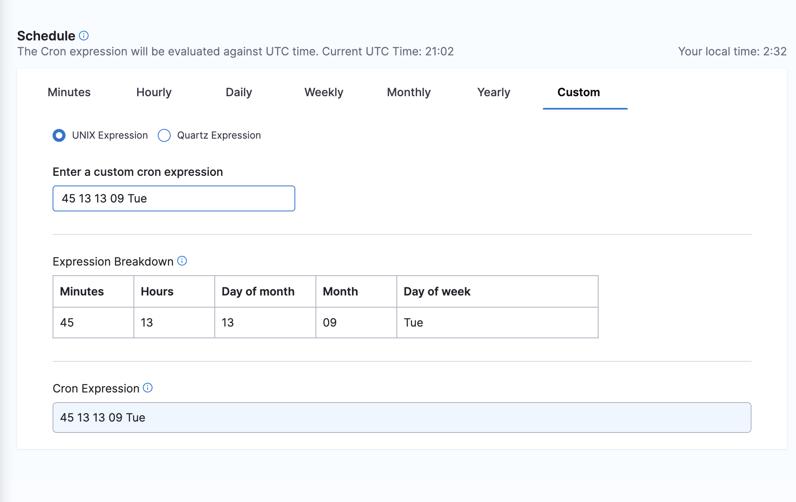

You can use cron triggers to schedule pipeline executions. For example, to schedule a pipeline run every Monday at 1AM, Harness uses the cron expression `0 1 * * MON`. For information about other trigger types and triggers in general, go to the [Triggers overview](./triggers-overview).

This topic assumes you're familiar with [Harness' key concepts](/docs/platform/get-started/key-concepts.md) and that you have created a Harness CI or CD pipeline.

import Variables from '/docs/platform/shared/variables-not-supported.md'

<Variables />

### Add a trigger to a pipeline

Open your Harness pipeline in Pipeline Studio.

1. Select **Triggers**.
2. Select **New Trigger**.
3. Select **Cron**.
   For Git-based trigger types or CodeCommit, go to [Trigger Pipelines using Git Events](triggering-pipelines.md).
4. In **Trigger Overview**, enter a name, description, and tags for the trigger.

### Schedule the trigger

In **Schedule**, use the settings to schedule the trigger.

When you edit a Cron trigger later, you can type or paste in a Cron expression.

The Cron expression will be evaluated against UTC time.

There are two types of supported cron expressions, QUARTZ and UNIX.

Following are the QUARTZ and UNIX expression formatting samples:

QUARTZ Expression
```
0 0 4 7 ? 2014
| | | |   | |
| | | |   | \------- YEAR (2014)
| | | |   \--------- DAY_OF_WEEK (NOT_SPECIFIED)
| | | \------------- MONTH (JULY)
| | \--------------- DAY_OF_MONTH (4th)
| \----------------- HOUR (0- MIDNIGHT LOCAL TIME)
\------------------- MINUTE (0)
```

UNIX Expression

```
5 0 * * 5
| | | | |
| | | | \-------DAY_OF_WEEK (Friday)
| | | \---------MONTH (Any month)
| | \-----------DAY_OF_MONTH (Any day of the month)
| \-------------HOUR(0- MIDNIGHT LOCAL TIME)
\---------------MINUTE(5)
```

### Set pipeline input

Pipelines often have [Runtime inputs](../variables-and-expressions/runtime-inputs.md) like codebase branch names or artifact versions and tags.

Provide values for the inputs. You can also use [Input sets](../pipelines/input-sets.md).

Select **Create Trigger**.

The Trigger is now added to the **Triggers** page.

### Enable or disable trigger

Use the enable setting to turn the trigger on and off.



Your pipeline will run when the Cron expression equals the current time.

### Run once

To specify a run-once schedule, specify a fully qualified date and time.

Enter the time, day of month, month, and then allow for any day of the week.

The below example runs on **At 1:45 PM, on day 13 of the month, and on Tuesday, only in September**

`45 13 13 09 Tue`


