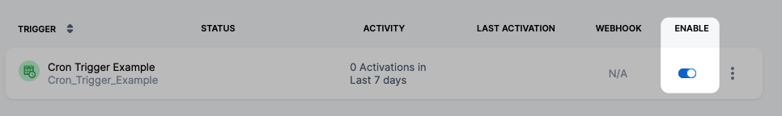
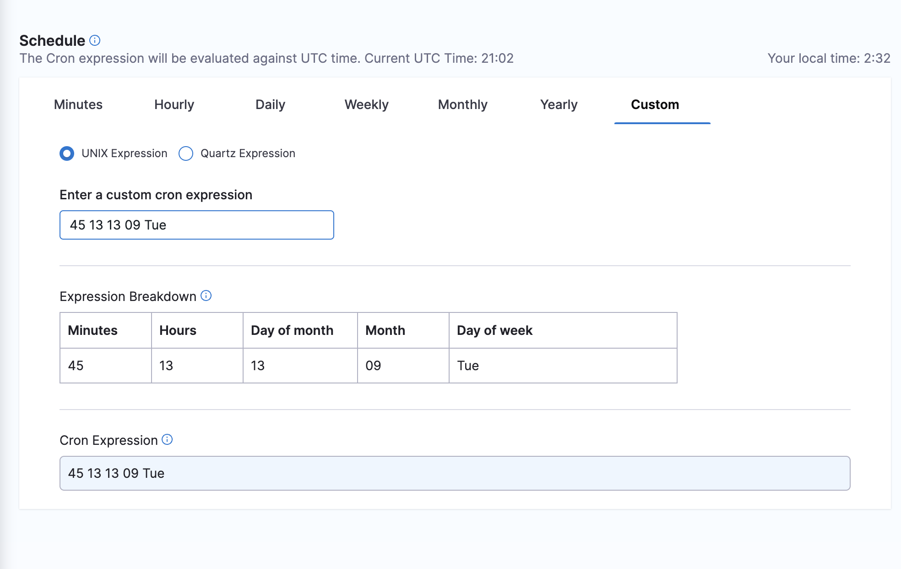

You can use cron triggers to schedule pipeline executions. For example, to schedule a pipeline run every Monday at 1AM, Harness uses the cron expression `0 1 * * MON`. For information about other trigger types and triggers in general, go to the [Triggers overview](./triggers-overview).

:::note
The cron expression will be evaluated in UTC time. Only UTC timezone is supported. It does not automatically adjust for daylight saving time (DST) and must be explicitly configured with the correct date and time in UTC.
:::

This topic assumes you're familiar with [Harness' key concepts](/docs/platform/get-started/key-concepts.md) and that you have created a Harness CI or CD pipeline.

import Variables from '/docs/platform/shared/variables-not-supported.md'

<Variables />

### Add a trigger to a pipeline

Open your Harness pipeline in Pipeline Studio.

1. Select **Triggers**.
2. Select **New Trigger**.
3. Select **Cron**.
   For Git-based trigger types or CodeCommit, go to [Trigger Pipelines using Git Events](triggering-pipelines.md).
4. In **Trigger Overview**, enter a name, description, and tags for the trigger.

### Schedule the trigger

In **Schedule**, use the settings to schedule the trigger.

**Timezone**: Select the timezone in which the cron expression should be evaluated. Harness supports the [IANA Time Zone convention](https://timeapi.io/documentation/iana-timezones#), such as `America/New_York`, `Asia/Kolkata`, or `Europe/London`. The default timezone is `UTC`.


<details>
<summary>Sample YAML with timezone</summary>

Here is a sample YAML for a cron trigger with a timezone setting, with timezone set to `America/New_York`:

```yaml
  source:
    type: Scheduled
    spec:
      type: Cron
      spec:
        expression: 0/5 * * * *
        type: UNIX
        timezone: America/New_York
```

</details>

:::note
Currently, the timezone setting is behind the feature flag `PIPE_SUPPORT_MULTIPLE_TIMEZONES_IN_CRON_TRIGGERS`. Contact [Harness Support](mailto:support@harness.io) to enable the feature.
:::

If the feature flag is not enabled, the cron expression will always be evaluated against `UTC` time.

When you edit a Cron trigger later, you can type or paste in a Cron expression.

There are two types of supported cron expressions, QUARTZ and UNIX.

Following are the QUARTZ and UNIX expression formatting samples:

QUARTZ Expression
```
0 0 4 7 ? 2014
| | | |   | |
| | | |   | \------- YEAR (2014)
| | | |   \--------- DAY_OF_WEEK (NOT_SPECIFIED)
| | | \------------- MONTH (JULY)
| | \--------------- DAY_OF_MONTH (4th)
| \----------------- HOUR (0- MIDNIGHT LOCAL TIME)
\------------------- MINUTE (0)
```

UNIX Expression

```
5 0 * * 5
| | | | |
| | | | \-------DAY_OF_WEEK (Friday)
| | | \---------MONTH (Any month)
| | \-----------DAY_OF_MONTH (Any day of the month)
| \-------------HOUR(0- MIDNIGHT LOCAL TIME)
\---------------MINUTE(5)
```

### Complex cron expressions with date and day constraints

:::note
This feature is behind the feature flag `PIPE_CRON_TRIGGER_AND_SEMANTICS`. Contact [Harness Support](mailto:support@harness.io) to enable the feature.
:::

Harness supports complex cron trigger expressions that execute pipelines only when both date range and day-of-week conditions are satisfied simultaneously. This enables more precise scheduling for scenarios where you need executions on specific days within specific date ranges.

Standard cron behavior uses OR semantics when both day-of-month and day-of-week are specified. For example, a cron expression like `0 3 16-22 * 1` would trigger at 3:00 AM UTC on **every Monday** OR **any day between the 16th and 22nd**. With AND semantics enabled, the pipeline executes only when it's a Monday **and** the date falls between the 16th and 22nd of the month.

#### Use cases

Complex cron expressions with AND semantics are useful for:

- Running monthly maintenance tasks on specific weekdays within a date window (for example, the third Monday of each month)
- Scheduling deployments during defined change windows that must occur on particular days
- Executing compliance or reporting pipelines that must run on business days within a specific week of the month
- Coordinating batch jobs that need to align with both calendar dates and weekly schedules

#### Example: Monthly maintenance on the third Monday

To schedule a pipeline at 3:00 AM UTC only on Mondays that fall between the 16th and 22nd of any month:

**UNIX cron expression:**
```
0 3 16-22 * 1
```

**Field breakdown:**
- `0` - Minute (0)
- `3` - Hour (3 AM UTC)
- `16-22` - Day of month (16th through 22nd)
- `*` - Month (any month)
- `1` - Day of week (Monday, where 0=Sunday, 1=Monday, etc.)

**How it works:**

- **Without AND semantics** (standard behavior): The trigger fires at 3:00 AM UTC on **every Monday** OR **any day from the 16th to 22nd**, which causes multiple unwanted executions.
- **With AND semantics** (feature flag enabled): The trigger fires at 3:00 AM UTC only on Mondays that fall between the 16th and 22nd. This targets the third Monday in most months, though the result varies when the month starts on a Monday.

This ensures your pipeline runs precisely once per month during the intended maintenance window. It eliminates unnecessary executions on other Mondays or non-Monday dates within the range.

#### Additional examples

**Quarterly reviews on second Tuesday:**
```
0 9 8-14 1,4,7,10 2
```
Executes at 9:00 AM UTC on Tuesdays (day 2) between the 8th and 14th of January, April, July, and October. This targets the second Tuesday of those months.

**End-of-month Friday deployments:**
```
0 18 25-31 * 5
```
Executes at 6:00 PM UTC on Fridays (day 5) between the 25th and 31st of every month. This targets the last Friday of each month.

**Mid-week maintenance in first week:**
```
0 2 1-7 * 3
```
Executes at 2:00 AM UTC on Wednesdays (day 3) between the 1st and 7th of every month. This targets the first Wednesday of the month for maintenance.

#### Expression evaluation behavior

When both day-of-month and day-of-week are specified (neither is `*` or `?`):

- **Standard cron semantics** (feature flag disabled): The expression matches if **either** condition is true (OR logic).
- **AND semantics** (feature flag enabled): The expression matches only when **both** conditions are true (AND logic).

This feature provides more precise control over pipeline schedules, reducing unnecessary executions and improving resource utilization for scenarios requiring specific date and day combinations.

### Set pipeline input

Pipelines often have [Runtime inputs](../variables-and-expressions/runtime-inputs.md) like codebase branch names or artifact versions and tags.

Provide values for the inputs. You can also use [Input sets](../pipelines/input-sets.md).

Select **Create Trigger**.

The Trigger is now added to the **Triggers** page.

### Enable or disable trigger

Use the enable setting to turn the trigger on and off.



Your pipeline will run when the Cron expression equals the current time.

### Run once

To specify a run-once schedule, specify a fully qualified date and time.

Enter the time, day of month, month, and then allow for any day of the week.

The below example runs on **At 1:45 PM, on day 13 of the month, and on Tuesday, only in September**

`45 13 13 09 Tue`


