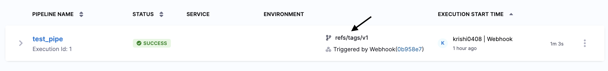

You can set up your pipeline to automatically trigger whenever a new tag is pushed to your repository. This guide walks you through the steps to achieve this using a webhook trigger.

### Pre-Requisite

1. [Code repo connector](/docs/category/code-repo-connectors) that connects to your Git provider account. 
2. Required [Code repo connector permissions for webhook triggers](/docs/platform/triggers/triggers-reference#code-repo-connector-permissions-for-webhook-triggers).
3. Harness CI/CD Pipeline

### Steps to Trigger a Pipeline on a New Tag

1. In your Harness pipeline, create a webhook trigger and configure the [Event](/docs/platform/triggers/triggers-reference#event-and-actions) type as **Push**.

2. When you create and push a new tag (e.g., v1) in your repository, Harness identifies it as a push event and triggers the configured pipeline.

Example: You push a tag v1 to the repository, which triggers the pipeline execution.



You can verify the payload received by the trigger in the Activity History section of the trigger. An example payload is shown below:

```json
{
  "ref": "refs/tags/v1",
  "before": "0000000000000000000000000000000000000000",
  "after": "0b958e797de7e9c55a4c8875b3d3a86c823cfd4b",
  "repository": {
    "id": 897881853,
    "node_id": "R_kgDONYSW_Q",
    "name": "azure-function-python",
    "full_name": "krishi0408/azure-function-python",
    "private": false,
    "owner": {
      "name": "krishi0408",
      "email": "krishika.singh@harness.io",
      "login": "krishi0408",
      "id": 109092049,
      "node_id": "U_kgDOBoCc0Q",
      "avatar_url": "https://avatars.githubusercontent.com/u/109092049?v=4",
      "gravatar_id": "",
      "url": "https://api.github.com/users/krishi0408",
      "html_url": "https://github.com/krishi0408",
      "followers_url": "https://api.github.com/users/krishi0408/followers",
      "following_url": "https://api.github.com/users/krishi0408/following{/other_user}",
      "gists_url": "https://api.github.com/users/krishi0408/gists{/gist_id}",
      "starred_url": "https://api.github.com/users/krishi0408/starred{/owner}{/repo}",
      "subscriptions_url": "https://api.github.com/users/krishi0408/subscriptions",
      "organizations_url": "https://api.github.com/users/krishi0408/orgs",
      "repos_url": "https://api.github.com/users/krishi0408/repos",
      "events_url": "https://api.github.com/users/krishi0408/events{/privacy}",
      "received_events_url": "https://api.github.com/users/krishi0408/received_events",
      "type": "User",
      "user_view_type": "public",
      "site_admin": false
    }
  }
}
```
The `ref` field indicates the new tag, in this case, refs/tags/v1.


