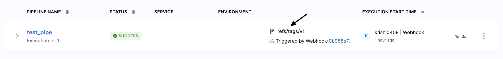

import Tabs from '@theme/Tabs';
import TabItem from '@theme/TabItem';

You can set up your pipeline to automatically trigger whenever a new tag is pushed to your repository. This guide walks you through the steps to achieve this using a webhook trigger. Additionally, you can configure the trigger to load both the pipeline YAML and input sets from the same Git tag that triggered the execution, enabling version-controlled pipeline executions.

### Pre-Requisite

1. [Code repo connector](/docs/category/code-repo-connectors) that connects to your Git provider account. 
2. Required [Code repo connector permissions for webhook triggers](/docs/platform/triggers/triggers-reference#code-repo-connector-permissions-for-webhook-triggers).
3. Harness CI/CD Pipeline
4. Delegate version **26.04.89002** or later (required for Git tag-based pipeline and input set loading)

### Steps to Trigger a Pipeline on a New Tag

1. In your Harness pipeline, create a webhook trigger and configure the [Event](/docs/platform/triggers/triggers-reference#event-and-actions) type as **Push**.

2. When you create and push a new tag (e.g., v1) in your repository, Harness identifies it as a push event and triggers the configured pipeline.

Example: You push a tag v1 to the repository, which triggers the pipeline execution.



3. Other types of pushes (e.g., commits) can also trigger push [events](/docs/platform/triggers/triggers-reference#event-and-actions). To ensure your pipeline is only triggered when a new tag is pushed, you should configure payload conditions in the webhook trigger. In these cases you will need to add payload conditions to ensure your pipeline is only triggered on a tag push. For example:

<Tabs>
<TabItem value="GitHub">

4. Add a new condition, under **Conditions** -> **Payload Conditions** for your webhook trigger. 
5. Set the payload's **Attribute** to `<+trigger.payload.ref>`.
6. Select **Starts With** as your **Operator**
7. For **Matches Value**, write `refs/tags`.

Optionally, to filter for tag creation vs deletion, add another condition that checks to see if the tag was just created. For example:

1. **Attribute**: `<+trigger.payload.created>`
2. **Operator**: `Equals`
3. **Matches Value**: `true`

</TabItem>
<TabItem value="Bitbucket">

4. Add a new condition, under **Conditions** -> **Payload Conditions** for your webhook trigger. 
5. Set the payload's **Attribute** to `<+trigger.payload.push.changes[0]['new']['type']>`.
   - *Note:* We recommend bracket notation here because `new` can be interpreted as a reserved keyword by the JEXL expression engine used to resolve these values.
6. Select **Equals** as your **Operator**.
7. For **Matches Value**, write `tag`.

</TabItem>
</Tabs>
---

You can verify the payload received by the trigger in the Activity History section of the trigger. An example payload is shown below:

```json
{
  "ref": "refs/tags/v1",
  "before": "0000000000000000000000000000000000000000",
  "after": "0b958e797de7e9c55a4c8875b3d3a86c823cfd4b",
  "repository": {
    "id": 897881853,
    "node_id": "R_kgDONYSW_Q",
    "name": "azure-function-python",
    "full_name": "krishi0408/azure-function-python",
    "private": false,
    "owner": {
      "name": "krishi0408",
      "email": "user@harness.io",
      "login": "krishi0408",
      "id": 109092049,
      "node_id": "U_kgDOBoCc0Q",
      "avatar_url": "https://avatars.githubusercontent.com/u/109092049?v=4",
      "gravatar_id": "",
      "url": "https://api.github.com/users/krishi0408",
      "html_url": "https://github.com/krishi0408",
      "followers_url": "https://api.github.com/users/krishi0408/followers",
      "following_url": "https://api.github.com/users/krishi0408/following{/other_user}",
      "gists_url": "https://api.github.com/users/krishi0408/gists{/gist_id}",
      "starred_url": "https://api.github.com/users/krishi0408/starred{/owner}{/repo}",
      "subscriptions_url": "https://api.github.com/users/krishi0408/subscriptions",
      "organizations_url": "https://api.github.com/users/krishi0408/orgs",
      "repos_url": "https://api.github.com/users/krishi0408/repos",
      "events_url": "https://api.github.com/users/krishi0408/events{/privacy}",
      "received_events_url": "https://api.github.com/users/krishi0408/received_events",
      "type": "User",
      "user_view_type": "public",
      "site_admin": false
    }
  }
}
```
The `ref` field indicates the new tag, in this case, refs/tags/v1.

---

## Load pipeline and input sets from Git tags

:::note
This feature requires delegate version **26.04.89002** or later and supports all Git providers including GitHub, GitLab, and Bitbucket.
:::

When using Git tag-based triggers, you can configure Harness to load both the pipeline YAML and input sets from the same Git tag that triggered the execution. This enables you to execute specific versions of your pipeline and input sets that are tagged in your repository, making it easier to maintain stable configurations alongside your release workflow and enabling reliable rollbacks to previous versions.

### Using `pipelineBranchName` and `inputSetBranchName` with Git tags

You can add the `pipelineBranchName` and `inputSetBranchName` properties to your trigger YAML to specify the exact Git tag from which Harness should fetch the pipeline YAML and input sets when the trigger is activated.

To reference a Git tag, use the `$tag:` format:

- **`$tag:<tag-name>`** - References a specific Git tag (for example, `$tag:v1.0.0` or `$tag:release-2024.01`)
- **`<+"$tag:"+<expression>>`** - References a Git tag using an expression that resolves at runtime to the tag name (for example, `<+"$tag:"+<+trigger.tag>>` resolves to the Git tag from the trigger payload)

<details>
<summary>Example: Execute pipeline from pushed Git tag</summary>

Here's an example trigger configuration that loads both the pipeline YAML and input set from the same Git tag that triggered the execution:

```yaml
trigger:
  name: Tag-based Release Trigger
  identifier: tag_release_trigger
  enabled: true
  description: "Execute pipeline from Git tag for releases"
  tags: {}
  orgIdentifier: default
  projectIdentifier: myProject
  pipelineIdentifier: myPipeline
  source:
    type: Webhook
    spec:
      type: Github
      spec:
        type: Push
        spec:
          connectorRef: myGithubConnector
          autoAbortPreviousExecutions: false
          repoName: myRepo
          payloadConditions:
            - key: <+trigger.payload.ref>
              operator: StartsWith
              value: refs/tags/
            - key: <+trigger.payload.created>
              operator: Equals
              value: "true"
  pipelineBranchName: <+"$tag:"+<+trigger.tag>>
  inputSetBranchName: <+"$tag:"+<+trigger.tag>>
  inputSetRefs:
    - production-input-set
  inputYaml: |
    pipeline:
      identifier: myPipeline
      properties:
        ci:
          codebase:
            build:
              type: branch
              spec:
                branch: <+trigger.tag>
```

In this example:
1. The trigger is configured with `type: Push` to listen for push events
2. **Important:** The `payloadConditions` filter ensures the trigger **only** fires for tag push events (not regular branch pushes):
   - `<+trigger.payload.ref>` starts with `refs/tags/` (filters for tags only)
   - `<+trigger.payload.created>` equals `true` (filters for tag creation, not deletion)
3. The `pipelineBranchName: <+"$tag:"+<+trigger.tag>>` loads the pipeline YAML from the pushed Git tag
4. The `inputSetBranchName: <+"$tag:"+<+trigger.tag>>` loads the input set from the same Git tag
5. When you push tag `v1.0.0`, both the pipeline and input set are fetched from that tag

Without the payload conditions, the trigger would fire on ALL push events (branches AND tags), causing `<+trigger.tag>` to be empty for branch pushes and resulting in an error. The payload conditions ensure this trigger only activates for tag push events.

This ensures that your pipeline executions use versioned configurations that match your Git tags, enabling reliable rollbacks and release management.

</details>

### Additional use cases

- **Load pipeline from a specific stable tag:** Use `pipelineBranchName: $tag:v1.0.0` to always execute a specific stable version of your pipeline
- **Load pipeline from tag, input set from branch:** Mix tag and branch references to use a stable pipeline version with the latest input set configurations

For more information on using Git tags with pipelines and input sets, go to [Git tag support for pipeline and input set source](/docs/platform/pipelines/input-sets#git-tag-support-for-pipeline-and-input-set-source).


