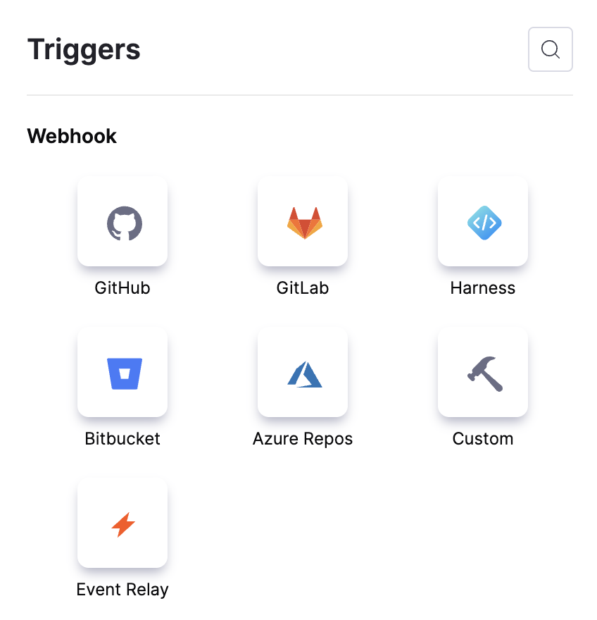
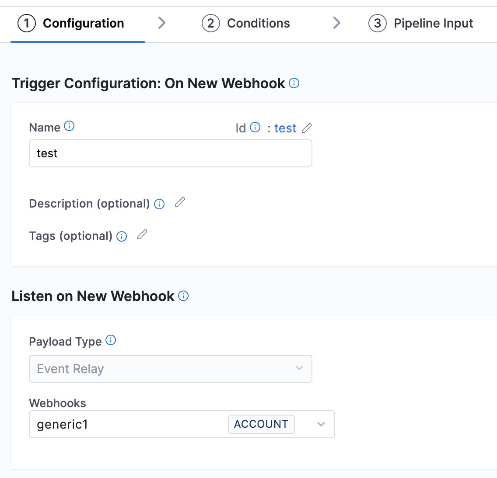

Trigger Pipelines Using Artifact Changes from Any Third-Party Repository

You can trigger pipelines in response to changes in artifacts from any third-party repository by setting up specific payload conditions in a Harness trigger. For example, when an artifact is updated or a new version is published, and your trigger settings align with the payload conditions, a CI or CD pipeline can be initiated.

Triggers enable event-driven CI/CD and support practices like building and deploying with every relevant artifact change.

:::important note

Currently this feature is behing the Feature Flag `CDS_EVENT_BRIDGE_WEBHOOK`. Please contact [Harness Support](mailto:support@harness.io) to enable this feature. 

:::

## Add a trigger to a pipeline

First, let’s configure a Generic webhook to create a trigger.

### Configure a webhook

1. Go to Account/Project settings and click on Webhook under resources.
2. Click on New Webhook.
3. Enter a Name for the webhook.
4. Select the type of webhook, in this case, Generic.
5. For Auth type, you have two options:
- No Auth: If your source requires authentication, no additional configuration is needed.
- HMAC: For Hash-Based Message Authentication Code authentication. To set up HMAC Authentication, provide the following details: Header, Hash Algorithm, and Secret Key.

6. Provide the necessary secret key value.

Click on **Add** to save the webhook.

The webhook is now created, click on the webhook you created earlier and copy the **Webhook URL** provided.

### Configure a trigger

To link this webhook to trigger your pipeline, navigate to your pipeline for which this webhook is to be used. 
1. Select **Triggers** present on the top right corner of the page.
2. Click in **New Trigger** and select the **Event Bridge**.

3. In the configurations page, provide the **Name** for the webhook.
4. Under the **Listen on New Webhook**, Event Bridge is selected by default for **Payload Type**. For selecting **Webhooks**, a pop up page will only list all the Generic and Slack webhooks configured will be displayed. 
Select the Generic webhook you created earlier.
Click on **Continue**.

5. In the **Conditions** page, give the approproate **Header Conditions** and **Payload Conditions**.
Click on **Continue**.

6. In the **Pipeline Input** page, you can provide any Pipeline input variables as per your requirement.
Click on **Create Trigger**

### Register the webhook in the third party repository

This webhook URL must be used to configure any third-party application or artifact repository. 

You can configure the webhook to any third-party artifact repository; for this example, we will use a Nexus artifact repository.

1. In your Nexus Repository, navigate to System -> Capabilities.
2. Create a webhook asset and specify the repository event.
3. Under the URL section, paste the URL of the Harness account where the webhook was created.
4. Enter the same Secret key value that you used when configuring the webhook.

By following these steps, you can successfully set up a webhook to trigger events in Harness from your Nexus repository.
